# CPQ Extraction Service — Architecture, Status & Completion Guide

> **Purpose:** Complete guide for the engineering team + CEO briefing on the CPQ data extraction service — what it is, how it's built, what's done, what's missing, and the step-by-step path to completion.
>
> **Date:** 2026-03-26
> **Audience:** Daniel (CTO), Niv (Engineer), Ofir (CEO)

---

## 1. What Is the CPQ Extraction Service?

RevBrain connects to a customer's Salesforce org and extracts their CPQ (Configure, Price, Quote) configuration to produce a migration assessment — a comprehensive report showing what they have, how complex it is, what maps to Revenue Cloud Advanced (RCA), and what risks they face.

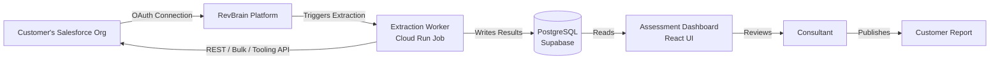

### The Three-Layer Architecture

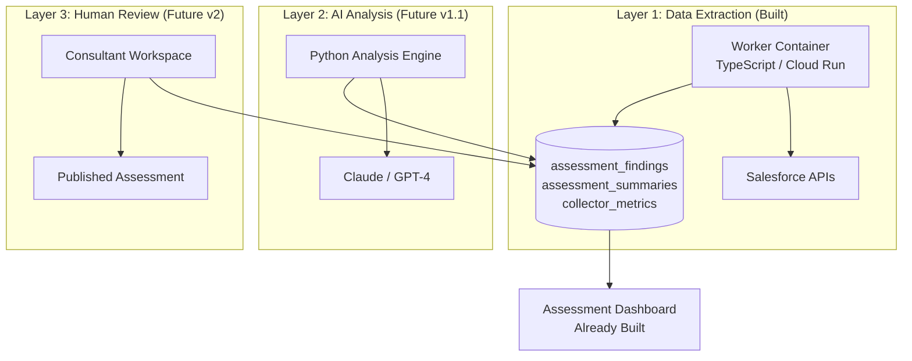

**Key insight:** Layer 1 (extraction) feeds Layer 2 (AI) which feeds Layer 3 (human). We're building Layer 1 now. The UI for showing results (the Assessment Dashboard) is already built with mock data.

---

## 2. How It Works End-to-End

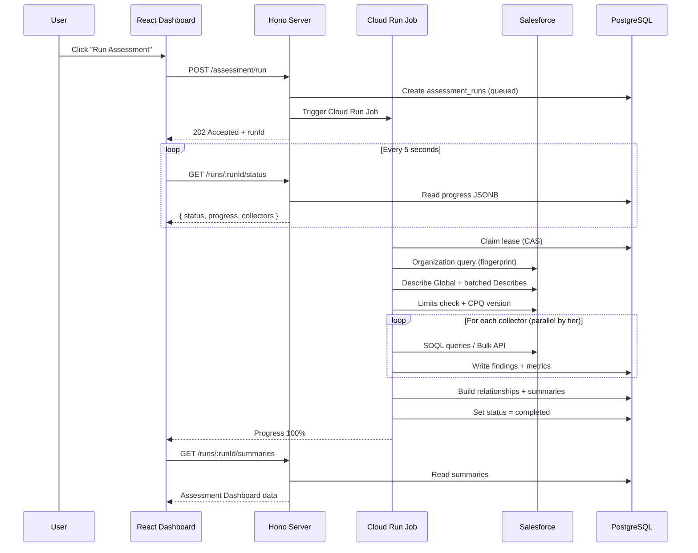

### The Run State Machine

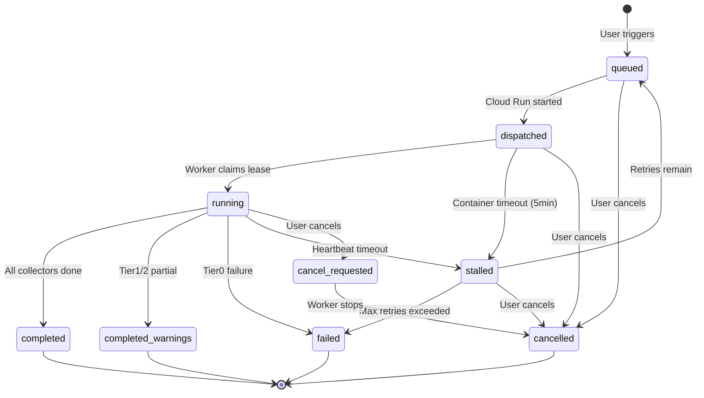

---

## 3. What's Already Built

### Fully Implemented & Tested (85 unit tests passing)

| Component                  | Files                                                 | What It Does                                                                                                     |
| -------------------------- | ----------------------------------------------------- | ---------------------------------------------------------------------------------------------------------------- |
| **Worker scaffold**        | `apps/worker/` (package, Docker, tsconfig)            | TypeScript package in monorepo, multi-stage Docker build                                                         |
| **Structured logging**     | `src/lib/logger.ts`                                   | pino JSON + AsyncLocalStorage trace propagation                                                                  |
| **Database schema**        | `packages/database/` (7 tables)                       | assessment_runs, findings, relationships, metrics, summaries + state machine trigger + security definer function |
| **Lease manager**          | `src/lease.ts`                                        | CAS claim/renew/release, 30s heartbeat, self-termination on loss                                                 |
| **Progress + checkpoint**  | `src/progress.ts`, `src/checkpoint.ts`                | Per-collector tracking, resumable runs                                                                           |
| **SIGTERM + cancellation** | `src/lifecycle.ts`                                    | Graceful shutdown, health check, run attempts                                                                    |
| **Finding model**          | `packages/contract/src/assessment.ts`                 | Zod schemas for all types (11 domains, 7 risk levels, finding keys)                                              |
| **Batch writes**           | `src/db/writes.ts`                                    | Provenance-based transactional writes with retry                                                                 |
| **Snapshot storage**       | `src/storage/snapshots.ts`                            | Configurable gzip upload (none/errors_only/transactional/all)                                                    |
| **SF token management**    | `src/salesforce/auth.ts`                              | AES-256-GCM decrypt, refresh fallback, proactive refresh, ID normalization                                       |
| **SF HTTP client**         | `src/salesforce/client.ts`                            | Retry, throttle, per-API circuit breakers, budget enforcement                                                    |
| **SF REST + Composite**    | `src/salesforce/rest.ts`                              | query/queryAll, Describe, limits, Composite Batch, Tooling                                                       |
| **SF Bulk API**            | `src/salesforce/bulk.ts`                              | Create/poll/stream/abort, adaptive polling, failedResults                                                        |
| **SF SOAP**                | `src/salesforce/soap.ts`                              | Metadata API retrieve for approval processes, flows                                                              |
| **Query builder**          | `src/salesforce/query-builder.ts`                     | Dynamic SOQL from Describe, compound fields, injection prevention                                                |
| **Collector framework**    | `src/collectors/base.ts`, `registry.ts`               | BaseCollector with timeout/cancel/checkpoint, tier registry                                                      |
| **Pipeline orchestrator**  | `src/pipeline.ts`                                     | Tier 0 → gate → Tier 1/2, dependency validation, concurrency                                                     |
| **API routes**             | `apps/server/src/v1/routes/assessment.ts`             | POST /run, GET /status, POST /cancel (placeholder)                                                               |
| **Sweeper SQL**            | `packages/database/sql/create_assessment_sweeper.sql` | Lease expiry, retry gating, normalization timeout                                                                |

### The Assessment Dashboard (Already Built — Mock Data)

This is the key surprise: **the entire assessment UI is already built** with comprehensive mock data.

```
apps/client/src/features/projects/
├── pages/workspace/AssessmentPage.tsx    ← Main page with 9 domain tabs
├── components/assessment/
│   ├── OverviewTab.tsx                   ← Executive summary
│   ├── ExecutiveSummary.tsx              ← VP-level readiness card
│   ├── DomainTab.tsx                     ← Reusable domain template
│   ├── ItemDetailPanel.tsx               ← Slide-over with full details
│   ├── RiskRegister.tsx                  ← Risk inventory table
│   ├── EffortEstimation.tsx              ← Effort breakdown
│   ├── RiskBlockerCards.tsx              ← Top risks + blockers
│   ├── RunDelta.tsx                      ← Run comparison
│   └── visualizations/                   ← Treemap, Radar, Bubble charts
└── mocks/assessment-mock-data.ts         ← 694 items, 47 risks, full org data
```

**What the UI already displays:**

- Executive summary with readiness level
- 9 domain tabs (Products, Pricing, Rules, Code, Integrations, Amendments, Approvals, Documents, Data)
- Per-domain item tables with complexity, migration status, RCA target
- Item detail panel with AI description, CPQ→RCA mapping, dependencies
- Risk register with severity heatmap
- Effort estimation by domain
- Run history with delta tracking
- Org health indicators
- Full EN + HE translations

**What the UI needs to work for real:**

- Replace mock data with real API calls
- Connect "Run Assessment" button to trigger endpoint
- Show live progress during extraction
- Load real summaries/findings after completion

---

## 4. What's Missing (The Gap)

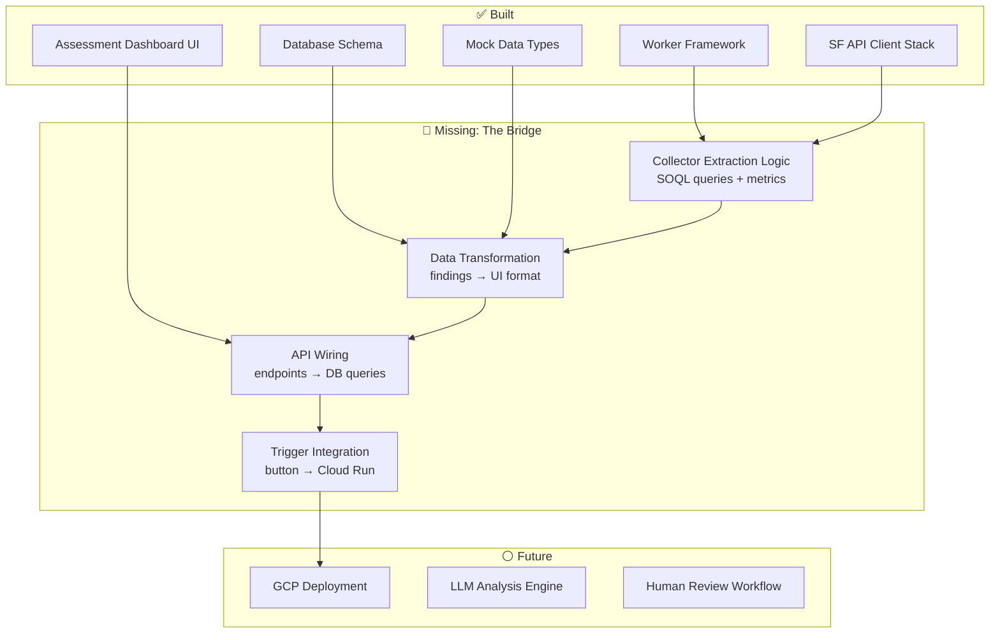

### The 4 Missing Pieces

**1. Collector Extraction Logic** (the biggest piece)

- Each of the 12 collector stubs has `execute() → TODO`
- Need to fill in: SOQL wishlists, query execution, result parsing, derived metrics, finding creation
- This is ~70% of remaining effort

**2. Data Transformation Layer**

- Extraction worker writes `assessment_findings` (our schema)
- UI reads `AssessmentItem` (mock data schema)
- Need a mapping layer: findings → domain data → UI format
- The mock data types (`AssessmentItem`, `DomainData`, `AssessmentRisk`) are the target format

**3. API Wiring**

- Assessment routes return 501 (not implemented)
- Need: DB queries for runs/findings/summaries, response formatting
- Need: trigger endpoint to create run + start Cloud Run job

**4. Trigger Integration**

- React hooks are placeholders (`useStartAssessmentRun` returns empty)
- Need: wire to real API, show progress, load results
- The progress UI and domain tabs already exist — just need real data

---

## 5. What Each Collector Does (and Why Discovery Comes First)

### Why Can't We Just Query Salesforce Directly?

A common misconception: "We know the CPQ tables — just run the SOQL queries." This fails because **every Salesforce org is different**:

| Problem                         | What Happens Without Discovery                                                                          |
| ------------------------------- | ------------------------------------------------------------------------------------------------------- |
| **Field doesn't exist**         | CPQ v218 doesn't have `SBQQ__TermDiscountLevel__c` (added in v230). Query crashes with `INVALID_FIELD`. |
| **Field-Level Security**        | Customer's admin restricted `SBQQ__BillingFrequency__c` from our connected user. Query fails.           |
| **CPQ not installed**           | No `SBQQ__` objects at all. Every collector crashes.                                                    |
| **Huge data volume**            | 500K products — REST API times out. We needed to know the count first to use Bulk API.                  |
| **API limits almost exhausted** | Org is at 95% of daily API limit. Our 70+ calls would break their production users.                     |

**Discovery solves all of this in one pass (under 5 minutes).** It's the reconnaissance mission before the army moves in.

### Discovery Collector — The Foundation

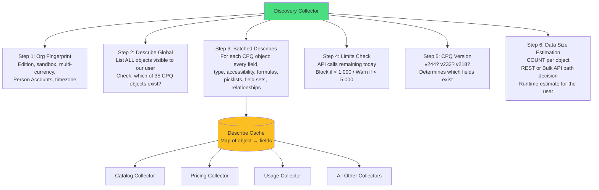

**The Describe Cache is the key output.** After Discovery, `ctx.describeCache` contains the full schema of every CPQ object in this customer's org. When any collector builds a SOQL query, it does:

```
Wishlist: [Id, Name, SBQQ__ChargeType__c, SBQQ__TermDiscountLevel__c, ...]
                                                  ↓
                              Filter against Describe (what actually exists)
                                                  ↓
Safe query: SELECT Id, Name, SBQQ__ChargeType__c FROM Product2
            (SBQQ__TermDiscountLevel__c removed — doesn't exist in this org)
```

This is why every other collector has `requires: ['discovery']` — without the Describe Cache, they can't build safe queries.

### Tier 0 Collectors — The Core Assessment

These are **mandatory**. If any fails, the entire run fails. They produce 80%+ of the assessment value.

#### Catalog Collector (Spec §5)

**What it extracts:** The product catalog — the "what are you selling?" question.

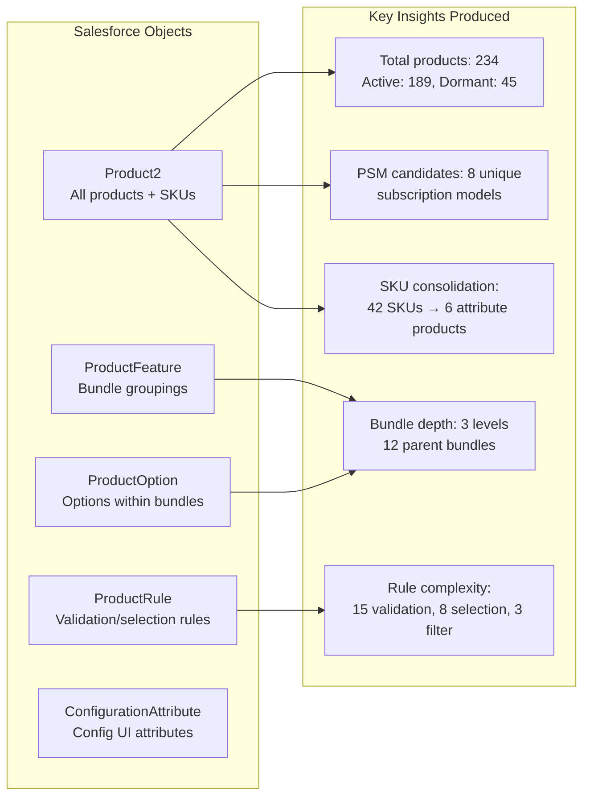

**Why it matters for migration:** RCA replaces flat SKU catalogs with attribute-based products. If a customer has 200 products that are really 20 products × 10 size/color variants, that's a massive simplification opportunity. The catalog collector detects these patterns.

**Example finding produced:**

```json
{
  "domain": "catalog",
  "artifactType": "Product2",
  "artifactName": "Enterprise Widget - Large",
  "findingKey": "catalog:Product2:01t000000ABC:sku_consolidation_candidate",
  "migrationRelevance": "should-migrate",
  "rcaTargetConcept": "ProductSellingModel",
  "rcaMappingComplexity": "transform",
  "evidenceRefs": [
    {
      "type": "field-ref",
      "referencedFields": ["SBQQ__ChargeType__c", "SBQQ__BillingFrequency__c"]
    }
  ]
}
```

#### Pricing Collector (Spec §6)

**What it extracts:** The pricing engine — the most complex and highest-risk migration area.

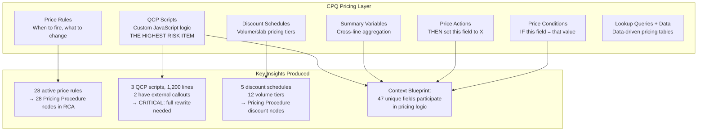

**Why it matters for migration:** CPQ's price rules + QCP JavaScript must be completely redesigned as RCA Pricing Procedures. QCP scripts are the #1 risk item in any migration — they contain custom business logic written in JavaScript that has no direct RCA equivalent. The pricing collector extracts the full source code, analyzes field references, detects external callouts, and flags everything for the consultant to review.

**LLM-readiness note:** The full QCP JavaScript source is preserved in `text_value` on each finding. In v1.1, the LLM reads this code and explains what business logic it implements — something no human could do quickly for 1,200 lines of pricing JavaScript.

#### Usage Collector (Spec §12)

**What it extracts:** Real operational data from the last 90 days — how actively they use CPQ.

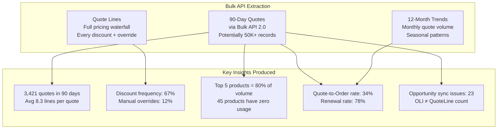

**Why it matters for migration:** Usage data answers "what do they actually use?" vs "what do they have configured?" A product catalog might have 500 products, but if only 50 are quoted in the last 90 days, the migration can focus on those first. The Opportunity sync health check catches data integrity issues that must be fixed BEFORE migration.

**This is the performance-critical collector.** It uses Bulk API 2.0 to stream potentially 50K+ quote lines as CSV, processes them in chunks, and never loads the entire dataset into memory.

### Tier 1 Collectors — Important but Non-Fatal

If these fail, the run completes with `completed_warnings` — the assessment is still useful but has gaps.

| Collector                      | What It Extracts                                                                                            | Why It Matters                                                                                                                                                 |
| ------------------------------ | ----------------------------------------------------------------------------------------------------------- | -------------------------------------------------------------------------------------------------------------------------------------------------------------- |
| **Dependencies** (Spec §10)    | Apex classes, triggers, flows, workflow rules that touch CPQ objects                                        | Apex code that disables CPQ triggers (`SBQQ.TriggerControl.disable()`) is a red flag — that pattern breaks completely in RCA. Flow dependencies need redesign. |
| **Customizations** (Spec §9)   | Custom fields on CPQ objects, custom metadata types, validation rules, page layouts, sharing rules          | Every custom field on `SBQQ__Quote__c` needs to be mapped to the standard `Quote` object in RCA. Formula fields are especially tricky.                         |
| **Settings** (Spec §15)        | CPQ package settings (Custom Settings) — calculation order, subscription proration, multi-currency behavior | These settings define the behavioral baseline. RCA's Revenue Settings must replicate this behavior or the pricing changes.                                     |
| **Order Lifecycle** (Spec §13) | Orders, OrderItems, Contracts, Assets with CPQ fields                                                       | Shows the downstream impact — how quote data flows into orders and contracts. Required for RCA's Dynamic Revenue Orchestrator mapping.                         |

### Tier 2 Collectors — Optional (Nice to Have)

If these fail, it's a minor coverage gap. The core assessment is still complete.

| Collector                   | What It Extracts                                                                | Why It Matters                                                                                     |
| --------------------------- | ------------------------------------------------------------------------------- | -------------------------------------------------------------------------------------------------- |
| **Templates** (Spec §7)     | Quote templates, merge fields, document generation config                       | Templates usually need complete redesign for RCA. Detecting JavaScript in templates is a red flag. |
| **Approvals** (Spec §8)     | CPQ custom actions, standard approval processes, Advanced Approvals (sbaa\_\_)  | Approval workflows need redesign for RCA's Flow-based approach. Multi-step approvals are complex.  |
| **Integrations** (Spec §11) | Named credentials, platform events, external data sources, e-signature packages | External integrations touching the quote-to-cash path need careful migration planning.             |
| **Localization** (Spec §14) | CPQ translations, custom labels                                                 | If >1,000 translation records exist, this adds weeks to migration effort.                          |

### How Collectors Work Together

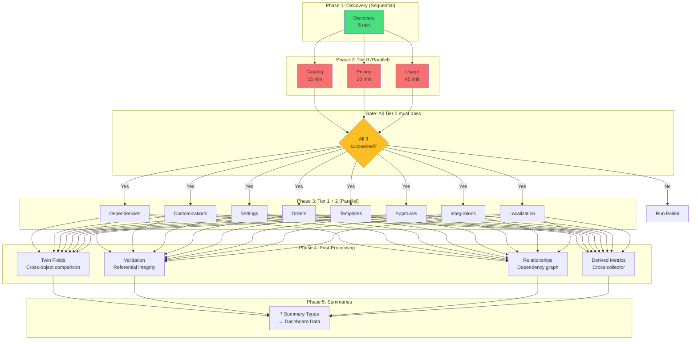

The tier gating is a key design decision: if Catalog extraction fails (e.g., Salesforce is unreachable), there's no point running Templates or Approvals — we'd just waste API calls. Tier 0 failure aborts the run, preserving the customer's API budget.

---

## 6. How Extraction Data Maps to the UI

This is critical to understand. The extraction worker produces data in one format; the UI expects another. Here's the mapping:

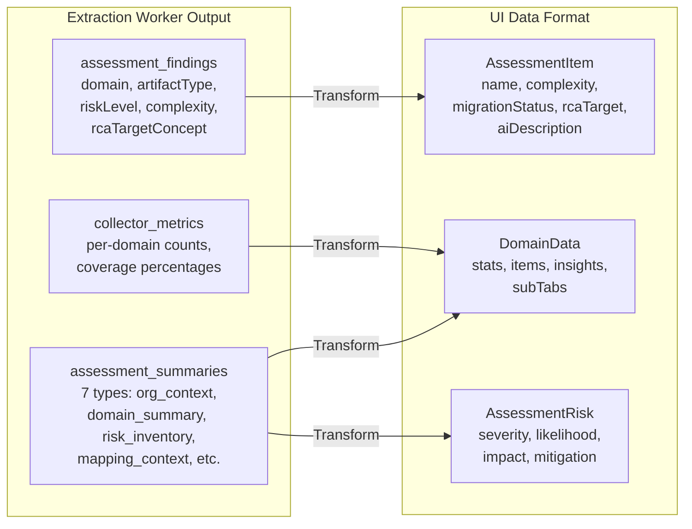

### Key Mapping Rules

| Worker Field                      | UI Field               | Transformation                                                                |
| --------------------------------- | ---------------------- | ----------------------------------------------------------------------------- |
| `finding.riskLevel`               | `item.complexity`      | critical/high → high, medium → moderate, low/info → low                       |
| `finding.rcaTargetConcept`        | `item.rcaTarget`       | Direct (e.g., "PricingProcedure")                                             |
| `finding.rcaMappingComplexity`    | `item.migrationStatus` | direct → auto, transform → guided, redesign → manual, no-equivalent → blocked |
| `finding.textValue`               | `item.aiDescription`   | v1: use source text; v2: LLM generates description                            |
| `finding.evidenceRefs`            | `item.dependencies`    | Extract referenced object/field names                                         |
| `summary.risk_inventory`          | `AssessmentRisk[]`     | Map severity, add mitigation text                                             |
| `summary.domain_summary`          | `DomainData.stats`     | Aggregate counts by migration status                                          |
| `summary.domain_summary.insights` | `DomainData.insights`  | Key observations per domain                                                   |

---

## 7. Step-by-Step Completion Guide

### Step 1: Get a Salesforce Sandbox Ready

**Who:** Daniel or Niv
**Time:** 1-2 hours
**Purpose:** Every collector needs a real Salesforce org to extract from

**What to do:**

1. Use the existing sandbox from Salesforce E2E tests (if CPQ is installed)
2. OR create a Salesforce Developer Org + install CPQ trial package
3. Ensure it has: 50+ products, some bundles, price rules, quotes from last 90 days
4. Verify the OAuth connection works via the existing "Connect Salesforce" flow in the UI

**How to verify:**

- Connect to the sandbox via the project workspace Overview page
- Run `pnpm test` in `e2e/` — the Salesforce connection E2E test should pass

---

### Step 2: Implement the Discovery Collector

**Who:** Developer (Daniel or Niv)
**Time:** 4-6 hours
**Purpose:** Discovery is the foundation — every other collector depends on its Describe cache

**What to do:**

1. Open `apps/worker/src/collectors/discovery.ts`
2. Implement the `execute()` method following the TODOs and Spec Section 4:
   - Query `Organization` object → store in `org_fingerprint`
   - Call `describeGlobal()` → detect SBQQ**, sbaa** namespaces
   - Validate required objects (~35 CPQ objects)
   - Batch Describes via Composite API (groups of 25)
   - Call `/limits/` → check thresholds
   - Detect CPQ version (3-step fallback)
   - COUNT() queries for data size estimation
3. Use `buildSafeQuery()` from the query builder for all SOQL
4. Create findings via `createFinding()` from the factory
5. Store Describe results in `ctx.describeCache` for downstream collectors

**How to test manually:**

```bash
# Start local DB
cd apps/worker && docker-compose up -d

# Create a test run record (use psql or any SQL client)
# INSERT INTO assessment_runs (id, project_id, org_id, connection_id, status)
# VALUES (uuid, ..., ..., ..., 'dispatched')

# Set up .env.local with real credentials
cp .env.example .env.local
# Fill in DATABASE_URL, SALESFORCE_TOKEN_ENCRYPTION_KEY, etc.

# Run the worker
JOB_ID=test RUN_ID=<uuid> pnpm worker:dev
```

**How to verify:**

- Worker logs show org fingerprint, object counts, CPQ version
- `assessment_runs.org_fingerprint` is populated in DB
- `assessment_runs.progress` shows discovery as "success"
- `collector_checkpoints` has a discovery row with status "success"

---

### Step 3: Implement Catalog + Pricing Collectors

**Who:** Can be parallelized (Niv does Catalog, Daniel does Pricing, or vice versa)
**Time:** 6-8 hours each
**Purpose:** These are Tier 0 — the core assessment value

**Catalog (`src/collectors/catalog.ts`):**

- Products query: all fields from spec Section 5.1 wishlist
- Features, Options, Constraints, Rules, Attributes
- Nested bundle depth detection
- All 15 derived metrics
- PSM candidate computation

**Pricing (`src/collectors/pricing.ts`):**

- Price Rules + Conditions + Actions chain
- Discount Schedules + Tiers
- Contracted Prices (Bulk API if >2000)
- QCP code extraction + regex analysis
- Lookup Queries + Data
- Context Definition Blueprint

**How to test:**

- Run worker against sandbox
- Check findings count per domain in DB
- Verify derived metrics in collector_metrics table
- Look at `text_value` for QCP scripts (should contain JavaScript source)

---

### Step 4: Implement Usage Collector

**Who:** Developer
**Time:** 6-8 hours
**Purpose:** Usage data (quotes, lines, trends) is the largest dataset and tests Bulk API

**What to do:**

- 90-day quotes via Bulk API 2.0
- 12-month aggregate trends via REST
- Quote Lines with full pricing waterfall
- Opportunity sync health check
- All 26 derived metrics

**This is the performance-critical collector** — verify:

- Bulk API polling works (5s → 15s → 30s cadence)
- CSV streaming doesn't OOM (monitor heap usage in logs)
- 50K+ records handled correctly

---

### Step 5: Wire the Pipeline End-to-End

**Who:** Developer
**Time:** 4-6 hours
**Purpose:** Run all collectors in sequence with tier gating

**What to do:**

1. Update `src/pipeline.ts` to instantiate real collectors (not just stubs)
2. Wire the `CollectorContext` with real Salesforce client instances
3. Test: Discovery → Catalog + Pricing + Usage (Tier 0 parallel) → gate → Tier 1/2
4. Verify: `assessment_runs.status` transitions correctly
5. Verify: summaries are written after normalization

---

### Step 6: Build the Data Transformation Layer

**Who:** Developer
**Time:** 4-6 hours
**Purpose:** Convert extraction findings into the UI's expected format

**What to do:**

1. Create `apps/server/src/services/assessment.service.ts`
2. Implement queries:
   - `getRunStatus(runId)` → run status + progress
   - `getRunSummaries(runId)` → 7 summary types
   - `getRunFindings(runId, domain)` → findings for a domain
   - `getRunRisks(runId)` → risk inventory
3. Implement transformation:
   - `findings → AssessmentItem[]` (map complexity, migrationStatus, rcaTarget)
   - `summaries → DomainData` (aggregate stats, insights)
   - `summaries → AssessmentRisk[]` (risk inventory)
4. Wire into the assessment API routes (replace 501 placeholders)

**This is the bridge between extraction and UI.** The mock data types in `assessment-mock-data.ts` are the contract — the service must produce data in exactly that shape.

---

### Step 7: Connect the UI to Real Data

**Who:** Developer (preferably someone familiar with the React codebase)
**Time:** 4-6 hours
**Purpose:** Replace mock data with real API calls

**What to do:**

1. Implement `use-assessment-run.ts` hooks (replace placeholders):
   - `useAssessmentRuns` → GET /assessment/runs
   - `useAssessmentRunStatus` → GET /assessment/runs/:id/status (5s poll)
   - `useStartAssessmentRun` → POST /assessment/run
2. Update `AssessmentPage.tsx` to use real hooks instead of mock data
3. Add "Run Assessment" trigger to the workspace (button + confirmation dialog)
4. Show real progress during extraction

**How to verify:**

- Open the project workspace in the browser
- Click "Run Assessment"
- Watch progress bar advance as collectors complete
- After completion, domain tabs show real data from the customer's Salesforce org

---

### Step 8: Deploy to Cloud Run

**Who:** Daniel (infrastructure)
**Time:** 2-4 hours
**Purpose:** Production deployment

**What to do:**

1. Create GCP project `revbrain-jobs`
2. Create Artifact Registry repository
3. Store secrets in Secret Manager (DATABASE_URL, SF encryption key, etc.)
4. Create Cloud Run Job definition
5. Wire the trigger service (Hono server → Cloud Run API)
6. Deploy the server with the assessment routes
7. Test end-to-end: UI → Server → Cloud Run → Salesforce → DB → UI

---

## 8. The Human-in-the-Loop Model

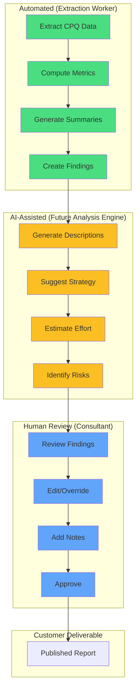

### What Each Layer Does

**Green (Automated — what we're building now):**

- Extracts raw data from Salesforce
- Computes deterministic metrics (counts, distributions, depths)
- Classifies items by complexity and migration path
- Detects structural risks (QCP, bundle nesting, field coupling)
- Produces structured findings with evidence

**Yellow (AI-Assisted — v1.1):**

- Reads structured findings + source code
- Generates human-readable descriptions ("This QCP implements tiered volume discounting")
- Suggests migration strategies per domain
- Estimates effort ranges
- Identifies hidden risks from cross-domain analysis

**Blue (Human Review — v2):**

- Consultant reviews AI-generated insights
- Edits risk levels, complexity assessments
- Adds customer-specific context
- Makes final migration recommendations
- Publishes the assessment for the customer

### Why This Model Works for Enterprise Sales

1. **Speed:** Automated extraction takes 10-60 minutes vs. days of manual analysis
2. **Consistency:** Every assessment follows the same methodology
3. **Depth:** Extracts data that manual analysis would miss (field coupling, code dependencies)
4. **Trust:** Human review ensures quality before customer sees it
5. **Scalability:** One consultant can review 5x more assessments when AI does the heavy lifting

### What the CEO Should Know

The assessment is NOT "AI does everything." It's:

- **Machine extracts** (fast, thorough, no human error)
- **AI interprets** (finds patterns, suggests strategies)
- **Human decides** (validates, adds context, takes responsibility)

This positions RevBrain as an **AI-augmented consulting tool**, not a black box. Customers trust it because a human expert reviews everything before they see it.

---

## 9. Timeline Estimate

| Phase                         | Effort   | Who        | Elapsed              |
| ----------------------------- | -------- | ---------- | -------------------- |
| Salesforce sandbox setup      | 2h       | Daniel     | Day 1                |
| Discovery collector           | 6h       | Niv        | Day 1-2              |
| Catalog collector             | 8h       | Niv        | Day 2-3              |
| Pricing collector             | 8h       | Daniel     | Day 2-3              |
| Usage collector               | 8h       | Niv        | Day 3-4              |
| Remaining Tier 1/2 collectors | 16h      | Both       | Day 4-6              |
| Pipeline wiring               | 6h       | Daniel     | Day 6-7              |
| Data transformation           | 6h       | Niv        | Day 7-8              |
| UI connection                 | 6h       | Daniel     | Day 8-9              |
| Cloud Run deployment          | 4h       | Daniel     | Day 9-10             |
| **Total**                     | **~70h** | **2 devs** | **~10 working days** |

This gets us to: **customer connects Salesforce → clicks Run → sees real assessment data in the dashboard.**

LLM analysis (v1.1) and human review workflow (v2) are separate initiatives that build on this foundation.

---

## 10. Reference Documents

| Document                                                                       | Purpose                                                                           |
| ------------------------------------------------------------------------------ | --------------------------------------------------------------------------------- |
| [CPQ-DATA-EXTRACTION-SPEC.md](CPQ-DATA-EXTRACTION-SPEC.md)                     | What to extract from Salesforce (field wishlists, derived metrics, SOQL patterns) |
| [CPQ-EXTRACTION-JOB-ARCHITECTURE.md](CPQ-EXTRACTION-JOB-ARCHITECTURE.md)       | How the job runs (Cloud Run, lease model, state machine, security)                |
| [CPQ-EXTRACTION-IMPLEMENTATION-PLAN.md](CPQ-EXTRACTION-IMPLEMENTATION-PLAN.md) | Task-by-task plan (54 tasks, track record, audit history)                         |
| [CPQ-EXTRACTION-PLAN-AUDIT-HISTORY.md](CPQ-EXTRACTION-PLAN-AUDIT-HISTORY.md)   | Full audit trail from 5 review rounds                                             |
