# CPQ Assessment Report V2.1 — Implementation Plan

> **Document ID:** CPQ-V2.1-IMPL-2026-001
> **Version:** 2.1 (Final — Post R2 Audit)
> **Date:** 2026-04-09
> **Status:** Approved for sprint planning (both auditors signed off)
> **Authors:** Daniel Aviram + Claude (Architect)
> **Input:** CPQ Assessment Report Template V2.1, Developer Implementation Spec V1.1, CPQ Configuration Settings research
> **Audit input:** Two independent architect reviews (senior/principal level). Key fixes: SOQL governor limit strategy, Tooling vs Data API clarification, structured-data validation over HTML grep, settings field allowlist, deterministic sorting, metadata collector async separation.
> **Audience:** Engineering team, CTO, external reviewers
> **Rollback:** Current V6 report code tagged at latest `main`. Rollback = revert to tag.
> **Review status:** Auditor 1: "Approve immediately" (4.8/5). Auditor 2: "Strong plan, fix critical items before sprint."

---

## 1. Executive Summary

The current assessment report (V6) is a 22-page HTML document covering 14 structured sections. The V2.1 template defines a significantly richer report with:

- **4 new sections** (Product Deep Dive 6.2, Bundles Deep Dive 6.6, Related Functionality 10, Object Configuration Appendix E)
- **Checkbox utilization tables** — a new visual pattern (4-column + 2-column variants)
- **Rendering tier logic** — conditional section inclusion based on extraction support
- **Expanded CPQ Settings extraction** — direct SOQL queries against 5 known custom settings objects
- **Stricter language and validation rules** — Fact + Implication pattern, denominator footnotes, no migration language

This plan decomposes the work into **32 tasks** across **3 phases**, each with testable acceptance criteria, explicit dependencies, file targets, and a pre-commit checklist.

**Phase 1 (MVP):** 22 tasks — all T1 sections + new 6.2 + 6.6 with checkbox tables. Ship-ready assessment.
**Phase 2:** 7 tasks — Related Functionality detection + section 10.
**Phase 3:** 3 tasks — Metadata API extraction + Object Configuration appendix.

---

## 2. Architecture Impact

### Files Modified

| File                                                   | Change Type                                                      | Tasks             |
| ------------------------------------------------------ | ---------------------------------------------------------------- | ----------------- |
| `apps/worker/src/collectors/settings.ts`               | Enhanced — add direct SOQL for 5 settings objects                | C-01              |
| `apps/worker/src/collectors/catalog.ts`                | Enhanced — add per-field population rate aggregation             | C-02, C-03        |
| `apps/worker/src/collectors/integrations.ts`           | Enhanced — add Experience Cloud, Billing, Tax detection          | C-06, C-07, C-08  |
| `apps/worker/src/collectors/dependencies.ts`           | Enhanced — add explicit callout pattern scan                     | C-09              |
| `apps/worker/src/report/assembler.ts`                  | Enhanced — new section builders, checkbox logic, tier logic      | A-01 through A-10 |
| `apps/worker/src/report/templates/index.ts`            | Enhanced — new section renderers, checkbox tables, summary boxes | R-01 through R-08 |
| `apps/worker/src/report/templates/partials/helpers.ts` | Enhanced — checkbox renderer, summary box partial                | R-01, R-03        |
| `apps/worker/src/report/templates/styles.ts`           | Enhanced — checkbox table CSS, summary box CSS                   | R-02              |
| `apps/worker/src/report/validation.ts`                 | Enhanced — new cross-section validators                          | V-01              |
| `tests/`                                               | New — unit tests for each task                                   | T-01 through T-06 |

### Files Created

| File                                                       | Purpose                                                | Tasks |
| ---------------------------------------------------------- | ------------------------------------------------------ | ----- |
| `apps/worker/src/collectors/metadata.ts`                   | New collector — Metadata API extraction for Appendix E | C-10  |
| `apps/worker/src/report/templates/partials/checkbox.ts`    | New partial — 4-column + 2-column checkbox renderers   | R-01  |
| `apps/worker/src/report/templates/partials/summary-box.ts` | New partial — paired summary box renderer              | R-03  |

### No Schema Changes

All new data flows through existing `AssessmentFindingInput` and `ReportData` types. No database migrations required. New assembler sections extend the `ReportData` interface with optional fields (backward-compatible).

---

## 3. Execution Tracker

> **How to use:** Work through tasks in order within each phase. Each task = one logical commit. After each commit: (1) update Status, (2) run `pnpm format && pnpm lint && pnpm test && pnpm build` (FLTB), (3) self-review code quality, (4) fill in all columns. Do not start the next task until the current row is fully green.

### Phase 1 — MVP (T1 Sections + Product Deep Dive + Bundles Deep Dive)

#### Collector Enhancements

| #     | Task                                                | Goal                                                                                                                                                                                                                                                                                                                                                                                                                                                                                                                                                                                                                                                                                                                                                                                                                                                                                                                                                                                                                                                                                                                                                | Files         | Depends On | Status      | Commit | Tested | FLTB | Code Review | Notes                                                                                                                                                                                                                                                                                                                                                                                                                                                                                                                                                                                                                                                                                   |
| ----- | --------------------------------------------------- | --------------------------------------------------------------------------------------------------------------------------------------------------------------------------------------------------------------------------------------------------------------------------------------------------------------------------------------------------------------------------------------------------------------------------------------------------------------------------------------------------------------------------------------------------------------------------------------------------------------------------------------------------------------------------------------------------------------------------------------------------------------------------------------------------------------------------------------------------------------------------------------------------------------------------------------------------------------------------------------------------------------------------------------------------------------------------------------------------------------------------------------------------- | ------------- | ---------- | ----------- | ------ | ------ | ---- | ----------- | --------------------------------------------------------------------------------------------------------------------------------------------------------------------------------------------------------------------------------------------------------------------------------------------------------------------------------------------------------------------------------------------------------------------------------------------------------------------------------------------------------------------------------------------------------------------------------------------------------------------------------------------------------------------------------------- |
| C-01  | **Settings: Direct SOQL for CPQ custom settings**   | **Two-pass approach:** (1) **Discovery pass (Tooling API):** `salesforce.tooling.query('SELECT DeveloperName FROM CustomObject WHERE NamespacePrefix = \'SBQQ\' AND IsCustomSetting = true')` — enumerate all CPQ settings objects. Note: `CustomObject` and `InstalledSubscriberPackage` are **Tooling API only**, not standard Data API. (2) **Extraction pass (Data API):** For the 5 known settings objects (`SBQQ__GeneralSettings__c`, `SBQQ__QuoteSettings__c`, `SBQQ__LineEditorSettings__c`, `SBQQ__SubscriptionSettings__c`, `SBQQ__PricingSettings__c`), query via `salesforce.data.query()` with `SetupOwnerId` = org ID filter. **Emit findings only for template-required fields** (explicit allowlist, ~30-40 fields total) — NOT all hundreds of fields on each settings object. Also capture override existence: `hasProfileOverrides: boolean` (SetupOwnerId starts with '00e') and `hasUserOverrides: boolean` (SetupOwnerId starts with '005') — report counts of each without enumerating override values. Discovery pass feeds Appendix D coverage; extraction pass feeds Section 4 content.                                  | `settings.ts` | —          | Not Started | —      | ☐      | ☐    | ☐           | **API endpoint discipline:** Discovery = Tooling API. Settings values = Data API. Package detection = Tooling API. Never mix endpoints in a single query call. **Allowlist approach:** maintain a `TEMPLATE_REQUIRED_SETTINGS` constant mapping `{ object: string, fields: string[] }[]` — only these fields produce `CPQSettingValue` findings. Prevents hundreds of irrelevant findings. **Redaction:** settings values that match credential patterns (`*password*`, `*token*`, `*secret*`, `*key*`) are redacted before emitting findings. **Fallback:** if Data API query fails (FLS, object not found), fall back to existing Tooling API path and log warning. Do not hard-fail. |
| C-02  | **Catalog: Per-field population rate via row scan** | Compute population rates for 38 product fields using a **single row-scan approach** (NOT 38 separate COUNT queries — that blows SOQL governor limits). Implementation: (1) Query active `Product2` with all 38 fields + `Id` in a single SOQL query, paginated via `queryMore`. (2) For large orgs (>5K products), switch to **Bulk API 2.0** query. (3) Iterate rows in memory, counting populated values per field using a centralized **`isPopulated(fieldType, value): boolean`** helper — type-aware: text `""` / whitespace = not populated, boolean `false` = populated, numeric `0` = populated, null = not populated, picklist `"--None--"` = not populated. (4) Emit one `ProductFieldUtilization` finding per field with `countValue` = populated count, `textValue` = field API name, and total active count in evidenceRef `label='TotalActive'`. For picklist fields, also capture value distribution (top 5 values) in notes. For FLS-blocked fields, emit finding with `countValue = null` and `notes = 'Field not accessible (FLS)'`. **Never use `-1` as sentinel** — use `null` and add helper `isAccessible(finding): boolean`. | `catalog.ts`  | —          | Not Started | —      | ☐      | ☐    | ☐           | **Critical governor limit mitigation:** one query + pagination, NOT 38 queries. Field list is driven by `PRODUCT_FIELD_WISHLIST` constant array (same 38 fields already defined in catalog collector). If org has >50K active products, add a hard time budget (30 sec) and emit partial results with coverage note. Memory budget: 50K rows × 38 fields ≈ ~100MB — acceptable within 2GB worker limit. **Sorting:** `ProductFieldUtilization` findings are emitted in field wishlist order (stable, template-defined). Checkbox table rows render in fixed template order (not dynamic population-rate sorting). Top-N lists elsewhere use count desc then name asc.                   |
| C-03a | **Catalog: Feature orphan detection**               | Query all features (`SBQQ__ProductFeature__c`), then query distinct feature IDs referenced by options (`SBQQ__ProductOption__c.SBQQ__Feature__c`). Diff to find orphans. Emit `DataCount` finding with `artifactType = 'FeatureOrphan'`, `countValue` = orphan count. Feed to section 6.6.1 checkbox table.                                                                                                                                                                                                                                                                                                                                                                                                                                                                                                                                                                                                                                                                                                                                                                                                                                         | `catalog.ts`  | —          | Not Started | —      | ☐      | ☐    | ☐           | Two-step approach (not JOIN — SOQL JOIN support is limited). If feature object not accessible, emit `detected = false` finding. Orphan = tech debt indicator.                                                                                                                                                                                                                                                                                                                                                                                                                                                                                                                           |
| C-03b | **Catalog: Option constraint count**                | `SELECT COUNT(Id) FROM SBQQ__OptionConstraint__c` via Data API. Emit `DataCount` finding with `artifactType = 'OptionConstraint'`.                                                                                                                                                                                                                                                                                                                                                                                                                                                                                                                                                                                                                                                                                                                                                                                                                                                                                                                                                                                                                  | `catalog.ts`  | —          | Not Started | —      | ☐      | ☐    | ☐           | Object may not exist in org. Describe check first. If absent, emit finding with `detected = false`. Independent of C-03a.                                                                                                                                                                                                                                                                                                                                                                                                                                                                                                                                                               |
| C-03c | **Catalog: Optional-for count**                     | `SELECT COUNT(DISTINCT SBQQ__OptionalSKU__c) FROM SBQQ__ProductOption__c` via Data API. Emit `DataCount` finding with `artifactType = 'OptionalFor'`. Products that appear as options in other bundles.                                                                                                                                                                                                                                                                                                                                                                                                                                                                                                                                                                                                                                                                                                                                                                                                                                                                                                                                             | `catalog.ts`  | —          | Not Started | —      | ☐      | ☐    | ☐           | Independent of C-03a and C-03b. Different failure mode (options exist but field not accessible vs object not accessible).                                                                                                                                                                                                                                                                                                                                                                                                                                                                                                                                                               |

#### Assembler Enhancements

| #    | Task                                                    | Goal                                                                                                                                                                                                                                                                                                                                                                                                                                                                                                                                              | Files                                | Depends On | Status      | Commit    | Tested | FLTB | Code Review | Notes                                                                                                                                                                                                                                                  |
| ---- | ------------------------------------------------------- | ------------------------------------------------------------------------------------------------------------------------------------------------------------------------------------------------------------------------------------------------------------------------------------------------------------------------------------------------------------------------------------------------------------------------------------------------------------------------------------------------------------------------------------------------- | ------------------------------------ | ---------- | ----------- | --------- | ------ | ---- | ----------- | ------------------------------------------------------------------------------------------------------------------------------------------------------------------------------------------------------------------------------------------------------ |
| A-01 | **Checkbox computation logic**                          | Implement `getCheckboxCategory(populatedCount, totalCount)` returning `CheckboxCategory`. Thresholds defined as **named constants** in a `CHECKBOX_THRESHOLDS` object: `SOMETIMES_MIN = 1`, `MOST_TIMES_MIN = 51`, `ALWAYS_MIN = 96`. `totalCount = 0` → NOT_APPLICABLE. `populatedCount = null` → NOT_APPLICABLE (FLS-blocked field). Export as pure utility function. Also add helpers: `isAccessible(finding)`, `getCountOrNull(finding)`, `isPopulated(value)`.                                                                               | `assembler.ts`                       | —          | Completed   | `061c7ae` | ☑      | ☑    | ☑           | Pure functions with null-safe boundary logic. isPopulated() is type-aware: text empty = not populated, boolean false = populated, numeric 0 = populated, picklist "--None--" = not populated.                                                          |
| A-02 | **Product Deep Dive section builder**                   | Build `assembleProductDeepDive(findings, counts)` returning `ProductDeepDive` with: (a) product summary (active/inactive/bundles/price books), (b) field utilization rows (one per field from C-02 findings, each with checkbox category + count + percentage + notes), (c) pricing method distribution (List/Cost/Block/Percent of Total with counts and complexity), (d) subscription profile (One-time/Renewable/Evergreen with counts). All counts derive from `ReportCounts` or `ProductFieldUtilization` findings. No independent counting. | `assembler.ts`                       | C-02, A-01 | Not Started | —         | ☐      | ☐    | ☐           | If no `ProductFieldUtilization` findings exist (C-02 not run), return `null` — section 6.2 is T2 conditional. The assembler must not fail if this data is absent.                                                                                      |
| A-03 | **Bundles & Options Deep Dive section builder**         | Build `assembleBundlesDeepDive(findings, counts)` returning `BundlesDeepDive` with: (a) bundle summary boxes (bundle-capable, configured bundles, nested bundles, avg options/bundle), (b) related object utilization rows: Features, Feature Orphans, Nested Bundles, Options, Optional For, Option Constraints, Config Attributes, Config Rules, Avg PBEs — each with checkbox category. All data from existing catalog findings + C-03 findings.                                                                                               | `assembler.ts`                       | C-03, A-01 | Not Started | —         | ☐      | ☐    | ☐           | If `SBQQ__ProductOption__c` query returned 0 records in extraction, return `null` — section 6.6 is T2 conditional. "Avg PBEs" = total PricebookEntry / active products. Use "bundle-capable" not "bundles" everywhere (V6 fix, enforce).               |
| A-04 | **Rendering tier logic via SectionConfig registry**     | Implement SECTION_RENDER_RULES registry with SectionKey type + isSectionEnabled() pure function.                                                                                                                                                                                                                                                                                                                                                                                                                                                  | `assembler.ts`, `templates/index.ts` | —          | Completed   | `30c92c1` | ☑      | ☑    | ☑           | Registry implemented in assembler. 22 sections registered (17 T1, 5 T2). Template integration pending R-04/R-05 (which will gate new sections). Existing sections unchanged — no T2 omission logic wired into template yet (no T2 sections have data). |
| A-05 | **Fact + Implication enforcement for key findings**     | Audit all key finding generators. Every finding detail must contain `— {implication word}`.                                                                                                                                                                                                                                                                                                                                                                                                                                                       | `assembler.ts`                       | —          | Completed   | `4d977f9` | ☑      | ☑    | ☑           | All 7 finding templates updated: QCP, rules, dormancy, multi-currency, Apex, products, fallback. Removed "Consider cleanup" recommendation (assessment-only). All now match `/— (indicating\|suggesting\|adding)/`.                                    |
| A-06 | **QCP name: single configured plugin**                  | Verify assembler pulls QCP name from `CPQSettingValue` finding where `artifactName` matches "Quote Calculator Plugin" (from settings collector), NOT from first `SBQQ__CustomScript__c` record name. If settings-based name exists, use it. If not, fall back to custom script finding name with "(from CustomScript)" qualifier. Never concatenate multiple script names.                                                                                                                                                                        | `assembler.ts`                       | C-01       | Not Started | —         | ☐      | ☐    | ☐           | V6 partially fixed this. With C-01 (direct SOQL for settings), we now have reliable access to the configured QCP name. Verify the precedence chain: (1) settings field value, (2) CustomScript record name, (3) "Not configured".                      |
| A-07 | **Low-volume warning threshold alignment**              | Change active users threshold from `< 5` to `< 3` per V2.1 spec. Keep quote volume threshold at `< 50`.                                                                                                                                                                                                                                                                                                                                                                                                                                           | `assembler.ts`                       | —          | Completed   | `d55bac4` | ☑      | ☑    | ☑           | One-line change: `activeUsers < 5` → `activeUsers < 3`. Warning text already matches V2.1 template.                                                                                                                                                    |
| A-08 | **Language audit: remove migration-readiness phrasing** | Scan all string literals in assembler and template for migration-specific language. Replace per dev spec rules.                                                                                                                                                                                                                                                                                                                                                                                                                                   | `assembler.ts`, `templates/index.ts` | —          | Completed   | `d55bac4` | ☑      | ☑    | ☑           | Only 1 match found: multi-currency finding had "during migration". Replaced with current-state language. Template was already clean. Appendix A "Phase" column retained (acceptable per spec).                                                         |
| A-09 | **Denominator footnotes via reusable partial**          | Create renderDenominatorFootnote() in checkbox.ts partial.                                                                                                                                                                                                                                                                                                                                                                                                                                                                                        | `partials/checkbox.ts`               | —          | Completed   | `720410e` | ☑      | ☑    | ☑           | renderDenominatorFootnote() implemented with escapeHtml. hasDenominatorFootnote field already in ProductDeepDive/BundlesDeepDive interfaces (A-10). Existing table footnotes to be updated when sections are wired (R-04/R-05).                        |
| A-10 | **Extend ReportData interface for new sections**        | Add optional fields to `ReportData`: `productDeepDive?: ProductDeepDive`, `bundlesDeepDive?: BundlesDeepDive`. Add `ProductDeepDive` and `BundlesDeepDive` interfaces with all fields needed by the template. Both are optional (T2 — may be absent). Add `CheckboxCategory` type.                                                                                                                                                                                                                                                                | `assembler.ts`                       | —          | Completed   | `061c7ae` | ☑      | ☑    | ☑           | Interfaces + types + CHECKBOX_THRESHOLDS constants added. Backward-compatible: existing generation unaffected (new fields default to null).                                                                                                            |

#### Template & Rendering Enhancements

| #    | Task                                                | Goal                                                                                                                                                                                                                                                                                                                                                                                                                                              | Files                                                    | Depends On             | Status      | Commit    | Tested | FLTB | Code Review | Notes                                                                                                                                                                                                                                                                     |
| ---- | --------------------------------------------------- | ------------------------------------------------------------------------------------------------------------------------------------------------------------------------------------------------------------------------------------------------------------------------------------------------------------------------------------------------------------------------------------------------------------------------------------------------- | -------------------------------------------------------- | ---------------------- | ----------- | --------- | ------ | ---- | ----------- | ------------------------------------------------------------------------------------------------------------------------------------------------------------------------------------------------------------------------------------------------------------------------- |
| R-01 | **4-column checkbox table renderer**                | renderCheckboxTable() with CSS pseudo-element checkmarks + renderBinaryCheckboxTable() for binary variant.                                                                                                                                                                                                                                                                                                                                        | `partials/checkbox.ts` (new)                             | A-10                   | Completed   | `720410e` | ☑      | ☑    | ☑           | CSS-based checkmarks (not Unicode). Supports nested rows via padding-left. getCategoryChecks() maps category to 4-column boolean array. renderDenominatorFootnote() also in this file.                                                                                    |
| R-02 | **Checkbox table CSS**                              | Checkbox table styles, numeric alignment, @page rules added to main styles.                                                                                                                                                                                                                                                                                                                                                                       | `styles.ts`                                              | R-01                   | Completed   | `720410e` | ☑      | ☑    | ☑           | .cb-table, .cb-check, .cb-check.checked::after (CSS checkmark), .numeric, @page { size: A4 portrait; margin: 1in; }. Print-safe, no media queries.                                                                                                                        |
| R-03 | **Summary box renderer**                            | renderSummaryBoxPair() + renderSummaryBoxSingle() for side-by-side metric cards.                                                                                                                                                                                                                                                                                                                                                                  | `partials/summary-box.ts` (new)                          | —                      | Completed   | `720410e` | ☑      | ☑    | ☑           | CSS flexbox, 48% width with 4% gap. Blue header bar matching report color scheme. Reusable for sections 6.2, 6.6, and potentially At-a-Glance refactor.                                                                                                                   |
| R-04 | **Product Deep Dive section renderer**              | Render section 6.2: Product summary boxes (A-02 data via R-03), field utilization checkbox table (A-02 data via R-01), pricing method distribution table, subscription profile table. Gate behind `isSectionEnabled('6.2', ...)` (A-04). Include denominator footnote for checkbox table.                                                                                                                                                         | `templates/index.ts`                                     | A-02, A-04, R-01, R-03 | Not Started | —         | ☐      | ☐    | ☐           | Section renders between 6.1 (Product Catalog) and 6.3 (Price Rules). If `productDeepDive` is null/undefined, section is entirely absent from HTML output. No empty div, no placeholder.                                                                                   |
| R-05 | **Bundles & Options Deep Dive section renderer**    | Render section 6.6: Bundle summary boxes (A-03 data via R-03), related object utilization checkbox table (A-03 data via R-01). Gate behind `isSectionEnabled('6.6', ...)`. Include denominator footnote.                                                                                                                                                                                                                                          | `templates/index.ts`                                     | A-03, A-04, R-01, R-03 | Not Started | —         | ☐      | ☐    | ☐           | Section renders between 6.5 (Discount Schedules) and 6.7 (Approvals). Same T2 omission rules as R-04. "Bundle-capable" wording enforced (not "bundles").                                                                                                                  |
| R-06 | **Page break structure + CSS @page rules**          | Verify and enforce: Cover Page = own page. Each numbered section (1-9, 10 if present, 11) starts on new page. Each Appendix starts on new page. Use both modern and legacy CSS: `break-before: page; page-break-before: always;` on each section header. Add explicit `@page { size: A4 portrait; margin: 1in; }` at top of `styles.ts` — Chrome/Playwright sometimes ignores margins without explicit `@page` rules.                             | `templates/index.ts`, `styles.ts`                        | —                      | Not Started | —         | ☐      | ☐    | ☐           | Test: generate a full report HTML, render to PDF via Playwright, verify each section starts on a new page and margins are correct. Edge case: very short sections (e.g., section 5 Quote Lifecycle) may look odd with a full blank page after — acceptable per V2.1 spec. |
| R-07 | **Table formatting rules + `paginateTable` helper** | Extract a reusable `paginateTable(rows, maxRows = 20, appendixAnchor)` helper that: (a) returns first `maxRows` rows + a footer row: "Top {maxRows} shown. See [Appendix {X}](#{anchor}) for full list ({totalRows} total)." (b) The appendix anchor uses HTML `id` attributes — specify anchor naming convention. Enforce: max 6 columns per table. Right-align all numeric columns via CSS class `.numeric`. Verify across all existing tables. | `templates/index.ts`, `partials/helpers.ts`, `styles.ts` | —                      | Not Started | —         | ☐      | ☐    | ☐           | Most impactful on: product catalog table (6.1 — could have 20+ families), price rules table (6.3 — could have 50+ rules), Apex classes table (9.1). Anchor convention: `#appendix-a`, `#appendix-b`, etc. Helper is reusable across all tables.                           |

#### Validation Enhancements

| #    | Task                                                              | Goal                                                                                                                                                                                                                                                                                                                                                                                                                                                                                                                                                                                                                                                                                                                                                                                                                                                                                 | Files           | Depends On       | Status      | Commit | Tested | FLTB | Code Review | Notes                                                                                                                                                                                                                                                                                                                                                                                                                                                                                                                                                                                                      |
| ---- | ----------------------------------------------------------------- | ------------------------------------------------------------------------------------------------------------------------------------------------------------------------------------------------------------------------------------------------------------------------------------------------------------------------------------------------------------------------------------------------------------------------------------------------------------------------------------------------------------------------------------------------------------------------------------------------------------------------------------------------------------------------------------------------------------------------------------------------------------------------------------------------------------------------------------------------------------------------------------ | --------------- | ---------------- | ----------- | ------ | ------ | ---- | ----------- | ---------------------------------------------------------------------------------------------------------------------------------------------------------------------------------------------------------------------------------------------------------------------------------------------------------------------------------------------------------------------------------------------------------------------------------------------------------------------------------------------------------------------------------------------------------------------------------------------------------- |
| V-01 | **New cross-section validators (structured data, NOT HTML grep)** | Add validators operating on **`ReportData` structure**, not rendered HTML: (a) **V30:** QCP name in `metadata` or `cpqAtAGlance` must not contain comma or semicolon (concatenation indicator) — single string check. (b) **V31:** All bundle-related strings in assembler output use `BUNDLE_CAPABLE_LABEL` constant (enforce at string generation layer via shared constant, not post-hoc regex on HTML). Add lint-style check: assembler must never produce a raw "bundle" without the constant. (c) **V32:** Every table data object with a percentage column has `hasDenominatorFootnote: true` — structural field check on `ReportData`, not HTML parse. (d) **V33:** Each finding in `executiveSummary.keyFindings[].detail` contains `—` followed by an implication word (regex on data string, not HTML). All validators run pre-render (on `ReportData`), not post-render. | `validation.ts` | A-05, A-06, A-09 | Not Started | —      | ☐      | ☐    | ☐           | **Critical architectural decision (from both auditors):** validate structured data, not rendered HTML. HTML snapshot tests (T-06) handle visual regression. Semantic correctness is checked here on `ReportData`. V31: provide `formatBundleCapable(n: number): string` helper and require its usage in all section builders. Validator scans curated string fields (titles, descriptions, rationale) for pattern `\bbundle(s)?\b(?!-capable)` (negative lookahead) — catches bare "bundle" but not "bundle-capable" or "configured bundles". V32: relies on `hasDenominatorFootnote` field added in A-09. |

#### Tests

| #     | Task                                                       | Goal                                                                                                                                                                                                                                                                                                                                                                                                                                                                                                                                                                                                                                                                                                                                                          | Files                       | Depends On          | Status      | Commit    | Tested | FLTB | Code Review | Notes                                                                                                                                                                                                                                                                                                                                                                                                                                                                                                                                                                                                                                                                    |
| ----- | ---------------------------------------------------------- | ------------------------------------------------------------------------------------------------------------------------------------------------------------------------------------------------------------------------------------------------------------------------------------------------------------------------------------------------------------------------------------------------------------------------------------------------------------------------------------------------------------------------------------------------------------------------------------------------------------------------------------------------------------------------------------------------------------------------------------------------------------- | --------------------------- | ------------------- | ----------- | --------- | ------ | ---- | ----------- | ------------------------------------------------------------------------------------------------------------------------------------------------------------------------------------------------------------------------------------------------------------------------------------------------------------------------------------------------------------------------------------------------------------------------------------------------------------------------------------------------------------------------------------------------------------------------------------------------------------------------------------------------------------------------ |
| T-01  | **Unit tests: Checkbox computation**                       | Test getCheckboxCategory(), isAccessible(), getCountOrNull(), isPopulated() with boundary values and edge cases.                                                                                                                                                                                                                                                                                                                                                                                                                                                                                                                                                                                                                                              | `checkbox.test.ts`          | A-01                | Completed   | `827e787` | ☑      | ☑    | ☑           | 36 test cases total: 15 for getCheckboxCategory, 5 for isAccessible, 5 for getCountOrNull, 11 for isPopulated. All boundary values covered.                                                                                                                                                                                                                                                                                                                                                                                                                                                                                                                              |
| T-02  | **Unit tests: Product Deep Dive assembler**                | Mock `ProductFieldUtilization` findings for 5 fields (Family, PricingMethod, SubscriptionType, BillingRule, DiscountSchedule) with varying population rates. Verify: (a) correct checkbox categories assigned, (b) pricing method distribution sums to total active products, (c) subscription profile counts correct, (d) returns `null` when no utilization findings present.                                                                                                                                                                                                                                                                                                                                                                               | `assembler.test.ts`         | A-02                | Not Started | —         | ☐      | ☐    | ☐           | Mock findings must cover: all-populated field (ALWAYS), zero-populated field (NOT_USED), partial field (SOMETIMES/MOST_TIMES), FLS-blocked field (countValue = null → NOT_APPLICABLE).                                                                                                                                                                                                                                                                                                                                                                                                                                                                                   |
| T-03  | **Unit tests: Bundles Deep Dive assembler**                | Mock findings for features, feature orphans, options, option constraints, optional-for, config attributes, config rules. Verify: (a) checkbox categories correct, (b) feature orphan percentage correct (orphans / total features), (c) returns `null` when no option findings exist, (d) "bundle-capable" wording in all bundle references.                                                                                                                                                                                                                                                                                                                                                                                                                  | `assembler.test.ts`         | A-03                | Not Started | —         | ☐      | ☐    | ☐           | Test edge case: org with 0 bundles but >0 options (options exist without parent bundles — data quality issue, should still render).                                                                                                                                                                                                                                                                                                                                                                                                                                                                                                                                      |
| T-04  | **Unit tests: Rendering tier logic**                       | Test isSectionEnabled() for all T1, T2 sections + unknown key + registry completeness.                                                                                                                                                                                                                                                                                                                                                                                                                                                                                                                                                                                                                                                                        | `section-tiers.test.ts`     | A-04                | Completed   | `3c22cad` | ☑      | ☑    | ☑           | 26 test cases: 18 T1 (always enabled), 4 T2 conditional (6.2 + 6.6 with/without data), 2 T2 not-yet-implemented (10, appendixE), 1 unknown key, 1 registry completeness.                                                                                                                                                                                                                                                                                                                                                                                                                                                                                                 |
| T-05  | **Unit tests: New validators**                             | Test V30 (QCP name), V31 (bundle wording), V32 (denominator footnotes), V33 (finding pattern). Each validator tested with: (a) valid input → no error, (b) invalid input → error/warning caught.                                                                                                                                                                                                                                                                                                                                                                                                                                                                                                                                                              | `validation.test.ts`        | V-01                | Not Started | —         | ☐      | ☐    | ☐           | V31 test: HTML containing "76 bundle products" → should trigger. HTML containing "76 bundle-capable products" → should not.                                                                                                                                                                                                                                                                                                                                                                                                                                                                                                                                              |
| T-C01 | **Unit tests: Settings collector**                         | Mock Salesforce Data API + Tooling API responses for settings extraction. Test: (a) all 5 settings objects return data → correct `CPQSettingValue` findings emitted for allowlisted fields only, (b) one settings object returns FLS error → graceful fallback to Tooling API, other objects unaffected, (c) override detection: mock records with `00e` and `005` prefixes → `hasProfileOverrides` and `hasUserOverrides` correct, (d) redaction: mock field named `SBQQ__APIToken__c` with value → emitted finding contains `[REDACTED]`, (e) `isPopulated()` helper: boolean `false` = populated, text `""` = not populated, null = not populated.                                                                                                         | `settings.test.ts`          | C-01                | Not Started | —         | ☐      | ☐    | ☐           | 8+ test cases. Mock both API endpoints. Verify allowlist filtering (findings only for `TEMPLATE_REQUIRED_SETTINGS` fields).                                                                                                                                                                                                                                                                                                                                                                                                                                                                                                                                              |
| T-C02 | **Unit tests: Catalog field utilization**                  | Mock row-scan results (array of Product2 records with varying field population). Test: (a) correct population counts per field, (b) `isPopulated()` type-aware behavior (text empty string = not populated, boolean false = populated, numeric 0 = populated, picklist "--None--" = not populated), (c) partial coverage: mock time budget expiry at 60% of rows → `fieldUtilizationCoverage.complete = false`, (d) FLS-blocked field → `countValue = null`, (e) findings emitted in field wishlist order (not dynamic).                                                                                                                                                                                                                                      | `catalog.test.ts`           | C-02                | Not Started | —         | ☐      | ☐    | ☐           | 8+ test cases. Test `isPopulated()` independently with all Salesforce field types.                                                                                                                                                                                                                                                                                                                                                                                                                                                                                                                                                                                       |
| T-C03 | **Unit tests: Feature orphans, constraints, optional-for** | Three independent test suites: (a) orphan detection: 10 features, 7 referenced by options, 3 orphans → `countValue = 3`, (b) option constraints: mock describe success → count returned; mock describe failure (object absent) → `detected = false`, (c) optional-for: 50 options referencing 30 distinct products → `countValue = 30`.                                                                                                                                                                                                                                                                                                                                                                                                                       | `catalog.test.ts`           | C-03a, C-03b, C-03c | Not Started | —         | ☐      | ☐    | ☐           | 6+ test cases (2 per subtask).                                                                                                                                                                                                                                                                                                                                                                                                                                                                                                                                                                                                                                           |
| T-06  | **Golden file regression: V2.1 report**                    | Create a frozen `AssessmentFindingInput[]` fixture. Generate `ReportData` via assembler, then render to HTML. Snapshot **both**: (a) `report-v2.1-snapshot.json` — `ReportData` via `stableStringify(data)` (custom helper that recursively sorts object keys before serializing — `JSON.stringify` does not guarantee key order). (b) `report-v2.1-section-6.2.html` and `report-v2.1-section-6.6.html` — rendered HTML snapshots for the two new high-risk sections only (not full report HTML — too fragile). CI test diffs future output against both snapshots. **Deterministic sorting required:** all table data arrays sorted by a stable key (count desc, then name asc) before snapshot — prevents flapping from non-deterministic iteration order. | `tests/fixtures/`, `tests/` | All Phase 1 tasks   | Not Started | —         | ☐      | ☐    | ☐           | Fixture must include: (a) normal org (500 products, 20 rules, 5 bundles), (b) T2-absent org (no ProductFieldUtilization findings — verify sections omitted in HTML), (c) low-volume org (10 quotes, 1 user — verify warning). **Dynamic value pinning:** all fixtures must use fixed assessment date, org ID, and environment label — never inject real timestamps into snapshot data. **Early Playwright PDF smoke test:** render the checkbox tables to PDF and visually verify CSS-based checkmarks render correctly in the target environment. Verify the embedded font stack displays the pseudo-element markers. This test must pass before golden file is frozen. |

### Phase 2 — Related Functionality Detection

#### Collector Enhancements

| #    | Task                                           | Goal                                                                                                                                                                                                                                                                                                                                                                                               | Files             | Depends On | Status      | Commit | Tested | FLTB | Code Review | Notes                                                                                                                                                                                                                                                                         |
| ---- | ---------------------------------------------- | -------------------------------------------------------------------------------------------------------------------------------------------------------------------------------------------------------------------------------------------------------------------------------------------------------------------------------------------------------------------------------------------------- | ----------------- | ---------- | ----------- | ------ | ------ | ---- | ----------- | ----------------------------------------------------------------------------------------------------------------------------------------------------------------------------------------------------------------------------------------------------------------------------- |
| C-06 | **Integrations: Experience Cloud detection**   | Query `Network` object. If records exist, emit `ExperienceCloud` finding with `detected = true`. Check `NetworkType` for 'Partner' and 'Customer' variants. Emit separate findings for each type found. If `Network` object doesn't exist (not enabled), emit finding with `detected = false`.                                                                                                     | `integrations.ts` | —          | Not Started | —      | ☐      | ☐    | ☐           | `Network` object may not be queryable if Experience Cloud is not enabled. Wrap in try-catch: if describe fails, emit `detected = false` finding. Do not hard-fail the collector.                                                                                              |
| C-07 | **Integrations: Salesforce Billing detection** | (a) Check `InstalledSubscriberPackage WHERE NamespacePrefix = 'blng'` — already partially done in settings collector for package list. (b) NEW: `SELECT COUNT(Id) FROM Product2 WHERE blng__BillingRule__c != null` for billing rule usage on products. (c) NEW: `SELECT COUNT(Id) FROM Product2 WHERE blng__TaxRule__c != null` for tax rule usage. Emit `BillingDetection` findings with counts. | `integrations.ts` | —          | Not Started | —      | ☐      | ☐    | ☐           | If `blng` package not installed, the `blng__BillingRule__c` field won't exist. Check describe first, skip queries if field absent. Do not confuse "package installed but not used" with "package not installed".                                                              |
| C-08 | **Integrations: Tax calculator detection**     | Check installed packages for Avalara (`AVA_MAPPER` namespace) or Vertex (`vertex` or `VTX` namespace). Emit `TaxCalculator` finding with provider name or `detected = false`.                                                                                                                                                                                                                      | `integrations.ts` | —          | Not Started | —      | ☐      | ☐    | ☐           | Namespace prefixes may vary by Avalara/Vertex version. Check for common prefixes: `AVA_MAPPER`, `avalara`, `vertex`, `VTX`.                                                                                                                                                   |
| C-09 | **Dependencies: Apex callout pattern scan**    | Scan Apex class source code (already extracted in `textValue`) for HTTP callout patterns: `Http`, `HttpRequest`, `HttpCallout`, `Callable`, `WebServiceCallout`. Emit `ApexCallout` finding for each class that matches with class name and line count.                                                                                                                                            | `dependencies.ts` | —          | Not Started | —      | ☐      | ☐    | ☐           | Current dependencies collector partially does this (callout detection in notes). Formalize: regex scan of `textValue` for callout keywords. Must not flag classes that merely import `Http` but never instantiate it — look for `new HttpRequest()` or `new Http()` patterns. |

#### Assembler & Template Enhancements

| #    | Task                                       | Goal                                                                                                                                                                                                                                                                                                                                                                      | Files                  | Depends On             | Status      | Commit | Tested | FLTB | Code Review | Notes                                                                                                                                                                |
| ---- | ------------------------------------------ | ------------------------------------------------------------------------------------------------------------------------------------------------------------------------------------------------------------------------------------------------------------------------------------------------------------------------------------------------------------------------- | ---------------------- | ---------------------- | ----------- | ------ | ------ | ---- | ----------- | -------------------------------------------------------------------------------------------------------------------------------------------------------------------- |
| A-11 | **Related Functionality section builder**  | Build `assembleRelatedFunctionality(findings)` returning `RelatedFunctionality` with binary Used/Not Used for each detection: Experience Cloud (Partner/Customer), Salesforce Billing (rules, tax), Integrations (named creds, platform events, callouts), Tax Calculator. Derive observations from combinations (e.g., "Community presence detected — adds complexity"). | `assembler.ts`         | C-06, C-07, C-08, C-09 | Not Started | —      | ☐      | ☐    | ☐           | Returns `null` if none of the related functionality is detected (T2 omission). If at least one item is "Used", render the full section (showing Not Used items too). |
| R-08 | **2-column binary checkbox renderer**      | Create `renderBinaryCheckboxTable(rows, title)` partial: columns = Functionality, Not Used, Used, Notes. Simpler than 4-column variant. Used for section 10.1 and Appendix E.                                                                                                                                                                                             | `partials/checkbox.ts` | —                      | Not Started | —      | ☐      | ☐    | ☐           | Reuse checkbox CSS from R-02. Can be a variant of the 4-column renderer with reduced columns.                                                                        |
| R-09 | **Related Functionality section renderer** | Render section 10: binary checkbox table (R-08) + observations list. Gate behind `isSectionEnabled('10', ...)`.                                                                                                                                                                                                                                                           | `templates/index.ts`   | A-11, R-08, A-04       | Not Started | —      | ☐      | ☐    | ☐           | Section renders between 9 (Custom Code) and 11 (Hotspots). If `relatedFunctionality` is null, section absent.                                                        |
| T-07 | **Unit tests: Related Functionality**      | Mock findings for each detection type. Test: (a) all detected → section renders with all "Used" checked, (b) none detected → returns null (section omitted), (c) partial detection → section renders with mix of Used/Not Used.                                                                                                                                           | `assembler.test.ts`    | A-11                   | Not Started | —      | ☐      | ☐    | ☐           | 4+ test cases.                                                                                                                                                       |

### Phase 3 — Metadata API Deep Dive

| #    | Task                                                       | Goal                                                                                                                                                                                                                                                                                                                                                                                                                                                                                                                                                                                                                                                                                                                                                                                                                                                                                                                                                                                                                                                                                                                                                                                                 | Files                          | Depends On | Status      | Commit | Tested | FLTB | Code Review | Notes                                                                                                                                                                                                                                                                                                                                                                                                                                                                                                                                                                                                                                                                |
| ---- | ---------------------------------------------------------- | ---------------------------------------------------------------------------------------------------------------------------------------------------------------------------------------------------------------------------------------------------------------------------------------------------------------------------------------------------------------------------------------------------------------------------------------------------------------------------------------------------------------------------------------------------------------------------------------------------------------------------------------------------------------------------------------------------------------------------------------------------------------------------------------------------------------------------------------------------------------------------------------------------------------------------------------------------------------------------------------------------------------------------------------------------------------------------------------------------------------------------------------------------------------------------------------------------- | ------------------------------ | ---------- | ----------- | ------ | ------ | ---- | ----------- | -------------------------------------------------------------------------------------------------------------------------------------------------------------------------------------------------------------------------------------------------------------------------------------------------------------------------------------------------------------------------------------------------------------------------------------------------------------------------------------------------------------------------------------------------------------------------------------------------------------------------------------------------------------------- |
| C-10 | **New collector: Metadata API extraction (async, opt-in)** | New **Tier 3 / async** collector that runs **after** the main report is generated, not inline with the pipeline. Triggered via opt-in flag (`--include-metadata`) or separate queue job. Queries Metadata API for CPQ objects (Product2, Quote, QuoteLine, Order, etc.): (1) `listMetadata()` to **discover** layout and FlexiPage names (required — names unknown until listed), (2) `readMetadata('Layout', [...discovered names...])` for page layouts, (3) `readMetadata('FlexiPage', [...])` for Lightning record pages, (4) `describeSObject().recordTypeInfos` for record types, (5) `describeSObject().fieldSets` for field sets, (6) `readMetadata('ValidationRule', [...])` for validation rules, (7) `describeLimits()` for object limits. Emit findings per object per config type. Results merge into Appendix E via **re-render model**: metadata findings are persisted keyed by `assessmentRunId` in the existing findings table, then a re-render of the full report (including Appendix E) is triggered. The main report is delivered immediately without Appendix E; the re-rendered version replaces it once metadata extraction completes. Does not block main report delivery. | `collectors/metadata.ts` (new) | —          | Not Started | —      | ☐      | ☐    | ☐           | **Critical architectural decision (from both auditors):** Metadata API is slow (seconds to minutes) and rate-limited. Running it synchronously in the main worker risks timeouts. Move to async post-processing. **Never block MVP delivery on Metadata API.** Implementation: separate Cloud Run job or post-pipeline phase. `listMetadata()` step is required before `readMetadata()` — you cannot read layouts without first discovering their names. Cache `listMetadata()` results. Graceful degradation: if any individual API call fails, log warning, skip that config type, continue. Add structured logs: duration, query counts, partial failure reasons. |
| A-12 | **Object Configuration appendix builder**                  | Build `assembleObjectConfiguration(findings)` returning `ObjectConfiguration[]` with per-object binary Used/Not Used for each config type (layouts, record pages, buttons, field sets, record types, triggers, validation rules) + object limits table (usage/limit/%).                                                                                                                                                                                                                                                                                                                                                                                                                                                                                                                                                                                                                                                                                                                                                                                                                                                                                                                              | `assembler.ts`                 | C-10       | Not Started | —      | ☐      | ☐    | ☐           | Appendix-first by rule: never render in main body, only in Appendix E. Returns `null` if no metadata findings exist.                                                                                                                                                                                                                                                                                                                                                                                                                                                                                                                                                 |
| R-10 | **Object Configuration appendix renderer**                 | Render Appendix E: per-object binary checkbox tables + limits tables. Gate behind `isSectionEnabled('appendixE', ...)`.                                                                                                                                                                                                                                                                                                                                                                                                                                                                                                                                                                                                                                                                                                                                                                                                                                                                                                                                                                                                                                                                              | `templates/index.ts`           | A-12, R-08 | Not Started | —      | ☐      | ☐    | ☐           | Appendix renders after Appendix D (Extraction Coverage). If absent, Appendix lettering does not change — D is still D regardless of whether E exists.                                                                                                                                                                                                                                                                                                                                                                                                                                                                                                                |

---

## 4. Dependency Graph

```mermaid
graph TD
    subgraph "Phase 1 — Collectors"
        C01["C-01: Settings SOQL"]
        C02["C-02: Field population rates"]
        C03["C-03: Feature orphans +<br/>option constraints"]
    end

    subgraph "Phase 1 — Assembler"
        A01["A-01: Checkbox logic"]
        A02["A-02: Product Deep Dive"]
        A03["A-03: Bundles Deep Dive"]
        A04["A-04: Rendering tiers"]
        A05["A-05: Fact + Implication"]
        A06["A-06: QCP name"]
        A07["A-07: Low-volume threshold"]
        A08["A-08: Language audit"]
        A09["A-09: Denominator footnotes"]
        A10["A-10: ReportData interface"]
    end

    subgraph "Phase 1 — Rendering"
        R01["R-01: Checkbox renderer"]
        R02["R-02: Checkbox CSS"]
        R03["R-03: Summary boxes"]
        R04["R-04: Section 6.2"]
        R05["R-05: Section 6.6"]
        R06["R-06: Page breaks"]
        R07["R-07: Table formatting"]
    end

    subgraph "Phase 1 — Validation + Test"
        V01["V-01: New validators"]
        T01["T-01: Checkbox tests"]
        T02["T-02: Product DD tests"]
        T03["T-03: Bundles DD tests"]
        T04["T-04: Tier logic tests"]
        T05["T-05: Validator tests"]
        T06["T-06: Golden file"]
    end

    C02 --> A02
    C03 --> A03
    C01 --> A06
    A01 --> A02
    A01 --> A03
    A10 --> R01
    R01 --> R02
    A02 --> R04
    A03 --> R05
    A04 --> R04
    A04 --> R05
    R01 --> R04
    R01 --> R05
    R03 --> R04
    R03 --> R05
    A05 --> V01
    A06 --> V01
    A09 --> V01
    A01 --> T01
    A02 --> T02
    A03 --> T03
    A04 --> T04
    V01 --> T05

    style C01 fill:#ff9
    style C02 fill:#ff9
    style C03 fill:#ff9
    style A01 fill:#9ff
    style R01 fill:#9f9
    style V01 fill:#fcf
    style T06 fill:#ffc

    subgraph "Phase 2 — Related Functionality"
        C06["C-06: Experience Cloud"]
        C07["C-07: Billing"]
        C08["C-08: Tax"]
        C09["C-09: Apex callouts"]
        A11["A-11: Related Func builder"]
        R08["R-08: Binary checkbox"]
        R09["R-09: Section 10"]
        T07["T-07: Related Func tests"]
    end

    subgraph "Phase 3 — Metadata"
        C10["C-10: Metadata API<br/>(async)"]
        A12["A-12: Object Config builder"]
        R10["R-10: Appendix E"]
    end

    C06 & C07 & C08 & C09 --> A11
    A11 --> R09
    R08 --> R09
    A11 --> T07
    C10 --> A12
    A12 --> R10

    style C06 fill:#ffd
    style C07 fill:#ffd
    style C08 fill:#ffd
    style C09 fill:#ffd
    style C10 fill:#eee
```



---

## 5. Execution Notes

### Parallelization Opportunities

- **C-01, C-02, C-03** are independent collector changes — can be developed in parallel by different engineers or in any order.
- **A-01** (checkbox logic) and **A-10** (interface extension) have no dependencies — start immediately.
- **A-04** (tier logic) is independent of all collector work — start immediately.
- **A-05, A-07, A-08** (language/threshold fixes) are independent of everything — can be done anytime.
- **R-01, R-02, R-03** (new rendering partials) can start as soon as A-10 defines the types.
- **R-06, R-07** (page breaks, table formatting) are independent — can be done anytime.

### Sequential Dependencies

- **A-02** (Product Deep Dive builder) requires C-02 (field population data) + A-01 (checkbox logic).
- **A-03** (Bundles Deep Dive builder) requires C-03 (orphan/constraint data) + A-01 (checkbox logic).
- **R-04** (section 6.2 renderer) requires A-02 + A-04 + R-01 + R-03.
- **R-05** (section 6.6 renderer) requires A-03 + A-04 + R-01 + R-03.
- **V-01** (new validators) requires A-05, A-06, A-09 to be complete.
- **T-06** (golden file) is the final task — depends on all Phase 1 work.

### One Task = One Commit Rule

Each task should be a single logical commit. Larger tasks (T-06 golden file) may span 2-3 commits if needed, but each commit must leave the codebase in a passing state (FLTB green).

---

## 6. Cross-Cutting Concerns

These apply to ALL tasks and must be enforced throughout implementation.

### API Endpoint Discipline

| Query Target                                            | Endpoint                                             | Example                                                                    |
| ------------------------------------------------------- | ---------------------------------------------------- | -------------------------------------------------------------------------- |
| Standard/Custom object records                          | **Data API** (`salesforce.data.query()`)             | `SELECT Id FROM Product2 WHERE IsActive = true`                            |
| Custom Settings records                                 | **Data API**                                         | `SELECT Id, ... FROM SBQQ__GeneralSettings__c WHERE SetupOwnerId = ...`    |
| Metadata about objects (CustomObject, EntityDefinition) | **Tooling API** (`salesforce.tooling.query()`)       | `SELECT DeveloperName FROM CustomObject WHERE NamespacePrefix = 'SBQQ'`    |
| Installed packages                                      | **Tooling API**                                      | `SELECT Id FROM InstalledSubscriberPackage WHERE NamespacePrefix = 'blng'` |
| Layouts, FlexiPages, ValidationRules (metadata)         | **Metadata API** (`salesforce.metadata.read/list()`) | `listMetadata({type: 'Layout'})`                                           |

Every query in every collector must use the correct endpoint. Mixing them causes silent failures.

### Deterministic Sorting

All tables and data arrays in `ReportData` must have **explicit, stable sorting rules** to prevent golden file flapping and ensure consistent customer experience across re-runs.

| Data                           | Sort Rule                                                                                                                 |
| ------------------------------ | ------------------------------------------------------------------------------------------------------------------------- |
| Product catalog (by family)    | Active count descending, then family name ascending                                                                       |
| Price/Product rules            | Active first, then name ascending                                                                                         |
| Field utilization rows         | Population rate descending, then field name ascending                                                                     |
| Top quoted products            | Quote count descending                                                                                                    |
| Technical debt items           | Count descending                                                                                                          |
| Apex classes                   | Line count descending, then name ascending                                                                                |
| Checkbox table rows (6.2, 6.6) | **Fixed template order** (matches V2.1 template spec — most readable, stable across orgs). NOT sorted by population rate. |

### Sensitive Data Handling

Settings values and Apex source can contain secrets. Rules:

| Data Type                         | Redaction Rule                                                                                         |
| --------------------------------- | ------------------------------------------------------------------------------------------------------ |
| CPQ Settings field values         | Redact any value where field name matches `*password*`, `*token*`, `*secret*`, `*key*`, `*credential*` |
| Apex source code (in `textValue`) | Already handled by existing dependencies collector. Verify no raw credentials leak into findings.      |
| Named Credential endpoints        | Show endpoint URL but redact auth headers/tokens                                                       |
| Custom script source (QCP)        | Show source for analysis but redact embedded credentials                                               |

### Operational Telemetry

Every collector enhancement must emit structured logs:

```typescript
logger.info('collector.catalog.fieldUtilization', {
  fieldsScanned: 38,
  fieldsAccessible: 35,
  fieldsBlocked: 3,
  totalProducts: 689,
  durationMs: 1250,
  approach: 'row-scan', // or 'bulk-api'
});
```

This is essential for diagnosing customer org issues (FLS blocks, Metadata API failures, Tooling API unavailability).

### Extraction Coverage Accounting

New collectors and findings must update **Appendix D (Extraction Coverage)**. For each new data source:

| New Source                       | Appendix D Entry                                   |
| -------------------------------- | -------------------------------------------------- |
| Product field utilization (C-02) | `Product Fields: Full/Partial/Not extracted`       |
| Feature orphans (C-03a)          | `Bundle Nesting: Full` (upgraded from Partial)     |
| Option constraints (C-03b)       | `Bundle Nesting: Full`                             |
| Experience Cloud (C-06)          | `Experience Cloud: Full/Partial/Not extracted`     |
| Salesforce Billing (C-07)        | `Salesforce Billing: Full/Partial/Not extracted`   |
| Object Configuration (C-10)      | `Object Configuration: Full/Partial/Not extracted` |

---

## 7. Risk Register

| Risk                                                       | Impact                                | Likelihood | Mitigation                                                                                                                                                                                                                                                          |
| ---------------------------------------------------------- | ------------------------------------- | ---------- | ------------------------------------------------------------------------------------------------------------------------------------------------------------------------------------------------------------------------------------------------------------------- |
| Row-scan exceeds time budget on large orgs (50K+ products) | C-02 produces partial data            | Medium     | Hard 30-sec time budget. Emit partial results with explicit `fieldUtilizationCoverage: { scanned: X, total: Y, complete: boolean }` finding. Reflect in Appendix D. If Bulk API unavailable (permissions), fall back to queryMore pagination with same time budget. |
| `SBQQ__OptionConstraint__c` doesn't exist in org           | C-03 fails on constraint count        | Low        | Describe check before query. If absent, emit `detected = false` finding.                                                                                                                                                                                            |
| Settings SOQL queries fail due to FLS                      | C-01 returns partial settings         | Medium     | Try-catch per settings object. Fall back to existing Tooling API path. Log which objects failed.                                                                                                                                                                    |
| Checkbox CSS rendering fails in Playwright PDF             | Visual quality issue                  | Medium     | Use CSS pseudo-elements (not Unicode glyphs). Run early Playwright smoke test before building sections 6.2/6.6. Embed known web-safe font stack.                                                                                                                    |
| T2 section omission breaks existing tests                  | Test regression                       | Low        | Update existing golden files to expect absent sections when appropriate findings are missing.                                                                                                                                                                       |
| Bulk API 2.0 unavailable due to permissions                | C-02 falls back to queryMore (slower) | Low        | Graceful fallback: detect Bulk API availability via probe request. If unavailable, use queryMore pagination with same time budget. Log which approach was used in telemetry.                                                                                        |

---

## 8. Success Criteria

The V2.1 report is ready for delivery when ALL of the following are true:

| #   | Criterion                                                                             | Verification                                                                                                    |
| --- | ------------------------------------------------------------------------------------- | --------------------------------------------------------------------------------------------------------------- |
| 1   | Section 6.2 Product Deep Dive renders with correct checkbox categories                | T-02 unit test passes + visual PDF review                                                                       |
| 2   | Section 6.6 Bundles Deep Dive renders with correct checkbox categories                | T-03 unit test passes + visual PDF review                                                                       |
| 3   | T2 sections are omitted entirely when data is absent (no "Not extracted" placeholder) | T-04 unit test passes                                                                                           |
| 4   | All 5 key findings follow Fact + Implication pattern                                  | V-01 validator V33 passes                                                                                       |
| 5   | QCP shows exactly 1 configured name                                                   | V-01 validator V30 passes                                                                                       |
| 6   | No migration-readiness language in report body                                        | Manual grep of rendered HTML                                                                                    |
| 7   | All percentage tables have explicit denominator footnote                              | V-01 validator V32 passes                                                                                       |
| 8   | CPQ Settings section includes data from all 5 known settings objects                  | C-01 findings include GeneralSettings, QuoteSettings, LineEditorSettings, SubscriptionSettings, PricingSettings |
| 9   | Golden file regression test passes                                                    | T-06 CI test                                                                                                    |
| 10  | All existing V17-V29 validators still pass                                            | Existing test suite                                                                                             |
| 11  | FLTB green on all tasks                                                               | `pnpm format && pnpm lint && pnpm test && pnpm build`                                                           |

---

## Appendix A: Pre-Commit Checklist

Every task must pass this checklist before the commit is pushed. This is the **FLTB** gate referenced in the execution tracker.

| #   | Step            | Command / Action                                   | Pass Criteria                                                                                                                                    |
| --- | --------------- | -------------------------------------------------- | ------------------------------------------------------------------------------------------------------------------------------------------------ |
| 1   | **Format**      | `pnpm format`                                      | No formatting changes needed (Prettier applied)                                                                                                  |
| 2   | **Lint**        | `pnpm lint`                                        | Zero ESLint errors. Warnings reviewed and justified.                                                                                             |
| 3   | **Test**        | `pnpm test`                                        | All tests pass (889+ existing + new tests from this plan). Zero failures.                                                                        |
| 4   | **Build**       | `pnpm build` (or `tsc --noEmit` for type checking) | TypeScript compilation succeeds. No type errors.                                                                                                 |
| 5   | **Self-review** | Read own diff line by line                         | No debug code (`console.log`, `TODO`, `FIXME`). All imports use `.ts` extensions (Deno compat). No hardcoded values that should be constants.    |
| 6   | **Code review** | Peer review or self-review checklist               | Security: no XSS in template strings (use `escapeHtml()`). No raw user input in HTML. All new strings use existing i18n pattern (if applicable). |

### Commit Message Format

```
{type}(report): {description} [{task-ids}]

- {detail 1}
- {detail 2}

Co-Authored-By: Claude Opus 4.6 (1M context) <noreply@anthropic.com>
```

Example: `feat(report): add Product Deep Dive checkbox table [A-02,R-04]`

Types: `feat` (new section/feature), `fix` (bug fix), `refactor` (restructure without behavior change), `test` (new tests), `chore` (tooling/config).

Task IDs in brackets make `git log --grep` searchable per task.

---

## Appendix B: Task Submission Checklist

When marking a task as "Completed" in the execution tracker, verify:

| #   | Check                                                                | ☐/☑ |
| --- | -------------------------------------------------------------------- | --- |
| 1   | Task goal is fully met (not partially)                               | ☐   |
| 2   | Acceptance test described in "Goal" column passes                    | ☐   |
| 3   | Unit tests written and passing (if task has test requirements)       | ☐   |
| 4   | FLTB gate passed (Appendix A, all 6 steps)                           | ☐   |
| 5   | No regressions in existing test suite                                | ☐   |
| 6   | Commit hash recorded in tracker                                      | ☐   |
| 7   | "Tested" checkbox filled                                             | ☐   |
| 8   | "FLTB" checkbox filled                                               | ☐   |
| 9   | "Code Review" checkbox filled                                        | ☐   |
| 10  | Notes column updated with implementation details or edge cases found | ☐   |

### When to Write Tests

| Task Type                        | Test Requirement                                                                                                                                          |
| -------------------------------- | --------------------------------------------------------------------------------------------------------------------------------------------------------- |
| **Collector enhancement** (C-xx) | Unit test with mocked Salesforce API responses. Test: correct findings emitted for success case, graceful degradation for failure case, FLS-blocked case. |
| **Assembler enhancement** (A-xx) | Unit test with mocked findings input. Test: correct output structure, null return for T2 absent data, boundary values for numeric computations.           |
| **Template renderer** (R-xx)     | Snapshot test: render with known input, compare HTML output against golden file. Visual regression test: render PDF, manual review.                       |
| **Validator** (V-xx)             | Unit test with planted valid and invalid inputs. Test: correct error/warning for each rule, zero false positives on clean data.                           |
| **Golden file** (T-06)           | CI integration test: frozen fixture → assembler → diff against snapshot. Any structural diff = test failure.                                              |

### Edge Cases to Always Consider

| Category                  | Edge Case                                        | How to Handle                                                                                              |
| ------------------------- | ------------------------------------------------ | ---------------------------------------------------------------------------------------------------------- |
| **Empty org**             | 0 products, 0 rules, 0 quotes                    | All sections render with "None detected" or are omitted (T2). No crashes.                                  |
| **Huge org**              | 50K products, 5K rules                           | SOQL limits respected. Aggregate queries. Truncated tables with appendix reference.                        |
| **FLS restrictions**      | Key fields not accessible                        | `detected = false` or `countValue = null` with explanatory note. Use `isAccessible()` helper. Never crash. |
| **Sandbox vs Production** | Sandbox may have stale/test data                 | Report correctly identifies environment. Metrics still valid.                                              |
| **Missing packages**      | sbaa, blng not installed                         | Related sections omit gracefully. No errors from missing objects.                                          |
| **Zero denominators**     | 0 active products, 0 quotes                      | Percentages show "N/A" not "NaN" or "Infinity". Checkbox = NOT_APPLICABLE.                                 |
| **Unicode/special chars** | Product names with quotes, angle brackets, emoji | `escapeHtml()` applied to all user-sourced strings in templates.                                           |

---

## Appendix C: File Naming & Structure Conventions

| Convention            | Rule                                                | Example                                           |
| --------------------- | --------------------------------------------------- | ------------------------------------------------- |
| **Test files**        | Co-located `*.test.ts`                              | `assembler.test.ts` next to `assembler.ts`        |
| **Template partials** | In `partials/` subdirectory                         | `partials/checkbox.ts`, `partials/summary-box.ts` |
| **Import extensions** | All imports use `.ts` extensions                    | `import { escapeHtml } from './helpers.ts'`       |
| **Type exports**      | Interfaces in same file as implementation           | `ProductDeepDive` interface in `assembler.ts`     |
| **Constants**         | UPPER_SNAKE_CASE for thresholds                     | `CHECKBOX_SOMETIMES_THRESHOLD = 50`               |
| **Output files**      | `{ClientName}_CPQ_Assessment_{Date}_v{Version}.pdf` | `AcmeCorp_CPQ_Assessment_2026-04-09_v2.1.pdf`     |

---

## Appendix D: Glossary

| Term                     | Definition                                                                             |
| ------------------------ | -------------------------------------------------------------------------------------- |
| **FLTB**                 | Format, Lint, Test, Build — the 4-step pre-commit gate                                 |
| **T1 / T2 / T3**         | Rendering tiers: Always Render / Conditional / Internal Only                           |
| **Checkbox table**       | Table with ☑/☐ columns showing utilization thresholds                                  |
| **Golden file**          | Frozen test fixture + expected output snapshot for regression detection                |
| **Denominator footnote** | Text below a percentage table stating what the percentage is calculated from           |
| **Fact + Implication**   | Pattern for key findings: quantitative fact followed by "— indicating/which means/..." |
| **FLS**                  | Field-Level Security — Salesforce permission that can hide fields from API queries     |
| **SOQL**                 | Salesforce Object Query Language                                                       |

---

---

## Appendix E: Audit Trail

This plan was developed through 3 review rounds with independent technical auditors.

| Round          | Auditor                                              | Score                             | Key Findings                                                                                                                                                                                                                                                                                                                                                                                                                                                                                                                                                                                    |
| -------------- | ---------------------------------------------------- | --------------------------------- | ----------------------------------------------------------------------------------------------------------------------------------------------------------------------------------------------------------------------------------------------------------------------------------------------------------------------------------------------------------------------------------------------------------------------------------------------------------------------------------------------------------------------------------------------------------------------------------------------- |
| R1 (Auditor 1) | Principal architect (15+ years enterprise SaaS)      | 4.8/5 — "Approve immediately"     | C-02 SOQL governor bomb (38 queries → 1 row scan), C-10 metadata collector must be async, golden file should use HTML snapshots not full JSON, checkbox thresholds to constants, `isSectionEnabled` → SectionConfig registry, denominator footnote as reusable partial, V32 structural check not HTML grep, split C-03 into 3 subtasks, task ID in commit messages                                                                                                                                                                                                                              |
| R1 (Auditor 2) | Principal architect (Salesforce platform specialist) | "Strong plan, fix critical items" | Tooling vs Data API confusion in C-01 (CustomObject = Tooling API only), C-01 settings: allowlist vs enumerate-all, C-02: row-scan/Bulk API approach for scale, V31/V32 validate structured data not HTML, sentinel `-1` → use `null` + helpers, deterministic sorting for golden file stability, section numbering must be fixed constants, sensitive data redaction policy, operational telemetry per collector, extraction coverage accounting (Appendix D)                                                                                                                                  |
| R2 (Auditor 2) | Same — follow-up                                     | 4.6/5 (A-) — "Now sprintable"     | Internal consistency fixes: `shouldRenderSection` → `isSectionEnabled` rename, sentinel -1 → null in T-02/edge-case table, Unicode → CSS checkmarks in T-06, sorting contradiction resolved (fixed template order for checkbox rows), risk register updated for row-scan approach. Platform gotchas: C-01 user-level overrides (`005` prefix), `isPopulated()` type-aware helper, Bulk API permissions fallback, V31 negative lookahead regex, `stableStringify` for golden file, dynamic value pinning in fixtures, Phase 3 re-render delivery mechanism, collector test tasks (T-C01/C02/C03) |

### How Audit Findings Were Addressed

| Finding                                                       | Resolution                                                                                                     | Tasks Affected               |
| ------------------------------------------------------------- | -------------------------------------------------------------------------------------------------------------- | ---------------------------- |
| 38 SOQL queries → governor limits                             | Changed C-02 to single row-scan approach with Bulk API fallback                                                | C-02                         |
| Tooling vs Data API confusion                                 | Added API Endpoint Discipline table in Cross-Cutting Concerns; C-01 now explicitly marks each query's endpoint | C-01, Section 6              |
| Settings: enumerate-all → allowlist                           | C-01 now uses `TEMPLATE_REQUIRED_SETTINGS` allowlist; discovery pass feeds Appendix D only                     | C-01                         |
| Metadata API blocking pipeline                                | C-10 moved to Tier 3 / async / opt-in; never blocks MVP delivery                                               | C-10                         |
| HTML-grep validators brittle                                  | V-01 now validates `ReportData` structure, not rendered HTML; `hasDenominatorFootnote` field on table model    | V-01, A-09                   |
| Sentinel `-1` value                                           | Changed to `null` with `isAccessible()` and `getCountOrNull()` helpers                                         | A-01, C-02                   |
| Deterministic sorting                                         | Added sorting rules table in Cross-Cutting Concerns                                                            | Section 6                    |
| Checkbox Unicode in PDF unreliable                            | R-01 changed to CSS-based pseudo-element approach                                                              | R-01                         |
| Golden file stability                                         | T-06 now uses sorted JSON + per-section HTML snapshots, not full report JSON                                   | T-06                         |
| Section numbering drift                                       | A-04 uses SectionConfig registry with fixed constant IDs                                                       | A-04                         |
| Missing cross-cutting concerns                                | Added Section 6: API discipline, deterministic sorting, redaction, telemetry, coverage accounting              | New section                  |
| C-03 too coarse                                               | Split into C-03a (orphans), C-03b (constraints), C-03c (optional-for)                                          | C-03a/b/c                    |
| Commit messages not searchable                                | Added `[task-ids]` suffix to commit message format                                                             | Appendix A                   |
| Mermaid graph incomplete                                      | Added Phase 2 and Phase 3 nodes to dependency graph                                                            | Section 4                    |
| **R2 fixes:**                                                 |                                                                                                                |                              |
| `shouldRenderSection` vs `isSectionEnabled` naming            | Global rename to `isSectionEnabled` throughout plan                                                            | R-04, R-05, T-04, R-09, R-10 |
| Sentinel `-1` still in T-02 and edge-case table               | Changed all to `null` with `isAccessible()` helper                                                             | T-02, Appendix B             |
| T-06 references Unicode checkmarks but R-01 uses CSS          | Updated T-06 to verify CSS-based checkmarks                                                                    | T-06                         |
| Sorting contradiction (population rate vs template order)     | Resolved: checkbox rows use fixed template order; top-N lists use count desc                                   | C-02, Section 6              |
| Risk register reflects old aggregate query approach           | Updated to row-scan + Bulk API fallback + time budget + partial coverage                                       | Section 7                    |
| C-01 override detection misses user-level (`005`)             | Added `hasUserOverrides` in addition to `hasProfileOverrides`                                                  | C-01                         |
| `isPopulated()` not type-aware (text empty, bool false, etc.) | Added centralized `isPopulated(fieldType, value)` helper to C-02                                               | C-02                         |
| V31 "lint-style check" not implementable                      | Changed to `formatBundleCapable()` helper + negative lookahead regex on curated fields                         | V-01                         |
| Golden file `JSON.stringify` key order not stable             | Changed to `stableStringify()` custom helper                                                                   | T-06                         |
| HTML snapshots contain dynamic values                         | Added "dynamic value pinning" requirement in T-06 fixture notes                                                | T-06                         |
| Phase 3 delivery mechanism undefined                          | Added re-render model: persist findings, re-render report with Appendix E                                      | C-10                         |
| Collector tests implied but not tracked                       | Added T-C01 (settings), T-C02 (catalog utilization), T-C03 (orphans/constraints)                               | New tasks                    |
| Bulk API may be unavailable (permissions)                     | Added risk register entry + fallback to queryMore pagination                                                   | Section 7                    |

_End of Implementation Plan_
