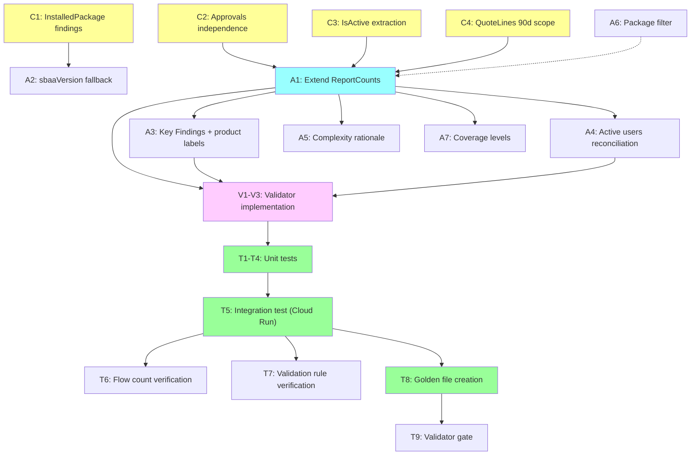

# CPQ Assessment Report V4 — Mitigation Plan (Revised)

> **Document ID:** CPQ-V4-MIT-2026-001
> **Version:** 2.1
> **Date:** 2026-03-31
> **Status:** Ready for Review
> **Authors:** Daniel Aviram + Claude (Architect)
> **Input:** Developer_Redline_Checklist_v4.md, Auditor 1 review, Auditor 2 review
> **Audience:** Technical reviewers, QA, SI stakeholders
> **Rollback:** V3 code tagged at commit `29937d7`. Rollback = regenerate from tag.
> **Review status:** Approved with minor revisions by two independent auditors. All audit findings addressed in v2.1.

---

## 1. Executive Summary

V3 fixed 20+ structural and labeling issues from V2. V4 review identified **6 P0 data accuracy bugs** and **5 P1 quality gaps**. Two independent auditors reviewed our initial mitigation plan and identified **3 critical gaps** and **4 significant gaps** in the approach.

This revised plan incorporates all audit feedback. The key additions:
1. **Canonical Metric Definitions Registry** — formal definitions for every disputed metric
2. **Two-layer validator** — FindingsValidator (pre-assembly) + ReportConsistencyValidator (post-assembly)
3. **Collector-level `IsActive` extraction** — not proxy inference from findings metadata
4. **Golden-file regression testing** — automated, not manual PDF/UI comparison
5. **Verification steps for disputed items** — SOQL-level evidence, not speculation

**Root cause pattern:** The bugs cluster into two categories:
1. **Cross-source inconsistency** — the same metric is computed differently in different assembler functions.
2. **Scope mismatch in collectors** — counts use different time windows or object filters.

---

## 2. System Architecture

```mermaid
graph LR
    SF["Salesforce Org<br/>(REST, Tooling, Bulk APIs)"] -->|SOQL queries| C["Collectors<br/>(12 domain collectors)"]
    C -->|AssessmentFindingInput[]| FV["Findings Validator<br/>(V1-V16: data consistency)"]
    FV -->|findings + warnings| A["Assembler<br/>(findings → ReportData)"]
    A -->|ReportData| RV["Report Validator<br/>(V17-V24: cross-section consistency)"]
    RV -->|validated ReportData| T["Template<br/>(ReportData → HTML)"]
    T -->|HTML| R["Renderer<br/>(HTML → PDF)"]

    style SF fill:#f9f,stroke:#333
    style C fill:#ff9,stroke:#333
    style FV fill:#fcf,stroke:#333
    style A fill:#9ff,stroke:#333
    style RV fill:#fcf,stroke:#333
```

### Key Design Principles

1. **Single Source of Truth (ReportCounts):** Every metric that appears in more than one section is computed exactly once and consumed by reference. No section-level function may independently count findings for metrics covered by ReportCounts.

2. **Two-Layer Validation:**
   - **FindingsValidator** (existing V1-V16): operates on raw findings before assembly. Catches impossible values, source-scope mismatches, missing dependencies.
   - **ReportConsistencyValidator** (new V17-V24): operates on assembled `ReportData`. Catches same-metric-rendered-differently, narrative contradictions, percentage math.

3. **Explicit Source Fields:** Metrics derived from Salesforce fields (IsActive, SBQQ__Active__c) must be preserved through the finding pipeline — not inferred from metadata heuristics.

---

## 3. Canonical Metric Definitions Registry

Every disputed metric must have a formal definition. This is the **single source of truth** for what each number means.

| Metric | Business Meaning | Source Finding Type | Explicit Field Basis | Time Scope | Object Scope | Fallback | Display Label |
|--------|-----------------|--------------------|--------------------|-----------|-------------|----------|--------------|
| **Active Products** | Products available for quoting | `Product2` findings | `IsActive=true` (must be extracted by collector) | All-time | `Product2` | Count of Product2 findings with `detected=true` (degraded: label as "Products Extracted") | "Active Products (IsActive=true)" |
| **Total Products** | All products in org | `Product2` findings | None (count all) | All-time | `Product2` | Always available | "Total Products" |
| **Bundle-capable Products** | Products that can have child options | `Product2` findings | `SBQQ__ConfigurationType__c IN ('Allowed','Required')` | All-time | `Product2` | Zero if field not extracted | "Bundle-capable Products" |
| **Product Options** | Child options linked to bundles | `ProductOption` findings or catalog metric | `SBQQ__ProductOption__c` record count | All-time | `SBQQ__ProductOption__c` | Zero if not extracted | "Product Options" |
| **Product Families** | Distinct families with active products | Derived from `Product2.Family` field | Distinct non-null Family values on active products | All-time | `Product2` | "(none)" excluded from count | "Product Families (with active products)" |
| **Active Price Rules** | Price rules that fire on quotes | `PriceRule` / `SBQQ__PriceRule__c` findings | `SBQQ__Active__c=true` (collector preserves this in `usageLevel`) | All-time | `SBQQ__PriceRule__c` | Count where `usageLevel !== 'dormant'` | "Active Price Rules" |
| **Active Product Rules** | Product rules that fire on configs | `ProductRule` / `SBQQ__ProductRule__c` findings | `SBQQ__Active__c=true` | All-time | `SBQQ__ProductRule__c` | Count where `usageLevel !== 'dormant'` | "Active Product Rules" |
| **Total Quotes (90d)** | Quotes created in assessment window | `DataCount` finding or `recentQuotes` array | `SBQQ__Quote__c WHERE CreatedDate >= 90d ago` | 90-day | `SBQQ__Quote__c` | 0 if not extracted | "Quotes (90 Days)" |
| **Total Quote Lines (90d)** | Lines on 90-day quotes only | `DataCount` finding or derived | `SBQQ__QuoteLine__c WHERE Quote.CreatedDate >= 90d ago` | 90-day | `SBQQ__QuoteLine__c` | 0 | "Quote Lines (90 Days)" |
| **Top Quoted Product %** | % of 90-day quotes containing this product | Derived from `TopQuotedProduct` findings | Numerator: distinct 90-day quotes with this product. Denominator: total 90-day quotes. | **90-day for BOTH** | `SBQQ__QuoteLine__c` → `SBQQ__Quote__c` | 0% if denominator is 0 | "% of Quotes (90d)" |
| **Active Users (90d)** | Users who created/modified quotes in 90d | `UserAdoption` finding (primary) | `countValue` from usage collector's user activity query | 90-day | Quote creators/modifiers | **Fallback:** sum of `UserBehavior` finding `countValue` fields. **Label fallback as "Estimated"** | "Active Users (90d)" |
| **Approval Rules** | sbaa approval rules configured | `AdvancedApprovalRule` findings | `sbaa__ApprovalRule__c` record count | All-time | `sbaa__ApprovalRule__c` | 0 if sbaa not installed or query fails | "Approval Rules (sbaa)" |
| **sbaa Version** | Advanced Approvals package version | `InstalledPackage` finding (primary) | `NamespacePrefix='sbaa'` from `InstalledSubscriberPackage` | All-time | `InstalledSubscriberPackage` | **Fallback chain:** (1) OrgFingerprint notes, (2) CPQSettingValue "Package: Advanced Approvals" notes. **If all miss:** "Installed (version unknown)" — never "Not installed" if package is detected elsewhere | "Adv. Approvals Version" |
| **Active Flows** | Active flow definitions | `Flow` findings from dependencies collector | `FlowDefinitionView WHERE IsActive=true` | All-time | `FlowDefinitionView` | 0 | "Active Flows" |
| **Validation Rules** | Active validation rules on CPQ objects | `ValidationRule` findings from customizations collector | `ValidationRule WHERE Active=true` | All-time | All objects with SBQQ fields | 0 | "Validation Rules" |
| **Apex Classes** | Apex classes referencing CPQ objects | `ApexClass` findings | Class name contains SBQQ reference or is in dependency graph | All-time | `ApexClass` | 0 | "Apex Classes (CPQ-related)" |
| **Triggers** | Triggers on CPQ objects | `ApexTrigger` findings | Trigger object is SBQQ-namespaced | All-time | `ApexTrigger` | 0 | "Triggers (CPQ-related)" |

### Metric Precedence Rules

When a metric has multiple potential sources:
1. **Primary source** is always preferred (explicit SOQL result, dedicated finding type)
2. **Fallback source** is used only when primary is absent, and the value is tagged with lower confidence
3. **If both miss**, display "Not extracted" — never display 0 for a metric that was supposed to be extracted

### Metric State Model

Each metric carries both a `value` and a `status`. Display logic must distinguish true zero from unknown/unavailable.

| Status | Meaning | Display |
|--------|---------|---------|
| `present` | Value extracted and confirmed | Show value with Confirmed badge |
| `zero` | Query succeeded, count is genuinely zero | Show "0 — Confirmed" |
| `estimated` | Derived from fallback source | Show value with Estimated badge |
| `not_extracted` | Extraction failed or was skipped | Show "Not extracted" (never show 0) |
| `not_applicable` | Package/feature not installed | Show "N/A" or omit section |

This model prevents silent misreporting — the most dangerous bug class in assessment reports.

---

## 4. V4 Item Analysis — Agree / Disagree / Root Cause

### P0 Items (Ship Blockers)

#### P0-1: sbaa Version shows "Not installed"

**Verdict: AGREE — assembler + collector gap**

**Root cause:** `sbaaVersion` is extracted from `OrgFingerprint.notes` via regex. The OrgFingerprint finding doesn't contain "sbaa" in the expected format. The installed package data exists as `CPQSettingValue` findings but is never cross-referenced.

**Fix (three-level fallback):**
1. Primary: `InstalledPackage` finding with `namespace='sbaa'` (requires collector enhancement — see C1)
2. Fallback 1: `OrgFingerprint.notes` regex match
3. Fallback 2: `CPQSettingValue` finding where `artifactName` contains "Advanced Approvals"
4. **If all three miss but sbaa namespace was detected in describeGlobal:** display "Installed (version unknown)" — never "Not installed"

**Layer:** Collector (C1: emit canonical InstalledPackage findings) + Assembler (A2: three-level fallback)

---

#### P0-2: Approval Rules shows "not detected" (16 exist in org)

**Verdict: AGREE — collector architecture gap**

**Root cause:** `isSbaaInstalled()` in approvals.ts checks `describeCache` for `sbaa__` keys. Discovery only adds objects to describeCache that are in its explicit wishlist. sbaa objects are not in the wishlist.

**Architectural concern (from Auditor 1):** The approvals collector is too dependent on Discovery internals. A domain collector should be able to probe availability directly.

**Fix (refactor for independence):**
1. Approvals collector checks `_installedPackages` for sbaa namespace (independent of describeCache)
2. If sbaa package detected, attempts direct `describeSObject('sbaa__ApprovalRule__c')` call
3. If describe succeeds, queries sbaa objects
4. If describe fails (object doesn't exist), degrades gracefully with "sbaa package detected but objects not accessible"
5. Discovery wishlist enhancement is an optimization, not a correctness dependency

**Layer:** Collector (C2: approvals independence from Discovery)

---

#### P0-3: Bundle count 76 vs V4 claims 19

**Verdict: PARTIALLY AGREE — labeling + complexity text contradiction**

**Analysis:** 76 is the correct CPQ count (`SBQQ__ConfigurationType__c IN ('Allowed','Required')`). The Salesforce UI "Bundles" list view may use a different filter. Both can be correct.

**But:** Complexity rationale says "no product options" while Section 6 says "475 product options." This is a real contradiction.

**Fix:**
1. Label: "Bundle-capable Products (76)" not "Product Bundles (76)"
2. Pass `counts.productOptions` to `computeComplexityScores()` — eliminate "no product options" text
3. Optional: add note "19 bundles have active child options" if we can compute this from product option data

**Layer:** Assembler (A5)

---

#### P0-4: Active Products 38 vs 179

**Verdict: AGREE — critical, needs collector-level fix (per Auditor 2)**

**Root cause:** Two different counting methods produce different numbers. Neither matches the Salesforce UI (176 active).

**Critical audit feedback:** The proposed `usageLevel !== 'dormant'` proxy is not equivalent to `IsActive=true`. The collector must preserve the explicit `IsActive` field value.

**Fix (collector + assembler):**
1. **Collector (C3):** Verify `catalog.ts` includes `IsActive` in the Product2 SOQL field list. If present, store as `evidenceRef` with `label='IsActive'`. If dropped by FLS, emit a validator warning.
2. **Assembler (A3):** `ReportCounts.activeProducts` = count of Product2 findings where `evidenceRef.IsActive === 'true'`. If `IsActive` field was dropped, fall back to `usageLevel !== 'dormant'` and label as "Products Extracted" not "Active Products."
3. **Every display site** uses `counts.activeProducts` with the canonical label.

**Layer:** Collector (C3) + Assembler (A3)

---

#### P0-5: Top Quoted Products 117% (7 of 6)

**Verdict: AGREE — cleanest diagnosis in the plan**

**Root cause:** `quotedCount` iterates ALL quoteLines (all-time); denominator is `recentQuotes.length` (90-day only).

**Fix:** Filter `quoteLines` to only those linked to `recentQuotes` (90-day scope) before computing `productQuoteSets`. Both numerator and denominator use the same 90-day window.

**Layer:** Collector (C4)

**Unit test:** Add test case with exact scenario: product on 7 all-time quotes, 6 in 90-day window → must produce ≤100%.

---

#### P0-6: Active Users 0 vs 1

**Verdict: AGREE — assembler inconsistency**

**Root cause:** Warning uses `UserAdoption.countValue ?? 0` (no fallback). At-a-Glance uses same with `UserBehavior` sum fallback. Different fallback chains for the same metric.

**Fix:** Compute `counts.activeUsers` once in ReportCounts with explicit precedence:
1. Primary: `UserAdoption.countValue` — label "Confirmed"
2. Fallback: sum of `UserBehavior.countValue` — label "Estimated"
3. If fallback used, tag with lower confidence (per Metric Definitions Registry)

**Layer:** Assembler (A4)

---

### P1 Items

#### P1-1: Package list not filtered

**Verdict: AGREE**

V3 added `CPQ_RELEVANT_NAMESPACES` but it only filters `installedPackages`. The `coreSettings` array still includes all packages as "Package: X" entries.

**Fix:** Remove all "Package:" entries from `coreSettings` (they already appear in `installedPackages`). Single display source for packages.

**Layer:** Assembler (A6)

---

#### P1-2: Product Families 21 vs 28

**Verdict: PARTIALLY AGREE — labeling issue**

21 = families with active products in extraction scope. 28 = configured picklist values (not verified).

**Fix:** Label as "21 product families with active products." Surface both counts if possible.

**Layer:** Assembler (A3, key findings text)

---

#### P1-3: Flows 44 vs 84

**Verdict: REQUIRES VERIFICATION (not "disagree")**

Per Auditor 2: "The word *likely* means nobody checked."

**Fix:** Add verification step T6 in testing phase:
- Run `SELECT COUNT(Id) FROM FlowDefinitionView WHERE IsActive = true` against the org
- Run `SELECT COUNT(Id) FROM FlowDefinitionView` (all flows including inactive)
- If 44 matches active count, close with evidence
- If not, document: which flow types are included? Are managed package flows excluded?

**Layer:** Testing (T6)

---

#### P1-4: Appendix D coverage claims

**Verdict: AGREE — Product Catalog claim contradicts evidence**

"Product options not available" but Section 6 shows 475 options.

**Fix:** Coverage check must also count product options from catalog metrics. Define coverage levels explicitly:
- **Full:** Products + options + rules extracted
- **Partial:** Products extracted, some sub-components missing
- **Minimal:** Only product counts, no detail

**Layer:** Assembler (A7)

---

#### P1-5: Validation Rules 25 vs 22

**Verdict: REQUIRES VERIFICATION (not "disagree")**

**Fix:** Add verification step T7:
- Run `SELECT COUNT(Id) FROM ValidationRule WHERE Active = true` with explicit object list
- Document which objects are included in the 25
- If matches, close. If not, investigate.

**Layer:** Testing (T7)

---

## 5. Extended ReportCounts

Per Auditor 2: ReportCounts must cover **all** metrics that appear in more than one section.

```typescript
interface ReportCounts {
  // Products
  totalProducts: number;
  activeProducts: number;        // From IsActive field, NOT proxy
  activeProductSource: 'IsActive' | 'inferred' | 'unknown';
  bundleProducts: number;
  productOptions: number;
  productFamilies: number;

  // Rules
  activePriceRules: number;
  totalPriceRules: number;
  activeProductRules: number;
  totalProductRules: number;

  // Usage (90-day scope only)
  totalQuotes: number;
  totalQuoteLines: number;
  activeUsers: number;
  activeUsersSource: 'UserAdoption' | 'UserBehavior' | 'unknown';

  // Discount schedules
  discountScheduleTotal: number;
  discountScheduleUnique: number;

  // Packages
  sbaaInstalled: boolean;          // true if namespace found in installed packages
  sbaaVersionRaw: string | null;   // raw version string, null if unknown
  sbaaVersionDisplay: string;      // "v232.2.0" | "Installed (version unknown)" | "Not installed"

  // Code & automation
  approvalRuleCount: number;
  flowCountActive: number;
  flowCountCpqRelated: number;
  validationRuleCount: number;
  apexClassCount: number;
  triggerCount: number;
}
```

**Enforcement rule:** No assembler function may call `findings.filter(f => f.artifactType === 'X').length` for any metric covered by ReportCounts. All access goes through `counts.X`. This is enforced by code review and by a lint-like check in CI (grep for forbidden patterns).

---

## 6. Two-Layer Validator Design

### Layer 1: FindingsValidator (pre-assembly, existing V1-V16)

Operates on raw `AssessmentFindingInput[]`. Catches:
- Impossible values (negative counts, dates in future)
- Source-scope mismatches (all-time data labeled as 90-day)
- Missing dependencies (sbaa package detected but zero approval rule findings)
- Percentage math (> 100% on any finding)
- Duplicate finding keys

### Layer 2: ReportConsistencyValidator (post-assembly, new V17-V24)

Operates on assembled `ReportData`. Catches:

| Rule | Check | Severity |
|------|-------|----------|
| V17 | Any percentage metric > 100% in assembled report | Error |
| V18 | `metadata.lowVolumeWarning` active users matches `cpqAtAGlance` active users | Error |
| V19 | `keyFindings.activeProducts === cpqAtAGlance.activeProducts` AND `inventory.totalProducts === counts.totalProducts` AND `bundleCount === counts.bundleProducts` (per-metric, not generic "product count") | Error |
| V20 | Complexity rationale mentions "no product options" when `counts.productOptions > 0` | Error |
| V21 | `metadata.sbaaVersion` is "Not installed" when `counts.sbaaDetected === true` | Error |
| V22 | Approval rules section says "not detected" when `counts.approvalRuleCount > 0` | Error |
| V23 | Every Top Quoted Product has `percentQuotes <= 100` | Error |
| V24 | Appendix D Product Catalog says "not available" when `counts.productOptions > 0` | Error |

---

## 7. Implementation Plan

### Phase 1: Collector Fixes (extraction accuracy)

| Task | File | Description | Testable Acceptance Criterion |
|------|------|-------------|-------------------------------|
| C1 | `settings.ts` | Emit canonical `InstalledPackage` findings with namespace, version, licenseCount for each installed package | `findings.filter(f => f.artifactType === 'InstalledPackage' && f.notes.includes('sbaa')).length === 1` |
| C2 | `approvals.ts` | Refactor: check `_installedPackages` for sbaa, then direct `describeSObject()`, then query. No dependency on Discovery describeCache for correctness. | When sbaa is installed, `findings.filter(f => f.artifactType === 'AdvancedApprovalRule').length > 0` regardless of Discovery cache state |
| C3 | `catalog.ts` | Ensure `IsActive` is included in the Product2 SOQL field list (add if absent). Store as `evidenceRef {label:'IsActive', value:'true/false'}` on each Product2 finding. If dropped by FLS, emit validator warning. Note: a first-class `attributes.isActive` field would be architecturally preferable to evidenceRef parsing, but evidenceRef is consistent with the current finding schema. | `findings.filter(f => f.artifactType === 'Product2').every(f => f.evidenceRefs.some(r => r.label === 'IsActive'))` — or a FLS warning is emitted |
| C4 | `usage.ts` | Filter `quoteLines` to only those linked to `recentQuotes` (by Quote ID) before computing `productQuoteSets`. Merge C3/C4 from original plan (per Auditor 2). | `topQuotedProducts.every(p => p.quotedCount <= recentQuotes.length)` |

### Phase 2: Assembler Fixes (single source of truth)

| Task | File | Description | Testable Acceptance Criterion |
|------|------|-------------|-------------------------------|
| A1 | `assembler.ts` | Extend `ReportCounts` to cover all multi-section metrics (per Section 5). Compute once at top of `assembleReport()`. | `typeof reportData.counts.activeProducts === 'number'` and all fields populated |
| A2 | `assembler.ts` | sbaaVersion: three-level fallback chain. If all miss but sbaaDetected, show "Installed (version unknown)". | `if (counts.sbaaDetected) then metadata.sbaaVersion !== 'Not installed'` |
| A3 | `assembler.ts` | Key Finding #5: use `counts.activeProducts` with explicit label. Product families: "X families with active products". | `keyFindings[4].title.includes('active products')` and count matches `counts.activeProducts` |
| A4 | `assembler.ts` | Active users: use `counts.activeUsers` for both warning and At-a-Glance. Tag with `activeUsersSource`. | `metadata.lowVolumeWarning` user count === `cpqAtAGlance` user count |
| A5 | `assembler.ts` | Complexity rationale: use `counts.productOptions`. No "no product options" when count > 0. | `if counts.productOptions > 0 then scoringMethodology[0].rationale.includes(counts.productOptions)` |
| A6 | `assembler.ts` | Remove "Package:" entries from `coreSettings`. Single display source for packages. | `coreSettings.filter(s => s.setting.startsWith('Package:')).length === 0` |
| A7 | `assembler.ts` | Product Catalog coverage: check `counts.productOptions > 0` for options coverage. Use explicit coverage levels (Full/Partial/Minimal). | `if counts.productOptions > 0 then appendixD['Product Catalog'].coverage !== 'Partial'` |
| A8 | `templates/index.ts` | Conditional label rendering: when `counts.activeProductSource === 'inferred'`, render "Products Extracted" instead of "Active Products". Same for `activeUsersSource === 'UserBehavior'` → append "(Estimated)" to the label. | Template renders degraded labels when source tracking fields indicate non-primary source |

### Phase 3: Validator Additions (prevent recurrence)

| Task | File | Description |
|------|------|-------------|
| V1 | `validation.ts` | Implement `validateReportConsistency(data: ReportData)` with V17-V24 rules |
| V2 | `validation.ts` | Wire into pipeline: `assembleReport()` → `validateReportConsistency()` → `renderReport()` |
| V3 | `assembler.ts` | Add `ReportCounts` usage lint: grep test that no assembler function uses `findings.filter(...).length` for ReportCounts-covered metrics |

### Phase 4: Testing

| Task | Description |
|------|-------------|
| T1 | **Unit tests for ReportCounts:** mock findings → verify all counts computed correctly |
| T2 | **Unit test for percentage math:** 7-of-6 scenario → must produce ≤100% |
| T3 | **Unit test for sbaaVersion fallback:** OrgFingerprint missing, CPQSettingValue present → version extracted |
| T4 | **Unit test for approvals independence:** describeCache empty, _installedPackages has sbaa → approvals queried |
| T5 | **Integration test:** Run extraction on Cloud Run → generate PDF → extract all numbers into golden file |
| T6 | **Verification:** Run `SELECT COUNT(Id) FROM FlowDefinitionView WHERE IsActive = true` against org. Compare to report's 44. Document result. |
| T7 | **Verification:** Run `SELECT COUNT(Id) FROM ValidationRule WHERE Active = true` against org with explicit object list. Compare to report's 25. Document result. |
| T7a | **Escalation rule:** If T6 or T7 reveals a discrepancy > 10% from the report value, open a P1 fix task targeting the relevant collector. If ≤ 10%, document the scope difference in the report text and close. |
| T8 | **Golden file regression:** Create `report-snapshot.json` from a frozen `AssessmentFindingInput[]` fixture (not live org data). CI test assembles ReportData from the fixture and diffs against the golden file. Live org verification (T5) is performed separately and is not a CI gate. Golden file tests catch assembler regressions; live tests catch collector regressions. |
| T9 | **Validator gate:** Run both FindingsValidator and ReportConsistencyValidator. Zero errors. Warnings documented and accepted. |

---

## 8. Dependency Graph



**Note:** A1 (ReportCounts extension) is implementable independently of C2/C3/C4. The collector fixes make A1's output *accurate*, but A1's *structure* doesn't depend on them. This allows parallel work.

---

## 9. Risk Register

| Risk | Impact | Likelihood | Mitigation |
|------|--------|-----------|-----------|
| Discovery still doesn't describe sbaa objects | Approval rules missing | Low (C2 removes this dependency) | C2 makes approvals collector independent of Discovery |
| Top Products rankings change after 90d filter | SI sees different list vs V3 | High | Document in changelog: "Top Products now correctly scoped to 90-day window" |
| Active product count changes visibly (38 → ~176) | SI sees different number vs V3 | High | Expected and correct. Label change ("Active Products") makes the basis explicit |
| `IsActive` dropped by FLS | `activeProducts` falls back to proxy | Medium | Emit validator warning. Label as "Products Extracted" not "Active Products" |
| sbaa queries fail on orgs without sbaa | False "not detected" | Low | Graceful degradation: "sbaa not installed" when package truly absent |
| API call budget exceeded by additional describes | Extraction fails on API-limited orgs | Low | Check remaining API calls before adding sbaa describes. Skip if < 100 remaining. **If skipped, emit validator warning:** 'sbaa describe skipped due to API budget — approval rules may be underreported.' Silent degradation is never acceptable. |
| Golden file becomes stale after org changes | False CI failures | Medium | Golden file is regenerated per-org, not shared across orgs |
| Validator creates false confidence | New bug class missed | Medium | Validator is safety net, not substitute for golden-file testing and manual review |

---

## 10. Success Criteria

The V4 report is ready for SI review when ALL of the following are true:

| # | Criterion | Verification Method |
|---|-----------|-------------------|
| 1 | sbaa version on cover page matches installed version (or "Installed (version unknown)") | Golden file check |
| 2 | Approval rules section shows data when sbaa is installed | Golden file: `approvalRuleCount > 0` |
| 3 | No percentage exceeds 100% anywhere in the report | ReportConsistencyValidator V17 + V23 |
| 4 | `activeProducts` in At-a-Glance, Key Findings, and Inventory are identical | ReportConsistencyValidator V19 |
| 5 | Warning banner and At-a-Glance agree on active user count | ReportConsistencyValidator V18 |
| 6 | Complexity rationale does not say "no product options" when options exist | ReportConsistencyValidator V20 |
| 7 | Section 4.2 contains only CPQ settings (no "Package:" entries) | Unit test on ReportData |
| 8 | Appendix D Product Catalog reads "Full" when product options > 0 | ReportConsistencyValidator V24 |
| 9 | Cloud Run extraction completes successfully with 12/12 collectors. Finding count deltas vs previous run are explained by C1-C4 changes and documented in the golden file baseline. | Integration test T5 |
| 10 | FindingsValidator: zero errors | T9 |
| 11 | ReportConsistencyValidator: zero errors | T9 |
| 12 | Flow count verified against direct SOQL | T6 |
| 13 | Validation rule count verified against direct SOQL | T7 |

---

## 11. Items NOT Fixed (with justification)

| Item | Decision | Justification |
|------|----------|---------------|
| ADM-1 Branding | **Keep RevBrain** | Stakeholder decision 2026-03-30. Trivial to change later. |
| P2-8 Apex SBQQ Objects | **Deferred** | Requires code parsing. Documented in Appendix D. |
| P3-1 Score bars | **Already working** | `scoreBar()` renders in PDF. |
| Backlogged items | **V2 Report scope** | H/M/L ratings, heat maps, migration recommendations are scope creep. |

---

## 12. Backward Compatibility

| Change | Impact | Communication |
|--------|--------|--------------|
| Active Products: 38 → ~176 | Significant visible change | Changelog: "Active Products now uses IsActive field directly instead of category subtotal" |
| Top Products %: some >100% → all ≤100% | Rankings may change | Changelog: "Top Products correctly scoped to 90-day window" |
| Approval Rules: "not detected" → 16 rules | New section content | Changelog: "sbaa approval rules now extracted (previously skipped due to Discovery dependency)" |
| sbaa Version: "Not installed" → "v232.2.0" | Cover page change | Changelog: "Package version detection enhanced with three-level fallback" |
| Packages in Core Settings: removed | Section 4.2 shorter | Changelog: "Packages moved to dedicated Installed Packages section" |

---

## Appendix A: V3 Progress Summary

V3 fixed 20 items from V2:

| Category | Fixed in V3 | Remaining for V4 |
|----------|------------|------------------|
| Extraction bugs | QuoteLines, QCP, Families | Approvals, Top Products %, IsActive |
| Template/structure | Section numbering, duplicate appendix, field completeness | — |
| Labeling/reconciliation | Active rule counts, discount schedules | Active users, product counts |
| Coverage claims | Advanced Approvals → Partial | Product Catalog overclaimed |
| Quality improvements | 5-level utilization, dormancy, rule summaries, score rationale | Executive summary synthesis |

## Appendix B: Audit Feedback Integration

| Auditor | Finding | How Addressed |
|---------|---------|--------------|
| Auditor 1 | Need canonical metric definitions | Section 3: full registry with 14 metrics |
| Auditor 1 | `activeProducts` definition too weak | C3: explicit `IsActive` field extraction |
| Auditor 1 | Validator should be two layers | Section 6: FindingsValidator + ReportConsistencyValidator |
| Auditor 1 | P1-3, P1-5 dismissed too quickly | T6, T7: SOQL verification steps added |
| Auditor 1 | Acceptance criteria not testable | All criteria rewritten as assertions |
| Auditor 1 | Missing regression matrix | T8: golden file approach |
| Auditor 2 | `activeProducts` needs IsActive from collector | C3: collector-level fix |
| Auditor 2 | sbaaVersion double-miss unhandled | A2: "Installed (version unknown)" fallback |
| Auditor 2 | C4→A1 false dependency | Dependency graph corrected |
| Auditor 2 | ReportCounts incomplete | Extended to 20+ fields |
| Auditor 2 | No automated regression testing | T8: golden file CI test |
| Auditor 2 | Risk register missing regression/performance | Section 9: added 3 risks |
| Auditor 2 | C3/C4 redundant tasks | Merged into C4 |
| Auditor 2 | Success criteria skip P1 | Criteria 7-8 added |
| Auditor 2 | No rollback plan | Header: V3 tag documented |
