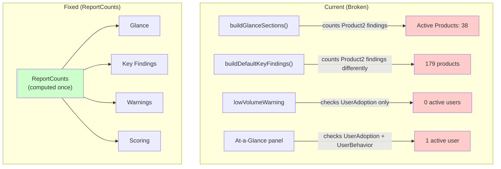
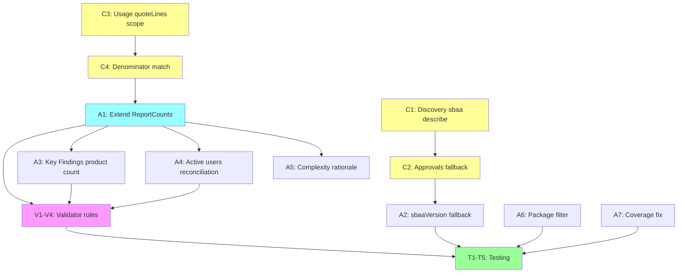

# CPQ Assessment Report V4 — Mitigation Plan

> **Document ID:** CPQ-V4-MIT-2026-001
> **Version:** 1.0
> **Date:** 2026-03-31
> **Status:** Ready for Review
> **Authors:** Daniel Aviram + Claude (Architect)
> **Input:** Developer_Redline_Checklist_v4.md (expert review of V3 output)
> **Audience:** Technical reviewers, QA, SI stakeholders

---

## 1. Executive Summary

V3 was a structural improvement — it fixed 20+ issues from V2 including section numbering, field completeness suppression, feature utilization model, and template parity. However, V4 review identified **6 P0 data accuracy bugs** and **5 P1 quality gaps** that remain.

**Root cause pattern:** The bugs cluster into two categories:
1. **Cross-source inconsistency** — the same metric (product count, user count, approval status) is computed differently in different parts of the assembler, using different finding types or fallback logic.
2. **Scope mismatch in collectors** — counts use different time windows (all-time vs 90-day) or different object filters (active vs total), producing numbers that contradict each other when placed side-by-side.

**This plan's goal:** Fix all P0/P1 items with architectural changes that prevent recurrence, not just point fixes.

---

## 2. System Architecture Context

The report pipeline has four stages. Understanding where each bug lives is critical for correct fixing:

```mermaid
graph LR
    SF["Salesforce Org<br/>(REST, Tooling, Bulk APIs)"] -->|SOQL queries| C["Collectors<br/>(12 domain collectors)"]
    C -->|AssessmentFindingInput[]| V["Validator<br/>(V1-V16 rules)"]
    V -->|findings + warnings| A["Assembler<br/>(findings → ReportData)"]
    A -->|ReportData| T["Template<br/>(ReportData → HTML)"]
    T -->|HTML| R["Renderer<br/>(HTML → PDF)"]

    style SF fill:#f9f,stroke:#333
    style C fill:#ff9,stroke:#333
    style A fill:#9ff,stroke:#333
```

| Stage | File(s) | Responsibility |
|-------|---------|---------------|
| **Collectors** | `apps/worker/src/collectors/*.ts` | Extract raw data from Salesforce via SOQL, produce `AssessmentFindingInput[]` |
| **Validator** | `apps/worker/src/normalize/validation.ts` | Check cross-section consistency (V1-V16 rules), inject warnings |
| **Assembler** | `apps/worker/src/report/assembler.ts` | Transform findings into typed `ReportData` structure |
| **Template** | `apps/worker/src/report/templates/index.ts` | Render `ReportData` → HTML |
| **Renderer** | `apps/worker/src/report/renderer.ts` | HTML → PDF via Playwright |

### Key Design Principle: Single Source of Truth

The V3 bugs all share a common anti-pattern: **the same metric is computed independently in multiple places**. The fix is architectural:



---

## 3. V4 Item Analysis — Agree / Disagree / Root Cause

### P0 Items (Ship Blockers)

#### P0-1: Adv. Approvals Version shows "Not installed"

**Verdict: AGREE — real bug in assembler**

| What V4 says | What the report shows | What the code does |
|---|---|---|
| sbaa v232.2.0 is Active with 344 licenses | Cover: "Not installed" / Settings: "Package: Advanced Approvals v232.2.0" | `sbaaVersion` extracted from `OrgFingerprint.notes` via regex — but the OrgFingerprint finding doesn't contain "sbaa" |

**Root cause:** The assembler searches `OrgFingerprint` notes for `sbaa\s+([v\d.]+)` but the installed package data is stored as `CPQSettingValue` findings from the settings collector. The two data sources are never cross-referenced.

**Fix:** Assembler fallback — if OrgFingerprint doesn't yield sbaaVersion, search `CPQSettingValue` findings where `artifactName` contains "Advanced Approvals" and extract version from notes.

**Layer:** Assembler only.

---

#### P0-2: Approval Rules section says "not detected" (16 exist)

**Verdict: AGREE — real bug in collector**

| What V4 says | What the report shows | What the code does |
|---|---|---|
| 16 active approval rules across 5 target objects | "Advanced Approvals (sbaa) not detected" | `isSbaaInstalled()` checks `describeCache` for `sbaa__` keys — but Discovery may not describe sbaa objects |

**Root cause:** The approvals collector's `isSbaaInstalled()` function only checks the describeCache (populated by Discovery's `describeGlobal()`). If the Discovery collector doesn't explicitly describe `sbaa__ApprovalRule__c`, the check returns false and the entire sbaa extraction branch is skipped.

The Discovery collector describes objects found in its initial `describeGlobal()` call, which returns ALL objects. However, it only adds objects to `describeCache` that it explicitly `describeSObject()` — and it only describes objects in its wishlist. sbaa objects are not in Discovery's wishlist.

**Fix (two-part):**
1. **Discovery collector:** Add `sbaa__ApprovalRule__c`, `sbaa__ApprovalChain__c`, `sbaa__ApprovalCondition__c` to the describe wishlist when the sbaa namespace is detected in `describeGlobal()`.
2. **Approvals collector fallback:** If `describeCache` doesn't have sbaa keys but `_installedPackages` shows sbaa is installed, attempt the SOQL queries anyway (they'll fail gracefully if the objects don't exist).

**Layer:** Collector (primary), with assembler defensive check.

---

#### P0-3: Bundle count shows 76 but V4 claims only 19

**Verdict: PARTIALLY AGREE — 76 is technically correct but the complexity text contradicts**

| What V4 says | What the report shows | What the code does |
|---|---|---|
| Only 19 bundles in Bundles list view | "76 bundle products" / "no product options" in complexity text | Counts `Product2 WHERE SBQQ__ConfigurationType__c IN ('Allowed', 'Required')` |

**Analysis:** The SOQL filter `SBQQ__ConfigurationType__c IN ('Allowed', 'Required')` is the correct CPQ definition of a bundle-capable product. The Salesforce UI "Bundles" list view may use a different filter (e.g., only products with actual child options). Both numbers can be correct — they measure different things.

However, the complexity score text at line 176 says "no product options" which directly contradicts "475 product options across 76 bundles" at line 431. This is an assembler bug where the `computeComplexityScores()` function doesn't have access to the product option count.

**Fix:**
1. **Label clarity:** Change "Product Bundles" to "Bundle-capable Products" in At-a-Glance, or add "(products with bundle configuration)" qualifier.
2. **Complexity text:** Pass the product option count to `computeComplexityScores()` so the rationale text is accurate.

**Layer:** Assembler.

---

#### P0-4: Active Products shows 38 vs 179

**Verdict: AGREE — real bug in assembler**

| What V4 says | What the report shows | What the code does |
|---|---|---|
| UI shows 176 active products | At-a-Glance: 38 / Key Findings: 179 / Inventory: 179 | Glance uses `dataCount('Product')` which finds a DataCount finding with value 38; Key Findings uses `findings.filter(f => f.artifactType === 'Product2').length` |

**Root cause:** Two different counting methods:
- `dataCount('Product')` finds a `DataCount` finding — this may be a filtered count (e.g., products in a specific category, or products meeting a specific criteria).
- `findings.filter(Product2).length` counts ALL Product2 findings (active + inactive).
- The UI shows 176 (active only, `IsActive=true`).

**Fix:** The `ReportCounts` canonical struct must define:
- `totalProducts`: all Product2 findings
- `activeProducts`: Product2 findings where `usageLevel !== 'dormant'` or `detected === true`
- Every place that displays a product count must use one of these with explicit labeling.

**Layer:** Assembler (ReportCounts).

---

#### P0-5: Top Quoted Products shows 117% (7 of 6)

**Verdict: AGREE — real bug in collector**

| What V4 says | What the report shows | What the code does |
|---|---|---|
| Percentage > 100% is mathematically impossible | "2-Yard Dumpster: 117% (7 of 6)" | `quotedCount` = distinct quotes containing this product (all-time); denominator = `recentQuotes.length` (90-day) |

**Root cause:** Scope mismatch between numerator and denominator:
- **Numerator** (usage.ts `productQuoteSets`): iterates over ALL `quoteLines` (not filtered to 90-day window), counting distinct quotes per product.
- **Denominator** (usage.ts `recentQuotes.length`): counts quotes in the 90-day window only.

When a product appears on 7 quotes total but only 6 quotes are in the 90-day window, you get 7/6 = 117%.

**Fix:** Both numerator and denominator must use the same scope. Either:
- (a) Filter `quoteLines` to only those linked to `recentQuotes` before computing `productQuoteSets`, OR
- (b) Use the all-time quote count as denominator if using all-time line data.

Option (a) is correct — "Top Quoted Products (90 Days)" should use 90-day data only.

**Layer:** Collector (usage.ts).

---

#### P0-6: Active Users shows 0 in warning but 1 in At-a-Glance

**Verdict: AGREE — real bug in assembler**

| What V4 says | What the report shows | What the code does |
|---|---|---|
| Cross-section contradiction | Warning: "0 active users" / Glance: "Active Users (90d): 1" | Warning uses `UserAdoption.countValue ?? 0`; Glance uses UserAdoption with UserBehavior fallback |

**Root cause:** The low-volume warning computation and the At-a-Glance panel use different fallback chains for the same metric:
- Warning: `findings.find(f => f.artifactType === 'UserAdoption')?.countValue ?? 0` — no fallback
- At-a-Glance: same lookup, but with `|| findings.filter(f => f.artifactType === 'UserBehavior').reduce(...)` — fallback to sum of UserBehavior counts

**Fix:** Extract `activeUserCount` into `ReportCounts` using the same logic everywhere.

**Layer:** Assembler (ReportCounts).

---

### P1 Items (SI Review Blockers)

#### P1-1: Package list not filtered

**Verdict: AGREE — the namespace filter from V3 is not working**

The V3 implementation added `CPQ_RELEVANT_NAMESPACES` but it only filters the `installedPackages` array in `buildInstalledPackages()`. The `coreSettings` array is built separately from `CPQSettingValue` findings and still includes all packages.

**Fix:** Apply the same namespace filter to `coreSettings` entries that start with "Package:" — or better, move all package display to the dedicated `installedPackages` section and remove them from `coreSettings`.

**Layer:** Assembler.

---

#### P1-2: Product Families count (21 vs 28)

**Verdict: PARTIALLY AGREE — labeling issue**

The 21 count is "families with extracted products." The 28 would be "configured picklist values." Both are correct but unlabeled.

**Fix:** Label as "21 product families with active products" in the report text.

**Layer:** Assembler (key findings text).

---

#### P1-3: Flow count (44 vs 84)

**Verdict: DISAGREE — 44 active flows is internally consistent**

The report shows 44 total active flows (13 CPQ-related + 31 non-CPQ). The 84 likely includes inactive flows or managed package flows. The code correctly filters `WHERE IsActive = true`.

**Fix:** None required for the count. Optional: add note "Excludes inactive and system flows."

**Layer:** None (or minor template note).

---

#### P1-4: Appendix D coverage claims

**Verdict: AGREE — Product Catalog claim contradicts evidence**

Appendix D says "Products extracted but product options not available" while Section 6 shows "475 product options across 76 bundles." The coverage logic checks for `ProductOption` findings but options may be stored as a different artifact type.

**Fix:** Update coverage check to also look for product option data in metrics or catalog findings. Change "not available" to "Full" when option count > 0.

**Layer:** Assembler (coverage builder).

---

#### P1-5: Validation Rules (25 vs 22)

**Verdict: DISAGREE — 25 is internally consistent**

The report shows 25 consistently across all sections. The V4 claim of 22 may be counting only rules on 4 specific objects; the extractor may include rules on additional objects (e.g., `SBQQ__Subscription__c`). No contradiction exists in the report.

**Fix:** Optional: add note specifying which objects are included.

**Layer:** None (or minor template note).

---

### ADM-1: Branding (RevBrain vs Vento)

**Verdict: NOT APPLICABLE — stakeholder decision was to keep RevBrain**

The project owner explicitly instructed: "use RevBrain not Vento." This is not a bug — it's a product decision. If the decision changes, a global find-replace is trivial.

---

## 4. Fix Strategy — Architectural Approach

### 4.1 The ReportCounts Single-Source-of-Truth Pattern

The V3 `ReportCounts` struct was a step in the right direction but didn't go far enough. V4 extends it:

```typescript
interface ReportCounts {
  // Products — ONE canonical computation
  totalProducts: number;       // All Product2 findings
  activeProducts: number;      // IsActive=true (from usageLevel/detected)
  bundleProducts: number;      // ConfigurationType in (Allowed, Required)
  productOptions: number;      // ProductOption finding count
  productFamilies: number;     // Distinct families with active products

  // Rules — already correct in V3
  activePriceRules: number;
  totalPriceRules: number;
  activeProductRules: number;
  totalProductRules: number;

  // Usage — must use same scope everywhere
  totalQuotes: number;         // 90-day window only
  totalQuoteLines: number;     // 90-day window only
  activeUsers: number;         // From UserAdoption OR UserBehavior fallback

  // Discount schedules
  discountScheduleTotal: number;
  discountScheduleUnique: number;
}
```

**Every** place in the assembler that displays a product count, user count, or quote count MUST reference `ReportCounts`. No independent re-computation allowed.

### 4.2 Collector Fixes (Extraction Layer)

```mermaid
graph TD
    subgraph "P0-2: Approval Rules Fix"
        D["Discovery Collector"] -->|"describeGlobal()"| NS["Detect sbaa namespace"]
        NS -->|"yes"| DESC["describeSObject(sbaa__ApprovalRule__c)"]
        DESC --> DC["Add to describeCache"]
        DC --> A["Approvals Collector"]
        A -->|"isSbaaInstalled() = true"| Q["Query sbaa objects"]
    end

    subgraph "P0-5: Top Products Fix"
        QL["quoteLines (all)"] -->|"filter"| RQL["quoteLines in 90-day quotes only"]
        RQL -->|"group by product"| PS["productQuoteSets"]
        PS -->|"quotedCount"| PCT["percentage = quotedCount / recentQuotes.length"]
    end
```



| Fix | Collector | Change |
|-----|-----------|--------|
| P0-2 | `discovery.ts` | Add sbaa objects to describe wishlist when sbaa namespace detected |
| P0-2 | `approvals.ts` | Fallback: check `_installedPackages` if describeCache misses sbaa |
| P0-5 | `usage.ts` | Filter quoteLines to 90-day scope before computing productQuoteSets |

### 4.3 Assembler Fixes (Transformation Layer)

| Fix | Change |
|-----|--------|
| P0-1 | sbaaVersion: fallback to CPQSettingValue "Package: Advanced Approvals" if OrgFingerprint misses it |
| P0-3 | Pass `productOptions` count to `computeComplexityScores()` for accurate rationale text |
| P0-4 | Use `ReportCounts.activeProducts` everywhere. Key Finding #5 says "X active products" not "X products" |
| P0-6 | Compute `activeUsers` once with UserAdoption + UserBehavior fallback, store in ReportCounts |
| P1-1 | Filter `coreSettings` to remove "Package:" entries (already in `installedPackages`) |
| P1-2 | Key Findings: "X families with active products" (explicit label) |
| P1-4 | Coverage check: look for option count in catalog metrics for Product Catalog coverage |

### 4.4 Validator Additions

| Rule | Check | Severity |
|------|-------|----------|
| V17 | Any percentage metric > 100% → error | Error |
| V18 | `activeUsers` in warning matches At-a-Glance → error if different | Error |
| V19 | `activeProducts` appears in multiple sections → must match | Error |
| V20 | `bundleProducts` + "no product options" text conflict | Warning |

---

## 5. Implementation Plan

### Phase 1: Collector Fixes (extraction accuracy)

| Task | File | Description | Acceptance Criteria |
|------|------|-------------|-------------------|
| C1 | `discovery.ts` | Add sbaa objects to describe wishlist when sbaa namespace detected in describeGlobal | `describeCache` contains `sbaa__ApprovalRule__c` after Discovery runs |
| C2 | `approvals.ts` | Add fallback: check `_installedPackages` for sbaa if describeCache misses | Approvals collector queries sbaa objects even if Discovery didn't describe them |
| C3 | `usage.ts` | Filter quoteLines to 90-day scope before computing productQuoteSets | No top product percentage > 100% |
| C4 | `usage.ts` | Ensure `quotedCount` denominator matches `recentQuotes.length` scope | `(7 of 6)` scenario eliminated |

### Phase 2: Assembler Fixes (single source of truth)

| Task | File | Description | Acceptance Criteria |
|------|------|-------------|-------------------|
| A1 | `assembler.ts` | Extend `ReportCounts` with `activeProducts`, `bundleProducts`, `productOptions`, `productFamilies`, `activeUsers` | All counts computed once |
| A2 | `assembler.ts` | sbaaVersion fallback to CPQSettingValue findings | Cover page shows "v232.2.0" not "Not installed" |
| A3 | `assembler.ts` | Key Finding #5: use `counts.activeProducts` with "active" label | No contradictory product counts |
| A4 | `assembler.ts` | Low-volume warning: use `counts.activeUsers` from ReportCounts | Warning and At-a-Glance agree |
| A5 | `assembler.ts` | Complexity rationale: include `counts.productOptions` | No "no product options" when 475 exist |
| A6 | `assembler.ts` | Remove "Package:" entries from `coreSettings` (already in `installedPackages`) | Section 4.2 is CPQ settings only |
| A7 | `assembler.ts` | Product Catalog coverage: check option count > 0 | Appendix D says "Full" when options extracted |

### Phase 3: Validator Additions (prevent recurrence)

| Task | File | Description |
|------|------|-------------|
| V1 | `validation.ts` | V17: percentage > 100% detection |
| V2 | `validation.ts` | V18: activeUsers cross-section match |
| V3 | `validation.ts` | V19: product count cross-section match |
| V4 | `validation.ts` | V20: bundle/option text consistency |

### Phase 4: Testing

| Task | Description |
|------|-------------|
| T1 | Run extraction against the same Salesforce org on Cloud Run |
| T2 | Generate PDF from extraction results |
| T3 | Automated checks: no percentage > 100%, sbaa version present, approval rules > 0, product counts consistent |
| T4 | Compare every number in the PDF against Salesforce UI screenshots |
| T5 | Run validator — zero errors, warnings reviewed and accepted |

---

## 6. Dependency Graph



---

## 7. Items NOT Fixed (with justification)

| Item | Decision | Justification |
|------|----------|---------------|
| ADM-1 Branding | **Keep RevBrain** | Stakeholder decision 2026-03-30. RevBrain is the product name. |
| P1-3 Flows (44 vs 84) | **No change needed** | 44 active flows is correct. 84 includes inactive. |
| P1-5 Validation Rules (25 vs 22) | **No change needed** | 25 is consistent across report. Difference is likely object scope. |
| P2-8 Apex SBQQ Objects | **Deferred** | Requires code parsing not available in metadata APIs. Documented in Appendix D. |
| P3-1 Score bars | **Already working** | `scoreBar()` renders correctly in PDF. |
| Backlogged items | **V2 Report scope** | H/M/L ratings, heat maps, migration recommendations are scope creep for v1. |

---

## 8. Risk Register

| Risk | Mitigation |
|------|-----------|
| Discovery still doesn't describe sbaa objects | C2 fallback ensures approvals collector tries SOQL regardless |
| Top products fix changes percentages visibly | Expected — 117% → ~50% is correct behavior |
| Active product count changes (38 → 176) | Expected — 176 is the correct count from Salesforce |
| sbaa queries fail on orgs without sbaa | Graceful degradation — collector catches SOQL errors, reports "not detected" |
| Validator rejects previously-passing reports | Validator errors are surfaced as warnings in the PDF, not silent blocks |

---

## 9. Success Criteria

The V4 report is ready for SI review when:

1. **Zero P0 items remain** — all 6 fixed and verified against Salesforce UI
2. **Validator passes** — V1-V20 rules all pass (or produce only accepted warnings)
3. **No percentage exceeds 100%** anywhere in the report
4. **Every product count is labeled** (Active / Total / In Scope)
5. **sbaa version appears on cover page** (if installed)
6. **Approval rules section shows data** (if sbaa installed)
7. **Warning banner and At-a-Glance agree** on active user count
8. **Cloud Run extraction matches local** — same finding counts, same report output

---

## Appendix A: V3 Progress Summary

V3 fixed 20 items from V2:

| Category | Fixed | Remaining |
|----------|-------|-----------|
| Extraction bugs | QuoteLines, QCP, Families, Bundles (partial) | Approvals, Active Products, Top Products % |
| Template/structure | Section numbering, duplicate appendix, field completeness | — |
| Labeling/reconciliation | Active rule counts, discount schedules, lifecycle caveat | Active users, product counts |
| Coverage claims | Advanced Approvals downgraded to Partial | Product Catalog overclaimed |
| Quality improvements | 5-level utilization, dormancy note, rule summaries, score rationale | Synthesis standard, integration view |

**Net assessment:** V3 improved structure and template parity significantly. V4 focuses on the harder problem: extraction accuracy and cross-section data reconciliation.
