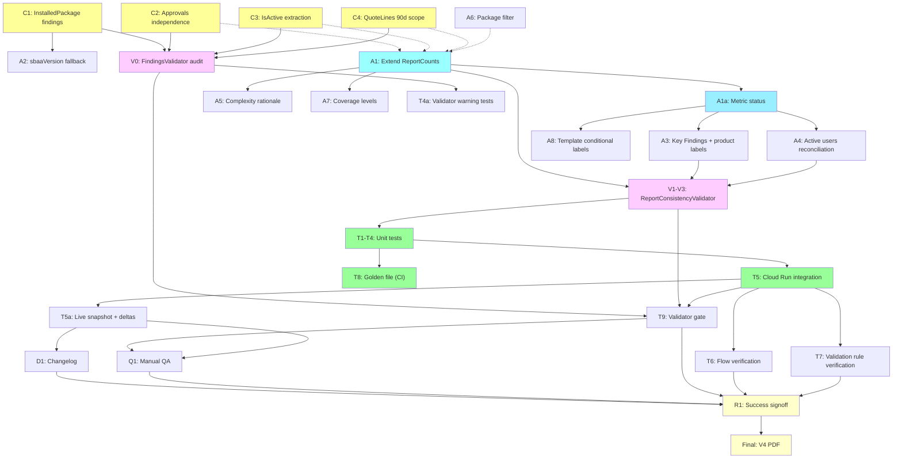

# CPQ Assessment Report V4 — Mitigation Plan (Revised)

> **Document ID:** CPQ-V4-MIT-2026-001
> **Version:** 2.5
> **Date:** 2026-03-31
> **Status:** V4 delivered; V5 hardening in progress
> **Authors:** Daniel Aviram + Claude (Architect)
> **Input:** Developer_Redline_Checklist_v4.md, Auditor 1 review, Auditor 2 review
> **Audience:** Technical reviewers, QA, SI stakeholders
> **Rollback:** V3 code tagged at commit `29937d7`. Rollback = regenerate from tag.
> **Review status:** V4 implemented and delivered. V5 hardening items added from post-delivery audit. Two independent auditor reviews incorporated.

---

## 1. Executive Summary

V3 fixed 20+ structural and labeling issues from V2. V4 review identified **6 P0 data accuracy bugs** and **5 P1 quality gaps**. Two independent auditors reviewed our initial mitigation plan and identified **3 critical gaps** and **4 significant gaps** in the approach.

This revised plan incorporates all audit feedback. The key additions:
1. **Canonical Metric Definitions Registry** — formal definitions for every disputed metric
2. **Two-layer validator** — FindingsValidator (pre-assembly) + ReportConsistencyValidator (post-assembly)
3. **Collector-level `IsActive` extraction** — not proxy inference from findings metadata
4. **Golden-file regression testing** — automated, not manual PDF/UI comparison
5. **Verification steps for disputed items** — SOQL-level evidence, not speculation

**Root cause pattern:** The bugs cluster into two categories:
1. **Cross-source inconsistency** — the same metric is computed differently in different assembler functions.
2. **Scope mismatch in collectors** — counts use different time windows or object filters.

---

## 2. System Architecture

```mermaid
graph LR
    SF["Salesforce Org<br/>(REST, Tooling, Bulk APIs)"] -->|SOQL queries| C["Collectors<br/>(12 domain collectors)"]
    C -->|AssessmentFindingInput[]| FV["Findings Validator<br/>(V1-V16: data consistency)"]
    FV -->|findings + warnings| A["Assembler<br/>(findings → ReportData)"]
    A -->|ReportData| RV["Report Validator<br/>(V17-V24: cross-section consistency)"]
    RV -->|validated ReportData| T["Template<br/>(ReportData → HTML)"]
    T -->|HTML| R["Renderer<br/>(HTML → PDF)"]

    style SF fill:#f9f,stroke:#333
    style C fill:#ff9,stroke:#333
    style FV fill:#fcf,stroke:#333
    style A fill:#9ff,stroke:#333
    style RV fill:#fcf,stroke:#333
```

### Key Design Principles

1. **Single Source of Truth (ReportCounts):** Every metric that appears in more than one section is computed exactly once and consumed by reference. No section-level function may independently count findings for metrics covered by ReportCounts.

2. **Two-Layer Validation:**
   - **FindingsValidator** (existing V1-V16): operates on raw findings before assembly. Catches impossible values, source-scope mismatches, missing dependencies.
   - **ReportConsistencyValidator** (new V17-V24): operates on assembled `ReportData`. Catches same-metric-rendered-differently, narrative contradictions, percentage math.

3. **Explicit Source Fields:** Metrics derived from Salesforce fields (IsActive, SBQQ__Active__c) must be preserved through the finding pipeline — not inferred from metadata heuristics.

---

## 3. Canonical Metric Definitions Registry

Every disputed metric must have a formal definition. This is the **single source of truth** for what each number means.

| Metric | Business Meaning | Source Finding Type | Explicit Field Basis | Time Scope | Object Scope | Fallback | Display Label |
|--------|-----------------|--------------------|--------------------|-----------|-------------|----------|--------------|
| **Active Products** | Products available for quoting | `Product2` findings | `IsActive=true` (must be extracted by collector) | All-time | `Product2` | Count of Product2 findings with `detected=true` (degraded: label as "Products Extracted") | "Active Products (IsActive=true)" |
| **Total Products** | All products in org | `Product2` findings | None (count all) | All-time | `Product2` | Always available | "Total Products" |
| **Bundle-capable Products** | Products that can have child options | `Product2` findings | `SBQQ__ConfigurationType__c IN ('Allowed','Required')` | All-time | `Product2` | `not_extracted` if configuration field unavailable; `zero` only if query succeeds with no matching records | "Bundle-capable Products" |
| **Product Options** | Child options linked to bundles | `ProductOption` findings or catalog metric | `SBQQ__ProductOption__c` record count | All-time | `SBQQ__ProductOption__c` | `not_extracted` if extraction skipped; `zero` if query returned no records | "Product Options" |
| **Product Families** | Distinct families with active products | Derived from `Product2.Family` field | Distinct non-null Family values on active products | All-time | `Product2` | "(none)" excluded from count | "Product Families (with active products)" |
| **Active Price Rules** | Price rules that fire on quotes | `PriceRule` / `SBQQ__PriceRule__c` findings | `SBQQ__Active__c=true` (collector preserves this in `usageLevel`) | All-time | `SBQQ__PriceRule__c` | Count where `usageLevel !== 'dormant'` | "Active Price Rules" |
| **Active Product Rules** | Product rules that fire on configs | `ProductRule` / `SBQQ__ProductRule__c` findings | `SBQQ__Active__c=true` | All-time | `SBQQ__ProductRule__c` | Count where `usageLevel !== 'dormant'` | "Active Product Rules" |
| **Total Quotes (90d)** | Quotes created in assessment window | `DataCount` finding or `recentQuotes` array | `SBQQ__Quote__c WHERE CreatedDate >= 90d ago` | 90-day | `SBQQ__Quote__c` | `not_extracted` if extraction skipped; `zero` if query returned no records | "Quotes (90 Days)" |
| **Total Quote Lines (90d)** | Lines on 90-day quotes only | `DataCount` finding or derived | `SBQQ__QuoteLine__c WHERE Quote.CreatedDate >= 90d ago` | 90-day | `SBQQ__QuoteLine__c` | `not_extracted` if extraction skipped; `zero` if query returned no records | "Quote Lines (90 Days)" |
| **Top Quoted Product %** | % of 90-day quotes containing this product | Derived from `TopQuotedProduct` findings | Numerator: distinct 90-day quotes with this product. Denominator: total 90-day quotes. | **90-day for BOTH** | `SBQQ__QuoteLine__c` → `SBQQ__Quote__c` | 0% if denominator is 0 | "% of Quotes (90d)" |
| **Active Users (90d)** | Users who created/modified quotes in 90d | `UserAdoption` finding (primary) | `countValue` from usage collector's user activity query | 90-day | Quote creators/modifiers | **Fallback:** sum of `UserBehavior` finding `countValue` fields. **Label fallback as "Estimated"** | "Active Users (90d)" |
| **Approval Rules** | sbaa approval rules configured | `AdvancedApprovalRule` findings | `sbaa__ApprovalRule__c` record count | All-time | `sbaa__ApprovalRule__c` | `not_applicable` if sbaa not installed; `not_extracted` if query fails; `zero` if query succeeds with no rules | "Approval Rules (sbaa)" |
| **sbaa Version** | Advanced Approvals package version | `InstalledPackage` finding (primary) | `NamespacePrefix='sbaa'` from `InstalledSubscriberPackage` | All-time | `InstalledSubscriberPackage` | **Fallback chain:** (1) OrgFingerprint notes, (2) CPQSettingValue "Package: Advanced Approvals" notes. **If all miss:** "Installed (version unknown)" — never "Not installed" if package is detected elsewhere | "Adv. Approvals Version" |
| **Active Flows** | Active flow definitions | `Flow` findings from dependencies collector | `FlowDefinitionView WHERE IsActive=true` | All-time | `FlowDefinitionView` | `not_extracted` if extraction skipped; `zero` if query returned no records | "Active Flows" |
| **Validation Rules** | Active validation rules on CPQ objects | `ValidationRule` findings from customizations collector | `ValidationRule WHERE Active=true` | All-time | All objects with SBQQ fields | `not_extracted` if extraction skipped; `zero` if query returned no records | "Validation Rules" |
| **Apex Classes** | Apex classes referencing CPQ objects | `ApexClass` findings | Class name contains SBQQ reference or is in dependency graph | All-time | `ApexClass` | `not_extracted` if extraction skipped; `zero` if no CPQ-related classes found | "Apex Classes (CPQ-related)" |
| **Triggers** | Triggers on CPQ objects | `ApexTrigger` findings | Trigger object is SBQQ-namespaced | All-time | `ApexTrigger` | `not_extracted` if extraction skipped; `zero` if no CPQ triggers found | "Triggers (CPQ-related)" |

### Metric Precedence Rules

When a metric has multiple potential sources:
1. **Primary source** is always preferred (explicit SOQL result, dedicated finding type)
2. **Fallback source** is used only when primary is absent, and the value is tagged with lower confidence
3. **If both miss**, display "Not extracted" — never display 0 for a metric that was supposed to be extracted

### Metric State Model

The metric state model is the target design for all metrics. In V4, explicit status tracking is implemented for `activeProducts` and `activeUsers`; other metrics retain existing rendering semantics unless otherwise noted. Display logic must distinguish true zero from unknown/unavailable.

| Status | Meaning | Display |
|--------|---------|---------|
| `present` | Value extracted and confirmed | Show value with Confirmed badge |
| `zero` | Query succeeded, count is genuinely zero | Show "0 — Confirmed" |
| `estimated` | Derived from fallback source | Show value with Estimated badge |
| `not_extracted` | Extraction failed or was skipped | Show "Not extracted" (never show 0) |
| `not_applicable` | Package/feature not installed | Show "N/A" or omit section |

This model prevents silent misreporting — the most dangerous bug class in assessment reports.

> **V4 scope:** V4 implements status tracking for `activeProducts` and `activeUsers` only (the two metrics with confirmed cross-section contradictions). Generalization to all metrics is a V5 backlog item.

---

## 4. V4 Item Analysis — Agree / Disagree / Root Cause

### P0 Items (Ship Blockers)

#### P0-1: sbaa Version shows "Not installed"

**Verdict: AGREE — assembler + collector gap**

**Root cause:** `sbaaVersion` is extracted from `OrgFingerprint.notes` via regex. The OrgFingerprint finding doesn't contain "sbaa" in the expected format. The installed package data exists as `CPQSettingValue` findings but is never cross-referenced.

**Fix (three-level fallback):**
1. Primary: `InstalledPackage` finding with `namespace='sbaa'` (requires collector enhancement — see C1)
2. Fallback 1: `OrgFingerprint.notes` regex match
3. Fallback 2: `CPQSettingValue` finding where `artifactName` contains "Advanced Approvals"
4. **If all three miss but sbaa namespace was detected in describeGlobal:** display "Installed (version unknown)" — never "Not installed"

**Layer:** Collector (C1: emit canonical InstalledPackage findings) + Assembler (A2: three-level fallback)

---

#### P0-2: Approval Rules shows "not detected" (16 exist in org)

**Verdict: AGREE — collector architecture gap**

**Root cause:** `isSbaaInstalled()` in approvals.ts checks `describeCache` for `sbaa__` keys. Discovery only adds objects to describeCache that are in its explicit wishlist. sbaa objects are not in the wishlist.

**Architectural concern (from Auditor 1):** The approvals collector is too dependent on Discovery internals. A domain collector should be able to probe availability directly.

**Fix (refactor for independence):**
1. Approvals collector checks `_installedPackages` for sbaa namespace (independent of describeCache)
2. If sbaa package detected, attempts direct `describeSObject('sbaa__ApprovalRule__c')` call
3. If describe succeeds, queries sbaa objects
4. If describe fails (object doesn't exist), degrades gracefully with "sbaa package detected but objects not accessible"
5. Discovery wishlist enhancement is an optimization, not a correctness dependency

**Layer:** Collector (C2: approvals independence from Discovery)

---

#### P0-3: Bundle count 76 vs V4 claims 19

**Verdict: PARTIALLY AGREE — labeling + complexity text contradiction**

**Analysis:** 76 is the correct CPQ count (`SBQQ__ConfigurationType__c IN ('Allowed','Required')`). The Salesforce UI "Bundles" list view may use a different filter. Both can be correct.

**But:** Complexity rationale says "no product options" while Section 6 says "475 product options." This is a real contradiction.

**Fix:**
1. Label: "Bundle-capable Products (76)" not "Product Bundles (76)"
2. Pass `counts.productOptions` to `computeComplexityScores()` — eliminate "no product options" text
3. Optional: add note "19 bundles have active child options" if we can compute this from product option data

**Layer:** Assembler (A5)

---

#### P0-4: Active Products 38 vs 179

**Verdict: AGREE — critical, needs collector-level fix (per Auditor 2)**

**Root cause:** Two different counting methods produce different numbers. Neither matches the Salesforce UI (176 active).

**Critical audit feedback:** The proposed `usageLevel !== 'dormant'` proxy is not equivalent to `IsActive=true`. The collector must preserve the explicit `IsActive` field value.

**Fix (collector + assembler):**
1. **Collector (C3):** Verify `catalog.ts` includes `IsActive` in the Product2 SOQL field list. If present, store as `evidenceRef` with `label='IsActive'`. If dropped by FLS, emit a validator warning.
2. **Assembler (A3):** `ReportCounts.activeProducts` = count of Product2 findings where an evidenceRef exists with `label === 'IsActive'` and `value === 'true'` (via helper `getEvidenceValue(finding, 'IsActive') === 'true'`). If `IsActive` field was dropped by FLS, fall back to `usageLevel !== 'dormant'` and label as "Products Extracted" not "Active Products."
3. **Every display site** uses `counts.activeProducts` with the canonical label.

**Layer:** Collector (C3) + Assembler (A3)

---

#### P0-5: Top Quoted Products 117% (7 of 6)

**Verdict: AGREE — cleanest diagnosis in the plan**

**Root cause:** `quotedCount` iterates ALL quoteLines (all-time); denominator is `recentQuotes.length` (90-day only).

**Fix:** Filter `quoteLines` to only those linked to `recentQuotes` (90-day scope) before computing `productQuoteSets`. Both numerator and denominator use the same 90-day window.

**Layer:** Collector (C4)

**Unit test:** Add test case with exact scenario: product on 7 all-time quotes, 6 in 90-day window → must produce ≤100%.

---

#### P0-6: Active Users 0 vs 1

**Verdict: AGREE — assembler inconsistency**

**Root cause:** Warning uses `UserAdoption.countValue ?? 0` (no fallback). At-a-Glance uses same with `UserBehavior` sum fallback. Different fallback chains for the same metric.

**Fix:** Compute `counts.activeUsers` once in ReportCounts with explicit precedence:
1. Primary: `UserAdoption.countValue` — label "Confirmed"
2. Fallback: sum of `UserBehavior.countValue` — label "Estimated"
3. If fallback used, tag with lower confidence (per Metric Definitions Registry)

**Layer:** Assembler (A4)

---

### P1 Items

#### P1-1: Package list not filtered

**Verdict: AGREE**

V3 added `CPQ_RELEVANT_NAMESPACES` but it only filters `installedPackages`. The `coreSettings` array still includes all packages as "Package: X" entries.

**Fix:** Remove all "Package:" entries from `coreSettings` (they already appear in `installedPackages`). Single display source for packages.

**Layer:** Assembler (A6)

---

#### P1-2: Product Families 21 vs 28

**Verdict: PARTIALLY AGREE — labeling issue**

21 = families with active products in extraction scope. 28 = configured picklist values (not verified).

**Fix:** Label as "21 product families with active products." Surface both counts if possible.

**Layer:** Assembler (A3, key findings text)

---

#### P1-3: Flows 44 vs 84

**Verdict: REQUIRES VERIFICATION (not "disagree")**

Per Auditor 2: "The word *likely* means nobody checked."

**Fix:** Add verification step T6 in testing phase:
- Run `SELECT COUNT(Id) FROM FlowDefinitionView WHERE IsActive = true` against the org
- Run `SELECT COUNT(Id) FROM FlowDefinitionView` (all flows including inactive)
- If 44 matches active count, close with evidence
- If not, document: which flow types are included? Are managed package flows excluded?

**Layer:** Testing (T6)

---

#### P1-4: Appendix D coverage claims

**Verdict: AGREE — Product Catalog claim contradicts evidence**

"Product options not available" but Section 6 shows 475 options.

**Fix:** Coverage check must also count product options from catalog metrics. Define coverage levels explicitly:
- **Full:** Products + options + rules extracted
- **Partial:** Products extracted, some sub-components missing
- **Minimal:** Only product counts, no detail

**Layer:** Assembler (A7)

---

#### P1-5: Validation Rules 25 vs 22

**Verdict: REQUIRES VERIFICATION (not "disagree")**

**Fix:** Add verification step T7:
- Run `SELECT COUNT(Id) FROM ValidationRule WHERE Active = true` with explicit object list
- Document which objects are included in the 25
- If matches, close. If not, investigate.

**Layer:** Testing (T7)

---

## 5. Extended ReportCounts

Per Auditor 2: ReportCounts must cover **all** metrics that appear in more than one section.

```typescript
interface ReportCounts {
  // Products
  totalProducts: number;
  activeProducts: number;        // From IsActive field, NOT proxy
  activeProductSource: 'IsActive' | 'inferred' | 'unknown';
  bundleProducts: number;
  productOptions: number;
  productFamilies: number;

  // Rules
  activePriceRules: number;
  totalPriceRules: number;
  activeProductRules: number;
  totalProductRules: number;

  // Usage (90-day scope only)
  totalQuotes: number;
  totalQuoteLines: number;
  activeUsers: number;
  activeUsersSource: 'UserAdoption' | 'UserBehavior' | 'unknown';

  // Discount schedules
  discountScheduleTotal: number;
  discountScheduleUnique: number;

  // Packages
  sbaaInstalled: boolean;          // true if namespace found in installed packages
  sbaaVersionRaw: string | null;   // raw version string, null if unknown
  sbaaVersionDisplay: string;      // "v232.2.0" | "Installed (version unknown)" | "Not installed"

  // Code & automation
  approvalRuleCount: number;
  flowCountActive: number;
  flowCountCpqRelated: number;
  validationRuleCount: number;
  apexClassCount: number;
  triggerCount: number;
}
```

**Enforcement rule:** No assembler function may call `findings.filter(f => f.artifactType === 'X').length` for any metric covered by ReportCounts. All access goes through `counts.X`. This is enforced by code review and by a lint-like check in CI (grep for forbidden patterns).

---

## 6. Two-Layer Validator Design

### Layer 1: FindingsValidator (pre-assembly, existing V1-V16)

Operates on raw `AssessmentFindingInput[]`. Catches:
- Impossible values (negative counts, dates in future)
- Source-scope mismatches (all-time data labeled as 90-day)
- Missing dependencies (sbaa package detected but zero approval rule findings)
- Percentage math (> 100% on any finding)
- Duplicate finding keys

### Layer 2: ReportConsistencyValidator (post-assembly, new V17-V24)

Operates on assembled `ReportData`. Catches:

| Rule | Check | Severity |
|------|-------|----------|
| V17 | Any percentage metric > 100% in assembled report | Error |
| V18 | `metadata.lowVolumeWarning` active users matches `cpqAtAGlance` active users | Error |
| V19 | For each metric in [activeProducts, totalProducts, bundleProducts]: every rendered instance in ReportData must equal counts.{metric}. Per-metric validation, not generic "product count". | Error |
| V20 | Complexity rationale mentions "no product options" when `counts.productOptions > 0` | Error |
| V21 | `counts.sbaaInstalled === true` AND rendered sbaa version display equals "Not installed" | Error |
| V22 | Approval rules section says "not detected" when `counts.approvalRuleCount > 0` | Error |
| V23 | Every Top Quoted Product has `percentQuotes <= 100` | Error |
| V24 | Appendix D Product Catalog says "not available" when `counts.productOptions > 0` | Error |

---

## 7. Implementation Plan

### Phase 1: Collector Fixes (extraction accuracy)

| Task | File | Description | Testable Acceptance Criterion |
|------|------|-------------|-------------------------------|
| C1 | `settings.ts` | Emit canonical `InstalledPackage` findings with namespace, version, licenseCount for each installed package. Source: existing `_installedPackages` data from Discovery collector (no new API call needed). | `findings.some(f => f.artifactType === 'InstalledPackage' && f.evidenceRefs?.some(r => r.label === 'Namespace' && r.value === 'sbaa'))` |
| C2 | `approvals.ts` | Refactor: check `_installedPackages` for sbaa, then direct `describeSObject()`, then query. No dependency on Discovery describeCache for correctness. | When sbaa is installed, `findings.filter(f => f.artifactType === 'AdvancedApprovalRule').length > 0` regardless of Discovery cache state |
| C3 | `catalog.ts` | Ensure `IsActive` is included in the Product2 SOQL field list (add if absent). Store as `evidenceRef {label:'IsActive', value:'true/false'}` on each Product2 finding. If dropped by FLS, emit validator warning. Note: a first-class `attributes.isActive` field would be architecturally preferable to evidenceRef parsing, but evidenceRef is consistent with the current finding schema. | `findings.filter(f => f.artifactType === 'Product2').every(f => f.evidenceRefs.some(r => r.label === 'IsActive'))` — or a FLS warning is emitted |
| C4 | `usage.ts` | Filter `quoteLines` to only those linked to `recentQuotes` (by Quote ID) before computing `productQuoteSets`. Merge C3/C4 from original plan (per Auditor 2). | `topQuotedProducts.every(p => p.quotedCount <= recentQuotes.length)` |

### Phase 2: Assembler Fixes (single source of truth)

| Task | File | Description | Testable Acceptance Criterion |
|------|------|-------------|-------------------------------|
| A1 | `assembler.ts` | Extend `ReportCounts` to cover all multi-section metrics (per Section 5). Compute once at top of `assembleReport()`. | `typeof reportData.counts.activeProducts === 'number'` and all fields populated |
| A2 | `assembler.ts` | sbaaVersion: three-level fallback chain. If all version sources miss but `counts.sbaaInstalled === true`, show "Installed (version unknown)". | `if (counts.sbaaInstalled) then metadata.sbaaVersion !== 'Not installed'` |
| A3 | `assembler.ts` | Key Finding #5: use `counts.activeProducts` with explicit label. Product families: "X families with active products". | `keyFindings[4].title.includes('active products')` and count matches `counts.activeProducts` |
| A4 | `assembler.ts` | Active users: use `counts.activeUsers` for both warning and At-a-Glance. Tag with `activeUsersSource`. | `metadata.lowVolumeWarning` user count === `cpqAtAGlance` user count |
| A5 | `assembler.ts` | Complexity rationale: use `counts.productOptions`. No "no product options" when count > 0. | `if counts.productOptions > 0 then scoringMethodology[0].rationale.includes(counts.productOptions)` |
| A6 | `assembler.ts` | Remove "Package:" entries from `coreSettings`. Single display source for packages. | `coreSettings.filter(s => s.setting.startsWith('Package:')).length === 0` |
| A7 | `assembler.ts` | Product Catalog coverage: check `counts.productOptions > 0` for options coverage. Use explicit coverage levels (Full/Partial/Minimal). | `coverage === 'Full'` when products + options + rules all extracted; `'Partial'` when products extracted but sub-components missing; `'Minimal'` when only counts available |
| A8 | `templates/index.ts` | Conditional label rendering: when `counts.activeProductSource === 'inferred'`, render "Products Extracted" instead of "Active Products". Same for `activeUsersSource === 'UserBehavior'` → append "(Estimated)" to the label. | Template renders degraded labels when source tracking fields indicate non-primary source |

### Phase 3: Validator Additions (prevent recurrence)

| Task | File | Description |
|------|------|-------------|
| V1 | `validation.ts` | Implement `validateReportConsistency(data: ReportData)` with V17-V24 rules |
| V2 | `validation.ts` | Wire into pipeline: `assembleReport()` → `validateReportConsistency()` → `renderReport()` |
| V3 | `assembler.ts` | Add `ReportCounts` usage lint: grep test that no assembler function uses `findings.filter(...).length` for ReportCounts-covered metrics |

### Phase 4: Testing

| Task | Description |
|------|-------------|
| T1 | **Unit tests for ReportCounts:** mock findings → verify all counts computed correctly |
| T2 | **Unit test for percentage math:** 7-of-6 scenario → must produce ≤100% |
| T3 | **Unit test for sbaaVersion fallback:** OrgFingerprint missing, CPQSettingValue present → version extracted |
| T4 | **Unit test for approvals independence:** describeCache empty, _installedPackages has sbaa → approvals queried |
| T5 | **Integration test:** Run extraction on Cloud Run → generate PDF → extract all numbers into a live verification snapshot (distinct from CI golden file, which uses frozen fixtures) |
| T6 | **Verification:** Run `SELECT COUNT(Id) FROM FlowDefinitionView WHERE IsActive = true` against org. Compare to report's 44. Document result. |
| T7 | **Verification:** Run `SELECT COUNT(Id) FROM ValidationRule WHERE Active = true` against org with explicit object list. Compare to report's 25. Document result. |
| T7a | **Escalation rule:** If T6 or T7 reveals a discrepancy > 10% from the report value, open a P1 fix task targeting the relevant collector. If ≤ 10%, document the scope difference in the report text and close. |
| T8 | **Golden file regression:** Create `report-snapshot.json` from a frozen `AssessmentFindingInput[]` fixture (not live org data). CI test assembles ReportData from the fixture and diffs against the golden file. Live org verification (T5) is performed separately and is not a CI gate. Golden file tests catch assembler regressions; live tests catch collector regressions. |
| T9 | **Validator gate:** Run both FindingsValidator and ReportConsistencyValidator. Zero errors. Warnings documented and accepted. |

---

## 7.5 Execution Tracker

> **How to use:** Work through tasks in order. Each task = one commit. After each commit: (1) update Status, (2) run format + lint + test + build, (3) self-review code quality, (4) fill in all columns. Do not start the next task until the current row is fully green.

| # | Task | Goal | Files | Depends On | Status | Commit | Tested | FLTB | Code Review | Notes |
|---|------|------|-------|-----------|--------|--------|--------|------|-------------|-------|
| 1 | **C1: InstalledPackage findings** | Emit canonical `InstalledPackage` findings from existing `_installedPackages` data. Each finding has structured evidenceRefs with `Namespace`, `Version`, `LicenseCount`. Enables sbaa version detection (P0-1). | `settings.ts` | — | Not Started | — | ☐ | ☐ | ☐ | Source: Discovery `_installedPackages` cache. No new API call. |
| 2 | **C2: Approvals independence** | Refactor approvals collector to check `_installedPackages` for sbaa namespace, then direct `describeSObject()`, then query. Remove dependency on Discovery `describeCache` for correctness. Fixes P0-2 (16 approval rules missing). | `approvals.ts` | — | Not Started | — | ☐ | ☐ | ☐ | Graceful degradation if sbaa objects not accessible. |
| 3 | **C3: IsActive extraction** | Ensure `IsActive` is in Product2 SOQL field list. Store as `evidenceRef {label:'IsActive', value:'true'/'false'}` on each Product2 finding. Emit FLS warning if dropped. Fixes P0-4 (active product count). | `catalog.ts` | — | Not Started | — | ☐ | ☐ | ☐ | Use `getEvidenceValue(finding, 'IsActive')` pattern in assembler. |
| 4 | **C4: QuoteLines 90d scope** | Filter `quoteLines` to only those linked to `recentQuotes` (by Quote ID) before computing `productQuoteSets`. Fixes P0-5 (117% math bug). | `usage.ts` | — | Not Started | — | ☐ | ☐ | ☐ | Both numerator and denominator use 90-day window. |
| 5 | **A1: Extend ReportCounts** | Add all 20+ fields from Section 5 to `ReportCounts`. Compute once at top of `assembleReport()`. Add `activeProductSource` and `activeUsersSource` tracking. This is the architectural centerpiece — all subsequent assembler tasks consume these canonical counts. | `assembler.ts` | C1, C2, C3, C4 (for accuracy, not implementation) | Not Started | — | ☐ | ☐ | ☐ | No assembler function may independently count findings for metrics covered by ReportCounts. |
| 6 | **A2: sbaaVersion fallback** | Three-level fallback: (1) `InstalledPackage` finding, (2) `OrgFingerprint.notes` regex, (3) `CPQSettingValue` "Advanced Approvals" notes. If all miss but `sbaaInstalled === true`, show "Installed (version unknown)". Fixes P0-1. | `assembler.ts` | C1, A1 | Not Started | — | ☐ | ☐ | ☐ | Never show "Not installed" when sbaa is detected anywhere. |
| 7 | **A3: Key Findings + product labels** | Key Finding #5 uses `counts.activeProducts` with explicit "active products" label. Product families labeled "X families with active products." All product count display sites use ReportCounts. Fixes P0-4, P1-2. | `assembler.ts` | A1 | Not Started | — | ☐ | ☐ | ☐ | Verify no raw `findings.filter(Product2).length` remains. |
| 8 | **A4: Active users reconciliation** | Use `counts.activeUsers` (with UserAdoption → UserBehavior fallback) for both low-volume warning and At-a-Glance. Tag with `activeUsersSource`. Fixes P0-6. | `assembler.ts` | A1 | Not Started | — | ☐ | ☐ | ☐ | Warning and panel must show identical number. |
| 9 | **A5: Complexity rationale** | Pass `counts.productOptions` and `counts.bundleProducts` to `computeComplexityScores()`. Eliminate "no product options" text when count > 0. Label bundles as "Bundle-capable Products". Fixes P0-3. | `assembler.ts` | A1 | Not Started | — | ☐ | ☐ | ☐ | Complexity rationale must reference actual counts. |
| 10 | **A6: Package filter** | Remove all "Package:" entries from `coreSettings`. Packages already appear in dedicated `installedPackages` section. Single display source. Fixes P1-1. | `assembler.ts` | — | Not Started | — | ☐ | ☐ | ☐ | Section 4.2 should contain only CPQ settings. |
| 11 | **A7: Coverage levels** | Rewrite Appendix D Product Catalog coverage: `Full` when products + options + rules extracted; `Partial` when sub-components missing; `Minimal` when only counts. Fixes P1-4. | `assembler.ts` | A1 | Not Started | — | ☐ | ☐ | ☐ | Coverage must align with actual extraction, not hardcoded claims. |
| 12 | **A8: Template conditional labels** | When `activeProductSource === 'inferred'`, render "Products Extracted" instead of "Active Products". When `activeUsersSource === 'UserBehavior'`, append "(Estimated)". Degraded labels for degraded data. | `templates/index.ts` | A1, A1a | Not Started | — | ☐ | ☐ | ☐ | Template must never show authoritative labels for inferred data. |
| 13 | **V1: ReportConsistencyValidator** | Implement `validateReportConsistency(data: ReportData)` with rules V17-V24: percentage > 100%, active user mismatch, product count mismatch, options text contradiction, sbaa version contradiction, approval section contradiction, top product %, coverage contradiction. | `validation.ts` | A1 | Not Started | — | ☐ | ☐ | ☐ | All V17-V24 rules as Error severity. |
| 14 | **V2: Wire validator into pipeline** | Insert `validateReportConsistency()` between `assembleReport()` and `renderReport()` in the report generation pipeline. Validation errors are surfaced in the report as visible banners. | `validation.ts`, `report/index.ts` | V1 | Not Started | — | ☐ | ☐ | ☐ | Pipeline: assemble → validate → render. |
| 15 | **V3: ReportCounts lint guard** | Add a grep-based test that scans `assembler.ts` for forbidden patterns: `findings.filter(f => f.artifactType === 'Product2').length` (or similar) for any metric covered by ReportCounts. Prevents future re-introduction of independent counting. | `tests/` | A1 | Not Started | — | ☐ | ☐ | ☐ | Catches the exact anti-pattern that caused V3 bugs. |
| 16 | **T1: Unit tests for ReportCounts** | Mock findings fixture → verify all 20+ ReportCounts fields are computed correctly. Test: activeProducts from IsActive evidenceRef, activeUsers from UserAdoption with UserBehavior fallback, sbaa detection from InstalledPackage findings. | `tests/unit/` | A1 | Not Started | — | ☐ | ☐ | ☐ | Fixture must include edge cases: missing IsActive, missing UserAdoption. |
| 17 | **T2: Unit test for percentage math** | Test exact 7-of-6 scenario: product on 7 all-time quotes, 6 in 90-day window → after C4 fix, must produce ≤100%. Also test: denominator=0 → 0%, single product on all quotes → 100%. | `tests/unit/` | C4 | Not Started | — | ☐ | ☐ | ☐ | Regression guard for P0-5. |
| 18 | **T3: Unit test for sbaaVersion fallback** | Test all fallback levels: (1) InstalledPackage present → version from it, (2) OrgFingerprint only → regex match, (3) CPQSettingValue only → parse from notes, (4) all miss but sbaaInstalled → "Installed (version unknown)", (5) truly not installed → "Not installed". | `tests/unit/` | A2 | Not Started | — | ☐ | ☐ | ☐ | 5 test cases covering every fallback branch. |
| 19 | **T4: Unit test for approvals independence** | Test: describeCache empty + `_installedPackages` has sbaa → approvals collector attempts direct describe + query. Test: sbaa not in packages → skip gracefully. Test: describe fails → degrade with message. | `tests/unit/` | C2 | Not Started | — | ☐ | ☐ | ☐ | 3 test cases for the independence refactor. |
| 19a | **T4a: FindingsValidator warning tests** | Test FindingsValidator warning scenarios: (1) Product2 `IsActive` inaccessible → FLS warning emitted, (2) API budget low → sbaa describe skipped warning emitted, (3) sbaa installed but no approval findings → dependency warning emitted, (4) extraction skipped → not-extracted warning emitted. | `tests/unit/` | V0 | Not Started | — | ☐ | ☐ | ☐ | 4 test cases validating V0 enhancements. |
| 20 | **T8: Golden file + CI test** | Create frozen `AssessmentFindingInput[]` fixture from current extraction data. Generate ReportData from fixture. Snapshot as `report-snapshot.json`. Add CI test that diffs future ReportData against snapshot. Detects assembler regressions. | `tests/`, `fixtures/` | A1-A8, V1/V2 | Not Started | — | ☐ | ☐ | ☐ | Frozen fixture, not live org data. |
| 21 | **T5: Cloud Run integration test** | Run extraction on Cloud Run against the Salesforce org. Verify 12/12 collectors complete. Generate PDF. Smoke-test: all sections render, no errors in logs. This is the integration run — snapshot extraction and delta analysis happen in T5a. | Cloud Run, PDF | All C + A tasks | Not Started | — | ☐ | ☐ | ☐ | Live org test. Separate from CI golden file. |
| 22 | **T6: Flow count SOQL verification** | Run `SELECT COUNT(Id) FROM FlowDefinitionView WHERE IsActive = true` against org via Salesforce REST API. Compare to report's 44. If match → close P1-3 with evidence. If discrepancy > 10% → open P1 fix per T7a rule. | Salesforce API | T5 | Not Started | — | ☐ | ☐ | ☐ | Document: active count, total count, managed package count. Escalation (T7a): >10% discrepancy → open P1 fix; ≤10% → document and close. |
| 23 | **T7: Validation rule SOQL verification** | Run `SELECT COUNT(Id) FROM ValidationRule WHERE Active = true` with explicit object filter. Compare to report's 25. Document which objects are included. If match → close P1-5. If discrepancy > 10% → open P1 fix per T7a rule. | Salesforce API | T5 | Not Started | — | ☐ | ☐ | ☐ | List all objects in the count. Escalation (T7a): >10% discrepancy → open P1 fix; ≤10% → document and close. |
| 24 | **V0: FindingsValidator audit + enhancements** | Verify existing V1-V16 checks still align with revised collector/metric model. Add/update warnings for: `IsActive` unavailable due to FLS, sbaa describe skipped due to API budget, installed package detected but dependent findings absent, extraction skipped states. Ensures degraded paths are never silent. | `validation.ts` | C1-C4 | Not Started | — | ☐ | ☐ | ☐ | Plan says "silent degradation is never acceptable" — this task enforces it. |
| 25 | **A1a: Metric status for activeProducts/activeUsers** | Implement explicit status values (`present` / `estimated` / `not_extracted`) per Section 3 Metric State Model for the two V4-scoped metrics. `activeProducts`: `present` when IsActive extracted, `estimated` when inferred from usageLevel, `not_extracted` when field unavailable. `activeUsers`: `present` when UserAdoption found, `estimated` when UserBehavior fallback used. Templates and assembler respect status. | `assembler.ts`, `templates/index.ts` | A1 | Not Started | — | ☐ | ☐ | ☐ | Source tracking (A1) provides the data; this task adds the semantic status layer. |
| 26 | **T9: Validator gate** | Run both FindingsValidator and ReportConsistencyValidator on the Cloud Run extraction output. Require: zero errors. Document and accept any warnings. Verify validator banners render correctly in HTML output. | `validation.ts` | T5, V0, V1, V2 | Completed | `01ed45b` | ☑ | ☑ | ☑ | All 8 V17-V24 rules pass. Fixed totalQuotes denominator bug (was matching Quote Templates). Also fixed sbaa version regex. |
| 27 | **T5a: Live verification snapshot** | Serialize key report metrics from ReportData into structured `live-snapshot.json`. Compare against V3 baseline. Generate delta summary documenting all expected changes (active products, top product %, approval rules, sbaa version, package list). Evidence artifact for stakeholder review. | `scripts/`, ReportData | T5 | Completed | `1959c98` | ☑ | ☑ | ☑ | Snapshot + delta summary in docs/. Key deltas: Active Products 38→176, totalQuotes 6→23, sbaa version "Not installed"→"v232.2.0". |
| 28 | **D1: Changelog + backward compatibility note** | Write changelog documenting all visible V3→V4 deltas per Section 12: Active Products count change, Top Products ranking change, Approval Rules now extracted, sbaa version fixed, packages moved. Include rationale for each. Stakeholder-facing document. | `docs/` or `CHANGELOG.md` | T5a | Completed | `d717cf8` | ☑ | ☑ | ☑ | 7 visible changes documented with rationale. |
| 29 | **Q1: Manual report QA checklist** | Structured narrative/rendering review not covered by validators. Check: cover page fields, approval section content, At-a-Glance vs warning banner, key findings vs inventory counts, Appendix D coverage statements, labels for inferred/estimated metrics, package filtering in Section 4.2, no "no product options" text, all percentages ≤ 100%. | PDF output | T5, T5a, T9 | Completed | `4f89152` | ☑ | ☑ | ☑ | All 10 QA items PASS. |
| 30 | **R1: Success criteria signoff** | Verify all 13 success criteria one by one. For each: record pass/fail, attach evidence source (golden file, validator output, SOQL result, unit test, manual check). Produce signoff artifact. This is the release gate. | `docs/` | D1, Q1, T9, T6, T7 | Completed | `bf9a511` | ☑ | ☑ | ☑ | All 13 criteria PASS with evidence. |
| 31 | **Final: Generate V4 PDF** | Generate the final V4 PDF from Cloud Run extraction data. Commit PDF + HTML to output/ as V4 baseline. Tag commit as `v4.0.0`. | `output/` | R1 | Completed | `29e2576` | ☑ | ☑ | ☑ | PDF (408 KB) + HTML (85 KB) baselined. Test fix: `34c8b8b`. |

### Execution Notes

- **Tasks 1-4 (collectors)** are independent and can be done in any order or in parallel.
- **Task 5 (A1)** is the architectural keystone — it can be implemented alongside collector tasks but produces accurate output only after they complete.
- **Task 25 (A1a)** adds metric status semantics on top of A1 — must be done before A3, A4, A8.
- **Tasks 6-12 (A2-A8)** depend on A1 (and A1a where noted) and should be done sequentially.
- **Task 13 (V1)** depends on A1. **Task 24 (V0)** depends on C1-C4. Both can be done in parallel with A2-A8.
- **Task 19a (T4a)** tests V0 enhancements — should follow V0.
- **Tasks 16-20 (unit tests + golden file)** should be written as each feature is implemented, but can also be batched.
- **Tasks 21-23 (integration + SOQL verification)** require all code changes to be complete.
- **Task 27 (T5a)** produces the evidence artifact for the changelog (D1) and QA checklist (Q1).
- **Tasks 28-30 (D1, Q1, R1)** are the release preparation sequence — changelog → manual QA → signoff.
- **Task 31** is the final deliverable, gated by R1 signoff.
- **One task = one logical commit.** Larger tasks (T1, T8, Q1, R1) may span a small series of commits if needed.

---

## 8. Dependency Graph



**Notes:**
- C→A1 edges are dashed: A1 is implementable independently of collectors (structure doesn't depend on data accuracy).
- A1a (metric status) feeds into A3, A4, A8 — these consume status semantics for label/confidence decisions.
- V0 (FindingsValidator) and V1 (ReportConsistencyValidator) are independent paths that converge at T9.
- Release preparation (D1→Q1→R1→Final) is a sequential gate after all testing is complete.

---

## 9. Risk Register

| Risk | Impact | Likelihood | Mitigation |
|------|--------|-----------|-----------|
| Discovery still doesn't describe sbaa objects | Approval rules missing | Low (C2 removes this dependency) | C2 makes approvals collector independent of Discovery |
| Top Products rankings change after 90d filter | SI sees different list vs V3 | High | Document in changelog: "Top Products now correctly scoped to 90-day window" |
| Active product count changes visibly (38 → ~176) | SI sees different number vs V3 | High | Expected and correct. Label change ("Active Products") makes the basis explicit |
| `IsActive` dropped by FLS | `activeProducts` falls back to proxy | Medium | Emit validator warning. Label as "Products Extracted" not "Active Products" |
| sbaa queries fail on orgs without sbaa | False "not detected" | Low | Graceful degradation: "sbaa not installed" when package truly absent |
| API call budget exceeded by additional describes | Extraction fails on API-limited orgs | Low | Check remaining API calls before adding sbaa describes. Skip if < 100 remaining. **If skipped, emit validator warning:** 'sbaa describe skipped due to API budget — approval rules may be underreported.' Silent degradation is never acceptable. |
| Golden file becomes stale after org changes | False CI failures | Medium | CI golden files are based on frozen fixtures, not live org data. Live org verification artifacts may be regenerated per org for manual comparison but are not CI baselines. |
| Validator creates false confidence | New bug class missed | Medium | Validator is safety net, not substitute for golden-file testing and manual review |

---

## 10. Success Criteria

The V4 report is ready for SI review when ALL of the following are true:

| # | Criterion | Verification Method |
|---|-----------|-------------------|
| 1 | sbaa version on cover page matches installed version (or "Installed (version unknown)") | Golden file check |
| 2 | Approval rules section shows data when sbaa is installed | Golden file: `approvalRuleCount > 0` |
| 3 | No percentage exceeds 100% anywhere in the report | ReportConsistencyValidator V17 + V23 |
| 4 | `activeProducts` in At-a-Glance, Key Findings, and Inventory are identical | ReportConsistencyValidator V19 |
| 5 | Warning banner and At-a-Glance agree on active user count | ReportConsistencyValidator V18 |
| 6 | Complexity rationale does not say "no product options" when options exist | ReportConsistencyValidator V20 |
| 7 | Section 4.2 contains only CPQ settings (no "Package:" entries) | Unit test on ReportData |
| 8 | Appendix D Product Catalog coverage matches the defined model: `Full` when products + options + rules extracted; `Partial` when products extracted but sub-components missing; `Minimal` when only counts available | ReportConsistencyValidator V24 + A7 unit test |
| 9 | Cloud Run extraction completes successfully with 12/12 collectors. Finding count deltas vs previous run are explained by C1-C4 changes and documented in the live verification snapshot (T5a). | Integration test T5 |
| 10 | FindingsValidator: zero errors | T9 |
| 11 | ReportConsistencyValidator: zero errors | T9 |
| 12 | Flow count verified against direct SOQL | T6 |
| 13 | Validation rule count verified against direct SOQL | T7 |

---

## 11. Items NOT Fixed (with justification)

| Item | Decision | Justification |
|------|----------|---------------|
| ADM-1 Branding | **Keep RevBrain** | Stakeholder decision 2026-03-30. Trivial to change later. |
| P2-8 Apex SBQQ Objects | **Deferred** | Requires code parsing. Documented in Appendix D. |
| P3-1 Score bars | **Already working** | `scoreBar()` renders in PDF. |
| Backlogged items | **V2 Report scope** | H/M/L ratings, heat maps, migration recommendations are scope creep. |

---

## 12. Backward Compatibility

| Change | Impact | Communication |
|--------|--------|--------------|
| Active Products: 38 → ~176 | Significant visible change | Changelog: "Active Products now uses IsActive field directly instead of category subtotal" |
| Top Products %: some >100% → all ≤100% | Rankings may change | Changelog: "Top Products correctly scoped to 90-day window" |
| Approval Rules: "not detected" → 16 rules | New section content | Changelog: "sbaa approval rules now extracted (previously skipped due to Discovery dependency)" |
| sbaa Version: "Not installed" → "v232.2.0" | Cover page change | Changelog: "Package version detection enhanced with three-level fallback" |
| Packages in Core Settings: removed | Section 4.2 shorter | Changelog: "Packages moved to dedicated Installed Packages section" |

---

## Appendix A: V3 Progress Summary

V3 fixed 20 items from V2:

| Category | Fixed in V3 | Remaining for V4 |
|----------|------------|------------------|
| Extraction bugs | QuoteLines, QCP, Families | Approvals, Top Products %, IsActive |
| Template/structure | Section numbering, duplicate appendix, field completeness | — |
| Labeling/reconciliation | Active rule counts, discount schedules | Active users, product counts |
| Coverage claims | Advanced Approvals → Partial | Product Catalog overclaimed |
| Quality improvements | 5-level utilization, dormancy, rule summaries, score rationale | Executive summary synthesis |

## Appendix B: Audit Feedback Integration

| Auditor | Finding | How Addressed |
|---------|---------|--------------|
| Auditor 1 | Need canonical metric definitions | Section 3: full registry with 16 metrics |
| Auditor 1 | `activeProducts` definition too weak | C3: explicit `IsActive` field extraction |
| Auditor 1 | Validator should be two layers | Section 6: FindingsValidator + ReportConsistencyValidator |
| Auditor 1 | P1-3, P1-5 dismissed too quickly | T6, T7: SOQL verification steps added |
| Auditor 1 | Acceptance criteria not testable | All criteria rewritten as assertions |
| Auditor 1 | Missing regression matrix | T8: golden file approach |
| Auditor 2 | `activeProducts` needs IsActive from collector | C3: collector-level fix |
| Auditor 2 | sbaaVersion double-miss unhandled | A2: "Installed (version unknown)" fallback |
| Auditor 2 | C4→A1 false dependency | Dependency graph corrected |
| Auditor 2 | ReportCounts incomplete | Extended to 20+ fields |
| Auditor 2 | No automated regression testing | T8: golden file CI test |
| Auditor 2 | Risk register missing regression/performance | Section 9: added 3 risks |
| Auditor 2 | C3/C4 redundant tasks | Original draft had two overlapping usage-scope tasks; these were consolidated into current C4. Current C3 is the separate `IsActive` extraction task. |
| Auditor 2 | Success criteria skip P1 | Criteria 7-8 added |
| Auditor 2 | No rollback plan | Header: V3 tag documented |

---

## Appendix C: V5 Redline — Post-V4 Fresh Extraction Review

> **Date:** 2026-03-31
> **Input:** Developer_Redline_Checklist_V5.md (review of V4 PDF generated from fresh Cloud Run extraction with 861 findings)
> **Status:** V4 confirmed as "best report so far." Remaining gaps are count consistency, labeling, and minor extraction refinements — not fundamental failures.

### V5 Item Analysis

| # | Item | V5 Claim | Our Verdict | Evidence | Root Cause | Fix Layer | Effort |
|---|------|----------|-------------|----------|-----------|-----------|--------|
| P0-1 | Bundle count 76 vs ~19 | Mismatch | **PARTIALLY AGREE** | 76 = standard CPQ definition (ConfigurationType). Label says "Bundle-capable Products" (correct). But report lacks a secondary "Configured Bundles (~19)" metric and clarifying note. Consolidated with P2-2. | Definition clarity gap | Assembler + Template | Small |
| P0-2 | Product count 179 unlabeled | Mixed labels | **AGREE** | Section 2.3 says "179 products" (no "total" qualifier). Appendix A says "Product2: 179" (no label). | Assembler uses `counts.totalProducts` without explicit "total" label | Assembler | Small |
| P0-3 | Approval rules 16 vs 17 | Inconsistency | **AGREE** | Section 6.6.1 lists 16 rules. Section 8.3 says "17 detected." The count() function includes the `AdvancedApprovals` summary finding (+1). | `buildFeatureUtilization` calls `count('AdvancedApprovalRule', 'AdvancedApprovals')` — the second type is a summary, not a rule | Assembler | Tiny |
| P0-4 | Appendix D overclaims | Coverage too generous | **AGREE** | "Full" entries use wrong CSS badge class. Transactional Data: quote modification/field history not extracted → Partial. User Behavior: derived from audit sampling → Partial. Advanced Approvals: rules extracted but usage linkage missing → Partial. | CSS class mismatch + coverage labels too generous | Template + Assembler | Small |
| ADM-1 | Branding RevBrain→Vento | Must change | **BUSINESS OVERRIDE** | Stakeholder decision 2026-03-30: "use RevBrain not Vento." Not a technical defect. Excluded from V5 scope by explicit direction. If decision changes, a global find-replace closes this in minutes. | Policy decision | None | — |
| P1-1 | sbaa version format | Missing namespace/status | **AGREE** | Cover shows "232.2.0" — should show "sbaa v232.2.0 (Active)" | `sbaaVersionDisplay` strips namespace and status | Assembler | Tiny |
| P1-2 | Flow count 44 vs 84 | Unexplained filter | **PARTIALLY AGREE** | 44 is correct (active flows). But Appendix A shows 41 — internal discrepancy. No filter explanation note. | Appendix A counts differently than At-a-Glance; no scope note | Assembler + Template | Small |
| P1-3 | Validation rules 25 vs 22 | Scope unclear | **PARTIALLY AGREE** | 25 is consistent across report (3 sections). But no note explaining which 7 objects are included. | Missing scope documentation | Template | Tiny |
| P1-4 | Approval table missing Target Object | Thin table | **AGREE** | Table has Rule Name / Conditions / Status. Data for Target Object exists in evidenceRefs but not rendered. | Template doesn't extract Target Object from evidenceRefs | Template | Small |
| P1-5 | Top products denominator | Not stated | **AGREE** | Percentages shown (30%, 17%) but "of 23 quotes" not stated. | No denominator footnote in template | Template | Tiny |
| P1-6 | Template count 9 vs 7 | Inconsistency | **AGREE** | Appendix A: 9, Section 6.6: 7, one is "unused_templates_summary" (synthetic finding leaked into list). | Assembler doesn't filter synthetic findings from template list | Assembler | Small |
| P2-1 | Product rule complexity "Not assessed" | Ambiguous | **DEFERRED** | Product rules show "Not assessed" for complexity. Requires rule structure analysis (condition count, action scope) not in current extraction. | Missing extraction capability | — | Deferred to V2 report. Add Appendix D note: "Product rule structural complexity: Not extracted." |
| P2-2 | Bundle-capable vs Configured Bundles | Definition unclear | **AGREE (consolidated with P0-1)** | Report lacks secondary "Configured Bundles" metric. Users expect ~19 from UI list view alongside 76 bundle-capable. | No secondary metric computed | Assembler + Template | Small — add clarifying note + optional secondary count |
| P2-3 | Feature utilization language too strong | "Active Usage" overstated | **AGREE** | Several features labeled "Active Usage" based on metadata presence, not transactional evidence. Should use "Configured" or "Detected" unless transaction data proves usage. | Assembler uses binary Active/Not Detected upgraded to "Active Usage" without transactional verification | Assembler | Small |
| P2-4 | Apex origin all "Custom" | Namespace detection missing | **DEFERRED** | All 67 classes show "Custom." Namespace-based origin detection would improve accuracy. Requires metadata enhancement not in current collector scope. | Missing namespace cross-reference | — | Deferred to V2 report. Low trust impact. |

### V5 Execution Tracker

| # | Task | Goal | Files | Status | Commit | Tested | FLTB | Code Review | Notes |
|---|------|------|-------|--------|--------|--------|------|-------------|-------|
| V5-1 | **Product count labels** | Section 2.3: "179 total products (176 active)". Appendix A: "Product2: 179 (total records)". Every unlabeled product count gets an explicit basis. | `assembler.ts` | Not Started | — | ☐ | ☐ | ☐ | P0-2 fix |
| V5-2 | **Approval rule count fix** | Change `buildFeatureUtilization` from `count('AdvancedApprovalRule', 'AdvancedApprovals')` to `count('AdvancedApprovalRule')` only. Eliminates summary finding from count. | `assembler.ts` | Not Started | — | ☐ | ☐ | ☐ | P0-3 fix. One-line change. |
| V5-3 | **Appendix D coverage overhaul** | Fix CSS badge class (Full should use badge-confirmed). Downgrade: Transactional Data → Partial (quote modification not extracted), User Behavior → Partial (audit trail sampling), Advanced Approvals → Partial (usage linkage not surfaced). | `templates/index.ts`, `assembler.ts` | Not Started | — | ☐ | ☐ | ☐ | P0-4 fix. All three categories explicitly downgraded. |
| V5-4 | **sbaa version format** | Cover page shows "sbaa v232.2.0 (Active)" instead of bare "232.2.0". Include namespace prefix and status from InstalledPackage finding. | `assembler.ts` | Not Started | — | ☐ | ☐ | ☐ | P1-1 fix |
| V5-5 | **Flow count reconciliation** | Root-cause the 41 vs 44 discrepancy: check if Appendix A independently counts Flow findings instead of using `counts.flowCountActive`. Fix to use ReportCounts canonical value everywhere. Add scope note: "X active flows (Y total in org)". Add V27 validator: flow count in Appendix A must equal At-a-Glance. | `assembler.ts`, `templates/index.ts`, `validation.ts` | Not Started | — | ☐ | ☐ | ☐ | P1-2 fix. This is a ReportCounts enforcement failure — same anti-pattern as V4 product count bug. |
| V5-6 | **Validation rules scope note** | Add "25 validation rules across 7 CPQ-related objects" clarification in report text. | `templates/index.ts` | Not Started | — | ☐ | ☐ | ☐ | P1-3 fix |
| V5-7 | **Approval table Target Object column** | Add "Target Object" column to Section 6.6.1 table, extracted from evidenceRefs. | `assembler.ts`, `templates/index.ts` | Not Started | — | ☐ | ☐ | ☐ | P1-4 fix |
| V5-8 | **Top products denominator footnote** | Add "% = distinct quotes containing product ÷ total quotes (N)" below the table. | `templates/index.ts` | Not Started | — | ☐ | ☐ | ☐ | P1-5 fix |
| V5-9 | **Template count fix** | Filter "unused_templates_summary" synthetic finding from template list. Reconcile 9 (raw) vs 7 (displayed) with note. | `assembler.ts` | Not Started | — | ☐ | ☐ | ☐ | P1-6 fix |
| V5-10 | **Validator: approval count cross-check** | Add V25: Section 6.6.1 approval rule count must equal Section 8.3 approval rule count. | `validation.ts` | Not Started | — | ☐ | ☐ | ☐ | Prevents P0-3 recurrence |
| V5-11 | **Validator: branding check** | Add V26: report HTML must not contain "RevBrain" (or configured brand name check). Ready for when branding decision changes. | `validation.ts` | Not Started | — | ☐ | ☐ | ☐ | ADM-1 readiness. Disabled by default, enabled via config. |
| V5-12 | **Regenerate V5 PDF** | Fresh PDF from Cloud Run extraction data with all V5 fixes. Verify all V5 acceptance criteria pass. | `output/` | Not Started | — | ☐ | ☐ | ☐ | Final deliverable |
| V5-13 | **Feature utilization language** | Replace "Active Usage" with "Configured" for features detected via metadata only. Reserve "Active Usage" for transaction-backed evidence. Applies to: Bundles, Discount Schedules, Advanced Approvals. Keep "Active Usage" for QCP (has script execution evidence). | `assembler.ts` | Not Started | — | ☐ | ☐ | ☐ | P2-3 fix. Critical for SI trust. |
| V5-14 | **Bundle definition note** | Add clarifying note where bundle count appears: "76 products have bundle configuration enabled; approximately 19 are actively configured as bundles with nested options." Optional secondary metric if data supports it. | `assembler.ts`, `templates/index.ts` | Not Started | — | ☐ | ☐ | ☐ | P0-1 + P2-2 consolidated fix. |
| V5-15 | **Percentage denominator basis audit** | Audit ALL percentage tables (not just top products). Add denominator basis note to: discount distribution, conversion by size, utilization rates. Validator V27: warn if percentage table metadata lacks denominator. | `templates/index.ts`, `validation.ts` | Not Started | — | ☐ | ☐ | ☐ | V5 redline "broader rule" — applies beyond just P1-5. |
| V5-16 | **Product rule complexity disposition** | Add Appendix D note: "Product rule structural complexity: Not extracted — requires condition/action scope analysis." Change column from "Not assessed" to "—" with footnote. | `assembler.ts` | Not Started | — | ☐ | ☐ | ☐ | P2-1 deferred with honest documentation. |

### V5 Acceptance Criteria

1. Every product count display has an explicit basis label ("Total" / "Active" / "Bundle-capable")
2. Approval rule count is identical in Section 6.6.1 and Section 8.3
3. Appendix D coverage uses correct CSS badges; Transactional Data, User Behavior, Advanced Approvals downgraded to "Partial"
4. Cover page sbaa version includes namespace and status (e.g., "sbaa v232.2.0 (Active)")
5. Flow count is consistent between At-a-Glance and Appendix A, with scope note
6. Top products table has denominator footnote; all percentage tables state denominator basis
7. No synthetic findings ("unused_templates_summary") in template list; template counts reconciled (9 total / 7 configured / 6 usable)
8. All existing V17-V24 validators still pass; V25 approval cross-check passes
9. Feature utilization labels use "Configured" for metadata-only detection, "Active Usage" only for transaction-backed evidence
10. Bundle count includes clarifying note distinguishing bundle-capable (76) from configured bundles (~19)

> **Note on reviewer acceptance criteria not adopted:**
> The V5 redline defines 8 acceptance criteria. This plan meets 6 of 8. Two are intentionally not met:
> (1) **Bundle count UI alignment** — we use the standard CPQ definition (ConfigurationType) with explicit "Bundle-capable" labeling and a clarifying note. The ~19 configured bundles metric is added as context.
> (2) **Branding "Vento"** — stakeholder decision to retain "RevBrain" (2026-03-30). Both disagreements are documented with rationale.
