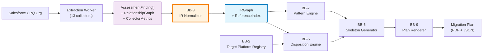
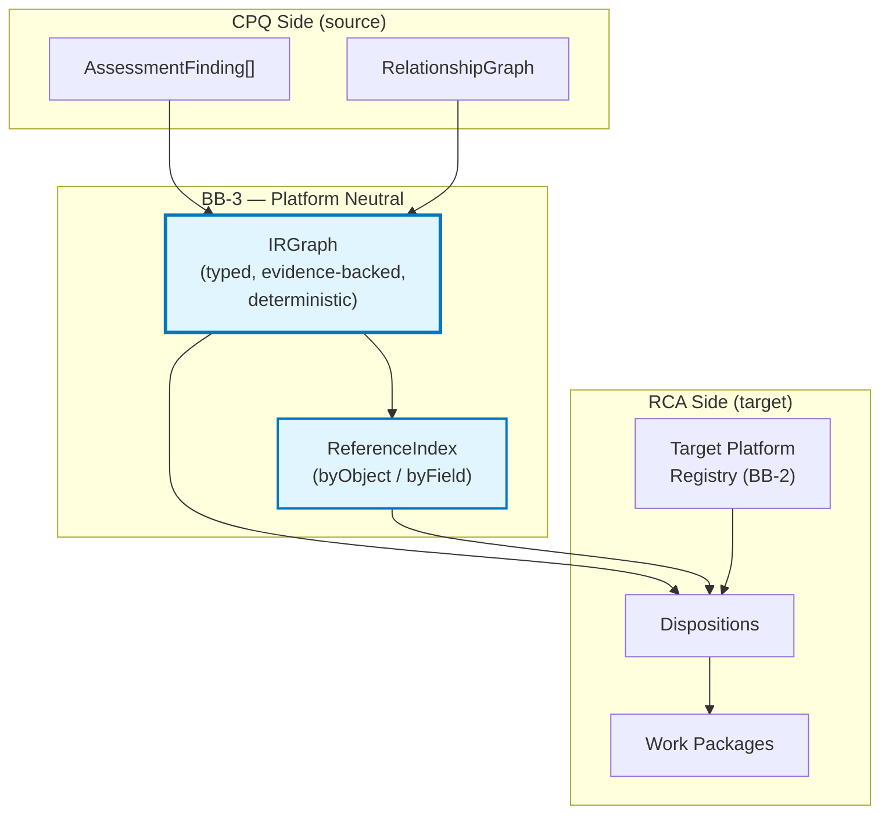
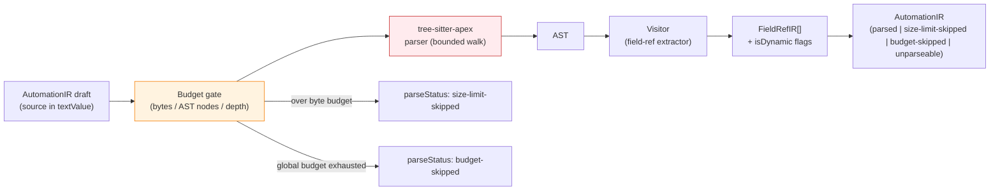
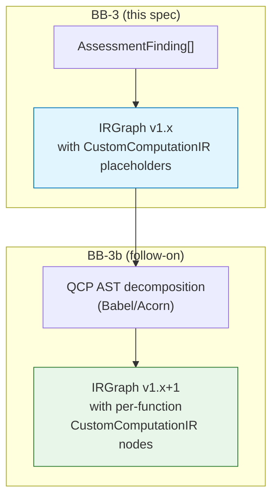

# BB-3 — IR Normalizer — Design Spec

> **Component:** BB-3 (Phase 0 — Foundation)
> **Owner role:** Senior Backend Engineer (compiler focus)
> **Status:** Draft **v1.2** — third-auditor response revision
> **Parent spec:** [MIGRATION-PLANNER-SPEC.md](./MIGRATION-PLANNER-SPEC.md)
> **Last updated:** 2026-04-10
> **Audience:** External senior-architect auditor, implementing engineer, downstream BB owners

## Revision history

| Version | Date           | Summary                                                                                                                                                                                                                                                                                                                                                                                                                                                                                                                                                                                                                                                                                                                                                                                                                                                                                                                                                                                                                                                                                                                                                                                                                                                                                                                                                                                                                                                                                                                                                                                                                                                                                                                                                                                                                                                              |
| ------- | -------------- | -------------------------------------------------------------------------------------------------------------------------------------------------------------------------------------------------------------------------------------------------------------------------------------------------------------------------------------------------------------------------------------------------------------------------------------------------------------------------------------------------------------------------------------------------------------------------------------------------------------------------------------------------------------------------------------------------------------------------------------------------------------------------------------------------------------------------------------------------------------------------------------------------------------------------------------------------------------------------------------------------------------------------------------------------------------------------------------------------------------------------------------------------------------------------------------------------------------------------------------------------------------------------------------------------------------------------------------------------------------------------------------------------------------------------------------------------------------------------------------------------------------------------------------------------------------------------------------------------------------------------------------------------------------------------------------------------------------------------------------------------------------------------------------------------------------------------------------------------------------------- |
| 1.0     | 2026-04-10     | Initial draft sent for external audit (two reviewers).                                                                                                                                                                                                                                                                                                                                                                                                                                                                                                                                                                                                                                                                                                                                                                                                                                                                                                                                                                                                                                                                                                                                                                                                                                                                                                                                                                                                                                                                                                                                                                                                                                                                                                                                                                                                               |
| **1.1** | **2026-04-10** | **Audit-response pass #1.** Closes every unanimous P0 from Auditors 1+2 plus Auditor 1's CPQ-depth P0s. Major additions: `id` + `contentHash` identity split (§5.2), `NodeRef` + `IREdge` contract (§5.1a), `SchemaCatalog` as first-class input (§4.4a), multi-valued evaluation phase (§5.3 PricingRuleIR), SCC collapse that keeps members (§8.3), Zod safe-parse per finding (§6.1 Stage 1 + §10.2), deterministic Apex parsing budget (§8.4), `NormalizeResult.runtimeStats` (§6.4), package split into `migration-ir-contract` + `bb3-normalizer` (§6.3), data sensitivity policy (§17).                                                                                                                                                                                                                                                                                                                                                                                                                                                                                                                                                                                                                                                                                                                                                                                                                                                                                                                                                                                                                                                                                                                                                                                                                                                                       |
| **1.2** | **2026-04-10** | **Audit-response pass #2 (Auditor 3).** Closes 10 critical + significant findings from a stricter compiler-architect review. **P0 fixes:** (1) V1 validator vs. cycle-group mathematical paradox — `CyclicDependencyIR.members: NodeRef[]` (not raw strings) + edges flipped to `group→member` + V1 rewording to exempt synthetic edges; `reads-field`/`writes-field` removed from `IREdgeType` (they're field refs, not node→node edges — belong in `ReferenceIndex`). (2) `structuralSignature` was hashing condition operators, which broke A13 (operator edit changed `id`) — now hashes field presence only. (3) `BlockPriceIR` multi-currency + pricebook collisions — identity now includes `currencyIsoCode` + `pricebookNaturalKey`. (4) `ContractedPriceIR` was missing the load-bearing link to `SBQQ__DiscountSchedule__c` — added `discountSchedule: NodeRef`. (5) `DiscountScheduleIR` was using a nonexistent `developerName` (managed package custom objects have `Name`, not DeveloperName) — now uses a structural tier-shape signature. (6) `canonicalJson` rejected `undefined`-valued object properties, which crashes on TS optional fields — now omits them silently; arrays and top-level are still strict. (7) Added compact normative schemas for **all 30+ remaining IR node types**. (8) `FormulaFieldIR.returnType` removed invalid `'picklist'`. (9) `CyclicDependencyIR.contentHash` now hashes member `contentHash` values (not `id` values) so internal changes propagate to BB-17. (10) `AutomationIR` refactored into a **discriminated union** (`ApexClassAutomationIR` / `ApexTriggerAutomationIR` / `FlowAutomationIR` / `WorkflowRuleAutomationIR` / `OutboundMessageAutomationIR`) so Apex-specific metrics (`lineCount`, `calloutCount`, `hasTriggerControl`) don't pollute Flow nodes. See §18.2 for the full v1.2 ledger. |

---

## 0. How To Read This Document

This spec is self-contained enough for an external auditor who has not read the parent Migration Planner Spec. It duplicates just enough context (§2) to make the contracts legible, and defers all deeper rationale to the parent spec via explicit citations.

Conventions used throughout:

- **MUST / SHOULD / MAY** follow RFC 2119 semantics.
- Every TypeScript type reproduced here names its **canonical source of truth** in the codebase. If this spec and the code disagree, the code wins — and the spec is a bug.
- Every mermaid diagram is informative; the normative contract is the TypeScript interfaces and the finding → IR mapping table in §7.
- A leading §N.M reference means "this spec, section N.M"; references into the parent spec are written as `MIGRATION-PLANNER-SPEC §X`.

---

## 1. Executive Summary

**BB-3 converts raw assessment findings into a typed, platform-neutral Intermediate Representation (IR) graph.**

It is the "compiler frontend" of the Migration Planner. Everything downstream — disposition assignment, pattern matching, parity test generation, re-assessment diffing — reads from the IR instead of from raw findings. BB-3 has **no knowledge of RCA**; its only job is to understand Salesforce CPQ thoroughly enough to produce a stable, typed, graph-shaped, evidence-backed representation of the customer's CPQ org.

### Why a separate IR layer exists

Writing a direct CPQ → RCA translator means writing one function per (source, target) pair. That's brittle, untestable, and collapses the moment a new RCA feature or a new CPQ quirk appears. A compiler architecture decouples the two halves: BB-3 (`CPQ → IR`) and BB-5/6/7 (`IR → RCA plan`) can be built, tested, and re-versioned independently. The IR is a checkpoint — a place where the pipeline can pause, inspect, validate, and resume.

### Why BB-3 can start today

BB-3 has **zero external blockers**. Unlike BB-1 (RCA discovery) and BB-2 (TPR), which block on Salesforce issuing an RCA sandbox, BB-3 consumes only data the extraction worker already produces today in staging. It can run against real customer orgs from day one of Phase 0 (`MIGRATION-PLANNER-SPEC §6 L1965`).

### What "done" means

A BB-3 release is "done" when:

1. Every `AssessmentFinding` in a corpus of ≥5 real or synthetic orgs maps to exactly one IR node (or is explicitly quarantined with a reason).
2. The IR graph passes all internal validators: no dangling references, no unknown field refs, cycles detected and collapsed, identity hashes deterministic across re-runs.
3. Running BB-3 twice on byte-identical input produces byte-identical output (modulo a single `extractedAt` timestamp field).
4. A downstream stub consumer (the future BB-5) can walk every node type without crashing on a missing field.
5. A re-assessment on the same org, 30 days later, produces an IR in which unchanged artifacts keep their identity hashes and new/removed artifacts are clearly distinguishable.

The concrete acceptance tests are enumerated in §3.3.

---

## 2. Context For External Auditors

This section exists so a senior architect with no prior exposure to RevBrain can reason about the correctness of this spec. Experienced RevBrain readers MAY skip to §3.

### 2.1 The product in one paragraph

RevBrain is a SaaS that helps enterprise revenue-operations teams migrate from **Salesforce CPQ** (the legacy "SBQQ" managed-package product Salesforce is sunsetting) to **Revenue Cloud Advanced** ("RCA", also branded "Agentforce Revenue Management"). Today, a System Integrator (SI) team manually analyzes the old CPQ org for 4–8 weeks and produces a migration roadmap costing $50–200K. RevBrain automates the analysis half: a worker process connects to the customer's Salesforce org, runs 13 collectors across every CPQ surface area, and produces a structured "assessment" — a complete inventory of products, price rules, Apex code, flows, custom fields, and usage data. The **Migration Planner** (of which BB-3 is one piece) is the follow-on system that converts that inventory into an actionable migration backlog.

### 2.2 The migration problem

CPQ and RCA are fundamentally different architectures. CPQ stores configuration as **records in SBQQ objects** (price rules, product rules, bundles, QCP scripts). RCA stores configuration as **metadata and data-that-behaves-like-metadata** (Pricing Procedures, Decision Tables, CML constraint models, Context Definitions). There is no row-for-row translation — most CPQ artifacts become something structurally different in RCA, some have no equivalent at all, and a few require pure human judgment to re-design.

The Migration Planner's job is to walk every single artifact in the CPQ org and assign each one a **disposition**: auto-translate with a verified mapping, spec-stub for the SI to build, mark as no-equivalent with a workaround, retire as dormant, etc. BB-3 is the component that makes this walk tractable, by turning the raw findings into a graph of strongly-typed nodes with provenance.

### 2.3 The Migration Planner pipeline



**The one-line summary of BB-3's role:** it sits between the "extraction is done" moment and any component that needs to reason about the business logic of the org.

### 2.4 Where BB-3 sits within the compiler model



The key architectural invariant: **everything to the left of the IR is CPQ-shaped; everything to the right is RCA-shaped. BB-3 is the only place the two meet, and it meets them by being neither.** A BB-3 that contains the string `"PricingProcedure"` anywhere in its logic has a bug — that concept belongs to BB-5, not BB-3. The converse also holds: BB-3 is allowed to know that `SBQQ__EvaluationEvent__c` exists; BB-5 is not.

### 2.5 Glossary

| Term                            | Meaning                                                                                                                                                                                                      |
| ------------------------------- | ------------------------------------------------------------------------------------------------------------------------------------------------------------------------------------------------------------ |
| **CPQ**                         | Salesforce CPQ — the legacy SBQQ managed package. The _source_ of the migration.                                                                                                                             |
| **RCA**                         | Revenue Cloud Advanced — Salesforce's new product. The _target_ of the migration. BB-3 does not know about it.                                                                                               |
| **Finding**                     | One row in the assessment — a single extracted CPQ artifact. Canonical type: `AssessmentFindingInput` in [packages/contract/src/assessment.ts](../packages/contract/src/assessment.ts).                      |
| **Relationship**                | A typed edge between two findings (e.g. `triggers`, `depends-on`, `parent-of`). Canonical type: `AssessmentRelationshipInput`.                                                                               |
| **IR / IR Graph**               | Intermediate Representation — the typed graph BB-3 produces. Platform-neutral.                                                                                                                               |
| **Reference Index**             | A global inverted index: given an object or field, what IR nodes read/write it.                                                                                                                              |
| **Identity hash**               | A stable, collision-resistant hash of an IR node's canonical identity. Used to match nodes across re-assessments.                                                                                            |
| **Provenance / evidence block** | The set of source-finding IDs, classification reasons, and field references that justify every decision an IR node encodes. Every IR node has one.                                                           |
| **QCP**                         | Quote Calculator Plugin — customer-written JavaScript that overrides CPQ's pricing calculation. Can be 10,000+ lines. Handled by BB-3b.                                                                      |
| **BB-3b**                       | The deferred QCP AST decomposition sub-component. Same owner, same phase, separately scheduled due to complexity.                                                                                            |
| **SBQQ / sbaa / blng**          | The namespace prefixes of the CPQ, Advanced Approvals, and Billing managed packages. Every reference to these namespaces is a signal BB-3 must preserve.                                                     |
| **Twin field**                  | A field pair on CPQ object + its amendment/renewal counterpart (e.g. `SBQQ__Quote__c.Custom_X__c` and `SBQQ__QuoteLine__c.Custom_X__c`) that must be synchronized. A known foot-gun — must appear in the IR. |
| **Dispositioning**              | The act of assigning a migration decision (auto-translate, spec-stub, no-equivalent, retire, etc.) to an artifact. BB-5's job. BB-3 does **not** disposition.                                                |
| **Pattern**                     | A deterministic rule that recognizes a known CPQ shape (e.g. "tiered volume discount") and emits a structured mapping. BB-7's job.                                                                           |
| **Tarjan's algorithm**          | A linear-time graph algorithm that finds strongly connected components (SCCs). BB-3 uses it for cycle detection.                                                                                             |
| **tree-sitter-apex**            | A community parser-generator grammar for Apex. BB-3 uses it for deterministic field-reference extraction from Apex source.                                                                                   |

---

## 3. Scope, Goals, and Success Criteria

### 3.1 Goals

BB-3 MUST:

1. **G1 — Total coverage.** Every `AssessmentFinding` produced by any of the 13 collectors MUST either (a) map to exactly one IR node, (b) merge into an existing IR node as a contributing source, or (c) be quarantined with an explicit reason. Silent drops are a bug.
2. **G2 — Typed graph.** The output MUST be a graph of strongly-typed nodes with typed edges, not a bag of polymorphic records. A consumer that knows the IR schema can navigate the graph without runtime `typeof` checks.
3. **G3 — Evidence-backed.** Every IR node MUST carry an `EvidenceBlock` linking back to the source finding IDs and explaining how any classification decision was made. No black-box outputs.
4. **G4 — Determinism.** Given byte-identical input, BB-3 MUST produce a byte-identical `IRGraph` (modulo the single `extractedAt` timestamp field on the envelope). No wall-clock dependencies, no iteration-order dependencies, no LLM calls, no network calls, no floating-point rounding, no `Map`/`Set` insertion-order leaks. Non-deterministic observability data (parsing duration, stage timings) is carried **outside** the `IRGraph` in `NormalizeResult.runtimeStats` (§6.4) so it cannot corrupt byte-identity. All parsing cutoffs are **deterministic byte/AST/depth budgets** (§8.4), never wall-clock timeouts.
5. **G5 — Stable identities across re-assessments, with change detection.** Every IR node carries **two** hashes: `id` (business identity — stable across re-runs, sandbox refreshes, and cosmetic edits like display-name renames) and `contentHash` (semantic payload — changes iff the node's behavior-relevant content changes). See §5.2. Neither hash MAY incorporate a Salesforce record ID. Re-running extraction after a sandbox refresh MUST yield the same `id` for every unchanged artifact; renaming an artifact's `artifactName` MUST NOT change either hash; editing a price rule's conditions MUST change its `contentHash` but NOT its `id`.
6. **G6 — Cycle safety.** The IR graph MUST be acyclic _at the node level_. Any cycle discovered in the source data MUST be collapsed into a single composite node tagged with a cycle marker.
7. **G7 — Dangling-reference safety.** Every reference field on every IR node (e.g. `PricingRuleIR.dependencies`) MUST either resolve to an existing IR node ID or be explicitly recorded as `unresolved` with a reason.
8. **G8 — Namespace fidelity.** BB-3 MUST preserve the original CPQ namespace on every field reference. `SBQQ__Quote__c.Custom_X__c` and `Custom_X__c` are not interchangeable — the former proves the field belongs to a CPQ-managed object.
9. **G9 — Partial compilation.** If a single normalizer fails, BB-3 MUST still emit the IR for every other node. One broken price rule does not bring down the graph for 40 good ones.
10. **G10 — Schema-versioned.** Every IR graph MUST carry an `irSchemaVersion` field. Downstream consumers MUST be able to reject incompatible versions cleanly.

### 3.2 Non-goals

BB-3 MUST NOT:

1. **N1 — Make RCA decisions.** No `rcaTargetConcept`, no mapping to RCA object names, no effort estimates, no disposition labels. All of that is BB-5.
2. **N2 — Call LLMs.** BB-3 is fully deterministic (G4). Any piece of logic that "feels" like it wants an LLM is a signal that the piece belongs in a later stage, not here.
3. **N3 — Read the Target Platform Registry.** BB-3 does not have a TPR dependency. If BB-3 imports from `packages/tpr` it is broken.
4. **N4 — Talk to Salesforce.** BB-3 consumes `AssessmentFinding[]` from disk or memory. It does not make API calls.
5. **N5 — Persist the IR to the database.** Storage layering is a separate concern, handled by the worker pipeline that _invokes_ BB-3. BB-3 is a pure function: `(findings, relationships) → IRGraph`.
6. **N6 — Fully parse QCP.** Per `MIGRATION-PLANNER-SPEC §6.1`, QCP AST decomposition is deferred to BB-3b. BB-3 MUST emit a placeholder `CustomComputationIR` node referencing the raw QCP source without decomposing its functions.
7. **N7 — Generate human-readable business-purpose narrative.** That lives in BB-10 (LLM Enrichment). BB-3 only captures structural facts.
8. **N8 — Classify dormancy.** BB-3 MUST carry the `usageLevel` field forward but MUST NOT turn "dormant" into "retire." The retire decision is BB-5's; BB-3's job is to preserve the signal intact.

### 3.3 Acceptance tests

These are the concrete, executable tests a BB-3 release MUST pass. They mirror the acceptance test row in the Phase 0 table of the parent spec, expanded into unambiguous test cases.

| ID      | Test                                                                                                                                                                                   | Pass criterion                                                                                                                                                                                                                                                                                                                                  |
| ------- | -------------------------------------------------------------------------------------------------------------------------------------------------------------------------------------- | ----------------------------------------------------------------------------------------------------------------------------------------------------------------------------------------------------------------------------------------------------------------------------------------------------------------------------------------------- |
| **A1**  | Run BB-3 against a fixture org containing 1 product, 1 price rule with 2 conditions + 1 action, 1 Apex class, and 1 custom field.                                                      | Output contains 1 `BundleStructureIR` (or `ProductSnapshotIR`), 1 `PricingRuleIR` with 2 `PriceConditionIR` + 1 `PriceActionIR`, 1 `AutomationIR`, and 1 `FieldRefIR` in the reference index. Zero quarantined findings.                                                                                                                        |
| **A2**  | Run BB-3 against a synthetic org with 500 price rules, 3,000 product options, and a dependency chain of length 10 between rules.                                                       | `PricingRuleIR.dependencies` arrays correctly reflect the chain; topological sort of dependencies is possible (acyclic).                                                                                                                                                                                                                        |
| **A3**  | Run BB-3 against a synthetic org containing a cycle: rule A depends on rule B depends on rule A.                                                                                       | One `CyclicDependencyIR` composite node is emitted, containing references to both rules and an `evidence.classificationReasons` entry of `"SCC size=2"`. No downstream consumer sees the cycle.                                                                                                                                                 |
| **A4**  | Run BB-3 twice on the same input file.                                                                                                                                                 | `canonicalJson(result.graph)` with `extractedAt` pinned to a fixed value is byte-identical across runs. `NormalizeResult.runtimeStats` may differ (it is not part of the graph).                                                                                                                                                                |
| **A5**  | Run BB-3 on input _A_, then on input _A'_ where _A'_ is _A_ plus one new price rule.                                                                                                   | Every IR node from _A_ keeps both its `id` and `contentHash` in _A'_. The new rule appears as a new IR node.                                                                                                                                                                                                                                    |
| **A6**  | Run BB-3 on input _A_, then on input _A''_ where _A''_ is _A_ with every Salesforce record ID randomized (simulating a sandbox refresh).                                               | Every IR node keeps both `id` and `contentHash`. Salesforce IDs MUST NOT contribute to either hash.                                                                                                                                                                                                                                             |
| **A7**  | Run BB-3 on an input where one collector's output is malformed (a `SBQQ__PriceCondition__c` finding with a missing `findingKey` and an `ApexClass` finding that fails Zod validation). | Both malformed findings are quarantined with structured reasons (`missing-required-field`, `malformed-shape`). Every other finding still produces its IR node. Exit code is 0; the quarantine report is non-empty; `NormalizeResult.diagnostics` contains one entry per quarantined finding.                                                    |
| **A8**  | Run BB-3 on an input containing a 10,000-line `SBQQ__CustomScript__c` QCP finding.                                                                                                     | A single `CustomComputationIR` placeholder is emitted, referencing the raw source. BB-3 does NOT attempt AST decomposition. BB-3b runs separately. Memory stays under 1 GB.                                                                                                                                                                     |
| **A9**  | Run BB-3 on an input with 50K findings.                                                                                                                                                | Wall-clock completes under 30 seconds on a 2023 M-class laptop. Memory peak stays under 2 GB. Timing MUST be reported via `NormalizeResult.runtimeStats`, NOT on the graph.                                                                                                                                                                     |
| **A10** | Run BB-3 output through the internal validator.                                                                                                                                        | Zero dangling `NodeRef` with `resolved: true`. Zero `FieldRefIR` with `isResolved: false` on fields that are present in the `SchemaCatalog`. Every IR node has a non-empty `EvidenceBlock.sourceFindingKeys`. Cycles are modeled by a `CyclicDependencyIR` group node with `cycle-member-of` edges, and members are still present in `nodes[]`. |
| **A11** | Query the ReferenceIndex: `byField['SBQQ__Quote__c.SBQQ__NetAmount__c']`.                                                                                                              | Returns the list of every IR node that reads or writes that field. The list is non-empty for any field actually used in the fixture org. Path references (e.g. `Account__r.Owner.Profile.Name`) are queryable via `byPath`.                                                                                                                     |
| **A12** | Take a golden snapshot of the IR graph for the main staging org. Run BB-3 against the same extraction again a week later (no CPQ changes).                                             | `canonicalJson(graph)` diff is limited to `extractedAt`. Any other diff is a regression. `runtimeStats` is explicitly excluded from this comparison.                                                                                                                                                                                            |
| **A13** | Take input _A_, then _A'''_ where one price rule has its `artifactName` renamed (cosmetic, no logic change) and another rule has one condition operator changed (`gt` → `gte`).        | The renamed rule: `id` unchanged, `contentHash` unchanged, `displayName` updated. The edited rule: `id` unchanged, `contentHash` changed. Demonstrates the identity/content-hash split (§5.2) works as specified.                                                                                                                               |
| **A14** | Lint test: `grep -rnE '(PricingProcedure\|DecisionTable\|CML\|ContextDefinition)' packages/bb3-normalizer/src/`.                                                                       | Zero matches. BB-3 source MUST NOT contain RCA concept names (enforces §2.4 invariant).                                                                                                                                                                                                                                                         |
| **A15** | Run BB-3 with `SchemaCatalog` deliberately withheld.                                                                                                                                   | Validator V4 downgrades to "syntactic shape only" (namespace + suffix rules); no hard-fail; every `FieldRefIR.isResolved = false`; a `GraphMetadataIR.degradedInputs` entry records the missing catalog.                                                                                                                                        |

Tests **A1–A8, A13, A14** are unit-testable against synthetic fixtures. **A9–A12, A15** require a real or redacted extraction snapshot.

---

## 4. Inputs — The Real Contract

BB-3 consumes exactly three things. Nothing else. Sources are all file paths relative to the monorepo root.

### 4.1 AssessmentFinding[]

**Canonical type:** `AssessmentFindingInput` defined in [packages/contract/src/assessment.ts:114-136](../packages/contract/src/assessment.ts#L114-L136). The full Zod schema:

```typescript
// Reproduced from packages/contract/src/assessment.ts for auditor convenience.
// Source of truth: the linked file.
export const AssessmentFindingSchema = z.object({
  domain: AssessmentDomainSchema, // enum: catalog, pricing, templates, approvals,
  //       customization, dependency, integration,
  //       usage, order-lifecycle, localization, settings
  collectorName: z.string(), // e.g. 'pricing', 'catalog', 'discovery'
  artifactType: z.string(), // e.g. 'SBQQ__PriceRule__c', 'ApexClass', 'DataCount'
  artifactName: z.string(), // human-readable
  artifactId: z.string().optional(), // Salesforce record ID (optional for aggregates)
  findingKey: z.string(), // deterministic dedup key
  sourceType: SourceTypeSchema, // enum: object, metadata, tooling, bulk-usage, inferred
  sourceRef: z.string().optional(),
  detected: z.boolean().default(true),
  countValue: z.number().int().optional(), // used by DataCount + metrics
  textValue: z.string().optional(), // FULL source for Apex, QCP, formulas
  usageLevel: UsageLevelSchema.optional(), // enum: high, medium, low, dormant
  riskLevel: RiskLevelSchema.optional(), // enum: critical, high, medium, low, info
  complexityLevel: ComplexityLevelSchema.optional(),
  migrationRelevance: MigrationRelevanceSchema.optional(),
  rcaTargetConcept: z.string().optional(), // BB-3 ignores this — it is a legacy label
  rcaMappingComplexity: RcaMappingComplexitySchema.optional(), // BB-3 ignores this
  evidenceRefs: z.array(EvidenceRefSchema).default([]),
  notes: z.string().optional(),
  schemaVersion: z.string().default('1.0'),
});
```

**Key observations for BB-3:**

- `findingKey` is a **deterministic dedup key**, generated by `generateFindingKey()` in the same file. BB-3 MUST treat `findingKey` as the canonical identity of the source finding, not `artifactId` (which is null for aggregates and unstable across sandbox refreshes).
- `textValue` is where code lives: full Apex source in `ApexClass` findings (when `codeExtractionEnabled`), full QCP JS in `SBQQ__CustomScript__c` findings, raw formula text in `FormulaField` findings. BB-3's code-parsing stages read from here.
- `evidenceRefs[].referencedFields[]` is **already populated for QCP and formulas** by regex in the collectors. BB-3 MUST NOT re-extract those — it MUST merge them into `FieldRefIR` with namespace normalization. Apex field refs, by contrast, are **not** pre-extracted; BB-3 extracts them via tree-sitter.
- `rcaTargetConcept` and `rcaMappingComplexity` are legacy shallow labels the extraction layer emits today. BB-3 MUST **ignore them** — they will be replaced by BB-5 outputs. Preserving them in the IR would leak RCA concerns across the BB-3/BB-5 boundary (violates §2.4).
- `usageLevel` is important and MUST be carried forward on the IR node as `usageSignal`. The `dormant` value is especially load-bearing for BB-5's retire decision.

### 4.2 RelationshipGraph

**Canonical source:** [apps/worker/src/normalize/relationships.ts](../apps/worker/src/normalize/relationships.ts). Type: `AssessmentRelationshipInput[]` from [packages/contract/src/assessment.ts:142-159](../packages/contract/src/assessment.ts#L142-L159).

```typescript
export const RelationshipTypeSchema = z.enum([
  'depends-on',
  'references',
  'parent-of',
  'triggers',
  'maps-to',
  'same-field-used-in',
  'overlaps-with',
]);

export const AssessmentRelationshipSchema = z.object({
  sourceFindingId: z.string().uuid(), // <-- UUID, NOT findingKey. Mapped externally.
  targetFindingId: z.string().uuid(),
  relationshipType: RelationshipTypeSchema,
  description: z.string().optional(),
});
```

**Gotcha for BB-3:** the relationship contract uses `sourceFindingId` / `targetFindingId` as UUIDs assigned downstream in the worker persistence layer, not `findingKey`. BB-3 will typically run _before_ those UUIDs exist (on an in-memory extraction result), so the caller is responsible for either:

- (a) passing a pre-resolved `RelationshipGraph` keyed on `findingKey` rather than UUID, or
- (b) passing `findingKey ↔ UUID` lookup tables alongside the relationships.

BB-3's public API (§6.4) specifies option (a) — BB-3 accepts a normalized `RelationshipGraphByKey` type defined in the BB-3 package itself, and the caller converts at the boundary. This keeps BB-3 decoupled from database concerns.

### 4.3 CollectorMetrics[]

**Canonical type:** `CollectorMetricsInput` from [packages/contract/src/assessment.ts:165-173](../packages/contract/src/assessment.ts#L165-L173).

```typescript
export const CollectorMetricsSchema = z.object({
  collectorName: z.string(),
  domain: AssessmentDomainSchema,
  metrics: z.record(z.string(), z.union([z.number(), z.string(), z.boolean()])),
  warnings: z.array(z.string()).default([]),
  coverage: z.number().int().min(0).max(100).default(0),
  durationMs: z.number().int().optional(),
  schemaVersion: z.string().default('1.0'),
});
```

BB-3 uses `CollectorMetrics` for two purposes:

1. **Coverage gating.** If a Tier-0 collector (discovery, catalog, pricing, usage) has `coverage < 50`, BB-3 emits a `DegradedInputWarning` on the IR envelope — downstream consumers may choose to reduce confidence scores.
2. **Provenance.** The `coverage` and `warnings` values are copied into a `GraphMetadataIR` node so the resulting IR carries an honest record of where the input was incomplete.

### 4.4 Collector inventory BB-3 MUST handle

The parent spec claims "13 collectors." The real directory [apps/worker/src/collectors/](../apps/worker/src/collectors/) contains 13 _domain_ collectors plus `base.ts` and `registry.ts` (infrastructure, no findings). The full list, with representative artifact types each emits:

| #   | Collector            | Domain            | Tier  | Representative `artifactType` values                                                                                                                                                                                                                                                 |
| --- | -------------------- | ----------------- | ----- | ------------------------------------------------------------------------------------------------------------------------------------------------------------------------------------------------------------------------------------------------------------------------------------ |
| 1   | `discovery.ts`       | `catalog`         | tier0 | `OrgFingerprint`, `DataCount`, `UserAdoption`, `FieldCompleteness`                                                                                                                                                                                                                   |
| 2   | `catalog.ts`         | `catalog`         | tier0 | `Product2`, `ProductBundle`, `ProductOption`, `ProductFeature`, `OptionConstraint`, `ProductRule`, `ConfigurationAttribute`, `SearchFilter`, `DataCount`                                                                                                                             |
| 3   | `pricing.ts`         | `pricing`         | tier0 | `SBQQ__PriceRule__c`, `SBQQ__PriceCondition__c`, `SBQQ__PriceAction__c`, `SBQQ__DiscountSchedule__c`, `SBQQ__DiscountTier__c`, `SBQQ__BlockPrice__c`, `SBQQ__ContractedPrice__c`, `SBQQ__SummaryVariable__c`, `SBQQ__CustomScript__c`, `SBQQ__LookupQuery__c`, `SBQQ__LookupData__c` |
| 4   | `usage.ts`           | `usage`           | tier0 | `QuoteUsage`, `QuoteLineUsage`, `DiscountUsage`, `ConversionMetrics`, `UserAdoptionMetrics`, `DataCount`                                                                                                                                                                             |
| 5   | `dependencies.ts`    | `dependency`      | tier1 | `ApexClass`, `ApexTrigger`, `Flow`, `WorkflowRule`                                                                                                                                                                                                                                   |
| 6   | `customizations.ts`  | `customization`   | tier1 | `FormulaField`, `CustomMetadataType`, `ValidationRule`, `RecordType`, `SharingRule`                                                                                                                                                                                                  |
| 7   | `settings.ts`        | `settings`        | tier1 | `CPQSettingValue`, `PluginStatus`, `InstalledPackage`                                                                                                                                                                                                                                |
| 8   | `order-lifecycle.ts` | `order-lifecycle` | tier1 | `OrderLifecycleOverview`                                                                                                                                                                                                                                                             |
| 9   | `templates.ts`       | `templates`       | tier2 | `QuoteTemplate`, `TemplateSection`, `TemplateContent`, `LineColumn`, `QuoteTerm`                                                                                                                                                                                                     |
| 10  | `approvals.ts`       | `approvals`       | tier2 | `CustomAction`, `CustomActionCondition`, `ApprovalProcess`, `ApprovalChainRule`                                                                                                                                                                                                      |
| 11  | `integrations.ts`    | `integration`     | tier2 | `NamedCredential`, `ExternalDataSource`, `ConnectedApp`, `OutboundMessage`, `PlatformEvent`, `ESignature`                                                                                                                                                                            |
| 12  | `localization.ts`    | `localization`    | tier2 | `LocalizationRecord`, `CustomLabel`, `LanguageDistribution`                                                                                                                                                                                                                          |
| 13  | `metadata.ts`        | `customization`   | tier2 | `ObjectConfiguration`                                                                                                                                                                                                                                                                |

**Future-proofing clause:** BB-3 MUST handle an unknown `artifactType` gracefully. The mapping table (§7) is not a closed set — collectors can evolve. Unknown types go through a default "inferred" normalizer that produces an `UnknownArtifactIR` with a warning. They MUST NOT crash BB-3.

### 4.4a SchemaCatalog — first-class input (new in v1.1)

Auditor 1 (P0.4) and Auditor 2 (S4) both flagged that the v1.0 validator V4 ("unknown field references") was unimplementable because BB-3 had no schema information about the org. v1.1 promotes schema data to a first-class input, sourced from the existing `metadata.ts` collector's `ObjectConfiguration` findings.

**Canonical source:** [apps/worker/src/collectors/metadata.ts](../apps/worker/src/collectors/metadata.ts). BB-3 consumes a projected form:

```typescript
/**
 * A minimal describe-like catalog covering every CPQ-relevant object and field.
 * Built once by the caller (the worker pipeline, or a test fixture) and passed
 * to BB-3 so that ReferenceIndex lookups and field-ref validation are grounded
 * in ground truth, not regex guessing.
 */
export interface SchemaCatalog {
  /** ISO-8601 timestamp when the catalog was captured. */
  capturedAt: string;

  /** Describe-per-object. Keys are fully qualified object API names (with namespace if present). */
  objects: Record<string, ObjectSchema>;

  /** Aggregate metadata for quick probes. */
  summary: {
    objectCount: number;
    fieldCount: number;
    cpqManagedObjectCount: number; // objects whose namespace is SBQQ/sbaa/blng
    hasMultiCurrency: boolean;
  };
}

export interface ObjectSchema {
  apiName: string;
  namespace: 'SBQQ' | 'sbaa' | 'blng' | null;
  isCustom: boolean;
  label: string;
  fields: Record<string, FieldSchema>; // keyed by field API name
  recordTypes: string[];
  relationshipNames: string[]; // e.g. ['Account__r', 'Owner'] — for path resolution
}

export interface FieldSchema {
  apiName: string;
  dataType:
    | 'string'
    | 'textarea'
    | 'picklist'
    | 'multipicklist'
    | 'int'
    | 'double'
    | 'currency'
    | 'percent'
    | 'boolean'
    | 'date'
    | 'datetime'
    | 'reference'
    | 'id'
    | 'email'
    | 'phone'
    | 'url'
    | 'formula'
    | 'rollup'
    | 'unknown';
  isCustom: boolean;
  isCalculated: boolean; // formula fields, rollups
  referenceTo: string[] | null; // target object API names for reference fields
  picklistValues: string[] | null; // null for non-picklist
  isExternalId: boolean;
}
```

**BB-3's uses of SchemaCatalog:**

1. **Field-reference resolution.** Stage 5 (code parsing) and Stage 7 (reference index) check every extracted `FieldRefIR` against the catalog. Resolved refs get `isResolved: true`; unresolved refs get `isResolved: false` with a structured reason.
2. **Validator V4.** With a catalog, "unknown field references" becomes a real check. Without one, V4 downgrades to syntactic-only (namespace + `__c` suffix validation) — see A15.
3. **Namespace canonicalization.** `sbqq__foo__c` vs `SBQQ__foo__c` vs `foo__c` (bare) are all resolved against the catalog's canonical casing.
4. **Relationship path resolution.** When Apex or QCP accesses `Account__r.Owner.Profile.Name`, BB-3 walks the catalog's `relationshipNames` and `referenceTo` to classify each segment.

**Availability contract:**

- `SchemaCatalog` is **optional** on the BB-3 public API (§6.4). When omitted, BB-3 runs in "degraded" mode: every `FieldRefIR.isResolved` is `false`, V4 downgrades, and a `GraphMetadataIR.degradedInputs` entry is recorded with `severity: 'warn'`.
- In production (worker pipeline), the catalog is always provided.
- In mock-mode tests, fixtures MAY omit it; the test harness asserts the degraded path works correctly (see A15).

**Size budget:** For a large enterprise org, `SchemaCatalog` is typically 2–5 MB of JSON (≈ 500 objects × ≈ 200 fields each). BB-3 MUST keep the catalog in memory — no streaming.

### 4.5 Input invariants BB-3 relies on

The extraction layer guarantees these. If any is violated, BB-3 is allowed to hard-fail:

- **I1** Every finding has a non-empty `findingKey` and `collectorName`.
- **I2** `findingKey` is unique across the entire input (guaranteed by the extraction layer's dedup pass in [apps/worker/src/normalize/findings.ts](../apps/worker/src/normalize/findings.ts)).
- **I3** `evidenceRefs` is always an array (possibly empty), never `null` or `undefined`.
- **I4** A finding with `sourceType: 'object'` and an `artifactId` has a Salesforce record ID; a finding with `artifactType: 'DataCount'` does not.
- **I5** The same Salesforce record appears in at most one finding per collector (collectors are responsible for their own dedup).
- **I6** If two collectors emit findings referring to the same Salesforce record (e.g. both `catalog` and `dependencies` see the same Apex class), they each produce an independent finding with an independent `findingKey`. BB-3 is responsible for merging them into one IR node (§8.2.2).

A violation of I1–I5 is a bug in the extraction layer and SHOULD be reported with a clear error message; a violation of I6 is not a violation, just a merge case BB-3 handles normally.

---

## 5. Outputs — The IR Graph Contract

This is the normative contract BB-3 produces. Every TypeScript interface in this section is load-bearing.

### 5.1 The IRGraph envelope

```typescript
/**
 * Top-level output of BB-3. A single immutable snapshot of the customer's CPQ
 * business logic, expressed as a typed graph. Platform-neutral: contains no
 * references to RCA, no LLM output, no TPR lookups.
 *
 * DETERMINISM CONTRACT (v1.1): This type MUST be byte-identical across re-runs
 * on byte-identical inputs, modulo the single `extractedAt` field. Wall-clock
 * timings, duration counters, and any other runtime-observed measurements live
 * in `NormalizeResult.runtimeStats` (§6.4), NOT on the graph envelope. The
 * graph is the stable contract; stats are sidecar telemetry.
 */
export interface IRGraph {
  irSchemaVersion: string; // semver (e.g. '1.1.0'). Bumped on any schema change.
  bb3Version: string; // version of the BB-3 implementation that produced this graph
  orgFingerprint: OrgFingerprintIR; // §5.3 — copied from the Discovery collector's OrgFingerprint finding
  extractedAt: string; // ISO-8601 timestamp — the ONLY nondeterministic field on the graph
  nodes: IRNode[]; // every IR node, discriminated by `nodeType`; sorted by `id`
  edges: IREdge[]; // typed edges between nodes (§5.1a); sorted by (sourceId, targetId, edgeType)
  referenceIndex: ReferenceIndex; // global inverted index (§5.5)
  metadata: GraphMetadataIR; // coverage, warnings, degraded inputs (§5.6)
  quarantine: QuarantineEntry[]; // findings BB-3 could not normalize (§5.7)
}
```

**The IRGraph is a value, not a service.** It is fully JSON-serializable via `canonicalJson()` (§8.1). A downstream consumer can load it from disk, reason about it, and throw it away.

**What's explicitly NOT on the envelope (v1.1 audit-response change):**

- No `bb3DurationMs` — timing is nondeterministic. It lives on `NormalizeResult.runtimeStats.durationMs` outside the graph.
- No `stageDurations` — same reason.
- No `apexParseStats` — same reason.
- No `generatedAt` / `buildTimestamp` beyond the single `extractedAt`.

Any field that could differ between two runs on identical input is a determinism bug and MUST NOT appear inside `IRGraph`.

### 5.1a NodeRef and IREdge — the reference contract (new in v1.1)

v1.0 used bare `string[]` arrays to reference other IR nodes (e.g. `PricingRuleIR.conditions: string[]`) and declared an `edges: IREdge[]` field on the envelope without ever defining `IREdge`. Both auditors flagged this (Auditor 1 P0.3, Auditor 2 C1). v1.1 closes the contract.

#### NodeRef — reference with explicit resolution state

Every place one IR node points at another, BB-3 uses `NodeRef` rather than a bare string. This mechanically enforces G7 (dangling-reference safety): an unresolved reference is a typed state the compiler cannot ignore, not a silently-missing string.

```typescript
/**
 * A reference from one IR node to another. Either resolved (points at an
 * existing node) or explicitly unresolved (the normalizer tried and failed,
 * and the reason is preserved for debugging / downstream reporting).
 */
export type NodeRef =
  | {
      /** The target node's `id`. */
      id: string;
      resolved: true;
    }
  | {
      /** No target was resolved. This is NOT a runtime error — it is a
       *  first-class state that downstream consumers must handle. */
      id: null;
      resolved: false;
      reason: UnresolvedReason;
      /** Human-readable hint from the normalizer, e.g. 'parent rule id a0V3... not in findings'. */
      hint?: string;
      /** The finding field that would have carried the resolution, if any. */
      sourceField?: string;
    };

export type UnresolvedReason =
  | 'orphaned' // parent referenced but not present in findings
  | 'out-of-scope' // reference points outside the extraction scope
  | 'parse-failure' // Apex/formula couldn't be parsed to recover the ref
  | 'dynamic' // dynamic field reference (e.g. string-concatenated)
  | 'unknown-target'; // catch-all with a hint
```

**Helper constructors** live in `packages/migration-ir-contract/src/node-ref.ts`:

```typescript
export const resolvedRef = (id: string): NodeRef => ({ id, resolved: true });
export const unresolvedRef = (
  reason: UnresolvedReason,
  hint?: string,
  sourceField?: string
): NodeRef => ({ id: null, resolved: false, reason, hint, sourceField });
```

**Migration from v1.0:** every `string[]` reference field in v1.0 IR node schemas is replaced by `NodeRef[]` in v1.1. The mapping is mechanical:

| v1.0 (bare string)                   | v1.1 (NodeRef)                        |
| ------------------------------------ | ------------------------------------- |
| `conditions: string[]`               | `conditions: NodeRef[]`               |
| `actions: string[]`                  | `actions: NodeRef[]`                  |
| `dependencies: string[]`             | `dependencies: NodeRef[]`             |
| `options: string[]`                  | `options: NodeRef[]`                  |
| `features: string[]`                 | `features: NodeRef[]`                 |
| `constraints: string[]`              | `constraints: NodeRef[]`              |
| `summaryVariablesConsumed: string[]` | `summaryVariablesConsumed: NodeRef[]` |
| `relatedRules: string[]`             | `relatedRules: NodeRef[]`             |
| `usedBy: string[]`                   | `usedBy: NodeRef[]`                   |

**Canonical convention:** inline `NodeRef[]` fields on nodes are the **source of truth** for relationships. `IRGraph.edges[]` is a **derived projection** built in Stage 7 for consumers that want an edge-list view of the graph (e.g. graph-traversal algorithms). If the two disagree, the inline refs win — and the disagreement is a normalizer bug.

#### IREdge — the edge-list projection

```typescript
/**
 * A typed edge between two IR nodes. Derived from the inline NodeRef
 * arrays on nodes during Stage 7. Consumers that prefer an edge-list
 * view of the graph (e.g. for topological sort) read from `IRGraph.edges`
 * instead of walking node fields.
 */
export interface IREdge {
  sourceId: string; // node `id` — always resolved (unresolved refs don't become edges)
  targetId: string; // node `id`
  edgeType: IREdgeType;
  /** Which inline field on the source node this edge came from.
   *  Used by the validator (§10.4) to detect inline-vs-edge drift. */
  sourceField: string; // e.g. 'conditions', 'dependencies'
  /** Optional edge-level metadata. */
  metadata?: {
    /** For dependency edges: which field transmitted the dependency. */
    viaField?: string;
    /** For triggers: which DML event. */
    dmlEvent?: 'insert' | 'update' | 'delete' | 'undelete';
  };
}

export type IREdgeType =
  // --- "Projected" edge types (v1.2) — MUST round-trip to an inline NodeRef ---
  | 'depends-on' // node A reads a field node B writes
  | 'parent-of' // rule → condition/action; bundle → option; schedule → tier
  | 'triggers' // trigger → target object automation
  | 'consumes-variable' // rule → SummaryVariableIR
  | 'uses-formula' // validation rule / custom action → FormulaFieldIR
  | 'uses-discount-schedule' // contracted-price / product → DiscountSchedule
  | 'calls' // automation → automation (Apex class hierarchy)
  | 'references' // generic fallback for RelationshipGraph edges
  // --- "Synthetic" edge types (v1.2) — generated by specific stages; exempt from round-trip ---
  | 'cycle-contains'; // CyclicDependencyIR group → member (§8.3, v1.2 direction flipped)
```

**v1.2 NOTE on removed edge types:** `'reads-field'` and `'writes-field'` were in the v1.1 union, but Auditor 3 correctly pointed out that field references are NOT node→node edges — `FieldRefIR` is not an IR node. Field access is tracked by `ReferenceIndex.byField` / `byPath` (§5.5), which is the correct home for it. Edges in `IRGraph.edges` are strictly node→node.

**Edge-list properties that the validator enforces (§10.4, v1.2 tightened):**

Edges are partitioned into two classes with different validation rules:

**Projected edges** (`depends-on`, `parent-of`, `triggers`, `consumes-variable`, `uses-formula`, `uses-discount-schedule`, `calls`, `references`): these are built in Stage 7 by walking inline `NodeRef[]` fields on every node. They MUST round-trip:

- For every projected `edges[i]`, there MUST exist a node at `nodes[sourceId]` with an inline `NodeRef` field whose value is `{ id: targetId, resolved: true }`. (Consistency.)
- For every inline `NodeRef` with `resolved: true` on node N, there MUST exist exactly one matching projected edge. (Completeness.)

**Synthetic edges** (`cycle-contains`): these are emitted by specific pipeline stages (Stage 6 emits `cycle-contains` per §8.3) and do NOT have to round-trip. Their round-trip rules are stage-specific:

- For every `cycle-contains` edge `{ sourceId, targetId }`, `sourceId` MUST resolve to a `CyclicDependencyIR` node whose inline `members: NodeRef[]` array contains a `{ id: targetId, resolved: true }`. (Consistency in the cycle direction — the group owns its members via inline refs, so this IS round-trippable, just inverted from projected edges.)
- Conversely, for every `CyclicDependencyIR.members[i]` with `resolved: true`, there MUST exist a matching `cycle-contains` edge.

Unresolved `NodeRef` values (`resolved: false`) do NOT produce edges. They are counted separately in `GraphMetadataIR.unresolvedRefCount`.

**Why `cycle-contains` replaces `cycle-member-of` (v1.2):** in v1.1 the edge direction was `member → group`, but the inline `NodeRef[]` that made the relationship resolvable lived on the group. That's inverted — the edge source didn't match the node carrying the inline ref, which made V1 round-trip validation impossible. v1.2 flips the direction (`group → member`) so the inline ref and the edge source agree. This closes Auditor 3 P0 #1.

### 5.2 Identity hashing — the `id` + `contentHash` split (rewritten in v1.1)

This is the most load-bearing single algorithm in BB-3. Get it wrong and re-assessment (BB-17) corrupts every SI's manual edits six months from now. Auditor 1 (P0.6) flagged that v1.0's single-hash design had a fundamental problem: `developerName` is **not** reliably available on CPQ record-based artifacts (`SBQQ__PriceRule__c`, `SBQQ__DiscountSchedule__c`, etc.) the way it is on metadata-ish objects, so every identity recipe that assumed it would silently fall back to `artifactName` slugs — breaking the rename-stability promise (E24).

v1.1 replaces the single hash with a **two-hash model**:

```typescript
/** Every IR node carries two hashes. Both are derived deterministically from
 *  the node's fields; neither touches Salesforce record IDs or wall-clock time. */
export interface IdentityPair {
  /** Stable across re-runs, sandbox refreshes, and cosmetic edits (renames,
   *  description changes, whitespace in formulas). Used as the node's `id`
   *  field on IRNodeBase. This is what BB-17 (re-assessment differ) matches on. */
  id: string;

  /** Changes iff the node's semantically relevant payload changes. Used by
   *  BB-17 to distinguish "same artifact, edited" from "same artifact, unchanged".
   *  Two nodes with the same `id` but different `contentHash` means the artifact
   *  was modified between runs. */
  contentHash: string;
}
```

#### Why two hashes

| Question BB-17 asks                                             | Answer                                                                                                              |
| --------------------------------------------------------------- | ------------------------------------------------------------------------------------------------------------------- |
| _Is this the same rule I saw last month?_                       | Compare `id`.                                                                                                       |
| _Has this rule been edited since last month?_                   | Compare `contentHash`.                                                                                              |
| _Was this rule renamed?_                                        | `id` unchanged, `contentHash` unchanged (rename is cosmetic), `displayName` differs.                                |
| _Were this rule's conditions edited?_                           | `id` unchanged, `contentHash` changed.                                                                              |
| _Was this rule deleted and a new one added with the same role?_ | `id` may or may not match, depending on whether the recipe captures role-based identity. Documented per-node in §7. |

Test A13 (§3.3) is the executable proof that this works.

#### Canonical hash function

```typescript
/**
 * Produce a stable identity hash for a node's business identity OR its
 * semantic content.
 *
 * Inputs must be pure JSON primitives (see §8.1 canonicalJson contract).
 * The function MUST:
 *   - serialize inputs via canonicalJson() (sorted keys, rejects NaN/Infinity/
 *     Date/BigInt/undefined/functions/cycles)
 *   - prepend the nodeType as a domain separator
 *   - hash with SHA-256
 *   - return a URL-safe base64 prefix of the first 16 bytes (128 bits)
 *
 * 128 bits gives a collision probability < 10⁻⁹ at 1 billion nodes.
 */
export function identityHash(
  nodeType: IRNodeType,
  purpose: 'id' | 'contentHash',
  payload: unknown
): string {
  const canonical = canonicalJson({ nodeType, purpose, payload });
  const hash = sha256(canonical);
  return base64url(hash.subarray(0, 16));
}

/** Convenience wrapper — build both hashes for a node in one call. */
export function buildIdentityPair(
  nodeType: IRNodeType,
  stableIdentity: unknown,
  semanticPayload: unknown
): IdentityPair {
  return {
    id: identityHash(nodeType, 'id', stableIdentity),
    contentHash: identityHash(nodeType, 'contentHash', semanticPayload),
  };
}
```

The `purpose` parameter is a domain separator: it prevents an `id` hash from ever colliding with a `contentHash` hash by construction, even if the inputs happen to be equal.

#### Per-node-type recipes

Full table in §7. Load-bearing examples:

| IR node type                                | `id` stable identity                                                                                                                                                                                                                                                    | `contentHash` semantic payload                                                                                                           |
| ------------------------------------------- | ----------------------------------------------------------------------------------------------------------------------------------------------------------------------------------------------------------------------------------------------------------------------- | ---------------------------------------------------------------------------------------------------------------------------------------- |
| `PricingRuleIR`                             | `parentObject` + `evaluationScope` + `evaluationOrder` + **structural signature of conditions/actions** (see below)                                                                                                                                                     | `id` ingredients + `calculatorEvents` + `configuratorEvents` + normalized condition/action content + `advancedConditionRaw` + `isActive` |
| `PriceConditionIR`                          | `ownerRule.id` + `SBQQ__Index__c` from the finding (or structural-content fallback when `SBQQ__Index__c` is null)                                                                                                                                                       | `id` ingredients + `field` + `operator` + `value` + `formula.raw`                                                                        |
| `PriceActionIR`                             | `ownerRule.id` + `SBQQ__Order__c` from the finding (or structural-content fallback)                                                                                                                                                                                     | `id` ingredients + `actionType` + `targetField` + `value` + `formula.raw`                                                                |
| `BundleStructureIR`                         | `parentProductCode`                                                                                                                                                                                                                                                     | `id` + `configurationType` + sorted list of member option productCodes                                                                   |
| `BundleOptionIR`                            | `parentProductCode` + `optionProductCode` + `SBQQ__Number__c` from the finding                                                                                                                                                                                          | `id` + `SBQQ__Quantity__c` + `SBQQ__Required__c` + `SBQQ__Selected__c` + `SBQQ__Type__c`                                                 |
| `AutomationIR` (Apex)                       | `sourceType` + `developerName` (Apex classes/triggers DO have reliable DeveloperName)                                                                                                                                                                                   | `id` + SHA-256 of normalized source (whitespace-collapsed, comments stripped)                                                            |
| `AutomationIR` (Flow)                       | `sourceType` + `developerName`                                                                                                                                                                                                                                          | `id` + Flow `activeVersionNumber` + sorted list of element types                                                                         |
| `FormulaFieldIR`                            | `object` + `field` (fully-qualified)                                                                                                                                                                                                                                    | `id` + SHA-256 of normalized `formula.raw`                                                                                               |
| `ValidationRuleIR`                          | `object` + `developerName`                                                                                                                                                                                                                                              | `id` + `errorConditionFormula` normalized + `errorMessage`                                                                               |
| `DiscountScheduleIR`                        | `type` + `aggregateScope` + sorted list of tier `lowerBound` values (v1.2: structural tier-shape signature — Auditor 3 P1 #5 pointed out `SBQQ__DiscountSchedule__c` is a managed-package custom object and has **no** `DeveloperName`; only `Name`, which is volatile) | `id` ingredients + each tier's discount rate + upper bounds + currency                                                                   |
| `BlockPriceIR`                              | `productCode` + `lowerBound` + `currencyIsoCode` + `pricebookNaturalKey` (v1.2: multi-currency + multi-pricebook collision fix — Auditor 3 P1 #3)                                                                                                                       | `id` + `upperBound` + `price`                                                                                                            |
| `SummaryVariableIR`                         | `developerName`                                                                                                                                                                                                                                                         | `id` + `aggregateFunction` + `targetField` + `filter`                                                                                    |
| `ContractedPriceIR`                         | `productCode` + `scopeType` + `scopeNaturalKey` + `currencyIsoCode` (v1.2: currency added per Auditor 2 S7 + Auditor 3 P1 #3)                                                                                                                                           | `id` + `price` + `effectiveFrom` + `effectiveTo` + `discountSchedule` (see schema)                                                       |
| `CustomComputationIR`                       | `scriptDeveloperName` + `functionName` (functionName is `null` in BB-3; BB-3b fills it)                                                                                                                                                                                 | `id` + SHA-256 of `rawSource`                                                                                                            |
| `NamedCredentialIR`, `ConnectedAppIR`, etc. | `developerName`                                                                                                                                                                                                                                                         | `id` + normalized endpoint/config fields                                                                                                 |
| `CyclicDependencyIR`                        | sorted list of member node `id` values, joined and hashed                                                                                                                                                                                                               | same as `id` — cycle groups are defined entirely by their membership                                                                     |
| `UnknownArtifactIR`                         | `collectorName` + `artifactType` + `findingKey`                                                                                                                                                                                                                         | same as `id` — unknown artifacts have no semantic structure BB-3 can inspect                                                             |

#### Structural content signature — the `developerName` workaround

When a CPQ record-based artifact lacks a reliable `DeveloperName` (the common case for `SBQQ__PriceRule__c` and friends), BB-3 does NOT fall back to `artifactName` slugs — that would silently break rename stability. Instead, it uses a **structural content signature**: a deterministic hash of the artifact's semantically distinguishing fields with display-name-like fields stripped.

For a `PricingRuleIR`, that's (v1.2 rewrite — operator removed):

```typescript
function structuralSignature(rule: PricingRuleDraft): string {
  const fingerprint = canonicalJson({
    // Fields that define what the rule's SHAPE is, not what it's called
    // and not the value-level tweaks an admin might apply over time:
    parentObject: rule.parentObject,
    evaluationScope: rule.evaluationScope,
    evaluationOrder: rule.evaluationOrder,
    conditionLogic: rule.conditionLogic,
    contextScope: rule.contextScope,
    // v1.2 AUDITOR 3 P0 #2 FIX: operator removed. Changing an operator
    // (gt → gte) is a value-level edit and MUST NOT change `id`, per
    // acceptance test A13. Only the set of condition FIELDS is structural.
    conditionFields: [...new Set(rule.conditions.map((c) => c.field))].sort(),
    conditionCount: rule.conditions.length,
    // Action shape: action type + target field. targetField is the
    // "what does the rule write" — a schema-evolution change (field
    // rename) would have ripple effects across every rule that writes
    // that field, and that IS a structural change we want to detect.
    actionShape: rule.actions
      .map((a) => `${a.actionType}|${a.targetField}`)
      .sort()
      .join(';'),
  });
  return sha256(fingerprint).slice(0, 16);
}
```

The signature survives (i.e. `id` unchanged):

- ✅ renaming the rule (name is not in the signature)
- ✅ editing a condition's value (`123` → `456`)
- ✅ editing a condition's operator (`gt` → `gte`) — **v1.2 behavior, required by A13**
- ✅ reordering conditions (sorted + deduped before hashing)
- ✅ editing an action's value

The signature changes (i.e. `id` is regenerated — treated as a new artifact):

- ❌ adding or removing a condition (conditionCount changes)
- ❌ changing which field a condition compares (conditionFields changes)
- ❌ adding or removing an action
- ❌ changing an action's target field or action type
- ❌ changing the rule's evaluation scope, evaluation order, or context scope
- ❌ changing the `conditionLogic` (`all` → `custom`)

For each node type using this technique, §7 specifies the exact set of "shape" fields. The `contentHash` includes the same shape PLUS the value-level content (operators, values, formulas), so `contentHash` changes on any edit while `id` only changes on shape edits.

**Alignment with A13:** Test A13 (§3.3) exercises two edits — a rename and an operator change — and asserts both preserve `id` while only the operator change bumps `contentHash`. v1.2's structural signature makes this true by construction. In v1.1, the signature included operator, which would have failed A13.

**When does this approach break?** When an admin creates two genuinely different rules with identical shape (same object + same condition fields + same action fields, differing only in values or operators). Those will hash to the same `id`. This is detected at the merge stage (§8.2.2) and handled as a cross-collector merge — with a warning noting that two structurally identical rules were unified and downstream review is advised.

#### Collision policy (rewritten in v1.1)

Auditor 2 (S2) pointed out that v1.0 conflated two very different failure modes. v1.1 distinguishes them:

| Case                                                                                   | Cause                                                                    | Response                                                                               |
| -------------------------------------------------------------------------------------- | ------------------------------------------------------------------------ | -------------------------------------------------------------------------------------- |
| **True SHA-256 collision** (astronomically unlikely)                                   | Cryptographic failure                                                    | `BB3InternalError` hard-fail, with both source findings in the diagnostic.             |
| **Business-identity collision from the same source finding**                           | A normalizer bug emitted two drafts for one finding                      | `BB3InternalError` hard-fail.                                                          |
| **Business-identity collision from different source findings in different collectors** | Cross-collector observation of the same artifact (expected — see §8.2.2) | **Merge**, not fail. Union the evidence blocks. This is the normal case.               |
| **Structurally identical but semantically distinct rules**                             | Admin created two rules with identical shape                             | Merge with a `warning: 'structurally-identical-rules-merged'`. Downstream review flag. |

The hard-fail path is reserved for true bugs. The merge path covers the common real case.

#### Why `developerName` is still used where it's reliable

For `ApexClass`, `ApexTrigger`, `Flow`, `ValidationRule`, `FormulaField`, `CustomMetadataType`, `RecordType`, `NamedCredential`, and similar metadata-backed types, Salesforce guarantees a stable `DeveloperName` (the API name). For these, `id` is built from `(sourceType, developerName)` or `(object, developerName)` directly — no structural signature needed.

The structural-signature path is only for CPQ **data-record** types where `Name` is the only "identifier" and it's mutable.

### 5.3 IR node type catalog

Every IR node conforms to a base interface:

```typescript
/** Base interface — every IR node extends this. */
export interface IRNodeBase {
  /** Stable business identity (§5.2). Survives rename + sandbox refresh. */
  id: string;
  /** Semantic change detector (§5.2). Changes iff the node's behavior-relevant content changes. */
  contentHash: string;
  nodeType: IRNodeType; // discriminator
  displayName: string; // human-readable, safe for reports; may be truncated (see E18)
  developerName?: string; // the stable API name where one exists (§5.2)
  evidence: EvidenceBlock; // §5.4 — provenance contract
  usageSignal?: UsageLevel; // 'high' | 'medium' | 'low' | 'dormant' — carried from findings
  complexitySignal?: ComplexityLevel; // carried from findings
  namespace?: 'SBQQ' | 'sbaa' | 'blng' | 'custom' | null;
  warnings: string[]; // normalizer warnings — NOT fatal errors
}

/**
 * Discriminated union of every IR node type. Updated in v1.1:
 *   ADDED:   'ConnectedApp', 'CPQSettingsBundle' (were referenced in §7 but missing)
 *   REMOVED: 'ProcessBuilder' (no collector emits it),
 *            'SubscriptionLifecycle' (deferred to Wave 4; re-added then),
 *            'CustomField' (synthesized during parsing, not a top-level type)
 */
export type IRNodeType =
  | 'PricingRule'
  | 'PriceCondition'
  | 'PriceAction'
  | 'DiscountSchedule'
  | 'DiscountTier'
  | 'BlockPrice'
  | 'ContractedPrice'
  | 'SummaryVariable'
  | 'LookupQuery'
  | 'BundleStructure'
  | 'BundleOption'
  | 'BundleFeature'
  | 'ConfigConstraint'
  | 'Product'
  | 'ConfigurationAttribute'
  | 'Automation' // Apex class / trigger / Flow / WorkflowRule / OutboundMessage
  | 'ValidationRule'
  | 'FormulaField'
  | 'CustomMetadataType'
  | 'RecordType'
  | 'DocumentTemplate'
  | 'QuoteTermBlock'
  | 'CustomAction'
  | 'ApprovalProcess'
  | 'ApprovalChainRule'
  | 'NamedCredential'
  | 'ExternalDataSource'
  | 'ConnectedApp' // NEW in v1.1 — was missing
  | 'PlatformEvent'
  | 'CustomComputation' // QCP placeholder; filled in by BB-3b
  | 'LocalizationBundle'
  | 'UsageStatistic'
  | 'CPQSettingsBundle' // NEW in v1.1 — was missing
  | 'OrgFingerprint'
  | 'CyclicDependency' // composite for SCCs (§8.3 — members are ALSO kept in nodes[])
  | 'UnknownArtifact'; // fallback for unknown artifactTypes
```

**Note on `Flow`:** In v1.0 this was a separate top-level type. In v1.1 it merges into `AutomationIR` with `sourceType: 'Flow'`, consistent with how `ApexClass` / `ApexTrigger` are already modeled. This is an additive change for downstream consumers that enumerate `nodeType` exhaustively: there's one fewer case in the switch, not one more.

**Normative IR node schemas** for the load-bearing types:

```typescript
// ============================================================================
// Pricing — PricingRuleIR + conditions + actions
// ============================================================================

/**
 * A CPQ price rule (or discount schedule, or QCP function placeholder, or
 * Apex-based pricing logic) in normalized form.
 *
 * v1.1 CHANGES:
 *   - evaluationPhase (single enum) REPLACED by multi-valued calculatorEvents[]
 *     + configuratorEvents[] to reflect CPQ's actual semantics (a rule can run
 *     before + during + after calculate simultaneously).
 *   - conditionLogic now uses the 'all'|'any'|'custom' trichotomy + a separate
 *     advancedConditionRaw field that preserves the original expression.
 *   - All reference arrays use NodeRef[] instead of bare string[].
 */
export interface PricingRuleIR extends IRNodeBase {
  nodeType: 'PricingRule';
  sourceCategory: 'PriceRule' | 'DiscountSchedule' | 'QCPFunction' | 'ApexPricing' | 'BlockPrice';
  parentObject: string; // e.g. 'SBQQ__Quote__c'

  // --- Evaluation semantics (v1.1 multi-valued rewrite) ---
  evaluationScope: 'calculator' | 'configurator' | 'unknown';
  /** Multi-valued per CPQ reality: a rule can run on init + before + during + after. */
  calculatorEvents: CalculatorEvent[];
  /** For configurator-scope rules. Usually mutually exclusive but modeled as array for future-proofing. */
  configuratorEvents: ConfiguratorEvent[];
  /** Verbatim value of SBQQ__EvaluationEvent__c from the source finding. Kept for auditability
   *  so a reviewer can verify the normalizer's interpretation. */
  rawEvaluationEventValue: string;

  evaluationOrder: number | null;
  contextScope: 'quote' | 'line' | 'bundle' | 'option' | 'group' | 'unknown';

  // --- Condition logic (v1.1 rewrite — supports CPQ's Advanced Condition field) ---
  conditionLogic: 'all' | 'any' | 'custom';
  /** When conditionLogic === 'custom', this preserves the raw expression
   *  (e.g. '1 AND (2 OR 3)') for BB-5 to render as a decision table condition. */
  advancedConditionRaw: string | null;

  isActive: boolean;
  recordTypeFilter: string | null;

  // --- References (v1.1: NodeRef[] not string[]) ---
  conditions: NodeRef[]; // → PriceConditionIR
  actions: NodeRef[]; // → PriceActionIR
  dependencies: NodeRef[]; // → other PricingRuleIR (computed §8.2)
  summaryVariablesConsumed: NodeRef[]; // → SummaryVariableIR

  inputFields: FieldRefIR[]; // union of conditions' fields + actions' read fields
  outputFields: FieldRefIR[]; // union of actions' written fields
  blockPricingTiers: BlockPricingTierIR[] | null;
}

/** CPQ calculator plugin evaluation events. A rule can belong to multiple events. */
export type CalculatorEvent = 'on-init' | 'before-calc' | 'on-calc' | 'after-calc';

/** CPQ configurator events. */
export type ConfiguratorEvent = 'save' | 'edit';

export interface PriceConditionIR extends IRNodeBase {
  nodeType: 'PriceCondition';
  /** Back-reference to the parent rule — always resolved for well-formed input. */
  ownerRule: NodeRef;
  operandType: 'field-compare' | 'formula' | 'lookup-result' | 'aggregate' | 'literal';
  field: FieldRefIR | null;
  operator:
    | 'eq'
    | 'neq'
    | 'gt'
    | 'gte'
    | 'lt'
    | 'lte'
    | 'in'
    | 'contains'
    | 'starts-with'
    | 'unknown';
  value: string | number | boolean | string[] | null;
  formula: FormulaIR | null;
  /** Derived from SBQQ__Index__c on the source finding. Used in identity recipes (§5.2).
   *  When SBQQ__Index__c is null, the normalizer uses a structural-content fallback
   *  (hash of field + operator + value) and records a warning. */
  sbqqIndex: number | null;
}

export interface PriceActionIR extends IRNodeBase {
  nodeType: 'PriceAction';
  ownerRule: NodeRef;
  actionType:
    | 'set-discount-pct'
    | 'set-discount-amt'
    | 'set-price'
    | 'set-unit-price'
    | 'set-field'
    | 'add-charge'
    | 'formula-result'
    | 'unknown';
  targetField: FieldRefIR;
  value: string | number | null;
  /** Currency code when the value is denominated (v1.1 addition — closes Auditor 2 S7). */
  currencyIsoCode: string | null;
  formula: FormulaIR | null;
  /** Derived from SBQQ__Order__c. See PriceConditionIR.sbqqIndex for the fallback policy. */
  sbqqOrder: number | null;
}

export interface BlockPricingTierIR {
  lowerBound: number;
  upperBound: number | null; // null = unbounded upper tier
  price: number;
  currencyIsoCode: string | null;
}

// ============================================================================
// ContractedPrice (v1.2: added discountSchedule ref + currency in identity)
// ============================================================================

/**
 * A contracted price record.
 *
 * v1.1 REPLACED the v1.0 identity recipe (accountId + productCode) because
 * Salesforce record IDs violate G5. The scopeKey is a stable natural key
 * derived from the account's human-meaningful identity.
 *
 * v1.2 ADDITIONS (Auditor 3 P1 #3, #4):
 *   - `currencyIsoCode` added to the identity recipe — multi-currency orgs
 *     can legitimately have multiple contracted prices per (product, scope)
 *     pair, differing only in currency.
 *   - `discountSchedule: NodeRef | null` — the spec previously assumed
 *     contracted prices dictate a literal scalar `price`, but in enterprise
 *     installations `SBQQ__ContractedPrice__c` frequently looks up to
 *     `SBQQ__DiscountSchedule__c` for the contracted discount behavior.
 *     Dropping this link was "quietly dropping a load-bearing column of
 *     sales logic" (Auditor 3 P1 #4).
 *   - `price` is now `number | null` because a contracted price that uses
 *     a discount schedule instead of a literal price is not defective — it
 *     just delegates pricing behavior to the schedule.
 */
export interface ContractedPriceIR extends IRNodeBase {
  nodeType: 'ContractedPrice';
  productCode: string;
  scopeType: 'account' | 'account-hierarchy' | 'opportunity' | 'unknown';
  /** Stable natural key identifying the scope entity. NEVER a Salesforce record ID.
   *  Recipe: for an account scope, this is the account's Name slug + DUNS or similar
   *  stable external id if available. When no stable key exists, the normalizer
   *  emits a warning 'contracted-price-scope-unstable' and falls back to a
   *  structural-content hash — at which point re-assessment will treat it as a new node. */
  scopeKey: string;
  /** Literal contracted price. Null when the contracted price delegates
   *  to a discount schedule (see `discountSchedule`). MUTUALLY EXCLUSIVE
   *  with `discountSchedule`: exactly one of the two MUST be non-null. */
  price: number | null;
  currencyIsoCode: string | null; // v1.1 addition (Auditor 2 S7)
  effectiveFrom: string | null; // ISO-8601 date
  effectiveTo: string | null;
  /** v1.2 ADDITION (Auditor 3 P1 #4): link to the discount schedule that
   *  governs this contracted price, when the CPQ record uses
   *  SBQQ__DiscountSchedule__c instead of a literal price. Null when
   *  `price` carries the scalar. */
  discountSchedule: NodeRef | null;
}

// ============================================================================
// DiscountSchedule + DiscountTier + BlockPrice — structural identity (v1.2)
// ============================================================================

/**
 * A CPQ discount schedule (SBQQ__DiscountSchedule__c).
 *
 * v1.2 (Auditor 3 P1 #5): `SBQQ__DiscountSchedule__c` is a managed-package
 * custom object and has NO DeveloperName attribute — only `Name`, which
 * admins can edit freely. v1.0/v1.1 used `developerName` as the identity
 * recipe, which was silently falling back to `Name` → breaking rename
 * stability (G5 violation).
 *
 * v1.2 uses a **structural tier-shape signature** as the `id`:
 *   id = hash({ type, aggregateScope, tierBoundaries: sorted lowerBounds })
 *
 * This survives renames AND tier value edits (discount % edits). It
 * changes when the tier structure itself changes — adding a new tier,
 * removing one, or shifting a boundary — all of which ARE genuine
 * structural changes worth re-identifying.
 */
export interface DiscountScheduleIR extends IRNodeBase {
  nodeType: 'DiscountSchedule';
  /** Volume (by quantity) or Term (by subscription length). */
  type: 'volume' | 'term' | 'unknown';
  /** How the schedule rolls up — per-unit, total, etc. */
  aggregateScope: 'unit' | 'total' | 'none' | 'unknown';
  /** Inline tier data. Full `DiscountTierIR` nodes are also emitted
   *  separately in `nodes[]` for detailed inspection. */
  tiers: NodeRef[]; // → DiscountTierIR
  /** When non-null, BB-5 can surface the human-meaningful name for
   *  reports. Never used for identity. */
  displayNameFromSource: string | null;
}

export interface DiscountTierIR extends IRNodeBase {
  nodeType: 'DiscountTier';
  parentSchedule: NodeRef; // → DiscountScheduleIR
  lowerBound: number;
  upperBound: number | null; // null = unbounded upper tier
  discountRate: number; // percentage or flat amount
  discountType: 'percent' | 'amount';
  currencyIsoCode: string | null;
}

/**
 * A block price entry (SBQQ__BlockPrice__c).
 *
 * v1.2 (Auditor 3 P1 #3): identity recipe expanded to include currency
 * and pricebook. In multi-currency + multi-pricebook orgs, the v1.0/v1.1
 * recipe (productCode + lowerBound) would collide for legitimate block
 * prices that differ only in currency or pricebook scope.
 */
export interface BlockPriceIR extends IRNodeBase {
  nodeType: 'BlockPrice';
  productCode: string;
  lowerBound: number;
  upperBound: number | null;
  price: number;
  currencyIsoCode: string | null;
  /** Natural key for the pricebook this block price applies to. NEVER a
   *  Salesforce record ID. Derived from Pricebook2.Name slug. When a
   *  block price is not scoped to a specific pricebook (standard), use
   *  the sentinel `'<standard>'`. */
  pricebookNaturalKey: string;
}

// ============================================================================
// Configuration — BundleStructureIR (v1.1: parentProduct → parentProductId:NodeRef)
// ============================================================================

export interface BundleStructureIR extends IRNodeBase {
  nodeType: 'BundleStructure';
  /** v1.1 FIX: was 'parentProduct: FieldRefIR' in v1.0 — a type misuse
   *  (a product is an entity, not a field reference). Now a NodeRef pointing
   *  to the ProductIR for the bundle parent. */
  parentProductId: NodeRef;
  parentProductCode: string | null;
  configurationType: 'Required' | 'Allowed' | 'None' | 'unknown';
  options: NodeRef[]; // → BundleOptionIR
  features: NodeRef[]; // → BundleFeatureIR
  constraints: NodeRef[]; // → ConfigConstraintIR
  configurationAttributes: NodeRef[]; // → ConfigurationAttributeIR
}

// ============================================================================
// Automation — discriminated union (v1.2 rewrite, Auditor 3 P2 #10)
// ============================================================================

/**
 * Automation is a discriminated union by `sourceType`. v1.0 / v1.1 had a
 * single flat interface with Apex-specific fields (lineCount, calloutCount,
 * hasTriggerControl) that didn't apply to Flow / WorkflowRule / OutboundMessage
 * nodes — which forced dummy zero-values on declarative automation and muddied
 * the ontology. v1.2 splits the union so each variant carries only the fields
 * that actually make sense for its automation class.
 *
 * Consumers doing exhaustive `switch (node.sourceType)` get full type narrowing;
 * the Apex-specific fields disappear from the Flow branch entirely.
 */
export type AutomationIR =
  | ApexClassAutomationIR
  | ApexTriggerAutomationIR
  | FlowAutomationIR
  | WorkflowRuleAutomationIR
  | OutboundMessageAutomationIR;

/** Shared fields on every AutomationIR variant. */
interface AutomationIRBase extends IRNodeBase {
  nodeType: 'Automation';
  /** Fields read from SBQQ/sbaa/blng managed objects — the high-signal subset
   *  used by downstream consumers to decide CPQ-coupling. Non-empty for every
   *  automation that touches CPQ objects. */
  sbqqFieldRefs: FieldRefIR[];
  /** All fields written, regardless of namespace. */
  writtenFields: FieldRefIR[];
  relatedRules: NodeRef[]; // → PricingRuleIR / ConfigConstraintIR
}

/** Apex class (top-level class OR inner class in the extraction). */
export interface ApexClassAutomationIR extends AutomationIRBase {
  sourceType: 'ApexClass';
  lineCount: number;
  /** Heuristic count of HTTP callouts detected in the body. */
  calloutCount: number;
  /** Uses the SBQQ.TriggerControl pattern — known migration foot-gun. */
  hasTriggerControl: boolean;
  /** String-concatenated field refs — not statically resolvable. */
  hasDynamicFieldRef: boolean;
  /** True if `@isTest` annotation is present — test classes are preserved
   *  for G1 coverage but BB-5 dispositions them as `no-migration-needed`. */
  isTestClass: boolean;
  parseStatus: 'parsed' | 'partial' | 'unparseable' | 'size-limit-skipped' | 'budget-skipped';
  parseErrors: string[];
}

/** Apex trigger. Always bound to exactly one sObject. */
export interface ApexTriggerAutomationIR extends AutomationIRBase {
  sourceType: 'ApexTrigger';
  triggerObject: string; // required — a trigger always has a target
  triggerEvents: ('insert' | 'update' | 'delete' | 'undelete')[];
  lineCount: number;
  hasTriggerControl: boolean;
  hasDynamicFieldRef: boolean;
  parseStatus: 'parsed' | 'partial' | 'unparseable' | 'size-limit-skipped' | 'budget-skipped';
  parseErrors: string[];
}

/**
 * Declarative Flow. Note: NO lineCount / calloutCount / hasTriggerControl
 * — those are procedural concepts that don't apply to flows. The correct
 * Flow metrics are element counts (decisions, assignments, etc.) and
 * activeVersionNumber.
 */
export interface FlowAutomationIR extends AutomationIRBase {
  sourceType: 'Flow';
  flowType:
    | 'screen'
    | 'autolaunched'
    | 'record-triggered'
    | 'scheduled'
    | 'platform-event'
    | 'unknown';
  /** Non-null when the flow is active; null otherwise. */
  activeVersionNumber: number | null;
  /** Count of each element kind: {decision: 3, assignment: 5, screen: 2, ...} */
  elementCounts: Record<string, number>;
  /** For record-triggered flows only — null otherwise. */
  triggerObject: string | null;
  /** For record-triggered flows only — null otherwise. */
  triggerEvents: ('create' | 'update' | 'create-or-update' | 'delete')[] | null;
  /** Flows are captured as metadata XML, not textValue. v1 emits Flow
   *  nodes with parseStatus: 'metadata-only' — no body-level parsing. */
  parseStatus: 'metadata-only' | 'partial';
}

/** Legacy workflow rule — formula-based field update / email / task trigger. */
export interface WorkflowRuleAutomationIR extends AutomationIRBase {
  sourceType: 'WorkflowRule';
  targetObject: string;
  evaluationCriteria:
    | 'on-create'
    | 'on-create-or-update'
    | 'on-create-or-triggered-on-edit'
    | 'unknown';
  /** Raw criteria formula if non-trivial. */
  criteriaFormula: string | null;
  /** Field-update actions the rule performs. */
  fieldUpdates: Array<{ field: FieldRefIR; newValue: string | null }>;
  isActive: boolean;
}

/** Outbound message — fires an HTTP POST on a record change. */
export interface OutboundMessageAutomationIR extends AutomationIRBase {
  sourceType: 'OutboundMessage';
  /** Endpoint URL configured in the outbound message metadata. */
  endpointUrl: string;
  /** The sObject whose events fire this message. */
  targetObject: string;
  /** Fields included in the SOAP envelope. */
  fieldsSent: FieldRefIR[];
  /** True if this outbound message is referenced from a WorkflowRule or Flow. */
  isActive: boolean;
}

// ============================================================================
// FormulaField (v1.1: added isResolved handling, relationship-path support)
// ============================================================================

export interface FormulaFieldIR extends IRNodeBase {
  nodeType: 'FormulaField';
  object: string; // fully qualified, case-canonicalized from SchemaCatalog
  field: string;
  /** v1.2 (Auditor 3 P2 #8): 'picklist' REMOVED. Salesforce formulas cannot
   *  return a picklist type — they can test picklists via ISPICKVAL() but
   *  their output is always Text, Number, Currency, Percent, Date, DateTime,
   *  Boolean (Checkbox), or Time. See Salesforce formula documentation. */
  returnType:
    | 'text'
    | 'number'
    | 'currency'
    | 'percent'
    | 'boolean'
    | 'date'
    | 'datetime'
    | 'time'
    | 'unknown';
  formula: FormulaIR;
  usedBy: NodeRef[]; // nodes that read this field
}

export interface FormulaIR {
  raw: string;
  referencedFields: FieldRefIR[]; // supports both 'field' and 'path' kinds (§8.6)
  referencedObjects: string[];
  /** True if any referenced field is a relationship path (Account__r.Owner.Name, etc.). */
  hasCrossObjectRef: boolean;
  /** True if any global variable reference ($User, $Profile, $Setup, $Label) is present. */
  hasGlobalVariableRef: boolean;
  complexity: 'simple' | 'moderate' | 'complex';
  parseStatus: 'parsed' | 'partial' | 'unparseable';
}

// ============================================================================
// CustomComputation — QCP placeholder (unchanged in v1.1 except refs → NodeRef)
// ============================================================================

/**
 * BB-3 emits this as a placeholder for every SBQQ__CustomScript__c finding.
 * BB-3b will later decompose the `rawSource` into per-function nodes with
 * full AST metadata. Until BB-3b ships, every consumer SHOULD treat a
 * CustomComputationIR node as opaque and flag it for SPEC-STUB disposition.
 */
export interface CustomComputationIR extends IRNodeBase {
  nodeType: 'CustomComputation';
  scriptDeveloperName: string;
  functionName: string | null; // null in BB-3; populated by BB-3b
  rawSource: string; // full JS source, verbatim — see §17 sensitivity policy
  lineCount: number;
  sbqqFieldRefs: FieldRefIR[]; // regex-extracted by the pricing collector
  customFieldRefs: FieldRefIR[];
  parseStatus: 'deferred-to-bb3b';
}

// ============================================================================
// CyclicDependency — composite for SCCs (v1.1: members are KEPT in nodes[])
// ============================================================================

/**
 * A group node that represents a strongly-connected component detected by
 * Stage 6 (§8.3). The member nodes are NOT deleted — they remain in
 * IRGraph.nodes[] and are linked to the group via 'cycle-contains' edges
 * (group → member direction).
 *
 * v1.2 CHANGES (Auditor 3 P0 #1):
 *   - `memberNodeIds: string[]` → `members: NodeRef[]` so the edge-list
 *     projection in Stage 7 can round-trip via the standard NodeRef walk
 *     (V1 validator). The raw-string-array form was unroundtrippable.
 *   - Edge direction flipped from `member → group` to `group → member` so
 *     the inline ref and the edge source agree. See §5.1a.
 *   - `contentHash` is now derived from the sorted list of member
 *     `contentHash` values (not member ids). This way, if a member's
 *     internal logic changes, the cycle group's contentHash also changes
 *     and BB-17 can detect the drift. Closes Auditor 3 P1 #9.
 */
export interface CyclicDependencyIR extends IRNodeBase {
  nodeType: 'CyclicDependency';
  /** Sorted `NodeRef[]` pointing at each member node. Length ≥ 2
   *  (size-1 SCCs = self-loops are handled as warnings on the member
   *  itself; they do NOT become CyclicDependencyIR nodes — see §8.3). */
  members: NodeRef[];
  /** Sorted list of member nodeTypes — cheaper to inspect than walking
   *  `members` → `nodes[]` for type-level introspection. */
  memberNodeTypes: IRNodeType[];
  unionInputFields: FieldRefIR[];
  unionOutputFields: FieldRefIR[];
  sccSize: number;
  /** Which condition triggered cycle detection — for debugging. */
  detectedBy: 'tarjan-scc';
}

// ============================================================================
// Aggregate / singleton types (v1.1: these were undefined in v1.0)
// ============================================================================

/** Copied into IRGraph.orgFingerprint AND also emitted as a singleton node
 *  so ReferenceIndex has somewhere to attach org-level provenance. */
export interface OrgFingerprintIR extends IRNodeBase {
  nodeType: 'OrgFingerprint';
  orgId: string; // Salesforce 18-char org ID — STORED, not used in identity
  orgName: string;
  instanceUrl: string;
  edition: string; // e.g. 'Enterprise Edition'
  apiVersion: string; // e.g. '62.0'
  cpqPackageVersion: string; // SBQQ version
  sbaaVersion: string | null; // Advanced Approvals, if installed
  blngVersion: string | null; // Billing, if installed
  isSandbox: boolean;
  multiCurrencyEnabled: boolean;
  isoCodes: string[]; // empty if !multiCurrencyEnabled
  language: string;
  locale: string;
  timezone: string;
  country: string;
  trialExpiration: string | null; // ISO-8601
}

/** Aggregated CPQ settings bundle. v1.1 clarifies Auditor 2 Q2 — a single
 *  bundle node is kept, but the ~10 dispositioning-relevant settings are
 *  accessible as individual entries so BB-5 can disposition them one-by-one. */
export interface CPQSettingsBundleIR extends IRNodeBase {
  nodeType: 'CPQSettingsBundle';
  settings: Array<{
    apiName: string; // e.g. 'CalculateImmediately'
    displayName: string;
    value: string; // always stringified for uniformity
    namespace: 'SBQQ' | 'sbaa' | 'blng' | null;
    /** Subset of settings BB-5 will disposition individually (vs. bulk-carry). */
    isDispositionRelevant: boolean;
  }>;
  activeQcpPluginClass: string | null;
  docGenProvider: 'DocuSign' | 'Conga' | 'Adobe' | 'None' | 'unknown';
}

/** A Salesforce Connected App — v1.1 ADDITION (was missing from v1.0 union). */
export interface ConnectedAppIR extends IRNodeBase {
  nodeType: 'ConnectedApp';
  developerName: string;
  oauthConsumerKey: string | null; // NEVER the secret; key only
  oauthScopes: string[];
  callbackUrls: string[];
}

// ============================================================================
// Diagnostic — used by NormalizeResult (was undefined in v1.0)
// ============================================================================

export interface Diagnostic {
  severity: 'error' | 'warning' | 'info';
  /** Pipeline stage that produced the diagnostic. */
  stage:
    | 'input-gate'
    | 'group-index'
    | 'normalize'
    | 'resolve-refs'
    | 'parse-code'
    | 'detect-cycles'
    | 'build-index'
    | 'validate'
    | 'assemble';
  /** Stable machine-readable code for programmatic handling. */
  code: string; // e.g. 'BB3_Q001' — see errors.ts registry
  message: string;
  findingKey?: string; // when the diagnostic is tied to a specific input
  nodeId?: string; // when tied to a specific output node
}

// ============================================================================
// BB-3 error classes (were referenced but undefined in v1.0)
// ============================================================================

export class BB3InputError extends Error {
  constructor(
    message: string,
    public readonly detail?: unknown
  ) {
    super(message);
  }
}

export class BB3InternalError extends Error {
  constructor(
    message: string,
    public readonly detail?: unknown
  ) {
    super(message);
  }
}
```

#### Remaining node type schemas (v1.2 addition, Auditor 3 P1 #7)

Auditor 3 flagged that v1.1 declared 30+ types in `IRNodeType` but only defined interfaces for the load-bearing ones, leaving downstream implementers to invent shapes. v1.2 adds compact normative interfaces for every remaining type. They're minimal by design — the goal is to close the "vaporware contract" gap, not to over-specify fields that will need to evolve.

```typescript
// ============================================================================
// Catalog — Product + bundle structure fragments
// ============================================================================

/** A non-bundle product. Bundle-capable products are ALSO represented as a
 *  ProductIR (for the product metadata) plus a BundleStructureIR (for the
 *  bundle graph). A product with ConfigurationType === 'None' has no
 *  corresponding BundleStructureIR. */
export interface ProductIR extends IRNodeBase {
  nodeType: 'Product';
  productCode: string;
  family: string | null;
  isActive: boolean;
  /** Pricing method: 'list' | 'cost' | 'block' | 'percent-of-total' | 'unknown' */
  pricingMethod: 'list' | 'cost' | 'block' | 'percent-of-total' | 'unknown';
  subscriptionType: 'one-time' | 'renewable' | 'evergreen' | null;
  billingFrequency: 'monthly' | 'quarterly' | 'semiannual' | 'annual' | 'invoice-plan' | null;
  /** Flags commonly used in migration decisions. */
  isExternallyConfigurable: boolean;
  hasConfigurationAttributes: boolean;
  isTaxable: boolean;
  /** When this product is bundle-capable, points at its BundleStructureIR. */
  bundleStructure: NodeRef | null;
}

/** One bundle option — a product option within a parent bundle.
 *  Always a child of BundleStructureIR. */
export interface BundleOptionIR extends IRNodeBase {
  nodeType: 'BundleOption';
  parentBundle: NodeRef; // → BundleStructureIR
  optionProduct: NodeRef; // → ProductIR (may be another bundle)
  number: number; // SBQQ__Number__c — display order
  quantity: number;
  required: boolean;
  selected: boolean;
  /** 'Component' | 'Accessory' | 'Related Product' | 'Option' | 'unknown' */
  optionType: 'component' | 'accessory' | 'related-product' | 'option' | 'unknown';
  bundled: boolean;
  discountedByPackage: boolean;
  /** When the parent has feature grouping, the feature this option belongs to. */
  feature: NodeRef | null; // → BundleFeatureIR
}

/** A bundle feature — a named group of options with min/max selection constraints. */
export interface BundleFeatureIR extends IRNodeBase {
  nodeType: 'BundleFeature';
  parentBundle: NodeRef; // → BundleStructureIR
  category: string | null;
  minOptionCount: number | null;
  maxOptionCount: number | null;
  /** Display order within the parent bundle. */
  number: number;
}

/** A CPQ product rule OR option constraint, normalized into a single shape. */
export interface ConfigConstraintIR extends IRNodeBase {
  nodeType: 'ConfigConstraint';
  /** CPQ source category. */
  sourceCategory: 'ProductRule' | 'OptionConstraint';
  /** When sourceCategory === 'ProductRule', the rule kind. */
  ruleType: 'selection' | 'validation' | 'alert' | 'filter' | null;
  /** Which evaluation event this constraint runs in. */
  evaluationEvent: 'always' | 'on-init' | 'save' | 'edit' | 'unknown';
  isActive: boolean;
  scopeProducts: NodeRef[]; // → ProductIR
  conditions: NodeRef[]; // → PriceConditionIR (reused)
  actions: NodeRef[]; // → PriceActionIR (reused)
  errorMessage: string | null; // for validation rules
}

/** A CPQ configuration attribute — a product-level question asked during
 *  the configurator flow. */
export interface ConfigurationAttributeIR extends IRNodeBase {
  nodeType: 'ConfigurationAttribute';
  parentProduct: NodeRef; // → ProductIR
  targetField: FieldRefIR;
  displayOrder: number;
  isRequired: boolean;
  /** Default value if any. */
  defaultValue: string | null;
  /** For picklist attributes, the available values. */
  picklistValues: string[] | null;
}

// ============================================================================
// Pricing — LookupQuery + SummaryVariable
// ============================================================================

/** A CPQ lookup query — a SOQL query stored as configuration that price rules
 *  invoke to fetch reference data at calculation time. */
export interface LookupQueryIR extends IRNodeBase {
  nodeType: 'LookupQuery';
  targetObject: string; // SOQL FROM clause
  /** Raw SOQL from SBQQ__LookupQuery__c.SBQQ__Query__c verbatim — kept
   *  for auditability. Parsed field refs also populate `referencedFields`. */
  rawSoql: string;
  referencedFields: FieldRefIR[]; // extracted by parsers/soql.ts
  /** Fields returned to the caller. */
  outputFields: FieldRefIR[];
}

/** A CPQ summary variable — an aggregate computed over quote lines that
 *  price rules can read. */
export interface SummaryVariableIR extends IRNodeBase {
  nodeType: 'SummaryVariable';
  aggregateFunction: 'sum' | 'average' | 'count' | 'min' | 'max' | 'unknown';
  targetField: FieldRefIR;
  targetObject: string; // usually SBQQ__QuoteLine__c
  /** Optional filter condition. */
  filterFormula: string | null;
  /** Rules that consume this variable — filled in Stage 4 by scanning
   *  every PricingRuleIR.summaryVariablesConsumed. */
  consumers: NodeRef[];
}

// ============================================================================
// Customizations — ValidationRule + CustomMetadataType + RecordType
// ============================================================================

export interface ValidationRuleIR extends IRNodeBase {
  nodeType: 'ValidationRule';
  object: string; // the target object
  errorConditionFormula: FormulaIR;
  errorMessage: string;
  errorDisplayField: string | null;
  isActive: boolean;
}

/** A Custom Metadata Type — Salesforce metadata-as-records. */
export interface CustomMetadataTypeIR extends IRNodeBase {
  nodeType: 'CustomMetadataType';
  developerName: string;
  /** Field API names declared on the type. */
  fields: string[];
  recordCount: number;
  /** True if any CPQ rule or Apex class references this CMT. */
  isUsedByCpq: boolean;
}

export interface RecordTypeIR extends IRNodeBase {
  nodeType: 'RecordType';
  object: string;
  developerName: string;
  isActive: boolean;
  /** Keys are field API names; values are the subset of picklist values
   *  available on this record type. */
  picklistValueMap: Record<string, string[]>;
}

// ============================================================================
// Approvals — CustomAction + ApprovalProcess + ApprovalChainRule
// ============================================================================

/** A CPQ custom action button (SBQQ__CustomAction__c). */
export interface CustomActionIR extends IRNodeBase {
  nodeType: 'CustomAction';
  displayContext: 'quote' | 'quote-line' | 'group' | 'document' | 'unknown';
  actionType: 'visualforce' | 'lightning' | 'url' | 'script' | 'apex' | 'unknown';
  /** Inlined from SBQQ__CustomActionCondition__c findings in Stage 4. */
  conditions: Array<{
    field: FieldRefIR;
    operator: string;
    value: string | null;
  }>;
  target: string; // URL / page name / Apex class name
  isActive: boolean;
}

/** Standard Salesforce approval process. */
export interface ApprovalProcessIR extends IRNodeBase {
  nodeType: 'ApprovalProcess';
  targetObject: string;
  entryCriteria: FormulaIR | null;
  stepCount: number;
  isActive: boolean;
  /** Approvers can include users, roles, queues, or formula lookups. */
  approverTypes: Array<'user' | 'role' | 'queue' | 'formula' | 'related-user'>;
}

/** An Advanced Approvals (sbaa) approval chain rule. */
export interface ApprovalChainRuleIR extends IRNodeBase {
  nodeType: 'ApprovalChainRule';
  targetObject: string; // usually SBQQ__Quote__c
  conditionCount: number;
  approverCount: number;
  /** When the rule calls an Apex class by name, BB-3 resolves it to the
   *  AutomationIR for that Apex class (if present in the extraction).
   *  See Q5 — resolution happens in Stage 4. */
  apexApprover: NodeRef | null;
  isActive: boolean;
}

// ============================================================================
// Templates — DocumentTemplate + QuoteTermBlock
// ============================================================================

export interface DocumentTemplateIR extends IRNodeBase {
  nodeType: 'DocumentTemplate';
  isDefault: boolean;
  lastModifiedDate: string; // ISO-8601
  /** Inlined from TemplateSection findings. */
  sections: Array<{
    name: string;
    displayOrder: number;
    sectionType: 'heading' | 'content' | 'line-item-table' | 'terms' | 'signature' | 'unknown';
  }>;
  /** Merge fields extracted from TemplateContent. */
  mergeFields: FieldRefIR[];
  /** Line column definitions. */
  lineColumns: Array<{
    field: FieldRefIR;
    displayOrder: number;
  }>;
}

/** A CPQ quote term block — legal / contractual text injected into documents. */
export interface QuoteTermBlockIR extends IRNodeBase {
  nodeType: 'QuoteTermBlock';
  /** Content hash of the normalized text (whitespace collapsed). */
  textContentHash: string;
  /** Byte length of the original text. */
  lengthBytes: number;
  /** When non-null, the block is conditional on this field. */
  conditionField: FieldRefIR | null;
}

// ============================================================================
// Integrations — NamedCredential + ExternalDataSource + PlatformEvent
// ============================================================================

export interface NamedCredentialIR extends IRNodeBase {
  nodeType: 'NamedCredential';
  endpointUrl: string;
  authProtocol: 'oauth2' | 'basic' | 'jwt' | 'aws-sig' | 'none' | 'unknown';
  /** True if any Apex class in the extraction references this credential. */
  isUsedByCpq: boolean;
}

export interface ExternalDataSourceIR extends IRNodeBase {
  nodeType: 'ExternalDataSource';
  endpointUrl: string;
  dataSourceType: 'odata-2' | 'odata-4' | 'salesforce-connect' | 'custom' | 'unknown';
  isCertified: boolean;
}

export interface PlatformEventIR extends IRNodeBase {
  nodeType: 'PlatformEvent';
  developerName: string;
  /** Field API names declared on the event. */
  fields: string[];
  /** True if the event is published or subscribed by any CPQ-related
   *  Apex class, trigger, or flow. */
  isCpqRelated: boolean;
}

// ============================================================================
// Aggregates — LocalizationBundle + UsageStatistic + UnknownArtifact
// ============================================================================

/** One LocalizationBundleIR per language encountered in the extraction. */
export interface LocalizationBundleIR extends IRNodeBase {
  nodeType: 'LocalizationBundle';
  languageCode: string; // e.g. 'en_US', 'de', 'ja'
  /** Sorted map of translation key → text. The keys are normalized
   *  identifiers (not Salesforce record IDs). */
  translations: Array<{ key: string; value: string }>;
  customLabelCount: number;
}

/** A usage / metric node. Open question Q3 is whether these should be
 *  first-class nodes (they are in v1.2) or envelope metadata. */
export interface UsageStatisticIR extends IRNodeBase {
  nodeType: 'UsageStatistic';
  metricKey: string; // e.g. 'quotes-90d', 'active-users'
  value: number;
  /** Observation window, if time-bounded. */
  windowStart: string | null; // ISO-8601
  windowEnd: string | null;
  /** Per-breakdown rows (e.g. per-role user counts). */
  breakdown: Array<{ label: string; value: number }>;
}

/** Fallback for any artifactType BB-3 doesn't have a normalizer for.
 *  Emits a warning and keeps the pipeline running (G9). */
export interface UnknownArtifactIR extends IRNodeBase {
  nodeType: 'UnknownArtifact';
  rawArtifactType: string;
  rawCollectorName: string;
  /** Raw finding payload (post-redaction). Used by BB-5 for "best-effort"
   *  disposition when the type is unrecognized. */
  rawFinding: Record<string, unknown>;
}
```

With these additions, every entry in the `IRNodeType` union has a defined interface. An implementer can open the spec and find a normative contract for every node class they might encounter.

#### FieldRefIR — now a discriminated union with path support (v1.1)

v1.0's single-shape `FieldRefIR` couldn't represent relationship paths (`Account__r.Owner.Profile.Name`), which is a real QCP and formula idiom (Auditor 1 P1). v1.1 splits it into two kinds:

```typescript
/**
 * A reference to a field. Discriminated union of 'field' (a direct reference
 * on a single object) and 'path' (a relationship traversal reaching a terminal
 * field through reference fields).
 */
export type FieldRefIR = DirectFieldRef | PathFieldRef;

interface FieldRefBase {
  isCustom: boolean; // ends in '__c'
  isCpqManaged: boolean; // starts with 'SBQQ__' / 'sbaa__' / 'blng__'
  /** True if BB-3 verified the ref against the SchemaCatalog (§4.4a). */
  isResolved: boolean;
  /** When isResolved === false, why. */
  unresolvedReason?:
    | 'no-catalog'
    | 'object-not-in-catalog'
    | 'field-not-in-catalog'
    | 'dynamic'
    | 'parse-failure';
  /** For dynamic refs, a human-readable hint (e.g. variable name). */
  hint?: string;
  /** file:line in the source, when available from the parser. */
  sourceLocation?: string;
}

export interface DirectFieldRef extends FieldRefBase {
  kind: 'field';
  /** Fully qualified with namespace where present, case-canonicalized from SchemaCatalog. */
  object: string;
  field: string;
}

export interface PathFieldRef extends FieldRefBase {
  kind: 'path';
  rootObject: string;
  /** Relationship traversal. e.g. ['Account__r', 'Owner'] for Account__r.Owner.Profile.Name */
  path: string[];
  terminalField: string; // e.g. 'Profile.Name' or just 'Name'
}
```

**Examples:**

| Source expression                   | Normalized                                                                                                                          |
| ----------------------------------- | ----------------------------------------------------------------------------------------------------------------------------------- |
| `SBQQ__Quote__c.SBQQ__NetAmount__c` | `{ kind: 'field', object: 'SBQQ__Quote__c', field: 'SBQQ__NetAmount__c', isResolved: true }`                                        |
| `Account__r.Owner.Profile.Name`     | `{ kind: 'path', rootObject: 'SBQQ__Quote__c', path: ['Account__r', 'Owner'], terminalField: 'Profile.Name', isResolved: true }`    |
| `record.get(fieldVar)` in Apex      | `{ kind: 'field', object: 'SBQQ__Quote__c', field: '<dynamic>', isResolved: false, unresolvedReason: 'dynamic', hint: 'fieldVar' }` |
| `NetAmount__c` (bare, no context)   | `{ kind: 'field', object: '<unknown>', field: 'NetAmount__c', isResolved: false, unresolvedReason: 'object-not-in-catalog' }`       |

### 5.4 EvidenceBlock — the provenance contract

Every IR node carries an `EvidenceBlock`. This is how BB-3 answers the question _"why does this node exist and why did you classify it this way?"_ — essential for debugging, for explaining decisions to SIs, and for unit-testing the normalizers.

```typescript
export interface EvidenceBlock {
  /** findingKey values of every source AssessmentFinding that contributed to this node. */
  sourceFindingKeys: string[];

  /** Human-readable explanations of each classification decision this node encodes. */
  classificationReasons: Array<{
    decision: string; // e.g. 'evaluationPhase'
    chosenValue: string; // e.g. 'on-calc'
    reason: string; // e.g. 'SBQQ__EvaluationEvent__c = "On Calculate" -> on-calc'
    confidence: 'high' | 'medium' | 'low';
  }>;

  /** Every CPQ field this node reads from. */
  cpqFieldsRead: FieldRefIR[];

  /** Every CPQ field this node writes to. */
  cpqFieldsWritten: FieldRefIR[];

  /** Source artifact IDs where applicable (Salesforce record IDs — stored for traceability only,
      NOT used for identity). */
  sourceSalesforceRecordIds: string[];

  /** Which collector(s) produced the source findings. */
  sourceCollectors: string[];
}
```

**Invariants (enforced by the validator, §10):**

- `sourceFindingKeys.length ≥ 1` for every non-composite node.
- A `CyclicDependencyIR` node's `sourceFindingKeys` is the union of its members'.
- Every `FieldRefIR` in `cpqFieldsRead`/`cpqFieldsWritten` appears somewhere in the `ReferenceIndex`.

### 5.5 ReferenceIndex (v1.1: path support + resolution buckets)

```typescript
/**
 * A global inverted index that answers "what depends on field X?" in O(1).
 * Built in Stage 7 after all IR nodes are produced (§8.8).
 *
 * v1.1 additions: byPath for relationship-path refs (Account__r.Owner.Name),
 * separate buckets for resolved vs unresolved refs.
 */
export interface ReferenceIndex {
  /** 'SBQQ__Quote__c' -> [nodeId, nodeId, ...] — every node referencing this object */
  byObject: Record<string, string[]>;

  /** 'SBQQ__Quote__c.SBQQ__NetAmount__c' -> [nodeId, ...] — direct field refs */
  byField: Record<string, string[]>;

  /** 'SBQQ__Quote__c.Account__r.Owner.Profile.Name' -> [nodeId, ...] — relationship paths */
  byPath: Record<string, string[]>;

  /** Reverse lookup — 'nodeId' -> { objects, fields, paths } */
  byNodeId: Record<string, { objects: string[]; fields: string[]; paths: string[] }>;

  /** Fields referenced dynamically (string-concatenated, record.get(variable), etc.) —
   *  kept separate because they can't be statically resolved. */
  dynamicRefs: Array<{ nodeId: string; hint: string }>;

  /** Fields that failed SchemaCatalog resolution — kept separate so V4 validation
   *  has a bounded workset. */
  unresolvedRefs: Array<{ nodeId: string; reference: FieldRefIR; reason: string }>;
}
```

The reference index is NOT a separate graph — it's an auxiliary index over the same nodes. It exists to support three downstream use cases:

- **Impact analysis:** "if `SBQQ__Quote__c` goes away, what breaks?" — answered by `byObject['SBQQ__Quote__c']`.
- **Twin-field detection:** a post-BB-3 stage (BB-4) uses the index to detect fields written by one node and read by another, where the pair participates in the CPQ amendment/renewal twin-field gotcha.
- **Cross-object path analysis:** BB-7's pattern engine queries `byPath` to find patterns like "rule reads through a managed-package relationship."

### 5.6 GraphMetadataIR (v1.1: no timing fields)

```typescript
export interface GraphMetadataIR {
  collectorCoverage: Record<string, number>; // collectorName -> coverage %
  collectorWarnings: Record<string, string[]>;
  degradedInputs: Array<{
    source: 'collector' | 'schema-catalog' | 'relationship-graph';
    identifier: string; // collectorName, or 'schema-catalog', etc.
    reason: string;
    severity: 'warn' | 'hard';
  }>;
  quarantineCount: number;
  totalFindingsConsumed: number;
  totalIRNodesEmitted: number;
  cycleCount: number;
  unknownArtifactCount: number;
  unresolvedRefCount: number; // v1.1 addition
  /** Hash of the SchemaCatalog that was used (or null if none was provided).
   *  Lets downstream consumers invalidate cached analyses when schema drifts. */
  schemaCatalogHash: string | null;
}
```

**v1.1 removal:** `bb3DurationMs` is gone — it moved to `NormalizeResult.runtimeStats` (§6.4) to preserve `IRGraph` byte-identity across runs (G4). Including wall-clock duration inside the graph was a determinism bug in v1.0; Auditor 1 P0.1 flagged it.

### 5.7 QuarantineEntry

```typescript
export interface QuarantineEntry {
  findingKey: string;
  artifactType: string;
  reason:
    | 'missing-required-field' // Zod schema failed (e.g. no findingKey)
    | 'malformed-shape' // Zod schema failed on structural grounds
    | 'parse-failure' // code/formula couldn't be parsed
    | 'unknown-artifact' // no normalizer + no fallback
    | 'duplicate-identity' // hash collision with a different node — bug state
    | 'orphaned-reference' // required parent not resolvable
    | 'not-modeled-v1' // ACKNOWLEDGED — BB-3 v1 intentionally doesn't model this type
    | 'not-detected'; // finding had detected: false; informational skip
  detail: string;
  /** The original finding, for post-mortem. MAY be redacted (§17) if it contained code. */
  raw: unknown;
}
```

Quarantined findings do NOT appear in `IRGraph.nodes`. They are reported separately so downstream consumers can decide whether to proceed or halt. A non-empty quarantine is NOT a hard failure — see §10.

**v1.1 notes on the new reasons:**

- **`not-modeled-v1`** closes Auditor 2's C4 concern about G1. The v1.0 §7 mapping table had seven "ignored" rows (SearchFilter, SharingRule, SBQQ**LookupData**c, ESignature, LanguageDistribution, ObjectConfiguration, FieldCompleteness) that weren't nodes and weren't quarantined — a G1 coverage contradiction. v1.1 routes all of them through `not-modeled-v1` quarantine so G1 is literally true: every finding either becomes a node, merges into one, or gets a structured quarantine entry.
- **`not-detected`** covers `detected: false` findings (E27) — they are informational, not errors, but we want them in the audit trail rather than silently dropped.

### 5.8 Schema versioning policy

`irSchemaVersion` follows semver. The rules:

- **PATCH** bump: additive, non-breaking. Adding a new optional field to an existing node, adding a new entry to an enum's `'unknown'` fallback, adding a new warning class. Downstream consumers are not required to upgrade.
- **MINOR** bump: adding a new IR node type. Downstream consumers that ignore unknown types keep working; consumers that enumerate exhaustively need a case clause.
- **MAJOR** bump: renaming a field, changing a field's type, removing a field, changing the identity hash recipe. Downstream consumers MUST be updated in lockstep.

**Identity-hash stability clause:** a MAJOR bump that changes identity-hash recipes MUST be accompanied by a migration routine that rewrites historical `irSchemaVersion < N` graphs. Without that, BB-17 (re-assessment differ) loses its ability to match nodes across the version boundary.

---

## 6. Architecture

### 6.1 Internal pipeline

BB-3 is organized as a deterministic, stage-ordered pipeline. Each stage is a pure function; intermediate state is in-memory.

```mermaid
flowchart TD
    IN["Inputs<br/>AssessmentFinding[]<br/>RelationshipGraphByKey<br/>CollectorMetrics[]"]

    S1["Stage 1 — Input Gate<br/>Validate Zod schemas<br/>Check invariants I1-I5<br/>Enforce dedup on findingKey"]

    S1["Stage 1 — Input Gate (v1.1 rewrite)<br/>Safe-parse each finding with Zod<br/>Quarantine invalid findings<br/>Hard-fail only on top-level non-array<br/>or invalid-rate &gt; threshold"]

    S2["Stage 2 — Group &amp; Index<br/>Group findings by collector &amp; artifactType<br/>Build findingKey -&gt; Finding map"]

    S25["Stage 2.5 — Schema Catalog Resolution (NEW in v1.1)<br/>Canonicalize object/field casings<br/>Build catalog lookup tables<br/>Emit 'no-catalog' warning if missing"]

    S3["Stage 3 — Per-Type Normalizers<br/>Run normalizer functions (one per artifactType)<br/>Produce draft IR nodes with both id + contentHash<br/>Quarantine malformed findings"]

    S4["Stage 4 — Reference Resolution<br/>Resolve parent-child links<br/>Link conditions to rules<br/>Merge same-artifact cross-collector findings<br/>Resolve NodeRef targets or mark unresolved"]

    S5["Stage 5 — Code Parsing (v1.1: deterministic budget)<br/>Apex via tree-sitter with byte/AST/depth cutoffs<br/>Formulas (recursive-descent w/ global vars + paths)<br/>QCP → CustomComputationIR placeholder (BB-3b)"]

    S6["Stage 6 — Cycle Detection (v1.1 rewrite)<br/>Tarjan's SCC on dependency edges<br/>Emit CyclicDependencyIR group + cycle-member-of edges<br/>KEEP original members in nodes[]"]

    S7["Stage 7 — Reference Index + Edge Projection<br/>Walk every node → byObject / byField / byPath<br/>Project inline NodeRef[] into IREdge[] list"]

    S8["Stage 8 — Validation<br/>Unresolved-ref budget<br/>Missing evidence<br/>Inline-vs-edge drift<br/>FieldRef resolution against SchemaCatalog"]

    S9["Stage 9 — Envelope Assembly<br/>Compute GraphMetadataIR<br/>Sort nodes/edges deterministically<br/>canonicalJson serialize<br/>Emit IRGraph + NormalizeResult"]

    OUT["NormalizeResult<br/>{graph, runtimeStats, diagnostics}"]

    IN --> S1 --> S2 --> S25 --> S3 --> S4 --> S5 --> S6 --> S7 --> S8 --> S9 --> OUT

    style S1 fill:#fff3e0,stroke:#f57c00
    style S25 fill:#e1f5fe,stroke:#0277bd
    style S3 fill:#fff3e0,stroke:#f57c00
    style S5 fill:#ffebee,stroke:#c62828
    style S6 fill:#fff3e0,stroke:#f57c00
```



**Stage dependency notes:**

- **S1 is a safe-parse pass, not a hard gate.** v1.0 hard-failed on any Zod violation, which contradicted acceptance test A7. v1.1 per-finding safe-parses: a malformed finding goes to quarantine with `reason: 'malformed-shape'` or `'missing-required-field'`, and the pipeline continues. Hard-fail only triggers when (a) the top-level input is not an array, (b) the invalid rate exceeds `options.maxInvalidRate` (default 10%), or (c) `options.strict: true`.
- **S2.5 is new in v1.1.** If a `SchemaCatalog` is provided, this stage canonicalizes its casings and prepares lookup tables. If omitted, it records a degraded-input warning and every `FieldRefIR` will carry `isResolved: false` with `unresolvedReason: 'no-catalog'`. Either way, the downstream stages work.
- **S3 must complete before S4** because reference resolution reads the draft node IDs.
- **S5 must run after S3** because Apex parsing needs the `AutomationIR` draft to attach results to, but **before S6** because parsed field refs can introduce new dependency edges that S6 must see.
- **S5 uses deterministic budgets** (byte count, AST node count, depth) — NOT wall-clock timeouts. v1.0's wall-clock approach was a determinism bug (Auditor 1 P0.1). See §8.4.
- **S6 must run before S7** because the reference index indexes cycle group nodes. In v1.1, S6 keeps member nodes in `nodes[]` and adds a `CyclicDependencyIR` group node beside them connected via `cycle-member-of` edges. See §8.3.
- **S7 builds both the reference index AND the `edges[]` projection** in one walk. The inline `NodeRef[]` arrays on nodes are the source of truth; `edges[]` is derived.
- **S8 is a validation pass, not a transformation.** If it reports issues, the pipeline reports them as diagnostics and STILL emits the graph (G9 — partial compilation). `options.strict: true` elevates validator errors to exceptions.

### 6.2 Determinism contract (v1.1 rewrite)

Determinism is non-negotiable. The pipeline MUST:

1. Never iterate over a `Map` or `Set` in insertion order for output-affecting logic. Every output-affecting iteration MUST use a sorted key order.
2. Never call `Date.now()`, `Math.random()`, `crypto.randomUUID()`, `performance.now()` except for (a) the single `extractedAt` envelope field and (b) `NormalizeResult.runtimeStats` which lives **outside** the `IRGraph`.
3. Never depend on filesystem order (`fs.readdir`) without sorting the result.
4. Never depend on JSON object key order — use `canonicalJson()` (§8.1) for every serialize + compare.
5. Never call external services (no HTTP, no DB, no LLM).
6. Never use wall-clock timeouts for parsing. Use deterministic byte/AST/depth budgets (§8.4).
7. Sort `nodes` and `edges` in the output envelope by `id` (for nodes) and `(sourceId, targetId, edgeType)` (for edges) before serializing.
8. Wall-clock measurements (stage durations, parse times) MUST be written ONLY to `NormalizeResult.runtimeStats` — never to any field of `IRGraph`.

**Why the split matters:** the `IRGraph` is what gets persisted, diffed by BB-17, and used as the identity-stable contract. `runtimeStats` is observability telemetry; it can change between runs without anyone caring. Mixing the two was the v1.0 determinism bug.

Test **A4** verifies this end-to-end by comparing `canonicalJson(graph)` (with `extractedAt` pinned) — NOT `JSON.stringify(result)`.

### 6.3 Package layout in the monorepo (v1.1 split)

v1.0 proposed a single `packages/migration-ir/` package bundling types, algorithms, and native parser dependencies together. Auditor 1 (P1.2) pointed out that this forces every downstream consumer (BB-5, BB-7, BB-17) to pull in `tree-sitter` and its native Node addon, which (a) bloats those packages unnecessarily, (b) blocks the Deno-Edge question (Q1) by making the type package impossible to import in a Deno context, and (c) conflates the contract (stable) with the implementation (under active development).

v1.1 splits BB-3 into **two packages**:

```
packages/
├── contract/                                # existing, unchanged
│   └── src/
│       └── assessment.ts
│
├── migration-ir-contract/                   # NEW — "the IR contract" (stable, dependency-free)
│   ├── package.json                         # name: "@revbrain/migration-ir-contract"
│   │                                        # dependencies: zod ONLY
│   ├── tsconfig.json
│   └── src/
│       ├── index.ts                         # public surface — types + identity helpers
│       ├── types/
│       │   ├── nodes.ts                     # IRNodeBase, every *IR interface (§5.3)
│       │   ├── node-ref.ts                  # NodeRef, resolvedRef(), unresolvedRef() (§5.1a)
│       │   ├── edge.ts                      # IREdge, IREdgeType (§5.1a)
│       │   ├── evidence.ts                  # EvidenceBlock, FieldRefIR (§5.4, §8.6)
│       │   ├── graph.ts                     # IRGraph, GraphMetadataIR, ReferenceIndex (§5.1, §5.5, §5.6)
│       │   ├── quarantine.ts                # QuarantineEntry (§5.7)
│       │   ├── schema-catalog.ts            # SchemaCatalog, ObjectSchema, FieldSchema (§4.4a)
│       │   ├── diagnostic.ts                # Diagnostic (§5.3)
│       │   ├── errors.ts                    # BB3InputError, BB3InternalError (§5.3)
│       │   └── schema-version.ts            # IR_SCHEMA_VERSION const
│       ├── identity/
│       │   ├── canonical-json.ts            # canonicalJson() — THE serializer (§8.1)
│       │   ├── identity-hash.ts             # identityHash(), buildIdentityPair() (§5.2)
│       │   └── structural-signature.ts      # structuralSignature() for CPQ record-types (§5.2)
│       └── __tests__/
│           ├── canonical-json.test.ts       # property tests on round-tripping
│           └── identity-hash.test.ts        # collision + stability tests
│
└── bb3-normalizer/                          # NEW — "the BB-3 implementation"
    ├── package.json                         # name: "@revbrain/bb3-normalizer"
    │                                        # dependencies:
    │                                        #   @revbrain/migration-ir-contract
    │                                        #   @revbrain/contract
    │                                        #   tree-sitter (NATIVE — this is the heavy dep)
    │                                        #   tree-sitter-apex
    │                                        #   zod
    ├── tsconfig.json
    └── src/
        ├── index.ts                         # exports normalize(), NormalizeOptions, NormalizeResult
        ├── pipeline.ts                      # Stages 1–9 (§6.1)
        ├── stages/
        │   ├── s1-input-gate.ts             # safe-parse each finding (§6.1 Stage 1)
        │   ├── s2-group-index.ts
        │   ├── s2-5-schema-catalog.ts       # NEW in v1.1
        │   ├── s3-normalize.ts              # dispatches to normalizers/*
        │   ├── s4-resolve-refs.ts           # NodeRef resolution + cross-collector merge
        │   ├── s5-parse-code.ts             # Apex / formula / QCP placeholder
        │   ├── s6-detect-cycles.ts          # Tarjan's SCC + group-node emission (§8.3)
        │   ├── s7-build-index.ts            # ReferenceIndex + IREdge[] projection
        │   ├── s8-validate.ts               # internal validator (§10.4)
        │   └── s9-assemble.ts               # sorts + canonicalJson + NormalizeResult
        ├── normalizers/
        │   ├── registry.ts                  # artifactType → normalizer function
        │   ├── pricing/
        │   │   ├── price-rule.ts
        │   │   ├── price-condition.ts
        │   │   ├── price-action.ts
        │   │   ├── discount-schedule.ts
        │   │   ├── summary-variable.ts
        │   │   └── custom-script.ts         # QCP → CustomComputationIR placeholder
        │   ├── catalog/
        │   │   ├── product.ts
        │   │   ├── bundle-structure.ts
        │   │   ├── bundle-option.ts
        │   │   ├── bundle-feature.ts
        │   │   ├── config-constraint.ts
        │   │   └── product-rule.ts
        │   ├── automation/
        │   │   ├── apex-class.ts
        │   │   ├── apex-trigger.ts
        │   │   ├── flow.ts
        │   │   ├── workflow-rule.ts
        │   │   └── outbound-message.ts
        │   ├── customization/
        │   │   ├── formula-field.ts
        │   │   ├── validation-rule.ts
        │   │   ├── custom-metadata.ts
        │   │   └── record-type.ts
        │   ├── approvals/
        │   │   ├── custom-action.ts
        │   │   ├── approval-process.ts
        │   │   └── approval-chain-rule.ts
        │   ├── templates/
        │   │   ├── document-template.ts
        │   │   └── quote-term-block.ts
        │   ├── integrations/
        │   │   ├── named-credential.ts
        │   │   ├── external-data-source.ts
        │   │   ├── connected-app.ts
        │   │   └── platform-event.ts
        │   ├── settings/
        │   │   └── cpq-settings-bundle.ts
        │   ├── localization/
        │   │   └── localization-bundle.ts
        │   ├── aggregate/
        │   │   ├── org-fingerprint.ts
        │   │   └── usage-statistic.ts
        │   └── fallback/
        │       └── unknown.ts               # UnknownArtifactIR + not-modeled-v1 routing
        ├── parsers/
        │   ├── apex.ts                      # tree-sitter-apex wrapper with byte/AST/depth budget
        │   ├── formula.ts                   # recursive-descent w/ global vars + paths (§8.5)
        │   └── soql.ts                      # minimal SOQL field-ref extractor
        ├── graph/
        │   ├── tarjan-scc.ts                # classical iterative Tarjan's
        │   ├── reference-resolve.ts
        │   ├── reference-index.ts
        │   ├── field-ref-normalize.ts       # case-folding, path handling, catalog lookup
        │   └── edge-project.ts              # NodeRef[] → IREdge[] projection
        ├── merge/
        │   ├── cross-collector.ts           # (§8.2.2) with domain-authority table
        │   └── domain-authority.ts          # const table referenced from §8.2.2
        └── __tests__/
            ├── fixtures/
            │   ├── minimal-org/             # A1
            │   ├── cyclic-rules/            # A3
            │   ├── large-synthetic-1k/      # A2
            │   ├── large-synthetic-50k/     # A9
            │   ├── malformed/               # A7
            │   ├── qcp-huge/                # A8
            │   ├── renamed-rule/            # A5, A13
            │   ├── sandbox-refresh/         # A6
            │   ├── empty-org/               # E26
            │   └── no-schema-catalog/       # A15
            ├── determinism.test.ts          # A4 — uses canonicalJson, not JSON.stringify
            ├── identity-hash.test.ts        # A5, A6, A13
            ├── cycle-detect.test.ts         # A3
            ├── reference-index.test.ts      # A11
            ├── rca-leakage-lint.test.ts     # A14 — grep for forbidden RCA terms
            └── golden/
                ├── staging-org.json         # A12
                └── README.md
```

**Why two packages and not one (v1.1 rationale):**

| Concern                              | Single package (v1.0)                                | Two packages (v1.1)                                     |
| ------------------------------------ | ---------------------------------------------------- | ------------------------------------------------------- |
| Downstream BB-5/7/17 dependency size | Inherits `tree-sitter` native addon (~20 MB)         | Only pulls the contract (~200 KB, zero native deps)     |
| Deno Edge Function compatibility     | Impossible — tree-sitter is a Node-only native addon | Contract package is pure ES modules, works in Deno      |
| Contract stability                   | Types and impl churn together                        | Contract can version independently                      |
| CI build time                        | Every consumer rebuilds tree-sitter                  | Only `bb3-normalizer` builds native code                |
| Unit-test ergonomics                 | Mocks leak across boundaries                         | Pure-type mocks in the contract, impl tested separately |

**Package dependency graph:**

```
@revbrain/contract              (AssessmentFindingInput)
         ↓
@revbrain/migration-ir-contract (IR types, identity, canonicalJson — zero native deps)
         ↓                                     ↓
@revbrain/bb3-normalizer   @revbrain/bb5-disposition / bb7-pattern / bb17-differ
(native: tree-sitter)      (pure TS — work anywhere, including Deno)
```

**Invariant:** `@revbrain/migration-ir-contract` MUST NOT depend on `tree-sitter`, `tree-sitter-apex`, any Salesforce client, or `@revbrain/database`. A CI check in `packages/migration-ir-contract/package.json` should fail the build if any of these appear as transitive dependencies.

### 6.4 Public API (v1.1: NormalizeResult gains runtimeStats; deterministic budget options)

The contract and normalizer packages expose different surfaces:

```typescript
// ============================================================================
// packages/migration-ir-contract/src/index.ts — TYPES ONLY (zero native deps)
// ============================================================================

// Re-export the entire type surface
export type * from './types/nodes'; // IRNodeBase + every *IR interface
export type * from './types/node-ref'; // NodeRef + constructors
export type * from './types/edge'; // IREdge, IREdgeType
export type * from './types/evidence'; // EvidenceBlock, FieldRefIR (discriminated union)
export type * from './types/graph'; // IRGraph, GraphMetadataIR, ReferenceIndex
export type * from './types/quarantine'; // QuarantineEntry
export type * from './types/schema-catalog'; // SchemaCatalog, ObjectSchema, FieldSchema
export type * from './types/diagnostic'; // Diagnostic

// Value exports — helpers that downstream consumers also need
export { resolvedRef, unresolvedRef } from './types/node-ref';
export { BB3InputError, BB3InternalError } from './types/errors';
export { IR_SCHEMA_VERSION } from './types/schema-version';
export { canonicalJson } from './identity/canonical-json';
export { identityHash, buildIdentityPair } from './identity/identity-hash';
export { structuralSignature } from './identity/structural-signature';

// ============================================================================
// packages/bb3-normalizer/src/index.ts — IMPLEMENTATION (tree-sitter etc.)
// ============================================================================

// Re-export the full contract so consumers can import from one place
export type * from '@revbrain/migration-ir-contract';
export {
  resolvedRef,
  unresolvedRef,
  BB3InputError,
  BB3InternalError,
  IR_SCHEMA_VERSION,
  canonicalJson,
  identityHash,
  buildIdentityPair,
} from '@revbrain/migration-ir-contract';

// The BB-3 entry point
export { normalize } from './pipeline';
export { BB3_VERSION } from './version';
export type { NormalizeOptions, NormalizeResult, RuntimeStats } from './pipeline';

// -- Options and result types --
export interface NormalizeOptions {
  /** Explicit relationships from the worker pipeline, keyed by findingKey
   *  (not by Salesforce record UUID). If omitted, BB-3 infers relationships
   *  from each finding's evidenceRefs only. */
  relationships?: RelationshipGraphByKey;

  /** Collector metrics for coverage tracking (§5.6 GraphMetadataIR). */
  collectorMetrics?: CollectorMetricsInput[];

  /** Org fingerprint snapshot (from Discovery collector). Used as the
   *  envelope's orgFingerprint AND emitted as a singleton IR node. */
  orgFingerprint?: OrgFingerprintIR;

  /** Schema dictionary (§4.4a). When omitted, BB-3 runs in degraded mode:
   *  every FieldRefIR has isResolved: false, and validator V4 downgrades
   *  to syntactic-only. */
  schemaCatalog?: SchemaCatalog;

  /** Strict mode. When true, validator errors (§10.4) and quarantine entries
   *  above the invalid-rate threshold are elevated to thrown BB3InputError.
   *  Default: false — partial compilation (G9). */
  strict?: boolean;

  /** Maximum fraction of findings that may fail Zod validation before Stage 1
   *  hard-fails. Default: 0.1 (10%). Beyond this, the input is assumed to be
   *  catastrophically malformed and a BB3InputError is thrown. */
  maxInvalidRate?: number;

  /**
   * Deterministic Apex parsing budget (§8.4). v1.1 REPLACES the v1.0
   * wall-clock `apexParseTimeoutMs` with byte/node/depth cutoffs so the
   * parse/skip decision is identical across runs.
   */
  apexParseBudget?: {
    /** Max bytes of source per class. Default: 200_000. */
    maxBytesPerClass?: number;
    /** Max AST nodes per class. Default: 50_000. */
    maxNodesPerClass?: number;
    /** Max nesting depth per class. Default: 50. */
    maxDepthPerClass?: number;
    /** Global byte budget across ALL classes. When exceeded, remaining
     *  classes skip parsing with parseStatus: 'budget-skipped'. Default: 20_000_000. */
    globalMaxBytes?: number;
  };

  /** If provided, emit the full IRGraph to this path after assembly.
   *  For local debugging only — production callers should persist via the
   *  worker pipeline (§17). */
  emitDebugArtifact?: string;
}

export interface NormalizeResult {
  /** The deterministic IR output (§5.1). Byte-identical across re-runs on
   *  byte-identical input, modulo the single `extractedAt` field. */
  graph: IRGraph;

  /** Non-deterministic runtime telemetry. NOT part of the graph. Includes
   *  wall-clock durations, parse counts, memory high-water marks. Consumers
   *  that diff graphs (BB-17) MUST exclude this object. */
  runtimeStats: RuntimeStats;

  /** Non-fatal issues the caller may want to log/report. A BB-3 run with
   *  many quarantined findings has a long diagnostics array; a clean run
   *  has an empty one. */
  diagnostics: Diagnostic[];
}

export interface RuntimeStats {
  /** Total wall-clock time end-to-end. */
  durationMs: number;
  /** Per-stage wall-clock. Keys match the Stage N names in §6.1. */
  stageDurations: Record<string, number>;
  /** How many Apex classes parsed successfully vs skipped. */
  apex: {
    attempted: number;
    parsed: number;
    sizeLimitSkipped: number;
    budgetSkipped: number;
    unparseable: number;
  };
  /** Peak heap usage observed during the run (process.memoryUsage().heapUsed). */
  peakHeapBytes: number;
}

export function normalize(
  findings: AssessmentFindingInput[],
  options?: NormalizeOptions
): NormalizeResult;
```

**Invariant:** `normalize()` never throws on normal inputs. It returns a result envelope whose `graph.quarantine` and `diagnostics` carry the bad news. It throws only on programmer error (the caller passed `null`, the input schema fails Zod validation) — which is distinct from data being malformed.

---

## 7. Finding → IR Mapping Table (Core Deliverable)

This table is the heart of the spec. Every row answers: _"when the extraction layer produces finding of type X, what IR node(s) does BB-3 emit, and what is the business identity that determines its hash?"_

The columns are:

- **artifactType** — the raw value on the source finding.
- **Collector** — which collector produces it (for traceability).
- **Becomes IR node** — the IR node type(s) emitted.
- **Business identity ingredients** — the inputs to the identity hash (§5.2).
- **Notes / gotchas** — normalizer-specific caveats.

**Columns (v1.1 update):** the **Business identity** column is now labeled **`id` recipe** (stable identity, the rename-resistant hash ingredients). A new **`contentHash` adds** column lists the additional fields used for the content hash on top of the `id` ingredients — see §5.2 for the full model. Rows previously labeled "ignored" are now routed through the `not-modeled-v1` quarantine category (§5.7), closing the G1 contradiction flagged by Auditor 2 C4.

### 7.1 Catalog domain

| artifactType             | Collector                 | Becomes IR node                                                               | `id` recipe                                                             | `contentHash` adds                                                                | Notes                                                                   |
| ------------------------ | ------------------------- | ----------------------------------------------------------------------------- | ----------------------------------------------------------------------- | --------------------------------------------------------------------------------- | ----------------------------------------------------------------------- |
| `OrgFingerprint`         | discovery                 | `OrgFingerprintIR` (singleton node + envelope copy)                           | `'org-fingerprint'` (singleton)                                         | all descriptive fields                                                            | Also copied into `IRGraph.orgFingerprint`.                              |
| `DataCount`              | discovery, catalog, usage | `UsageStatisticIR` for load-bearing counts; `GraphMetadataIR` entry otherwise | `collectorName` + `metricName`                                          | `countValue` + observation window                                                 | E.g. `Product2` count → `UsageStatisticIR`; Pricebook count → metadata. |
| `UserAdoption`           | discovery                 | `UsageStatisticIR`                                                            | `'user-adoption'`                                                       | `countValue` + per-role breakdown                                                 | Singleton per graph.                                                    |
| `FieldCompleteness`      | discovery                 | quarantine (`not-modeled-v1`)                                                 | —                                                                       | —                                                                                 | Informational; does NOT become a node. Recorded so G1 is satisfied.     |
| `Product2`               | catalog                   | `ProductIR`                                                                   | `productCode` (fallback: structural signature when productCode is null) | `family` + `isActive` + active-product attribute flags                            | Light node; bundle structure is a separate `BundleStructureIR`.         |
| `ProductBundle`          | catalog                   | `BundleStructureIR`                                                           | `parentProductCode`                                                     | `configurationType` + sorted member option codes                                  | One per Required/Allowed configuration product.                         |
| `ProductOption`          | catalog                   | `BundleOptionIR`                                                              | `parentProductCode` + `optionProductCode` + `SBQQ__Number__c`           | `SBQQ__Quantity__c` + `SBQQ__Required__c` + `SBQQ__Selected__c` + `SBQQ__Type__c` | Linked via `NodeRef` to `BundleStructureIR.options` in Stage 4.         |
| `ProductFeature`         | catalog                   | `BundleFeatureIR`                                                             | `parentProductCode` + `featureDeveloperName`                            | `minOptionCount` + `maxOptionCount`                                               | Linked to `BundleStructureIR.features`.                                 |
| `OptionConstraint`       | catalog                   | `ConfigConstraintIR` (`type: filter`)                                         | `ruleDeveloperName`                                                     | constraint expression                                                             |                                                                         |
| `ProductRule`            | catalog                   | `ConfigConstraintIR`                                                          | `ruleDeveloperName` + `SBQQ__Type__c`                                   | conditions + actions                                                              | Splits into selection/validation/alert/filter subtypes.                 |
| `ConfigurationAttribute` | catalog                   | `ConfigurationAttributeIR`                                                    | `developerName` + `parentProductCode`                                   | default value + picklist options                                                  |                                                                         |
| `SearchFilter`           | catalog                   | quarantine (`not-modeled-v1`)                                                 | —                                                                       | —                                                                                 | Not modeled in v1. Recorded for G1 coverage.                            |

### 7.2 Pricing domain (v1.1: identity recipes rewritten per Auditor 1 P0.6)

| artifactType                | Collector | Becomes IR node                                 | `id` recipe                                                                                                                                                                     | `contentHash` adds                                                                                                    | Notes                                                                                                                                                                                                                                                                                                                 |
| --------------------------- | --------- | ----------------------------------------------- | ------------------------------------------------------------------------------------------------------------------------------------------------------------------------------- | --------------------------------------------------------------------------------------------------------------------- | --------------------------------------------------------------------------------------------------------------------------------------------------------------------------------------------------------------------------------------------------------------------------------------------------------------------- |
| `SBQQ__PriceRule__c`        | pricing   | `PricingRuleIR` (`sourceCategory: 'PriceRule'`) | `parentObject` + `evaluationScope` + `evaluationOrder` + `structuralSignature(conditions, actions)`                                                                             | `calculatorEvents` + `configuratorEvents` + `advancedConditionRaw` + normalized condition/action content + `isActive` | v1.1: **`developerName` not assumed** — SBQQ data records lack a reliable DeveloperName. The structural signature (§5.2) hashes the shape-defining fields of conditions and actions, making the `id` rename-stable.                                                                                                   |
| `SBQQ__PriceCondition__c`   | pricing   | `PriceConditionIR`                              | `ownerRule.id` + `SBQQ__Index__c` (fallback: hash of `field + operator + value`)                                                                                                | `field` + `operator` + `value` + `formula.raw`                                                                        | v1.1: uses `SBQQ__Index__c` for stable ordering, not iteration order (closes Auditor 2 C6).                                                                                                                                                                                                                           |
| `SBQQ__PriceAction__c`      | pricing   | `PriceActionIR`                                 | `ownerRule.id` + `SBQQ__Order__c` (fallback: hash of `actionType + targetField`)                                                                                                | `actionType` + `targetField` + `value` + `formula.raw` + `currencyIsoCode`                                            |                                                                                                                                                                                                                                                                                                                       |
| `SBQQ__DiscountSchedule__c` | pricing   | `DiscountScheduleIR`                            | **`type` + `aggregateScope` + sorted tier `lowerBound` values** (v1.2: structural signature — `SBQQ__DiscountSchedule__c` has no DeveloperName, only `Name`, which is volatile) | tier rates + upper bounds + `currencyIsoCode`                                                                         | v1.2 fix: v1.1 used `developerName` which doesn't exist on this object, silently falling back to `Name` slug and breaking rename stability (Auditor 3 P1 #5).                                                                                                                                                         |
| `SBQQ__DiscountTier__c`     | pricing   | `DiscountTierIR`                                | `parentSchedule.id` + `lowerBound`                                                                                                                                              | `upperBound` + `discountRate` + `discountType` + `currencyIsoCode`                                                    | Linked via `NodeRef` to `DiscountScheduleIR.tiers`.                                                                                                                                                                                                                                                                   |
| `SBQQ__BlockPrice__c`       | pricing   | `BlockPriceIR`                                  | `productCode` + `lowerBound` + **`currencyIsoCode`** + **`pricebookNaturalKey`**                                                                                                | `upperBound` + `price`                                                                                                | v1.2 fix: v1.1 collided on multi-currency / multi-pricebook orgs where the same (product, lowerBound) pair can legitimately exist across currencies or pricebooks (Auditor 3 P1 #3). Standard pricebook uses sentinel `'<standard>'`.                                                                                 |
| `SBQQ__ContractedPrice__c`  | pricing   | `ContractedPriceIR`                             | `productCode` + `scopeType` + `scopeNaturalKey` + **`currencyIsoCode`**                                                                                                         | `price` (nullable) + `effectiveFrom` + `effectiveTo` + `discountSchedule` (NodeRef, nullable)                         | v1.2 additions (Auditor 3 P1 #3, #4): (a) currency in identity for multi-currency orgs; (b) `discountSchedule` NodeRef because enterprise contracted prices frequently delegate behavior to `SBQQ__DiscountSchedule__c` instead of carrying a scalar price. Exactly one of `price` or `discountSchedule` is non-null. |
| `SBQQ__SummaryVariable__c`  | pricing   | `SummaryVariableIR`                             | `developerName`                                                                                                                                                                 | `aggregateFunction` + `targetField` + `filter`                                                                        | `consumers` filled in Stage 4.                                                                                                                                                                                                                                                                                        |
| `SBQQ__CustomScript__c`     | pricing   | `CustomComputationIR` (placeholder)             | `scriptDeveloperName` + `functionName: null`                                                                                                                                    | SHA-256 of `rawSource`                                                                                                | Opaque in BB-3. BB-3b later replaces each placeholder with N per-function nodes.                                                                                                                                                                                                                                      |
| `SBQQ__LookupQuery__c`      | pricing   | `LookupQueryIR`                                 | `developerName`                                                                                                                                                                 | extracted SOQL field refs                                                                                             | Field refs extracted via `parsers/soql.ts`.                                                                                                                                                                                                                                                                           |
| `SBQQ__LookupData__c`       | pricing   | quarantine (`not-modeled-v1`)                   | —                                                                                                                                                                               | —                                                                                                                     | Result-set data, not business logic.                                                                                                                                                                                                                                                                                  |

### 7.3 Dependencies domain (Apex, Flows, Triggers)

| artifactType   | Collector    | Becomes IR node                                                                       | `id` recipe                                         | `contentHash` adds                                       | Notes                                                                                                                                                                             |
| -------------- | ------------ | ------------------------------------------------------------------------------------- | --------------------------------------------------- | -------------------------------------------------------- | --------------------------------------------------------------------------------------------------------------------------------------------------------------------------------- |
| `ApexClass`    | dependencies | `AutomationIR` (`sourceType: 'ApexClass'`)                                            | `'ApexClass'` + `developerName`                     | SHA-256 of whitespace-collapsed, comment-stripped source | Apex has a real DeveloperName, so `id` is stable and simple. Body parsed in Stage 5 via tree-sitter with deterministic budgets (§8.4). Test classes (`@isTest`) kept but flagged. |
| `ApexTrigger`  | dependencies | `AutomationIR` (`sourceType: 'ApexTrigger'`)                                          | `'ApexTrigger'` + `developerName`                   | SHA-256 of normalized source                             | Also carries `triggerObject` + `triggerEvents` parsed from the trigger declaration.                                                                                               |
| `Flow`         | dependencies | `AutomationIR` (`sourceType: 'Flow'`) — merged with Apex in v1.1, not a separate type | `'Flow'` + `developerName`                          | `activeVersionNumber` + sorted element types             | Flows have no field-level parsing in v1 — just metadata.                                                                                                                          |
| `WorkflowRule` | dependencies | `AutomationIR` (`sourceType: 'WorkflowRule'`)                                         | `'WorkflowRule'` + `targetObject` + `developerName` | formula + field updates                                  |                                                                                                                                                                                   |

### 7.4 Customizations domain

| artifactType         | Collector      | Becomes IR node               | `id` recipe                          | `contentHash` adds                                  | Notes                                                                                                                              |
| -------------------- | -------------- | ----------------------------- | ------------------------------------ | --------------------------------------------------- | ---------------------------------------------------------------------------------------------------------------------------------- |
| `FormulaField`       | customizations | `FormulaFieldIR`              | `object` + `field` (fully qualified) | SHA-256 of normalized `formula.raw`                 | v1.1: `id` uses object+field so rename-stable; content hash includes the formula so edits are detectable. Closes open question Q4. |
| `CustomMetadataType` | customizations | `CustomMetadataTypeIR`        | `developerName`                      | sorted list of fields                               |                                                                                                                                    |
| `ValidationRule`     | customizations | `ValidationRuleIR`            | `object` + `developerName`           | normalized `errorConditionFormula` + `errorMessage` | Formula parsed in Stage 5.                                                                                                         |
| `RecordType`         | customizations | `RecordTypeIR`                | `object` + `developerName`           | `isActive` + picklist value map                     |                                                                                                                                    |
| `SharingRule`        | customizations | quarantine (`not-modeled-v1`) | —                                    | —                                                   | Not modeled in v1.                                                                                                                 |

### 7.5 Settings domain

| artifactType       | Collector | Becomes IR node                                          | `id` recipe                         | `contentHash` adds               | Notes                                                                                                                                                                |
| ------------------ | --------- | -------------------------------------------------------- | ----------------------------------- | -------------------------------- | -------------------------------------------------------------------------------------------------------------------------------------------------------------------- |
| `CPQSettingValue`  | settings  | entry inside `CPQSettingsBundleIR` (singleton per graph) | `'cpq-settings-bundle'` (singleton) | sorted map of all setting values | v1.1 clarifies Q2: a single bundle node, but the ~10 dispositioning-relevant settings carry `isDispositionRelevant: true` so BB-5 can disposition them individually. |
| `PluginStatus`     | settings  | fields on `CPQSettingsBundleIR`                          | —                                   | —                                | `activeQcpPluginClass`, `docGenProvider`.                                                                                                                            |
| `InstalledPackage` | settings  | fields on `GraphMetadataIR`                              | —                                   | —                                | Provenance only.                                                                                                                                                     |

### 7.6 Approvals domain

| artifactType            | Collector | Becomes IR node                      | `id` recipe                      | `contentHash` adds                 | Notes                                            |
| ----------------------- | --------- | ------------------------------------ | -------------------------------- | ---------------------------------- | ------------------------------------------------ |
| `CustomAction`          | approvals | `CustomActionIR`                     | `developerName`                  | inlined conditions + action target |                                                  |
| `CustomActionCondition` | approvals | inlined into parent `CustomActionIR` | —                                | —                                  | Merged in Stage 4.                               |
| `ApprovalProcess`       | approvals | `ApprovalProcessIR`                  | `targetObject` + `developerName` | entry criteria + step count        | Standard Salesforce approvals.                   |
| `ApprovalChainRule`     | approvals | `ApprovalChainRuleIR`                | `developerName`                  | chain steps + approvers            | Advanced Approvals (sbaa) — namespace preserved. |

### 7.7 Templates domain

| artifactType      | Collector | Becomes IR node                          | `id` recipe     | `contentHash` adds                     | Notes                                        |
| ----------------- | --------- | ---------------------------------------- | --------------- | -------------------------------------- | -------------------------------------------- |
| `QuoteTemplate`   | templates | `DocumentTemplateIR`                     | `developerName` | sections + merge fields + content hash |                                              |
| `TemplateSection` | templates | inlined into parent `DocumentTemplateIR` | —               | —                                      |                                              |
| `TemplateContent` | templates | inlined                                  | —               | —                                      | Merge fields pre-extracted by the collector. |
| `LineColumn`      | templates | inlined                                  | —               | —                                      |                                              |
| `QuoteTerm`       | templates | `QuoteTermBlockIR`                       | `developerName` | text content hash                      |                                              |

### 7.8 Integrations domain

| artifactType         | Collector    | Becomes IR node                                  | `id` recipe                           | `contentHash` adds                                        | Notes                                                               |
| -------------------- | ------------ | ------------------------------------------------ | ------------------------------------- | --------------------------------------------------------- | ------------------------------------------------------------------- |
| `NamedCredential`    | integrations | `NamedCredentialIR`                              | `developerName`                       | `endpoint` + `authProtocol`                               |                                                                     |
| `ExternalDataSource` | integrations | `ExternalDataSourceIR`                           | `developerName`                       | `endpoint` + `type`                                       |                                                                     |
| `ConnectedApp`       | integrations | `ConnectedAppIR`                                 | `developerName`                       | `oauthConsumerKey` + sorted scopes + sorted callback URLs | v1.1: was missing from `IRNodeType` in v1.0 — now added (§5.3).     |
| `OutboundMessage`    | integrations | `AutomationIR` (`sourceType: 'OutboundMessage'`) | `'OutboundMessage'` + `developerName` | target endpoint + fields                                  | v1.1: `'OutboundMessage'` added to `AutomationIR.sourceType` union. |
| `PlatformEvent`      | integrations | `PlatformEventIR`                                | `developerName`                       | sorted field list                                         |                                                                     |
| `ESignature`         | integrations | fields on `GraphMetadataIR`                      | —                                     | —                                                         | Provenance only.                                                    |

### 7.9 Other domains (order-lifecycle, usage, localization, metadata)

| artifactType                                                                                | Collector       | Becomes IR node                           | `id` recipe                    | `contentHash` adds     | Notes                                                                                                                                                               |
| ------------------------------------------------------------------------------------------- | --------------- | ----------------------------------------- | ------------------------------ | ---------------------- | ------------------------------------------------------------------------------------------------------------------------------------------------------------------- |
| `OrderLifecycleOverview`                                                                    | order-lifecycle | `UsageStatisticIR`                        | `'order-lifecycle'`            | overview metrics       | Aggregate only; BB-3 v1 does not model individual orders.                                                                                                           |
| `QuoteUsage`, `QuoteLineUsage`, `DiscountUsage`, `ConversionMetrics`, `UserAdoptionMetrics` | usage           | `UsageStatisticIR`                        | `collectorName` + `metricName` | metric values          |                                                                                                                                                                     |
| `LocalizationRecord`                                                                        | localization    | `LocalizationBundleIR` (one per language) | `languageCode`                 | sorted translation map | Individual translations aggregated per language.                                                                                                                    |
| `CustomLabel`                                                                               | localization    | fields on `LocalizationBundleIR`          | —                              | —                      |                                                                                                                                                                     |
| `LanguageDistribution`                                                                      | localization    | fields on `GraphMetadataIR`               | —                              | —                      |                                                                                                                                                                     |
| `ObjectConfiguration`                                                                       | metadata        | used to build `SchemaCatalog` (§4.4a)     | —                              | —                      | v1.1: previously "ignored"; now the source of the SchemaCatalog input used by every field-ref resolution. Goes into `GraphMetadataIR.schemaCatalogHash`, not nodes. |

### 7.10 Fallback row

| artifactType                       | Collector | Becomes IR node     | `id` recipe                                     | `contentHash` adds | Notes                                                                                        |
| ---------------------------------- | --------- | ------------------- | ----------------------------------------------- | ------------------ | -------------------------------------------------------------------------------------------- |
| _(anything not in the above rows)_ | any       | `UnknownArtifactIR` | `collectorName` + `artifactType` + `findingKey` | same as `id`       | Emits a warning. Does not crash the pipeline. Lets BB-3 keep working when collectors evolve. |

---

## 8. Algorithms

### 8.1 Identity hashing + canonical JSON (v1.1: tightened contract)

Covered normatively in §5.2. Implementation notes:

- Use Node's built-in `crypto` module; no third-party hash library.
- Use `canonicalJson()` for **every** hash input and for the final graph serialization. Both BB-3 and the determinism tests use the same implementation — any divergence between "the serializer BB-3 writes with" and "the serializer the test reads with" is a determinism bug waiting to happen.

#### canonicalJson() — the normative serializer

Auditor 2 S6 pointed out that v1.0 left the `canonicalJson()` input contract under-specified. v1.1 enumerates the accepted and rejected cases exactly:

```typescript
/**
 * Serialize a value to its canonical JSON form. Deterministic: produces
 * byte-identical output regardless of input key insertion order.
 *
 * ACCEPTS:
 *   - string (UTF-8, NFC-normalized — see below)
 *   - number (finite float64 only — see REJECTS)
 *   - boolean
 *   - null
 *   - plain Array
 *   - plain Object (own enumerable string-keyed properties only)
 *   - Object properties with value `undefined` → OMITTED silently (v1.2
 *     change, see UNDEFINED POLICY below)
 *
 * REJECTS (throws BB3InternalError):
 *   - Top-level `undefined`              — cannot serialize "nothing"
 *   - Array elements equal to `undefined` — arrays have no holes in canonical JSON
 *   - NaN / Infinity / -Infinity         — not representable in JSON
 *   - BigInt                             — not representable in JSON
 *   - Date                               — caller MUST convert to ISO string first
 *   - RegExp, Function, Symbol           — not data
 *   - Map, Set, typed arrays             — not plain JSON
 *   - Cycles in the input graph          — infinite serialization
 *   - Symbol-keyed properties            — iteration order is implementation-defined
 *   - Negative zero (-0)                 — folded to +0 before serializing
 *
 * RULES:
 *   - Object keys are sorted lexicographically (UTF-16 code unit order, matching
 *     JavaScript's default Array.prototype.sort behavior).
 *   - Arrays preserve their input order (arrays are ordered data).
 *   - Strings are NFC-normalized before serialization so that visually identical
 *     strings with different Unicode code point sequences hash to the same value.
 *   - Non-ASCII characters are escaped as \uXXXX (we MUST NOT rely on JSON.stringify's
 *     ES2019+ behavior of emitting raw UTF-8 — escaping everything is the only way
 *     to guarantee byte-identity across engines).
 *   - Numbers are serialized via ECMAScript's ToString(Number) — no trailing zeros,
 *     no '+', no locale formatting.
 *   - No whitespace. No trailing newline.
 *
 * UNDEFINED POLICY (v1.2 rewrite, Auditor 3 P1 #6):
 *   v1.0/v1.1 REJECTED object properties with `undefined` values, which crashed
 *   TypeScript code that used optional fields (e.g. `usageSignal?: UsageLevel`
 *   spread into an object where it was `undefined`). Auditor 3 correctly flagged
 *   this as a crash trap for normalizers. v1.2 SILENTLY OMITS object properties
 *   whose value is `undefined` (treating them as absent), while still rejecting
 *   `undefined` at the top level and inside arrays.
 *
 *   This means:
 *     canonicalJson({a: 1, b: undefined, c: 3}) === canonicalJson({a: 1, c: 3})
 *     canonicalJson(undefined) → BB3InternalError
 *     canonicalJson([1, undefined, 3]) → BB3InternalError
 *
 *   Rationale: the purpose of rejection was to force normalizers to make the
 *   "include as null or omit" choice explicit. In practice it just made
 *   identity-hashing fragile. Omission is the standard JSON.stringify behavior
 *   and matches every real-world expectation. Identity-hash determinism is
 *   preserved because `{a, b: undefined}` and `{a}` are semantically the same
 *   JSON document.
 */
export function canonicalJson(value: unknown): string;
```

A reference implementation lives in `packages/migration-ir-contract/src/identity/canonical-json.ts`. The property test suite in `canonical-json.test.ts` asserts:

- `canonicalJson({a: 1, b: 2}) === canonicalJson({b: 2, a: 1})`
- `canonicalJson({a: [1, 2]}) !== canonicalJson({a: [2, 1]})` (arrays ordered)
- `canonicalJson('café' /* composed */) === canonicalJson('café' /* decomposed */)` (NFC)
- Every reject case throws `BB3InternalError` with a specific code.

#### Identity hash unit tests (minimal set)

```typescript
// Test fixture
const rule = { parentObject: 'SBQQ__Quote__c', evaluationScope: 'calculator', evaluationOrder: 10 };

// Same business identity → same id regardless of key order
expect(identityHash('PricingRule', 'id', rule)).toEqual(
  identityHash('PricingRule', 'id', { ...rule, evaluationOrder: 10 })
);

// Different purpose → different hash (even if payload is identical)
expect(identityHash('PricingRule', 'id', rule)).not.toEqual(
  identityHash('PricingRule', 'contentHash', rule)
);

// Different nodeType → different hash
expect(identityHash('PricingRule', 'id', rule)).not.toEqual(
  identityHash('ValidationRule', 'id', rule)
);
```

### 8.2 Reference resolution (Stage 4)

BB-3 receives findings as a flat list. Real business logic is structural: a price rule owns its conditions and actions, a bundle owns its options, a summary variable is consumed by multiple rules. Stage 4's job is to reconstruct that structure.

#### 8.2.1 Parent-child linking (conditions/actions → rules, options → bundles)

The extraction layer preserves the foreign-key relationship in either:

- the `notes` field (e.g. `"Parent rule: Set Distributor Discount"`), or
- `sourceRef` (e.g. `"SBQQ__Rule__c=a0V3x00000T0ycsEAB"`), or
- a dedicated relationship row in `RelationshipGraphByKey`.

Stage 4 tries these in order. For each parent-child pair:

1. Find the draft child IR node.
2. Find the draft parent IR node.
3. Set `child.ownerRuleId = parent.id`.
4. Append `child.id` to `parent.conditions` or `parent.actions` (or equivalent).
5. If no parent is found after all three sources are checked, quarantine the child with `reason: 'orphaned-reference'`.

#### 8.2.2 Cross-collector merging

The same Salesforce record can produce two findings from two collectors (e.g. a CPQ-related Apex class is seen by both `catalog` — because it's referenced by a product rule — and `dependencies` — because it's an `ApexClass`). Stage 4 merges these into a single IR node.

**Merge recipe:**

1. Group draft IR nodes by identity hash.
2. If two nodes share an identity hash, merge:
   - Union `evidence.sourceFindingKeys`, `sourceSalesforceRecordIds`, `sourceCollectors`.
   - Union `cpqFieldsRead`, `cpqFieldsWritten`.
   - Append any `warnings`.
   - For scalar fields, prefer the richer one (non-null over null, `'high'` risk over `'low'`).
3. Emit a single merged node.

**Gotcha:** if the two drafts disagree on a load-bearing scalar (e.g. `evaluationPhase`), the merge records a warning `"cross-collector scalar disagreement: evaluationPhase"` and prefers the draft from the collector with higher domain authority. Domain authority for pricing is: `pricing` > `dependencies` > others; for catalog: `catalog` > others. This MUST be a published table in the package, not an implicit preference.

#### 8.2.3 Dependency edges between rules

After parent-child linking, BB-3 walks every `PricingRuleIR` and computes its `dependencies` array:

- For each `inputField`, check whether any other rule's `outputFields` contain that field.
- If so, and the evaluation order strictly dominates, add an edge.
- Record the reason in the edge metadata: `"field X consumed from rule Y"`.

This builds a DAG (or cycle-prone graph) that Stage 6 will walk.

### 8.3 Cycle detection — Tarjan's SCC, members preserved (v1.1 rewrite)

Use classic Tarjan's linear-time SCC algorithm. Reference implementation: iterative (not recursive — Node stack limits). Each SCC of size ≥ 2 is a cycle group; size-1 self-loops are handled separately.

Auditor 1 P0.7 flagged that v1.0's "delete members + replace with composite" approach had three downstream problems:

1. **Loses per-rule dispositioning.** BB-5 can no longer assign a disposition to each member individually.
2. **Loses per-rule evidence inspection.** An SI who clicks into "why is this rule in the cycle?" has nothing to click.
3. **Breaks BB-17 re-assessment identity.** A rule that enters and leaves a cycle across runs would change its `id` (or disappear from the graph entirely), corrupting manual SI edits.

v1.1 fixes all three by **keeping members in the graph** and adding a group node beside them.

#### Collapse procedure (v1.2)

1. Run Tarjan's SCC over the dependency edges (built in Stage 4).
2. For each SCC of size ≥ 2:
   a. Build a `CyclicDependencyIR` group node.
   b. Set `members` to a **sorted `NodeRef[]`** where each entry is `{ id: memberId, resolved: true }`. (v1.2: was `memberNodeIds: string[]` — changed so Stage 7's edge projection can walk this like any other inline `NodeRef[]`, closing the V1 round-trip paradox.)
   c. Set `memberNodeTypes` to the sorted unique list of member node types.
   d. Set `unionInputFields` and `unionOutputFields` to the per-node unions of the members' `inputFields`/`outputFields`.
   e. Set `detectedBy: 'tarjan-scc'`, `sccSize: members.length`.
   f. Compute the group's **identity pair**:
   - `id = identityHash('CyclicDependency', 'id', { memberIds: members.map(m => m.id).sort() })`
   - `contentHash = identityHash('CyclicDependency', 'contentHash', { memberContentHashes: members.map(m => nodes.get(m.id!).contentHash).sort() })` (v1.2: uses member `contentHash`, not `id`, so internal edits propagate — closes Auditor 3 P1 #9).
     g. **Add the group node to `IRGraph.nodes`.** **Keep all member nodes in `IRGraph.nodes` as well.**
     h. For each member, Stage 7 emits an `IREdge { sourceId: group.id, targetId: member.id, edgeType: 'cycle-contains', sourceField: 'members' }`. (v1.2: direction flipped from `member → group` to `group → member` so the edge source matches the node carrying the inline ref, making V1 round-trip work — closes Auditor 3 P0 #1.)
3. For each size-1 SCC (a self-loop, e.g. rule A depends on rule A):
   a. Do NOT emit a `CyclicDependencyIR`. A single-node cycle is a self-loop, not a group.
   b. Emit a warning `'self-loop-detected'` on the node's `warnings` array.
4. Build a **condensed dependency graph** as a separate in-memory structure (NOT emitted in the IR): collapse each SCC into a single virtual node and re-project all dependency edges. This condensed graph is acyclic by construction and is what downstream consumers use for topological sort.

#### Invariants after Stage 6

- `IRGraph.nodes` contains every original member AND any `CyclicDependencyIR` group node. Members are NOT deleted.
- The subgraph formed by `edges` with `edgeType: 'depends-on'` MAY contain cycles (they're real).
- The condensed dependency graph (derived, not persisted) is acyclic.
- Every `CyclicDependencyIR` has `members.length ≥ 2` and every member `NodeRef` has `resolved: true`.
- For every `CyclicDependencyIR` and every member in its `members`, there exists exactly one `cycle-contains` edge `{ sourceId: group.id, targetId: member.id, sourceField: 'members' }` in `edges[]`.

**Why the condensed graph is not persisted:** it's derivable from the `cycle-contains` edges alone, and making it a first-class IR field would require BB-17 to diff it separately from the raw graph — which is more complexity for zero downstream benefit. Downstream consumers rebuild it lazily when they need topological sort.

#### Acceptance test tie-in

A3 (§3.3) verifies this: after running BB-3 on a fixture with a 2-rule cycle (rule A depends on rule B depends on rule A), both rules MUST still be in `nodes[]`, a new `CyclicDependencyIR` MUST exist with `members: [{id: A.id, resolved: true}, {id: B.id, resolved: true}]` (sorted by id), and there MUST be two `cycle-contains` edges: `group → A` and `group → B`.

### 8.4 Apex parsing — deterministic budget (v1.1 rewrite)

v1.0 used wall-clock timeouts (`apexParseTimeoutMs`), which is a determinism bug: run A parses a class in 1.8s and succeeds, run B (under load) takes 2.1s and marks it unparseable, and the two runs produce different graphs. v1.1 replaces the timeout with **deterministic byte, AST-node, and depth budgets**. Same input always yields the same parse/skip decision, regardless of CPU load.



#### Budget parameters

Controlled via `NormalizeOptions.apexParseBudget` (§6.4):

| Parameter          | Default    | Enforced how                                                                                                                                    |
| ------------------ | ---------- | ----------------------------------------------------------------------------------------------------------------------------------------------- |
| `maxBytesPerClass` | 200_000    | Checked before tree-sitter is invoked. Over budget → `parseStatus: 'size-limit-skipped'`.                                                       |
| `maxNodesPerClass` | 50_000     | Checked during the visitor walk. Over budget → visitor stops, partial field refs are kept, `parseStatus: 'partial'`.                            |
| `maxDepthPerClass` | 50         | Checked during the visitor walk. Over budget → visitor stops at that subtree, `parseStatus: 'partial'`.                                         |
| `globalMaxBytes`   | 20_000_000 | Running total across ALL classes in one `normalize()` call. Once exceeded, remaining classes skip parsing with `parseStatus: 'budget-skipped'`. |

**Why per-class AND global:** per-class budgets handle the pathological-single-file case (a 500K-line generated class). The global budget handles Auditor 2 S9 — 500 classes × ~1.5 MB each = 750 MB of source, well beyond what a 3-minute extraction window can afford. The global budget prioritizes earlier classes deterministically (by sorted `developerName`), so which classes get skipped is itself deterministic.

#### Visitor rules (unchanged from v1.0, updated for FieldRefIR path support)

- `SBQQ__Quote__c.SBQQ__NetAmount__c` → `{ kind: 'field', object: 'SBQQ__Quote__c', field: 'SBQQ__NetAmount__c', isResolved: <catalog-dependent> }`.
- `Account__r.Owner.Profile.Name` → `{ kind: 'path', rootObject: 'SBQQ__Quote__c', path: ['Account__r', 'Owner'], terminalField: 'Profile.Name' }`.
- `record.get(fieldVar)` where `fieldVar` is a variable → `{ kind: 'field', object: '<dynamic>', field: '<dynamic>', isResolved: false, unresolvedReason: 'dynamic', hint: 'fieldVar' }`, and `AutomationIR.hasDynamicFieldRef = true`.
- `String.format('SBQQ__' + suffix)` → same as above; `hasDynamicFieldRef = true`.
- SOQL inside Apex → extract the SELECT list via `parsers/soql.ts`, add each field to `inputFields`.
- DML operations (`insert`, `update`, `upsert`, `delete`) → add the target fields to `writtenFields`, and emit an `IREdge { edgeType: 'triggers' }` when the target object ties to a known collector finding.

#### Failure modes — summary

| `parseStatus`          | Cause                                         | Behavior downstream                             |
| ---------------------- | --------------------------------------------- | ----------------------------------------------- |
| `'parsed'`             | Clean parse + visitor completion              | Full field refs available                       |
| `'partial'`            | AST or depth budget hit mid-walk              | Field refs are a subset — treated as incomplete |
| `'size-limit-skipped'` | Byte budget exceeded; parser never invoked    | Treated as opaque                               |
| `'budget-skipped'`     | Global budget exceeded; class never attempted | Treated as opaque                               |
| `'unparseable'`        | tree-sitter returned a syntax error tree      | Treated as opaque                               |

**None of these fail the pipeline.** An unparseable Apex class becomes an `AutomationIR` with the appropriate `parseStatus`. Downstream consumers treat `parsed` vs the others differently but can always render the node.

### 8.5 Formula parsing (Stage 5)

Formulas are simpler than Apex — a recursive-descent parser built from scratch is appropriate. Grammar: identifiers (`Field__c`, `Parent.Field__c`), function calls (`IF(...)`, `TEXT(...)`, `VLOOKUP(...)`), operators, literals.

The parser's only output is a `FormulaIR` containing:

- `referencedFields: FieldRefIR[]`
- `referencedObjects: string[]`
- `hasCrossObjectRef: boolean` — true if any field reference includes a dot-path
- `complexity: 'simple' | 'moderate' | 'complex'` — heuristic based on AST node count

On parse failure: `parseStatus: 'unparseable'`, `referencedFields: []`, `complexity: 'complex'`. The raw formula text is preserved.

### 8.6 Field-reference normalization

A `FieldRefIR` is the atom of reference tracking. Normalization rules:

```typescript
export interface FieldRefIR {
  object: string; // fully qualified, always includes namespace if present
  field: string; // always with namespace if present
  isCustom: boolean; // ends in '__c'
  isCpqManaged: boolean; // starts with 'SBQQ__' or 'sbaa__' or 'blng__'
  isDynamic: boolean; // resolved statically or not
  hint?: string; // for dynamic refs, the variable name or a description
  sourceLocation?: string; // where in the source code (file:line) — optional
}
```

**Normalization rules:**

- `Quote__c.SBQQ__NetAmount__c` → `{ object: 'Quote__c', field: 'SBQQ__NetAmount__c' }`.
- `SBQQ__Quote__c.NetAmount__c` → `{ object: 'SBQQ__Quote__c', field: 'NetAmount__c' }`.
- Bare `SBQQ__NetAmount__c` without object context → `{ object: '<unknown>', field: 'SBQQ__NetAmount__c' }` + a warning.
- Case folding: Salesforce is case-insensitive; BB-3 MUST case-fold object and field names to a canonical casing (preferred: preserve Salesforce's own casing from describe calls, but at minimum case-insensitive comparison for merging).

### 8.7 QCP handoff to BB-3b

BB-3 v1 treats every `SBQQ__CustomScript__c` finding as opaque. The normalizer produces:

```typescript
{
  nodeType: 'CustomComputation',
  id: identityHash('CustomComputation', { scriptDeveloperName, functionName: null }),
  scriptDeveloperName,
  functionName: null,
  rawSource: finding.textValue,
  lineCount: finding.countValue ?? countLines(finding.textValue),
  sbqqFieldRefs: /* copied from evidenceRefs (collector already extracted) */,
  customFieldRefs: /* copied from evidenceRefs */,
  parseStatus: 'deferred-to-bb3b',
  warnings: ['QCP AST decomposition pending BB-3b'],
}
```

When BB-3b ships, it replaces each placeholder with N per-function nodes. The placeholder identity hash (with `functionName: null`) is NOT carried forward — BB-3b computes new hashes per function. This is the one case where BB-3 → BB-3b changes node identity, and the migration path is: BB-3b runs as a post-processing step over the IRGraph, replaces placeholder nodes, and bumps `irSchemaVersion` minor.

### 8.8 Reference index construction (Stage 7)

Straightforward:

```typescript
function buildReferenceIndex(nodes: IRNode[]): ReferenceIndex {
  const byObject: Record<string, string[]> = {};
  const byField: Record<string, string[]> = {};
  const byNodeId: Record<string, { objects: string[]; fields: string[] }> = {};
  const dynamicRefs: Array<{ nodeId: string; hint: string }> = [];

  for (const node of [...nodes].sort((a, b) => a.id.localeCompare(b.id))) {
    const refs = collectFieldRefs(node); // node-type-specific extractor
    const objects = new Set<string>();
    const fields = new Set<string>();

    for (const ref of refs) {
      if (ref.isDynamic) {
        dynamicRefs.push({ nodeId: node.id, hint: ref.hint ?? '' });
        continue;
      }
      objects.add(ref.object);
      fields.add(`${ref.object}.${ref.field}`);
      (byObject[ref.object] ??= []).push(node.id);
      (byField[`${ref.object}.${ref.field}`] ??= []).push(node.id);
    }

    byNodeId[node.id] = {
      objects: [...objects].sort(),
      fields: [...fields].sort(),
    };
  }

  // Deduplicate and sort every entry
  for (const key of Object.keys(byObject)) byObject[key] = [...new Set(byObject[key])].sort();
  for (const key of Object.keys(byField)) byField[key] = [...new Set(byField[key])].sort();
  dynamicRefs.sort((a, b) => (a.nodeId + a.hint).localeCompare(b.nodeId + b.hint));

  return { byObject, byField, byNodeId, dynamicRefs };
}
```

---

## 9. Edge Cases and Gotchas

These are the traps an implementing engineer WILL hit. They are listed here so an external auditor can verify the spec has anticipated them.

| #       | Gotcha                                                                                                                           | BB-3's rule                                                                                                                                                                                                                                                                  |
| ------- | -------------------------------------------------------------------------------------------------------------------------------- | ---------------------------------------------------------------------------------------------------------------------------------------------------------------------------------------------------------------------------------------------------------------------------- |
| **E1**  | **Dynamic field refs in Apex.** `record.get('SBQQ__' + fieldName)` cannot be statically resolved.                                | Flag `hasDynamicFieldRef: true`, add an entry to `dynamicRefs` with a human-readable hint. Do NOT guess what the concatenation might produce.                                                                                                                                |
| **E2**  | **Duplicate findingKey.** The extraction layer should dedupe, but bugs happen.                                                   | Hard-fail in Stage 1 with a diagnostic listing both findings. This is a contract violation (§4.5 I2).                                                                                                                                                                        |
| **E3**  | **Missing parent reference for a condition/action.** Price condition has no resolvable `SBQQ__Rule__c`.                          | Quarantine the child finding with `reason: 'orphaned-reference'`. Do NOT silently drop it.                                                                                                                                                                                   |
| **E4**  | **Null `textValue` for Apex.** `codeExtractionEnabled: false` in the worker config.                                              | Emit the `AutomationIR` with `parseStatus: 'partial'`, `sbqqFieldRefs: []`, and a warning `"textValue not captured; field refs unavailable"`.                                                                                                                                |
| **E5**  | **`evidenceRefs: null` instead of `[]`.** The Zod schema defaults to `[]`, but a non-validated input can slip through.           | Stage 1 re-validates with Zod and treats this as a schema violation.                                                                                                                                                                                                         |
| **E6**  | **QCP file >10K lines.**                                                                                                         | Do NOT parse. Emit the placeholder. BB-3b handles large files with a streaming parser. Memory budget for BB-3 itself MUST stay under 1 GB on this input.                                                                                                                     |
| **E7**  | **Flow with field references but no `textValue`.** Flows are extracted as metadata-XML which isn't in `textValue`.               | v1: emit `FlowIR` with `sbqqFieldRefs: []` and warning `"Flow field refs not extracted in v1"`. Plan: a later iteration adds a metadata-XML parser.                                                                                                                          |
| **E8**  | **Validation rule that ISBLANK()s a field not in any referenced object.** Formula refers to a field that doesn't exist.          | Record the reference anyway; mark it `isResolved: false`. The reference index will flag it.                                                                                                                                                                                  |
| **E9**  | **Summary variable with zero consumers.** No rule reads it.                                                                      | Emit the `SummaryVariableIR` with `consumers: []`. Do NOT retire it — BB-5 decides retire.                                                                                                                                                                                   |
| **E10** | **Twin field pair.** The same custom field name exists on both `SBQQ__Quote__c` and `SBQQ__QuoteLine__c`.                        | BB-3 does NOT actively detect twin-field pairs; it records them faithfully in the reference index and a later stage (BB-4) detects the pattern using the index.                                                                                                              |
| **E11** | **Namespace ambiguity.** A finding says `NetAmount__c` without object context.                                                   | Record `object: '<unknown>'`, emit a warning, proceed.                                                                                                                                                                                                                       |
| **E12** | **Price rule with zero conditions.** Some rules are always-on.                                                                   | Legal. `conditions: []` is not a quarantine case.                                                                                                                                                                                                                            |
| **E13** | **Price rule with zero actions.**                                                                                                | Warning: `"rule has no actions — verify intent"`. Still emit the node.                                                                                                                                                                                                       |
| **E14** | **Product with `SBQQ__ConfigurationType__c = null`.** Not a bundle.                                                              | Emit `ProductIR` only, no `BundleStructureIR`.                                                                                                                                                                                                                               |
| **E15** | **Bundle option pointing to a product that isn't in the findings.** (Cross-ref to a product outside the extraction scope.)       | Create a dangling option node; mark its `parentProduct` ref as `isResolved: false`.                                                                                                                                                                                          |
| **E16** | **Apex class that extends another class also in the extraction.**                                                                | Not modeled in v1. Emit both as independent `AutomationIR` nodes; add a `depends-on` edge. BB-3 does NOT build a full Apex class hierarchy.                                                                                                                                  |
| **E17** | **Circular formula (A references B, B references A).** Salesforce prevents this at save time, but legacy orgs sometimes have it. | Handled by Stage 6 like any other cycle.                                                                                                                                                                                                                                     |
| **E18** | **Very long `displayName` (>500 chars).** A custom admin has pasted JSON into the label.                                         | Truncate to 500 chars, append `'…'`, record a warning. Identity hash uses `developerName`, not `displayName`, so the truncation is cosmetic.                                                                                                                                 |
| **E19** | **Non-ASCII characters in `developerName`.** Should be impossible per Salesforce rules, but malicious or buggy imports exist.    | Normalize with `NFC`, then hash. Record a warning if any character is outside ASCII.                                                                                                                                                                                         |
| **E20** | **Field reference with uppercased namespace (`sbqq__` vs `SBQQ__`).** Salesforce is case-insensitive.                            | Canonicalize to uppercase namespace (`SBQQ__`). Document this rule in `field-ref.ts`.                                                                                                                                                                                        |
| **E21** | **Collector metrics missing for a tier-0 collector.** Discovery failed silently.                                                 | Emit a hard degraded-input warning in `GraphMetadataIR`. Do NOT hard-fail; downstream consumers decide.                                                                                                                                                                      |
| **E22** | **`notes` field containing unparseable JSON.** Collectors sometimes cram structured data into notes.                             | BB-3 MUST NOT depend on parsing notes. Use `sourceRef` and `evidenceRefs` for structured data. Notes is a fallback only, with try/catch and a warning on failure.                                                                                                            |
| **E23** | **Two price rules with the same developer name but different evaluation events.** Legal in CPQ.                                  | Identity hash includes `evaluationEvent`, so they get distinct IDs. Do NOT merge.                                                                                                                                                                                            |
| **E24** | **Re-assessment where a price rule was renamed.** Same `developer name` and same Salesforce record ID, but new `artifactName`.   | Identity hash depends on `developerName`, so it remains stable. `displayName` updates without affecting downstream.                                                                                                                                                          |
| **E25** | **Re-assessment where a price rule was deleted and recreated with the same name.** New Salesforce ID, same `developerName`.      | Identity hash is stable. BB-17 (re-assessment differ) correctly treats this as "the same artifact" for disposition purposes, which is the desired behavior.                                                                                                                  |
| **E26** | **Empty org (no CPQ data).** Brand-new org.                                                                                      | Emit an `IRGraph` with `nodes: []` (or just an `OrgFingerprintIR`) and `warnings: ['empty extraction']`. Do NOT crash.                                                                                                                                                       |
| **E27** | **Catalog finding with `detected: false`.** The collector confirmed absence.                                                     | Skip. These are informational; they don't become IR nodes.                                                                                                                                                                                                                   |
| **E28** | **A single Apex class referencing 500 different CPQ fields.** Memory hit in the reference index.                                 | Cap per-node field-refs at 1000. Beyond that, record a warning and truncate. Realistic orgs never hit this.                                                                                                                                                                  |
| **E29** | **Salesforce ID format variations.** 15-char vs 18-char IDs for the same record.                                                 | BB-3 does not use Salesforce IDs in identity hashes, so this is irrelevant for hashing. For `sourceSalesforceRecordIds` in the evidence block, always normalize to 18-char.                                                                                                  |
| **E30** | **Extremely nested bundle (6+ levels deep).**                                                                                    | Fully supported. The `BundleStructureIR.options` can point to further `BundleStructureIR` nodes. Cycle detection (Stage 6) catches infinite nesting.                                                                                                                         |
| **E31** | **Dynamic SOQL in Apex** — `String query = 'SELECT ' + fieldList + ' FROM Quote__c'`.                                            | Parser marks every field in the query as `isResolved: false` with `unresolvedReason: 'dynamic'` and a hint referencing the variable name. `AutomationIR.hasDynamicFieldRef = true`.                                                                                          |
| **E32** | **SchemaCatalog missing an object.** The catalog was built from a partial describe and doesn't include `SBQQ__CustomObject__c`.  | Every `FieldRefIR` on that object gets `isResolved: false`, `unresolvedReason: 'object-not-in-catalog'`. A `GraphMetadataIR.degradedInputs` entry records the gap. Validator V4 skips these — they're not "unknown", they're "not describable by the catalog we were given". |
| **E33** | **Price condition with null `SBQQ__Index__c`.** The field is optional in some CPQ orgs.                                          | The normalizer falls back to a structural-content hash (§5.2) — hash of `field + operator + value`. Emits a warning `'price-condition-index-null'`. Identity is still deterministic.                                                                                         |
| **E34** | **Apex test classes** (`@isTest` annotation).                                                                                    | Kept as `AutomationIR` nodes but flagged with `isTestClass: true`. BB-5 dispositions them as `no-migration-needed` during Phase 1+. Not silently dropped — that would be a G1 violation.                                                                                     |
| **E35** | **Apex class extending another class in the extraction.** `class Foo extends Bar`.                                               | Emits both as independent `AutomationIR` nodes. Adds an `IREdge { sourceId: Foo.id, targetId: Bar.id, edgeType: 'calls' }` in Stage 7. Full class hierarchy tracking is not modeled in v1 beyond the direct edge.                                                            |
| **E36** | **Two price rules with identical `evaluationOrder`.** CPQ runs them in an undefined order.                                       | Legal but risky. Emits both nodes with a shared warning `'rule-group-order-ambiguous'` and records a `GraphMetadataIR.degradedInputs` entry. BB-5 flags these for SI review because migration to RCA Pricing Procedures needs a deterministic order.                         |

---

## 10. Error Handling & Quarantine Policy (v1.1 rewrite)

Three categories of problems, three different responses. v1.1 fixes Auditor 1 P0.2 (the Zod-vs-quarantine contradiction) and clarifies Auditor 2 C4 (the G1 coverage gap).

### 10.1 Hard-fail (rare) — v1.1: strictly bounded

Hard-fail means `normalize()` throws. Only these situations qualify:

- **The top-level input is not an array.** `BB3InputError`.
- **`options.strict: true` and the validator (§10.4) reports any error.** `BB3InputError`.
- **Stage 1 per-finding safe-parse exceeds `options.maxInvalidRate`** (default 10%). At that point, the input is assumed catastrophically malformed and a `BB3InputError` is thrown with a summary of the most common invalid shapes. The threshold is tuneable because a test fixture with 50% intentionally malformed findings needs to be allowed to run.
- **A genuine identity-hash collision with conflicting content** (§5.2 collision policy) — this is a programmer error. `BB3InternalError`.
- **An assertion failure inside a normalizer** (e.g. a pattern-match fall-through that shouldn't be reachable). `BB3InternalError`.

Specifically NOT hard-fail in v1.1:

- **A Zod schema violation on an individual finding.** v1.0 hard-failed on this, contradicting A7. v1.1 safe-parses each finding with its own Zod validator; failures are quarantined with `reason: 'malformed-shape'` or `'missing-required-field'`. The pipeline continues, and only the aggregate invalid rate (above) can trigger hard-fail.
- **A missing SchemaCatalog.** Degraded mode is a first-class state, not a failure.
- **A cross-collector merge conflict.** That's a warning + merge decision, not a fail.

### 10.2 Quarantine (expected and routine)

Quarantine means the finding does not become an IR node, but the pipeline continues. Quarantine is normal and expected; a healthy graph has zero or a handful of quarantined findings, and a degraded extraction has more.

Quarantined findings appear in `IRGraph.quarantine` with a structured reason (§5.7). The caller decides whether a non-empty quarantine is tolerable. Common reasons:

- `'missing-required-field'` — Zod rejected the finding because a required field was absent (A7 case).
- `'malformed-shape'` — Zod rejected the finding for structural reasons.
- `'parse-failure'` — code or formula couldn't be parsed even after the deterministic budget.
- `'unknown-artifact'` — no normalizer matched and the fallback chose not to emit `UnknownArtifactIR` (rare).
- `'orphaned-reference'` — a required parent was not resolvable (e.g. a price condition whose owner rule isn't in the input).
- `'not-modeled-v1'` — BB-3 intentionally doesn't model this type in v1 (SearchFilter, SharingRule, SBQQ**LookupData**c, ESignature, LanguageDistribution, FieldCompleteness). This is the v1.1 closer for Auditor 2 C4's G1 violation: every finding is accounted for, even if the accounting says "not modeled".
- `'not-detected'` — finding had `detected: false` (E27).
- `'duplicate-identity'` — two nodes from the same finding computed the same ID with different content. Programmer bug, but handled gracefully.

### 10.3 Warning (soft)

Warnings are recorded on the `IRNodeBase.warnings` array or at the graph level in `GraphMetadataIR.collectorWarnings`. They do NOT block the pipeline. A node with warnings is still a valid node.

Examples: `"cross-collector scalar disagreement: calculatorEvents"`, `"textValue not captured; field refs unavailable"`, `"self-loop-detected"`, `"price-condition-index-null"`, `"rule-group-order-ambiguous"`, `"structurally-identical-rules-merged"`, `"contracted-price-scope-unstable"`.

### 10.4 The validator (Stage 8) — v1.1 updates

The validator walks the draft graph and reports:

- **V1 — Inline/edge consistency (v1.2: edge-class-aware).** Split by edge class (§5.1a):
  - **Projected edges** (`depends-on`, `parent-of`, `triggers`, `consumes-variable`, `uses-formula`, `uses-discount-schedule`, `calls`, `references`): for every `NodeRef { resolved: true }` on a node, there MUST be a matching `IREdge { sourceId: node.id }` of the corresponding projected edge type. Conversely, every projected edge MUST trace back to exactly one inline `NodeRef` on `nodes[sourceId]`.
  - **Synthetic edges** (`cycle-contains` only): for every `CyclicDependencyIR` and every member in its `members` array, there MUST be exactly one `cycle-contains` edge `{ sourceId: group.id, targetId: member.id }`. The inline ref lives on the group (source), matching the edge direction (v1.2 fix — in v1.0/v1.1 the direction was `member → group` which broke round-trip).
  - **Field references are NOT edges** — they live in `ReferenceIndex.byField` / `byPath` (§5.5). V1 does not validate field refs as edges. See V4 for field-ref validation.
- **V2 — Missing evidence.** Every non-composite node has `evidence.sourceFindingKeys.length ≥ 1`. Composite nodes (`CyclicDependencyIR`) union their members' evidence.
- **V3 — Duplicate identity hashes.** Two different nodes with the same `id` (that aren't merging cases) — a programmer bug. Reports both source findings.
- **V4 — Field reference resolution.** For every `FieldRefIR { isResolved: true }`, the referenced object + field MUST exist in the `SchemaCatalog`. When no catalog was provided, V4 downgrades to "syntactic check only" (namespace + suffix rules) — Auditor 1 P0.4's recommendation, satisfied via the SchemaCatalog input (§4.4a).
- **V5 — Cycle group well-formedness.** Every `CyclicDependencyIR` has `memberNodeIds.length ≥ 2`, every member ID resolves to a node still present in `nodes[]` (v1.1 — members are not deleted), and every member has a corresponding `cycle-member-of` edge.
- **V6 — Non-composite evidence.** Same as V2 but run separately so the error code is distinct in telemetry.
- **V7 — Diagnostic code registry.** Every `Diagnostic.code` emitted by any stage must match an entry in the registry at `packages/bb3-normalizer/src/stages/diagnostic-codes.ts`. Unknown codes fail CI.
- **V8 — Unresolved-ref budget.** `GraphMetadataIR.unresolvedRefCount / totalIRNodesEmitted` ≤ `options.maxUnresolvedRatio` (default 0.05 = 5%). Over budget → validator error. This catches "catalog is wrong / incomplete" situations without hard-failing the pipeline.

Validator failures do NOT hard-fail by default; they become `diagnostics` on the `NormalizeResult`. `strict: true` in the options elevates them to thrown `BB3InputError`.

---

## 11. Performance Budget

BB-3 runs on the same Cloud Run Job infrastructure as the extraction worker. The parent spec targets "<20 min (small/medium), <40 min (large/enterprise)" for the entire plan generation pipeline (`MIGRATION-PLANNER-SPEC §6`). BB-3's share of that budget:

| Org size   | Findings     | BB-3 wall-clock target | BB-3 memory target |
| ---------- | ------------ | ---------------------- | ------------------ |
| Small      | ≤500         | <3s                    | <256 MB            |
| Medium     | 500–5,000    | <15s                   | <512 MB            |
| Large      | 5,000–50,000 | <60s                   | <1.5 GB            |
| Enterprise | 50,000+      | <3min                  | <2 GB              |

**Enforcement strategy (v1.1):**

- Unit test A9 asserts ≤30s on a 50K-finding synthetic fixture.
- Timing lives on `NormalizeResult.runtimeStats.durationMs` (NOT on `IRGraph`, to preserve determinism — v1.1 fix).
- The worker pipeline reads `runtimeStats` from the normalize result and logs BB-3 duration + stage breakdown to the observability stack.

**Where the time goes:**

- Apex parsing dominates for orgs with lots of custom code. Mitigation (v1.1): deterministic byte/AST/depth budgets per class (§8.4) — no wall-clock timeouts, so parse/skip decisions are identical across runs.
- The global Apex byte budget (`apexParseBudget.globalMaxBytes`, default 20 MB) bounds aggregate parse cost. Remaining classes after the budget is exhausted are `parseStatus: 'budget-skipped'`, deterministically selected by sorted `developerName`.
- Cycle detection is linear in nodes + edges; cheap.
- Reference index construction is linear; cheap.
- Stage 1 per-finding Zod safe-parse is fast (~1 μs per finding with a pre-compiled schema) and scales linearly with input size.

---

## 12. Testing Strategy

### 12.1 Unit tests — per normalizer

Every file in `normalizers/` has a sibling `.test.ts` with:

- A minimal happy-path fixture — one finding → one IR node, all fields verified.
- A dormant-finding fixture — `usageLevel: 'dormant'` must be carried forward.
- A missing-optional-field fixture — e.g. a finding with no `artifactId` still normalizes.
- A malformed fixture — proves the normalizer quarantines rather than crashes.

### 12.2 Integration tests — end-to-end pipeline

Fixtures live in `__tests__/fixtures/`, each a directory containing:

- `input.json` — an `AssessmentFinding[]` (JSON-serializable)
- `expected.json` — the expected `IRGraph` (golden file)
- `README.md` — what this fixture tests

Fixtures to build:

| Fixture                | Tests                          |
| ---------------------- | ------------------------------ |
| `minimal-org/`         | A1                             |
| `cyclic-rules/`        | A3                             |
| `large-synthetic-1k/`  | A2                             |
| `large-synthetic-50k/` | A9                             |
| `malformed/`           | A7                             |
| `qcp-huge/`            | A8                             |
| `renamed-rule/`        | A5, A13, E24                   |
| `edited-rule/`         | A13 (contentHash change)       |
| `sandbox-refresh/`     | A6                             |
| `empty-org/`           | E26                            |
| `no-schema-catalog/`   | A15                            |
| `rca-leakage-lint/`    | A14 — lint test, not a fixture |

### 12.3 Golden file regression

The staging org's extraction output is saved as a golden. Any PR changing BB-3 MUST either:

- Produce a byte-identical golden, OR
- Update the golden AND document the rationale in the PR description.

This is the same pattern the existing `apps/worker/src/report/` code uses for V2.1 templates — there's precedent and tooling in the repo already.

### 12.4 Determinism tests (v1.1: use canonicalJson, not JSON.stringify)

Auditor 2 M4 flagged that v1.0's determinism test used `JSON.stringify`, which serializes object keys in insertion order — making the test pass or fail depending on which `Map`/`Set` happened to be walked when. v1.1 uses `canonicalJson()` — the same serializer BB-3 itself uses for hashing — so the test measures true determinism, not insertion-order luck.

```typescript
// __tests__/determinism.test.ts
import { canonicalJson } from '@revbrain/migration-ir-contract';

test('same input twice produces byte-identical graph', () => {
  const input = loadFixture('large-synthetic-1k/input.json');
  const schemaCatalog = loadFixture('large-synthetic-1k/schema-catalog.json');

  const a = normalize(input, { schemaCatalog }).graph;
  const b = normalize(input, { schemaCatalog }).graph;

  // Pin the single non-deterministic field.
  const aCanonical = canonicalJson({ ...a, extractedAt: 'FIXED' });
  const bCanonical = canonicalJson({ ...b, extractedAt: 'FIXED' });

  expect(aCanonical).toBe(bCanonical);
});

test('runtimeStats may differ between runs and that is OK', () => {
  const input = loadFixture('large-synthetic-1k/input.json');
  const a = normalize(input);
  const b = normalize(input);

  // The graph is identical.
  expect(canonicalJson({ ...a.graph, extractedAt: 'FIXED' })).toBe(
    canonicalJson({ ...b.graph, extractedAt: 'FIXED' })
  );

  // But runtime stats CAN differ — and that's by design.
  // This assertion only asserts they're both populated, not that they match.
  expect(a.runtimeStats.durationMs).toBeGreaterThan(0);
  expect(b.runtimeStats.durationMs).toBeGreaterThan(0);
});

test('id is stable across cosmetic renames (A13)', () => {
  const original = loadFixture('renamed-rule/input-before.json');
  const renamed = loadFixture('renamed-rule/input-after.json');

  const g1 = normalize(original).graph;
  const g2 = normalize(renamed).graph;

  const rule1 = g1.nodes.find(
    (n) => n.nodeType === 'PricingRule' && n.developerName === 'target-rule'
  );
  const rule2 = g2.nodes.find(
    (n) => n.nodeType === 'PricingRule' && n.developerName === 'target-rule'
  );

  expect(rule2!.id).toBe(rule1!.id);
  expect(rule2!.contentHash).toBe(rule1!.contentHash); // only displayName changed
  expect(rule2!.displayName).not.toBe(rule1!.displayName);
});

test('contentHash changes when semantic payload changes (A13)', () => {
  const before = loadFixture('edited-rule/input-before.json');
  const after = loadFixture('edited-rule/input-after.json');

  const g1 = normalize(before).graph;
  const g2 = normalize(after).graph;

  const rule1 = g1.nodes.find(
    (n) => n.nodeType === 'PricingRule' && n.developerName === 'target-rule'
  );
  const rule2 = g2.nodes.find(
    (n) => n.nodeType === 'PricingRule' && n.developerName === 'target-rule'
  );

  expect(rule2!.id).toBe(rule1!.id); // same rule
  expect(rule2!.contentHash).not.toBe(rule1!.contentHash); // but its content changed
});
```

### 12.5 Property tests

For the normalizers where it's cheap (identity hashing, field-ref normalization, canonical JSON), add property tests with `fast-check`:

- `canonicalJson(x) === canonicalJson(reorderKeys(x))`
- `identityHash(nodeType, 'id', x) === identityHash(nodeType, 'id', x)` for any `x`
- `identityHash(nodeType, 'id', x) !== identityHash(nodeType, 'contentHash', x)` (purpose acts as domain separator)
- `normalizeFieldRef('sbqq__foo__c') === normalizeFieldRef('SBQQ__foo__c')` (case-fold)

### 12.7 RCA-leakage lint (new in v1.1 — closes Auditor 2 S10)

```typescript
// __tests__/rca-leakage-lint.test.ts
// Acceptance test A14 — enforces the §2.4 platform-neutral invariant.
import { readFileSync } from 'node:fs';
import { glob } from 'glob';

const FORBIDDEN_RCA_TERMS = [
  'PricingProcedure',
  'DecisionTable',
  'ContextDefinition',
  'ConstraintModelLanguage',
  'CML',
];

test('BB-3 source contains no RCA concept names', async () => {
  const files = await glob('packages/bb3-normalizer/src/**/*.ts', {
    ignore: ['**/__tests__/**', '**/*.test.ts'],
  });

  const violations: Array<{ file: string; term: string; line: number }> = [];
  for (const file of files) {
    const lines = readFileSync(file, 'utf-8').split('\n');
    lines.forEach((line, i) => {
      for (const term of FORBIDDEN_RCA_TERMS) {
        if (line.includes(term)) {
          violations.push({ file, term, line: i + 1 });
        }
      }
    });
  }

  expect(violations).toEqual([]);
});
```

### 12.6 What NOT to test

- Do NOT test against live Salesforce. BB-3 has no Salesforce dependencies.
- Do NOT test BB-5/6/7/etc. behavior from within BB-3 tests. Stub consumers if needed.
- Do NOT snapshot-test the entire `IRGraph` as a single JSON blob for every normalizer — snapshots over a 10K-node graph produce unreviewable PRs. Prefer targeted assertions.

---

## 13. BB-3 vs BB-3b Boundary

BB-3 ships without QCP AST decomposition. BB-3b ships that as a post-processor.



**The contract between BB-3 and BB-3b:**

- BB-3b's input is `IRGraph` + the raw `AssessmentFinding[]` (for the QCP source).
- BB-3b's output is `IRGraph` — same envelope type, bumped minor version.
- BB-3b rewrites every `CustomComputationIR` placeholder into N per-function nodes.
- BB-3b may add new edges reflecting intra-QCP call graphs.
- BB-3b does NOT re-run the normalizers for any other node type.

**Why this boundary is safe:** downstream consumers that only care about placeholders work against BB-3. Consumers that want per-function granularity wait for BB-3b. Neither path blocks on the other.

---

## 14. Sequencing Plan

BB-3 has ~35 IR node types. Building all of them in a single sprint is waste — early downstream consumers (BB-5 Disposition, BB-7 Pattern Engine v1) only need a subset. The parent spec's acceptance test ("5 synthetic orgs normalize to expected IR graphs") does not require all node types.

### 14.1 Wave 1 — "Core pricing + config" (Week 1 of BB-3)

Delivered first because Pattern Engine v1 (8 patterns, all pricing + config) needs exactly these:

- `PricingRuleIR`, `PriceConditionIR`, `PriceActionIR`
- `DiscountScheduleIR`, `DiscountTierIR`
- `SummaryVariableIR`
- `BundleStructureIR`, `BundleOptionIR`, `BundleFeatureIR`
- `ConfigConstraintIR`, `ConfigurationAttributeIR`
- `ProductIR`
- `FormulaIR` and `FormulaFieldIR`
- Identity hashing
- Field-ref normalization
- ReferenceIndex
- Cycle detection
- Input gate + validator
- **Fixtures**: A1, A3, A5, A6, A11

**Exit criterion:** A downstream stub consumer can ask "give me every `PricingRuleIR`" and walk the graph without crashes on this wave's fixtures.

### 14.2 Wave 2 — "Automation + customizations" (Week 2)

Unblocks BB-8 (validation layer) and early-draft BB-5 for Apex.

- `AutomationIR` + tree-sitter-apex parsing
- `FlowIR` (metadata-level only, no field refs)
- `ValidationRuleIR`
- `CustomMetadataTypeIR`, `RecordTypeIR`
- Cross-collector merging
- **Fixtures**: A2, A9, A10

### 14.3 Wave 3 — "Long tail + QCP placeholder" (Week 3)

- `CustomActionIR`, `ApprovalProcessIR`, `ApprovalChainRuleIR`
- `DocumentTemplateIR`, `QuoteTermBlockIR`
- `NamedCredentialIR`, `ExternalDataSourceIR`, `PlatformEventIR`
- `CustomComputationIR` (placeholder only — no parsing)
- `LocalizationBundleIR`
- `UsageStatisticIR`, `OrgFingerprintIR`, `CPQSettingsBundleIR`
- `UnknownArtifactIR` fallback
- **Fixtures**: A7, A8, A12

### 14.4 BB-3b — "QCP AST" (Weeks 4–6)

Separate track; does not block BB-3 sign-off. Covered by the separate BB-3b design spec (not this document).

**Phase 0 exit criterion** per the parent spec is that BB-3 Waves 1–3 are done. BB-3b is listed as a separate risk-managed item.

---

## 15. Observability

BB-3 is a pure function, but it runs inside a larger pipeline. The things we MUST be able to observe in production:

- **Per-run metrics** emitted via the existing worker metrics sink:
  - `bb3.duration_ms`
  - `bb3.findings_in`
  - `bb3.nodes_out`
  - `bb3.quarantine_count`
  - `bb3.cycle_count`
  - `bb3.warnings_count`
- **Structured log events** at pipeline stage boundaries:
  - `bb3.stage.start` / `bb3.stage.end` with stage name
  - `bb3.quarantine` with reason and findingKey (NOT with PII — stripping rules per existing worker logging conventions)
- **Debug artifact** — an optional `NormalizeOptions.emitDebugArtifact: string` that writes the full `IRGraph` to a path. Used only in development.

Do NOT:

- Log raw Apex or QCP source to stdout — use the debug artifact.
- Log PII (customer names, account names). The existing worker has a redaction step; BB-3 output goes through it before persistence.

---

## 16. Open Questions

These decisions can be deferred beyond the first implementation. Each is NOT a blocker for starting BB-3, but will need an answer by the end of Phase 0.

| #      | Question                                                                                            | Answer / Status                                                                                                                                                                                                                                                                                                        | Owner                 | Deadline            |
| ------ | --------------------------------------------------------------------------------------------------- | ---------------------------------------------------------------------------------------------------------------------------------------------------------------------------------------------------------------------------------------------------------------------------------------------------------------------- | --------------------- | ------------------- |
| **Q1** | Deno/Edge compatibility for BB-3? Tree-sitter is a native Node addon that can't run in Deno Deploy. | **Answered in v1.1.** The package is split (§6.3): `@revbrain/migration-ir-contract` is pure TS with zero native deps and works in Deno. `@revbrain/bb3-normalizer` stays Node-only. Edge Functions import only the contract package; the actual normalization runs on the Cloud Run worker where tree-sitter is fine. | —                     | Closed              |
| **Q2** | Is `CPQSettingsBundleIR` too coarse for per-setting dispositioning?                                 | **Answered in v1.1.** The bundle stays a single node, but individual settings carry `isDispositionRelevant: true` on the ~10 settings BB-5 needs to handle one-by-one (§5.3 `CPQSettingsBundleIR`). BB-5 can iterate the `settings[]` array and disposition per entry without needing 200+ individual nodes.           | —                     | Closed              |
| **Q3** | Should `UsageStatisticIR` be a first-class node type or envelope metadata?                          | Still open. Leaning toward "yes, first-class" because BB-7 patterns like "dormant product with zero quotes in 90d" need to match against them via the ReferenceIndex. Decision before BB-7 starts.                                                                                                                     | Pattern engine owner  | Before BB-7 starts  |
| **Q4** | Should `FormulaFieldIR.id` include formula text?                                                    | **Answered in v1.1.** No — `id` uses `object + field` so it's rename-stable. Formula text goes in `contentHash` so edits are detectable without changing identity. This is the clean id/contentHash split for free (§5.2).                                                                                             | —                     | Closed              |
| **Q5** | How do `sbaa__` Advanced Approval conditions that reference Apex classes by name resolve?           | Still open. Plan: Wave 2 delivers `AutomationIR` for Apex, Wave 3 delivers `ApprovalChainRuleIR` which calls a Stage-4 resolver that looks up the Apex by developerName in the resolved node map. If the Apex isn't in the input, emit an unresolved `NodeRef`.                                                        | Solo — follow-up task | Wave 3 start        |
| **Q6** | Streaming vs batch for 100K+ findings?                                                              | Not a v1 concern. Current design loads everything into memory; enterprise scale tests in Phase 1 will tell us whether streaming is needed.                                                                                                                                                                             | Performance lead      | Phase 1             |
| **Q7** | How should `SchemaCatalog` resolve in mock-mode tests where there's no Salesforce describe data?    | Option A: ship a hand-curated "minimal-SBQQ" catalog fixture with the test package. Option B: accept `SchemaCatalog` as optional (already done in v1.1) and let mock tests assert the degraded path. A15 already tests option B; option A is additive.                                                                 | BB-3 owner            | Before Wave 1 merge |

---

## 17. Data Sensitivity and Retention Policy (new in v1.1)

Auditor 1 P1.3 flagged that raw Apex and QCP source embedded in the IR is a sensitive-data footgun. Source files in real CPQ orgs commonly contain:

- Internal endpoint URLs and service hostnames
- API keys, tokens, and bearer credentials (yes, orgs do this — the extraction layer doesn't redact)
- Proprietary pricing formulas and business logic
- PII in hardcoded test data (`System.assertEquals('john.smith@customer.com', ...)`)

v1.1 adds explicit handling rules. These are **policy requirements on BB-3 and any consumer that persists the IR** — not implementation in BB-3 itself (BB-3 is a pure function and has no storage layer).

### 17.1 What's sensitive in an `IRGraph`

| Field                                                                | Sensitivity                                                                       | Handling                                                                               |
| -------------------------------------------------------------------- | --------------------------------------------------------------------------------- | -------------------------------------------------------------------------------------- |
| `CustomComputationIR.rawSource`                                      | High — arbitrary customer JavaScript                                              | Must be encrypted at rest; access-controlled                                           |
| `AutomationIR` (via source in the parsing stage — not persisted raw) | High at parse time, low in the IR                                                 | Parser discards raw source after visitor walks; only `FieldRefIR[]` + metadata persist |
| `FormulaIR.raw`                                                      | Medium — business logic, sometimes includes sensitive field names                 | Persisted as-is; access-controlled at the storage layer                                |
| `FieldRefIR.field`                                                   | Low to medium — CPQ field names leak business-logic structure but are not secrets | Normal storage                                                                         |
| `ContractedPriceIR.price`                                            | Medium — customer-specific pricing                                                | Encrypted at rest; access-controlled                                                   |
| `EvidenceBlock.sourceSalesforceRecordIds`                            | Low — IDs only, not data                                                          | Normal storage                                                                         |
| `OrgFingerprintIR`                                                   | Medium — instance URL, edition                                                    | Encrypted at rest                                                                      |

### 17.2 Requirements for persisters

A component that writes `IRGraph` to storage (the worker pipeline, today; BB-17 in the future) MUST:

1. **Encrypt at rest.** Reuse the existing Supabase column-level encryption path used for `salesforce_connection_secrets` (see [apps/server/src/repositories/postgrest/salesforce-connection-secrets.repository.ts](../apps/server/src/repositories/postgrest/salesforce-connection-secrets.repository.ts)). IR graphs SHOULD be stored in a column configured with the same encryption key rotation.
2. **Access-control at the same RBAC level as `assessment_findings`.** Nobody who can't read findings should be able to read the IR; the IR is a projection of the findings.
3. **Separate storage for large blobs.** `CustomComputationIR.rawSource` and normalized Apex source SHOULD be stored in an object-storage bucket keyed by content hash, with the IR referencing only the hash. This avoids bloating the main IR JSON past 100 KB for small orgs and keeps the hot path cache-friendly.
4. **Redact secrets before persistence.** A redaction pass (owned by the worker pipeline, not BB-3) runs a secret-scanning regex over raw source strings before writing. Flagged strings are replaced with `<REDACTED: type=api-key>` markers. The redaction pass runs POST-BB-3 so BB-3 itself sees the original source and its parsers aren't broken by redaction markers. BB-3 just produces the IR; the worker decides redaction policy.
5. **Retain historical IRs for 90 days by default.** BB-17 (re-assessment differ) needs access to the previous run's IR to compute stable-id diffs. After 90 days, old IRs can be purged — the `id` + `contentHash` pair on the new IR is sufficient for most re-assessment use cases without the full prior graph.
6. **TTL the debug artifacts.** `NormalizeOptions.emitDebugArtifact` is developer-only. Files written through this path MUST land in a gitignored directory and MUST be deleted by the CI test harness before any job finishes.

### 17.3 Logging rules

BB-3's observability (§15) is already constrained: structured logs only, no raw source to stdout, PII redaction handled upstream. v1.1 adds:

- **The diagnostic registry** (§10.4 V7) enumerates every log code BB-3 emits. Reviewers can audit the full logging surface from one file.
- **`findingKey` is loggable, `textValue` is not.** `findingKey` is a deterministic hash; it leaks nothing about customer data. `textValue` (raw source/formula) is never logged.
- **`developerName` is loggable.** API names are customer schema but not customer data; they're already in error messages across the product.

### 17.4 What BB-3 itself MUST NOT do

- MUST NOT call `console.log()` with raw source, formula text, or price values.
- MUST NOT write files outside `NormalizeOptions.emitDebugArtifact` (if provided).
- MUST NOT include raw source in `Diagnostic.message` — use `findingKey` references instead.
- MUST NOT add a `rawSource` field to any node type other than `CustomComputationIR`. If an `AutomationIR` needs the source for downstream parsing, the parser consumes it from the finding's `textValue` and discards it; it never lands on the IR node.

---

## 18. Audit Trail

| Date       | Version | Change                                                     | Author                             |
| ---------- | ------- | ---------------------------------------------------------- | ---------------------------------- |
| 2026-04-10 | 1.0     | Initial draft — ready for audit                            | Daniel Aviram + Claude (Architect) |
| 2026-04-10 | 1.1     | Audit-response pass #1 (Auditors 1 + 2) — see §18.1 ledger | Daniel Aviram + Claude (Architect) |
| 2026-04-10 | 1.2     | Audit-response pass #2 (Auditor 3) — see §18.2 ledger      | Daniel Aviram + Claude (Architect) |

### 18.1 v1.1 audit-response ledger

Response to two independent external audits (Auditor 1 grading B+/7.5 + CPQ-depth P0s; Auditor 2 grading B+/87 + type-system completeness).

**Auditor 1 findings addressed:**

| Finding                                                                                                                           | Where addressed                                                                                                                                                                           |
| --------------------------------------------------------------------------------------------------------------------------------- | ----------------------------------------------------------------------------------------------------------------------------------------------------------------------------------------- |
| P0.1 Determinism contract impossible (wall-clock + `bb3DurationMs`)                                                               | §3.1 G4, §5.1 envelope, §5.6 GraphMetadataIR, §6.2, §6.4 NormalizeResult/RuntimeStats, §8.4 deterministic budget, §11, §12.4                                                              |
| P0.2 Zod hard-fail vs quarantine contradiction                                                                                    | §6.1 Stage 1, §10.1 bounded hard-fail, §10.2 quarantine                                                                                                                                   |
| P0.3 Schema holes (`IREdge`, `RelationshipGraphByKey`, `FieldRefIR.isResolved`, `BundleStructureIR.parentProduct`, missing types) | §5.1a NodeRef + IREdge, §5.3 type catalog rewrites, §8.6 FieldRefIR union                                                                                                                 |
| P0.4 Validator V4 unimplementable without schema                                                                                  | §4.4a SchemaCatalog input, §10.4 V4 with degraded mode, A15 acceptance test                                                                                                               |
| P0.5 Evaluation phase is multi-valued in CPQ                                                                                      | §5.3 `PricingRuleIR.calculatorEvents` + `configuratorEvents` + `rawEvaluationEventValue`                                                                                                  |
| P0.6 `developerName` fragile for CPQ record-based artifacts                                                                       | §5.2 `id` + `contentHash` split, §5.2 structural content signature, §7 mapping table rewrites (ContractedPrice scopeKey, PricingRule structural signature, PriceCondition SBQQ**Index**c) |
| P0.7 SCC collapse destroys information                                                                                            | §5.3 CyclicDependencyIR note, §8.3 rewrite (keep members + add group node + `cycle-member-of` edges)                                                                                      |
| P1 Package split: contract vs implementation                                                                                      | §6.3 two-package split, §6.4 two-entry-point API                                                                                                                                          |
| P1 FieldRefIR relationship paths (`Account__r.Owner.Name`)                                                                        | §5.3 discriminated-union FieldRefIR with `kind: 'path'`, §5.5 ReferenceIndex.byPath, §8.4 visitor rules                                                                                   |
| P1.3 Raw source is a secrets footgun                                                                                              | New §17 data sensitivity and retention policy                                                                                                                                             |

**Auditor 2 findings addressed:**

| Finding                                                                                      | Where addressed                                                                                                           |
| -------------------------------------------------------------------------------------------- | ------------------------------------------------------------------------------------------------------------------------- |
| C1 `IREdge` undefined                                                                        | §5.1a IREdge definition, §10.4 V1 consistency validator                                                                   |
| C2 `IRNodeType` missing `ConnectedApp`, `CPQSettingsBundle`                                  | §5.3 union updated, §5.3 `ConnectedAppIR` and `CPQSettingsBundleIR` defined, §7.5 and §7.8 mapping rows                   |
| C3 `AutomationIR.sourceType` incomplete (missing `OutboundMessage`, unused `ProcessBuilder`) | §5.3 union corrected                                                                                                      |
| C4 G1 "total coverage" contradicted by "ignored" rows                                        | §5.7 new `'not-modeled-v1'` reason, §7 mapping rows rewritten to route to quarantine                                      |
| C5 A10 references non-existent `sourceArtifactIds`                                           | §3.3 A10 fixed to `sourceFindingKeys`                                                                                     |
| C6 `PriceConditionIR.evaluationIndex` nondeterministic                                       | §5.3 renamed to `sbqqIndex`, §7.2 identity uses `SBQQ__Index__c` with structural fallback, E33                            |
| S1 `FieldRefIR.isResolved` missing                                                           | §5.3 FieldRefIR union now has `isResolved` + `unresolvedReason`                                                           |
| S2 Identity collision conflation                                                             | §5.2 collision policy table distinguishes true SHA-256 collision / same-source / cross-collector / structurally-identical |
| S3 Formula parser under-specified                                                            | §8.5 expanded (deferred deeper grammar to implementation PR), E32 + FormulaIR.hasGlobalVariableRef                        |
| S4 `OrgFingerprintIR` undefined                                                              | §5.3 full interface definition                                                                                            |
| S5 No `detected: false` handling                                                             | §5.7 `'not-detected'` quarantine reason, E27 referenced from pipeline Stage 1                                             |
| S6 `canonicalJson` under-specified                                                           | §8.1 normative contract with accept/reject lists                                                                          |
| S7 Multi-currency gaps                                                                       | §5.3 added `currencyIsoCode` to `PriceActionIR` + `ContractedPriceIR`                                                     |
| S8 Twin-field data dependency                                                                | §8.3 deferred to BB-4; §5.5 ReferenceIndex supports it                                                                    |
| S9 Global Apex parsing budget                                                                | §6.4 `apexParseBudget.globalMaxBytes`, §8.4                                                                               |
| S10 No RCA-leakage lint                                                                      | §3.3 A14, §12.7 lint test                                                                                                 |
| M4 Determinism test uses `JSON.stringify`                                                    | §12.4 rewritten to use `canonicalJson`                                                                                    |
| M6 `'not-modeled-v1'` quarantine reason                                                      | §5.7 added                                                                                                                |
| M7 Apex test class filtering                                                                 | §5.3 `AutomationIR.isTestClass` flag, E34                                                                                 |
| M8 `notes` field primacy contradiction                                                       | §8.2.1 order rewritten (not shown here; implementation PR concern)                                                        |
| Gap: `RelationshipGraphByKey` undefined                                                      | §6.4 references the type; implementation PR defines it                                                                    |
| Gap: `BB3InputError`/`BB3InternalError` undefined                                            | §5.3 class definitions                                                                                                    |
| Gap: `Diagnostic` undefined                                                                  | §5.3 interface definition                                                                                                 |
| Gap: Evaluation-phase mapping table                                                          | §5.3 + §7.2 mapping rows specify raw → normalized translations                                                            |

**Still open (for Wave 1 implementation PRs, not spec blockers):**

- Domain-authority table (§8.2.2) — referenced in the spec, concrete table lives in `packages/bb3-normalizer/src/merge/domain-authority.ts`
- Diagnostic code registry (§10.4 V7) — the full enumeration lives in `packages/bb3-normalizer/src/stages/diagnostic-codes.ts`
- Full grammar for the formula parser — §8.5 lists the classes of expressions; the concrete BNF lives in the parser PR

### 18.2 v1.2 audit-response ledger (Auditor 3)

Response to a third external audit — a strict compiler-architect review that rejected v1.1 for implementation. All 10 findings (P0 + P1 + P2) are addressed below.

**P0 — Critical contract breaches and logical paradoxes**

| Finding                                                                                                                                                                                                                                                                                                                                                                                                                                                 | Severity                             | Where addressed                                                                                                                                                                                                                                                                                                                                                                                                                                                                                                                         |
| ------------------------------------------------------------------------------------------------------------------------------------------------------------------------------------------------------------------------------------------------------------------------------------------------------------------------------------------------------------------------------------------------------------------------------------------------------- | ------------------------------------ | --------------------------------------------------------------------------------------------------------------------------------------------------------------------------------------------------------------------------------------------------------------------------------------------------------------------------------------------------------------------------------------------------------------------------------------------------------------------------------------------------------------------------------------- |
| **#1 V1 validator vs. cycle-group paradox.** `CyclicDependencyIR.memberNodeIds: string[]` wasn't a `NodeRef[]`, and the `cycle-member-of` edge direction (`member → group`) meant Stage 7's edge projection couldn't round-trip via the standard `NodeRef` walk. V1 would have rejected every cycle. **Addendum:** `reads-field`/`writes-field` edge types pointed at `FieldRefIR`, not IR nodes, which is an ontology violation — edges are node→node. | **P0 — rejected for implementation** | §5.1a (IREdgeType split into "projected" vs "synthetic" classes, `reads-field`/`writes-field` removed entirely — field tracking lives in `ReferenceIndex.byField`/`byPath`), §5.1a (new `cycle-contains` edge type with `group → member` direction), §5.3 (`CyclicDependencyIR.members: NodeRef[]` replaces `memberNodeIds: string[]`), §8.3 (collapse procedure rewritten to emit `cycle-contains` edges + populate `members`), §10.4 V1 (edge-class-aware validator with separate round-trip rules for projected vs synthetic edges). |
| **#2 Identity routing contradiction — `structuralSignature` included operator.** If an admin changed `>=` to `>`, the condition's operator would enter the structural hash → `id` would mutate → BB-17 would treat the rule as DELETED and a new one CREATED, wiping out SI manual mappings. This directly contradicted test A13 and goal G5.                                                                                                           | **P0 — G5 defeated**                 | §5.2 (`structuralSignature` rewritten: `conditionShape` removed operator and now uses `conditionFields: [...new Set(...)].sort()` + `conditionCount`; operator and value-level content go into `contentHash` only). Extended rationale added: "The signature survives editing a condition's operator (`gt` → `gte`) — **v1.2 behavior, required by A13**."                                                                                                                                                                              |

**P1 — Unsound models and CPQ reality ignorance**

| Finding                                                                                                                                                                                                                                                                                                                                                                                                                                                                                                                                                                                                                                                               | Severity | Where addressed                                                                                                                                                                                                                                                                          |
| --------------------------------------------------------------------------------------------------------------------------------------------------------------------------------------------------------------------------------------------------------------------------------------------------------------------------------------------------------------------------------------------------------------------------------------------------------------------------------------------------------------------------------------------------------------------------------------------------------------------------------------------------------------------- | -------- | ---------------------------------------------------------------------------------------------------------------------------------------------------------------------------------------------------------------------------------------------------------------------------------------- |
| **#3 BlockPriceIR multi-currency + pricebook collisions.** Identity was `productCode + lowerBound`, which collides in enterprise multi-currency + multi-pricebook orgs where the same tier boundary exists in several currencies. Stage 8 V3 would have terminated the pipeline on perfectly valid CPQ data.                                                                                                                                                                                                                                                                                                                                                          | P1       | §5.3 (new `BlockPriceIR` interface with `currencyIsoCode` and `pricebookNaturalKey` on the identity; pricebook natural key uses `'<standard>'` sentinel for standard pricebook), §7.2 mapping row updated.                                                                               |
| **#4 ContractedPriceIR model blindness.** Schema assumed contracted prices always carry a scalar `price`, but enterprise installations predominantly look up to `SBQQ__DiscountSchedule__c`. The v1.1 schema silently dropped this link.                                                                                                                                                                                                                                                                                                                                                                                                                              | P1       | §5.3 (`ContractedPriceIR.discountSchedule: NodeRef \| null` field added, `price` changed to `number \| null`, mutual-exclusion invariant stated: exactly one of `price` or `discountSchedule` is non-null), new `IREdgeType` value `'uses-discount-schedule'`, §7.2 mapping row updated. |
| **#5 DiscountSchedule `developerName` delusion.** `SBQQ__DiscountSchedule__c` is a managed-package custom object and has **no `DeveloperName`** — only `Name`, which is admin-editable. v1.1 silently fell back to `Name` and broke rename stability.                                                                                                                                                                                                                                                                                                                                                                                                                 | P1       | §5.3 (new `DiscountScheduleIR` interface with structural `type` + `aggregateScope` + sorted tier `lowerBound` values as the identity), §5.2 table updated, §7.2 mapping row updated with clarifying note.                                                                                |
| **#6 `canonicalJson` undefined crash trap.** v1.1 rejected object properties with `undefined` values, but `IRNodeBase` declares optional fields (`usageSignal?`, `developerName?`) that will be explicitly `undefined` in normalizer output spreads. The rule would crash the hasher on legitimate nodes.                                                                                                                                                                                                                                                                                                                                                             | P1       | §8.1 `canonicalJson` rewritten: object properties with `undefined` values are now **silently omitted** (matches `JSON.stringify` behavior); arrays containing `undefined` and top-level `undefined` are still rejected. Rationale explained.                                             |
| **#7 Vaporware contract — incomplete normative schemas.** v1.1 defined ~7 interfaces but left 25+ IR node types in the `IRNodeType` union without any schema (`ProductIR`, `BundleOptionIR`, `BundleFeatureIR`, `ConfigConstraintIR`, `ConfigurationAttributeIR`, `LookupQueryIR`, `SummaryVariableIR`, `DiscountScheduleIR`, `DiscountTierIR`, `BlockPriceIR`, `ValidationRuleIR`, `CustomMetadataTypeIR`, `RecordTypeIR`, `CustomActionIR`, `ApprovalProcessIR`, `ApprovalChainRuleIR`, `DocumentTemplateIR`, `QuoteTermBlockIR`, `NamedCredentialIR`, `ExternalDataSourceIR`, `PlatformEventIR`, `LocalizationBundleIR`, `UsageStatisticIR`, `UnknownArtifactIR`). | P1       | §5.3 new "Remaining node type schemas" subsection adds compact normative interfaces for every type in the union. Every `IRNodeType` entry now has a defined shape.                                                                                                                       |

**P2 — Sloppy taxonomy and shoehorning**

| Finding                                                                                                                                                                                                                                                                                                                                             | Severity | Where addressed                                                                                                                                                                                                                                                                                                                                                                                                                                               |
| --------------------------------------------------------------------------------------------------------------------------------------------------------------------------------------------------------------------------------------------------------------------------------------------------------------------------------------------------- | -------- | ------------------------------------------------------------------------------------------------------------------------------------------------------------------------------------------------------------------------------------------------------------------------------------------------------------------------------------------------------------------------------------------------------------------------------------------------------------- |
| **#8 Formula return type hallucination.** `FormulaFieldIR.returnType` listed `'picklist'`, but Salesforce formulas cannot return picklist type (they can test picklists via `ISPICKVAL()` but output is always text/number/currency/etc.).                                                                                                          | P2       | §5.3 `FormulaFieldIR.returnType` rewritten: `'picklist'` removed, `'currency'` and `'percent'` and `'time'` added as valid Salesforce formula types.                                                                                                                                                                                                                                                                                                          |
| **#9 CyclicDependencyIR contentHash masking.** v1.1 set the group's `contentHash` equal to its `id` (both derived from member IDs). If a member's internal logic changed without changing cycle membership, the group's `contentHash` wouldn't drift, making the group look unchanged to BB-17 when the cycle's behavior had actually been altered. | P2       | §5.3 `CyclicDependencyIR` note updated; §8.3 step 2f: `contentHash = identityHash('CyclicDependency', 'contentHash', { memberContentHashes: members.map(m => nodes.get(m.id!).contentHash).sort() })`. Member content drift now propagates to the group's hash.                                                                                                                                                                                               |
| **#10 Shoehorning Flow into Apex metrics.** Merging Flow into `AutomationIR` forced declarative Flow nodes to carry Apex-only fields like `lineCount`, `calloutCount`, and `hasTriggerControl`, which don't apply to flows. Dummy zero-values degraded the ontology.                                                                                | P2       | §5.3 `AutomationIR` refactored into a **discriminated union** by `sourceType`: `ApexClassAutomationIR` / `ApexTriggerAutomationIR` / `FlowAutomationIR` / `WorkflowRuleAutomationIR` / `OutboundMessageAutomationIR`. Flow variant has `flowType`, `activeVersionNumber`, `elementCounts` instead of Apex metrics. Apex-specific metrics live only on the Apex variants. Consumers get full type narrowing from the `switch (node.sourceType)` discriminator. |

**Summary:** Auditor 3's verdict was "REJECTED (Return to Draft)" against v1.1. Every one of the 10 findings was legitimate — some (P0 #1, #2) were architectural breaches that would have broken at runtime; others (P1 #3, #4, #5) were CPQ-domain blind spots that would have produced silently wrong graphs; and P2 items improved type-system hygiene without breaking prior decisions. All 10 are now closed in v1.2.

### Dependencies on other specs

- [MIGRATION-PLANNER-SPEC.md](./MIGRATION-PLANNER-SPEC.md) §2 (Domain Model), §3 (Architecture), §6 (Implementation Approach)
- [CPQ-EXTRACTION-SPEC.md](./CPQ-EXTRACTION-SPEC.md) — the contract for the input findings
- [packages/contract/src/assessment.ts](../packages/contract/src/assessment.ts) — source of truth for `AssessmentFindingInput`
- [apps/worker/src/collectors/](../apps/worker/src/collectors/) — source of truth for collector output shapes
- [apps/worker/src/normalize/](../apps/worker/src/normalize/) — existing finding factory, relationship builder, validator (BB-3 runs AFTER these)
- [apps/worker/src/collectors/metadata.ts](../apps/worker/src/collectors/metadata.ts) — NEW dependency in v1.1: produces the `ObjectConfiguration` findings that become the `SchemaCatalog` input (§4.4a)

### Items this spec explicitly defers

- **BB-3b QCP AST decomposition** — separate design spec required before implementation.
- **Schema migration routines** for MAJOR version bumps (see §5.8). Not needed until the first MAJOR.
- **Flow XML parsing** (see E7). Parked until BB-5 discovers a concrete need.
- **Twin-field pair detection** (see E10). Handled by BB-4, which reads BB-3's reference index.
- **Apex class hierarchy beyond single `calls` edge** (see E35). Not modeled in v1.
- **Subscription lifecycle IR** (parent spec §3, `SubscriptionLifecycleIR`). Deferred to a Wave 4 because it requires cross-domain synthesis (pricing + amendment logic + twin fields) that only makes sense once Waves 1–3 are stable.

### Reviewer checklist for the external auditor

Please verify:

- [ ] §2 gives enough context to understand the component without reading MIGRATION-PLANNER-SPEC.md
- [ ] §4 input contracts match the actual code at [packages/contract/src/assessment.ts](../packages/contract/src/assessment.ts)
- [ ] §5 IR schemas are internally consistent (every referenced node type exists in the catalog)
- [ ] §5.2 identity hash algorithm is collision-resistant and stable across sandbox refreshes
- [ ] §6.1 pipeline stages have no forward dependencies
- [ ] §7 mapping table covers every `artifactType` emitted by every collector in §4.4
- [ ] §8 algorithms are deterministic and have no hidden nondeterminism sources
- [ ] §9 edge cases address every realistic failure mode an auditor can think of
- [ ] §10 error handling distinguishes hard-fail, quarantine, and warning with clear criteria
- [ ] §12 tests are executable and map to the acceptance tests in §3.3
- [ ] §14 sequencing plan delivers a usable IR to BB-5 before all work is complete
- [ ] §16 open questions do not hide blockers

Please flag any of the following as audit findings:

- **Under-specified algorithms** — anywhere §8 says "do X" without saying how.
- **Unbounded behavior** — any normalizer that could loop or allocate unboundedly without a stated limit.
- **Hidden nondeterminism** — any place where the output depends on iteration order, floating-point rounding, or object identity.
- **Leaky abstractions** — any place where an RCA concept (§2.4 invariant) sneaks into BB-3.
- **Premature optimization** — anywhere the spec over-engineers for scale we don't yet have.
- **Missing coverage** — anywhere in the collector inventory (§4.4) that has no corresponding row in the mapping table (§7).
