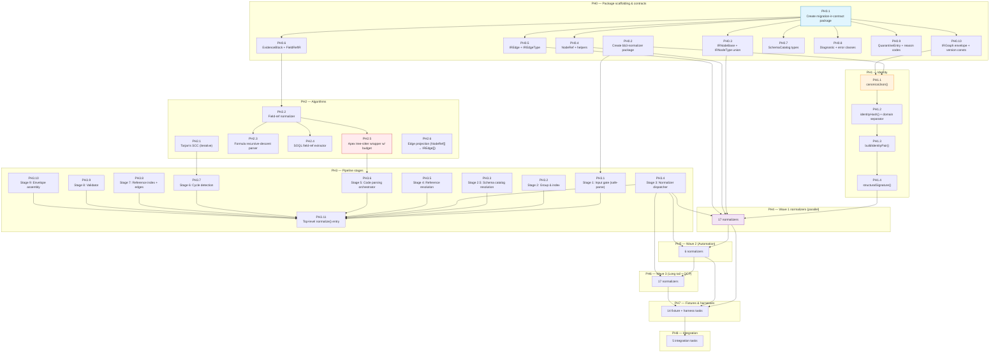

# BB-3 — Task Graph + Task Cards

> **Companion to:** [MIGRATION-PLANNER-BB3-DESIGN.md](./MIGRATION-PLANNER-BB3-DESIGN.md) (**v1.2**)
> **Purpose:** The executable shard of the spec. Every card is a unit of work sized for one AI agent invocation. Cards are self-contained, pinned to specific spec sections, and carry explicit test coverage.
> **Status:** Phases 0–8 all shipped as code. Finishing plumbing underway as **Phase 9** (see below).
> **Tasks doc version:** 1.2 — added Phase 9 "Plumbing & end-to-end" + Current State snapshot
> **Last updated:** 2026-04-10

---

## Current State (2026-04-10)

**All 89 original task cards (PH0 – PH8) shipped code and unit tests.** Everything compiles, `pnpm lint && pnpm test && pnpm build` is green, `staging` and `main` are aligned at `282e527`.

**But the end-to-end pipeline is incomplete.** A self-reflective audit ([docs/BB3-COMPLETION-STATUS.md](BB3-COMPLETION-STATUS.md)) surfaced 11 gaps where per-task acceptance criteria passed in isolation but do not hold in the full pipeline path. Summary:

- **PH3.11 is shipped but stubbed** — Stages 5, 6, 7 are wired as no-ops or with empty input maps in [pipeline.ts](../packages/bb3-normalizer/src/pipeline.ts). Stage 5 `parseCode` is never called, Stage 6 `detectCycles` gets an empty `outEdges` map, Stage 7 gets an empty `projectedDescriptors` array.
- **PH3.5 (Stage 4) does identity merging but never walks `NodeRef[]` fields** — `PriceCondition.ownerRule` points at a raw Salesforce record-id that doesn't match any real node. `PricingRule.conditions[]` is always empty in production. Parent-child linking is missing.
- **PH8.1 shipped an orphaned `runBB3()` wrapper** — the real worker pipeline ([apps/worker/src/pipeline.ts](../apps/worker/src/pipeline.ts)) never imports or calls it. BB-3 is not invoked on any real extraction run.
- **PH8.2 `saveIRGraph()` and PH8.3 `emitBB3Metrics()` are never called** — the write-side of persistence and the metrics sink both ship but nothing triggers them.
- **PH7.11 integration harness asserts "does not throw"** instead of semantic invariants, which is why the gaps above went unnoticed until the audit.

**What these gaps are NOT:** they are not a new wave, not a spec change, and not BB-3b (QCP AST — that is intentionally out of scope per spec §14.4). They are targeted plumbing fixes inside `packages/bb3-normalizer/src/pipeline.ts`, `packages/bb3-normalizer/src/stages/s4-resolve-refs.ts`, and `apps/worker/src/pipeline.ts`.

**The gap-closing work is tracked as Phase 9 below** (§13 — Phase 9 Plumbing & end-to-end). 11 new task cards, grouped into 4 sprints, estimated ~1 focused engineer-week. See [docs/BB3-COMPLETION-STATUS.md](BB3-COMPLETION-STATUS.md) for the full audit and rationale.

### Phase rollup

| Phase                           | Cards         | Status                                               | Notes                                                            |
| ------------------------------- | ------------- | ---------------------------------------------------- | ---------------------------------------------------------------- |
| PH0 — Contracts                 | 10/10         | ✅ truly done                                        |                                                                  |
| PH1 — Identity                  | 6/6           | ✅ truly done                                        |                                                                  |
| PH2 — Shared algorithms         | 6/6           | ✅ truly done                                        | `projectEdges()` needs a default descriptor table — see PH9.1    |
| PH3 — Pipeline stages           | 11/11 shipped | 🟡 3 stages stubbed in end-to-end                    | PH9.2/3/4/5/6/7 close the gaps                                   |
| PH4 — Wave 1 normalizers        | 17/17         | ✅ per-node, 🟡 cross-node refs empty                | Fixed by PH9.3 (Stage 4 parent wiring)                           |
| PH5 — Wave 2 automation         | 6/6           | ✅ per-node, 🟡 Apex parse never runs                | Fixed by PH9.5 (wire Stage 5)                                    |
| PH6 — Wave 3 long tail          | 17/17         | ✅ per-node                                          |                                                                  |
| PH7 — Fixtures & harnesses      | 13/14         | ✅ builders, 🟡 harness too lenient, PH7.12 deferred | Fixed by PH9.8 (harness rewrite); PH7.12 tracked in TECH-DEBT.md |
| PH8 — Integration               | 5/5 shipped   | 🔴 runBB3/save/metrics orphaned                      | Fixed by PH9.9/10/11 (wire into real worker)                     |
| **PH9 — Plumbing & end-to-end** | **0/11**      | 🟡 new phase, see below                              | Drives BB-3 to 100% end-to-end coverage                          |

### How to continue

Phase 9 follows the same workflow as PH0–PH8: `/bb3-next` → implement → `/ship-it` → `/wave-review` every 5 commits → `/sync-branches` at sprint boundaries. Non-negotiables from [CLAUDE.md](../CLAUDE.md) still apply (determinism, RCA-neutrality, canonicalJson, NodeRef, parser budgets, contract package stays thin). Pre-authorization for autonomous continuation from the prior session carries forward: the next agent should not pause for per-task permission, only at sprint boundaries and at anything destructive.

---

## 0. How To Use This Document

This document serves three audiences:

1. **The implementing engineer / AI agent.** Pick a task card whose dependencies are met, paste it into a fresh context along with the relevant spec sections, and implement. Each card states exactly what files to touch, what interface to expose, and what tests to write.
2. **The coordinator.** Read §2 (task graph) and §3 (inventory) to see what's blocking what, assign parallel work, and track progress.
3. **The reviewer.** Use the acceptance-criteria checklists in each card as the PR review rubric.

### The golden rule

**The spec is the source of truth. This document is the execution surface.** When a card and the spec disagree, the spec wins — and that's a bug report against this document. Cards copy 2–4 non-negotiables from the spec so agents don't need to hold the whole 2,700-line design doc in context, but for anything beyond those non-negotiables, the card cites §X.Y and the agent reads the spec.

### Card anatomy

```
### TASK-ID — Title
Goal:          One sentence.
Wave:          Phase + wave label
Depends on:    [list of task IDs that MUST be merged first]
Spec anchors:  §X.Y references in the BB-3 design spec
Effort:        S (≤ 2h), M (2-6h), L (6-12h), XL (12-24h)

Non-negotiables:   2-4 bullets copied from the spec
Files:             Paths to create / modify
Interface:         TypeScript signature or config contract
Implementation:    3-5 bullets of how-to
Acceptance:        Checklist of testable conditions
Test coverage:     Explicit: unit | integration | golden | property | e2e | smoke | lint | playwright
Out of scope:      What NOT to do in this task
```

### Effort scale

- **S (Small)** — ≤ 2 hours. One file, one function, one test.
- **M (Medium)** — 2–6 hours. Multiple files, a small subsystem, a handful of tests.
- **L (Large)** — 6–12 hours. A full pipeline stage or several normalizers. Usually produces 100–400 lines.
- **XL (Extra Large)** — 12–24 hours. Reserved for genuinely complex work (tree-sitter integration, the large-synthetic fixture generator). Split if possible.

### Test taxonomy

Every card names its test type(s) explicitly. This matters because "add tests" is too vague for an AI agent — it'll write whatever feels right. The taxonomy forces a decision up front.

| Test type       | Meaning                                                            | Where it runs                                     |
| --------------- | ------------------------------------------------------------------ | ------------------------------------------------- |
| **unit**        | Isolated function tests. No I/O, no fixtures beyond inline data.   | Sibling `*.test.ts` next to the implementation.   |
| **integration** | Multi-stage pipeline tests using fixture inputs.                   | `packages/bb3-normalizer/__tests__/integration/`. |
| **golden**      | Snapshot comparison against a checked-in expected output.          | `packages/bb3-normalizer/__tests__/golden/`.      |
| **property**    | Randomized property tests via `fast-check`.                        | Sibling `*.property.test.ts`.                     |
| **e2e**         | Full worker pipeline: Salesforce extraction → BB-3 → persisted IR. | `apps/worker/__tests__/e2e/`.                     |
| **smoke**       | Sub-second sanity check runnable in CI pre-commit.                 | `packages/*/` via `pnpm smoke`.                   |
| **lint**        | Static / grep-based check.                                         | CI only.                                          |
| **playwright**  | Browser-level E2E against the RevBrain UI.                         | `e2e/` directory.                                 |

**Note on Playwright for BB-3:** BB-3 itself is a pure function with no UI, so the library does not get Playwright tests. But the _integration_ (Phase 8) — where the IR output surfaces in the assessment results page — does warrant a Playwright test. That's task **PH8.5**.

---

## 1. Conventions

### Task ID format

`PH<phase>.<sequence>` where phase is one of:

| Phase | Label       | Description                                    |
| ----- | ----------- | ---------------------------------------------- |
| PH0   | Contracts   | Package scaffolding + type definitions         |
| PH1   | Identity    | Canonical JSON + identity hashing              |
| PH2   | Algorithms  | Shared graph/parser algorithms                 |
| PH3   | Stages      | The 9 pipeline stages                          |
| PH4   | Wave 1      | Core pricing + catalog + formula normalizers   |
| PH5   | Wave 2      | Automation normalizers (Apex / Flow)           |
| PH6   | Wave 3      | Long-tail normalizers + QCP placeholder        |
| PH7   | Fixtures    | Test fixtures and acceptance test harnesses    |
| PH8   | Integration | Worker integration, persistence, observability |

### Dependency semantics

- **"Depends on"** means the listed task MUST be merged before the dependent task can start. This is strict — you cannot stub a dependency and proceed.
- **"Blocks"** is the reverse direction — which tasks are waiting on this one. Listed at the end of critical-path cards for situational awareness.
- Tasks with `Depends on: —` are ready to start immediately.

### Parallelization hints

Cards that can run in parallel share a **Parallel group** label (e.g. "Group W1-pricing"). An agent coordinator MAY spawn one agent per card in the same group simultaneously, as long as all members' dependencies are met.

### What every task produces (minimum bar)

Regardless of what the card says, every task MUST deliver:

1. The code described in **Files**.
2. Tests matching the **Test coverage** row — not a subset.
3. A brief PR description linking to the card and noting any deviations from the spec.
4. `pnpm lint` and `pnpm test` passing locally before the PR opens.

---

## 2. Task Graph



### Critical path

```
PH0.1 → PH0.10 → PH1.1 → PH1.2 → PH1.4 → (any one Wave 1 normalizer, e.g. W1.1 PricingRule)
       → PH3.11 → PH7.13 (determinism harness) → PH7.12 (golden)
```

This is the shortest path to a demonstrable end-to-end run: scaffolding → types → identity hashing → one normalizer → the pipeline entry → the determinism test → the first golden snapshot. Estimated ~2.5–3 weeks of solo work, or ~8–10 days with 3 engineers working in parallel on the parallel-group tasks.

---

## 3. Task Inventory

Legend: **Depends** = hard upstream dependencies. **Group** = parallel-execution label.

### Phase 0 — Contracts (10 tasks)

| ID     | Title                                                   | Effort | Depends                    | Group        |
| ------ | ------------------------------------------------------- | ------ | -------------------------- | ------------ |
| PH0.1  | Create `@revbrain/migration-ir-contract` package        | S      | —                          | PH0-scaffold |
| PH0.2  | Create `@revbrain/bb3-normalizer` package               | S      | PH0.1                      | PH0-scaffold |
| PH0.3  | `IRNodeBase` + `IRNodeType` union + base patterns       | M      | PH0.1                      | PH0-types    |
| PH0.4  | `NodeRef` + `resolvedRef()` / `unresolvedRef()`         | S      | PH0.1                      | PH0-types    |
| PH0.5  | `IREdge` + `IREdgeType` union                           | S      | PH0.1                      | PH0-types    |
| PH0.6  | `EvidenceBlock` + `FieldRefIR` discriminated union      | M      | PH0.1                      | PH0-types    |
| PH0.7  | `SchemaCatalog` + `ObjectSchema` + `FieldSchema`        | S      | PH0.1                      | PH0-types    |
| PH0.8  | `Diagnostic` + `BB3InputError` / `BB3InternalError`     | S      | PH0.1                      | PH0-types    |
| PH0.9  | `QuarantineEntry` + full reason enum                    | S      | PH0.1                      | PH0-types    |
| PH0.10 | `IRGraph` envelope + `GraphMetadataIR` + version consts | M      | PH0.3, PH0.5, PH0.6, PH0.9 | —            |

### Phase 1 — Identity (6 tasks)

| ID    | Title                                                        | Effort | Depends | Group     |
| ----- | ------------------------------------------------------------ | ------ | ------- | --------- |
| PH1.1 | `canonicalJson()` with accept/reject contract                | M      | PH0.1   | —         |
| PH1.2 | `identityHash()` with domain separator                       | S      | PH1.1   | —         |
| PH1.3 | `buildIdentityPair()` convenience wrapper                    | S      | PH1.2   | —         |
| PH1.4 | `structuralSignature()` for CPQ record-types                 | S      | PH1.2   | —         |
| PH1.5 | Property tests for canonicalJson (round-trip, ordering, NFC) | S      | PH1.1   | PH1-tests |
| PH1.6 | Collision + stability tests for identityHash                 | S      | PH1.3   | PH1-tests |

### Phase 2 — Shared algorithms (6 tasks)

| ID    | Title                                                      | Effort | Depends      | Group |
| ----- | ---------------------------------------------------------- | ------ | ------------ | ----- |
| PH2.1 | Tarjan's SCC (iterative, not recursive)                    | M      | PH0.3        | —     |
| PH2.2 | Field-ref normalizer (case-fold, path vs field, namespace) | M      | PH0.6, PH0.7 | —     |
| PH2.3 | Formula recursive-descent parser                           | L      | PH2.2        | —     |
| PH2.4 | SOQL SELECT field-ref extractor                            | S      | PH2.2        | —     |
| PH2.5 | Apex tree-sitter wrapper with deterministic budget         | L      | PH2.2        | —     |
| PH2.6 | Edge projection (`NodeRef[]` → `IREdge[]`)                 | S      | PH0.4, PH0.5 | —     |

### Phase 3 — Pipeline stages (11 tasks)

| ID     | Title                                                    | Effort | Depends                    | Group |
| ------ | -------------------------------------------------------- | ------ | -------------------------- | ----- |
| PH3.1  | Stage 1: Input gate (per-finding Zod safe-parse)         | M      | PH0.9                      | —     |
| PH3.2  | Stage 2: Group & index                                   | S      | PH3.1                      | —     |
| PH3.3  | Stage 2.5: Schema catalog resolution                     | M      | PH0.7, PH3.2               | —     |
| PH3.4  | Stage 3: Normalizer dispatcher (registry)                | M      | PH0.3, PH3.2               | —     |
| PH3.5  | Stage 4: Reference resolution + cross-collector merge    | L      | PH3.4, PH0.4               | —     |
| PH3.6  | Stage 5: Code parsing orchestrator                       | M      | PH2.3, PH2.4, PH2.5, PH3.4 | —     |
| PH3.7  | Stage 6: Cycle detection (using PH2.1)                   | M      | PH2.1, PH3.5               | —     |
| PH3.8  | Stage 7: Reference index + edges                         | M      | PH0.10, PH2.6, PH3.7       | —     |
| PH3.9  | Stage 8: Validator (V1–V8)                               | L      | PH3.8                      | —     |
| PH3.10 | Stage 9: Envelope assembly + sort + canonical serialize  | M      | PH3.9, PH1.1               | —     |
| PH3.11 | Top-level `normalize()` + `NormalizeResult.runtimeStats` | M      | PH3.1–3.10                 | —     |

### Phase 4 — Wave 1 normalizers (17 tasks, parallel)

| ID     | Title                                                            | Effort | Depends      | Group      |
| ------ | ---------------------------------------------------------------- | ------ | ------------ | ---------- |
| PH4.1  | `PricingRuleIR` normalizer                                       | L      | PH1.4, PH3.4 | W1-pricing |
| PH4.2  | `PriceConditionIR` normalizer                                    | M      | PH1.4, PH3.4 | W1-pricing |
| PH4.3  | `PriceActionIR` normalizer                                       | M      | PH1.4, PH3.4 | W1-pricing |
| PH4.4  | `DiscountScheduleIR` normalizer                                  | S      | PH1.4, PH3.4 | W1-pricing |
| PH4.5  | `DiscountTierIR` normalizer                                      | S      | PH1.4, PH3.4 | W1-pricing |
| PH4.6  | `SummaryVariableIR` normalizer                                   | S      | PH1.4, PH3.4 | W1-pricing |
| PH4.7  | `BlockPriceIR` normalizer                                        | S      | PH1.4, PH3.4 | W1-pricing |
| PH4.8  | `ContractedPriceIR` normalizer (scopeKey handling)               | M      | PH1.4, PH3.4 | W1-pricing |
| PH4.9  | `LookupQueryIR` normalizer                                       | S      | PH2.4, PH3.4 | W1-pricing |
| PH4.10 | `ProductIR` normalizer                                           | S      | PH1.4, PH3.4 | W1-catalog |
| PH4.11 | `BundleStructureIR` normalizer                                   | M      | PH1.4, PH3.4 | W1-catalog |
| PH4.12 | `BundleOptionIR` normalizer                                      | S      | PH1.4, PH3.4 | W1-catalog |
| PH4.13 | `BundleFeatureIR` normalizer                                     | S      | PH1.4, PH3.4 | W1-catalog |
| PH4.14 | `ConfigConstraintIR` normalizer (ProductRule + OptionConstraint) | M      | PH1.4, PH3.4 | W1-catalog |
| PH4.15 | `ConfigurationAttributeIR` normalizer                            | S      | PH1.4, PH3.4 | W1-catalog |
| PH4.16 | `FormulaFieldIR` normalizer                                      | M      | PH2.3, PH3.4 | W1-formula |
| PH4.17 | `ValidationRuleIR` normalizer                                    | S      | PH2.3, PH3.4 | W1-formula |

### Phase 5 — Wave 2 Automation normalizers (6 tasks)

| ID    | Title                                                        | Effort | Depends                          | Group         |
| ----- | ------------------------------------------------------------ | ------ | -------------------------------- | ------------- |
| PH5.1 | `ApexClassAutomationIR` normalizer + tree-sitter integration | L      | PH0.3, PH2.5, PH3.6, PH4.\* done | W2-automation |
| PH5.2 | `ApexTriggerAutomationIR` normalizer                         | M      | PH0.3, PH5.1                     | W2-automation |
| PH5.3 | `FlowAutomationIR` normalizer                                | S      | PH0.3, PH3.4                     | W2-automation |
| PH5.4 | `WorkflowRuleAutomationIR` normalizer                        | S      | PH0.3, PH3.4                     | W2-automation |
| PH5.5 | `CustomMetadataTypeIR` normalizer                            | S      | PH3.4                            | W2-custom     |
| PH5.6 | `RecordTypeIR` normalizer                                    | S      | PH3.4                            | W2-custom     |

### Phase 6 — Wave 3 Long tail (17 tasks)

| ID     | Title                                                   | Effort | Depends       | Group           |
| ------ | ------------------------------------------------------- | ------ | ------------- | --------------- |
| PH6.1  | `CustomActionIR` normalizer (with inlined conditions)   | M      | PH3.4, PH3.5  | W3-approvals    |
| PH6.2  | `ApprovalProcessIR` normalizer                          | S      | PH3.4         | W3-approvals    |
| PH6.3  | `ApprovalChainRuleIR` normalizer                        | S      | PH3.4         | W3-approvals    |
| PH6.4  | `DocumentTemplateIR` normalizer (with inlined sections) | M      | PH3.4         | W3-templates    |
| PH6.5  | `QuoteTermBlockIR` normalizer                           | S      | PH3.4         | W3-templates    |
| PH6.6  | `NamedCredentialIR` normalizer                          | S      | PH3.4         | W3-integrations |
| PH6.7  | `ExternalDataSourceIR` normalizer                       | S      | PH3.4         | W3-integrations |
| PH6.8  | `ConnectedAppIR` normalizer                             | S      | PH3.4         | W3-integrations |
| PH6.9  | `PlatformEventIR` normalizer                            | S      | PH3.4         | W3-integrations |
| PH6.10 | `OutboundMessageAutomationIR` normalizer                | S      | PH0.3, PH5.1  | W3-integrations |
| PH6.11 | `CustomComputationIR` QCP placeholder normalizer        | M      | PH3.4         | —               |
| PH6.12 | `LocalizationBundleIR` normalizer                       | S      | PH3.4         | W3-misc         |
| PH6.13 | `UsageStatisticIR` normalizer                           | S      | PH3.4         | W3-misc         |
| PH6.14 | `OrgFingerprintIR` normalizer (singleton + envelope)    | S      | PH0.10, PH3.4 | W3-misc         |
| PH6.15 | `CPQSettingsBundleIR` normalizer                        | M      | PH3.4         | W3-misc         |
| PH6.16 | `UnknownArtifactIR` fallback normalizer                 | S      | PH3.4         | W3-misc         |
| PH6.17 | Not-modeled-v1 quarantine router                        | S      | PH0.9, PH3.4  | W3-misc         |

### Phase 7 — Fixtures & harnesses (14 tasks)

| ID     | Title                                             | Effort | Depends                    | Group       |
| ------ | ------------------------------------------------- | ------ | -------------------------- | ----------- |
| PH7.1  | `minimal-org` fixture (A1)                        | S      | PH4.\* (Wave 1 done)       | W3-fixtures |
| PH7.2  | `cyclic-rules` fixture (A3)                       | S      | PH3.7, PH4.1, PH4.2, PH4.3 | W3-fixtures |
| PH7.3  | `large-synthetic-1k` fixture generator (A2)       | M      | PH4.\* (Wave 1 done)       | W3-fixtures |
| PH7.4  | `large-synthetic-50k` fixture generator (A9)      | M      | PH7.3                      | W3-fixtures |
| PH7.5  | `malformed` fixture (A7)                          | S      | PH3.1                      | W3-fixtures |
| PH7.6  | `qcp-huge` fixture (A8)                           | S      | PH6.11                     | W3-fixtures |
| PH7.7  | `renamed-rule` + `edited-rule` fixtures (A5, A13) | M      | PH4.1                      | W3-fixtures |
| PH7.8  | `sandbox-refresh` fixture (A6)                    | S      | PH4.1                      | W3-fixtures |
| PH7.9  | `empty-org` fixture (E26)                         | S      | PH3.11                     | W3-fixtures |
| PH7.10 | `no-schema-catalog` fixture (A15)                 | S      | PH3.3                      | W3-fixtures |
| PH7.11 | Integration test harness (runs all fixtures)      | M      | PH7.1–7.10                 | —           |
| PH7.12 | Staging golden file capture + diff CI job (A12)   | M      | PH7.11                     | —           |
| PH7.13 | Determinism test harness (A4)                     | M      | PH1.1, PH3.11              | —           |
| PH7.14 | RCA-leakage lint test (A14)                       | S      | PH3.11                     | —           |

### Phase 8 — Integration (5 tasks)

| ID    | Title                                                          | Effort | Depends | Group |
| ----- | -------------------------------------------------------------- | ------ | ------- | ----- |
| PH8.1 | Wire BB-3 into extraction worker pipeline                      | M      | PH7.11  | —     |
| PH8.2 | Persistence layer: store `IRGraph` alongside findings          | L      | PH8.1   | —     |
| PH8.3 | Worker metrics sink for `runtimeStats`                         | S      | PH8.1   | —     |
| PH8.4 | CLI smoke test: run full extraction → BB-3 → IR dump           | S      | PH8.1   | —     |
| PH8.5 | Playwright smoke test: assessment page surfaces IR node counts | M      | PH8.2   | —     |

### Phase 9 — Plumbing & end-to-end (11 tasks, added 2026-04-10)

Closes the 11 gaps identified in [docs/BB3-COMPLETION-STATUS.md](BB3-COMPLETION-STATUS.md). Each card matches one gap and is sized for one `/bb3-next` → `/ship-it` cycle. Sprints group the cards into natural PR-merge points for `/sync-branches`.

| ID     | Title                                                                    | Effort | Depends             | Group       |
| ------ | ------------------------------------------------------------------------ | ------ | ------------------- | ----------- |
| PH9.1  | Default `NodeRefFieldDescriptor` table (gap G7)                          | M      | PH0.5, PH3.8        | PH9-sprint1 |
| PH9.2  | Thread `FindingIndex` through pipeline (gap G2)                          | S      | PH3.2, PH3.4        | PH9-sprint1 |
| PH9.3  | Stage 4 parent-child wiring + orphan quarantine (gap G1)                 | M      | PH9.2, PH3.5        | PH9-sprint1 |
| PH9.4  | Swap Stage 6 ↔ Stage 7 order so cycle detection has real edges (gap G5)  | S      | PH9.1, PH9.3        | PH9-sprint1 |
| PH9.5  | Wire Stage 5 parse-code + `enrichApexClass` into pipeline (gap G4)       | M      | PH3.6, PH5.1        | PH9-sprint1 |
| PH9.6  | Populate `GraphMetadataIR.schemaCatalogHash` (gap G3)                    | S      | PH3.3, PH3.11       | PH9-sprint1 |
| PH9.7  | Worker-level `runBB3()` passes default descriptor table + catalog hash   | S      | PH9.1, PH9.6, PH8.1 | PH9-sprint1 |
| PH9.8  | Rewrite integration harness to assert semantic invariants (gap G6)       | M      | PH9.1–PH9.5, PH7.11 | PH9-sprint2 |
| PH9.9  | Real worker pipeline calls `runBB3()` in `runPipeline()` (gap G8)        | S      | PH9.7               | PH9-sprint3 |
| PH9.10 | Real worker pipeline calls `saveIRGraph()` after `runBB3()` (gap G9)     | XS     | PH9.9, PH8.2        | PH9-sprint3 |
| PH9.11 | Real worker pipeline calls `emitBB3Metrics()` after `runBB3()` (gap G10) | XS     | PH9.9, PH8.3        | PH9-sprint3 |

**Total: 100 tasks.** (89 original + 11 Phase 9 plumbing.)

---

## 4. Phase 0 — Contracts

These tasks are pure TypeScript type definitions in `@revbrain/migration-ir-contract`. No implementation, no dependencies on tree-sitter, no I/O. They exist so every downstream task has a stable contract to import.

---

### PH0.1 — Create `@revbrain/migration-ir-contract` package

**Goal:** Scaffold the contract package with zero native deps so any BB can import types without pulling in tree-sitter.
**Wave:** PH0 • **Depends on:** — • **Spec anchors:** §6.3 package layout • **Effort:** S

**Non-negotiables:**

- Package MUST NOT depend on `tree-sitter`, `@revbrain/database`, or any Salesforce client.
- Only runtime dep allowed: `zod` (for input type re-exports).
- MUST be consumable by a Deno edge function (pure ES modules).

**Files:**

- `packages/migration-ir-contract/package.json`
- `packages/migration-ir-contract/tsconfig.json`
- `packages/migration-ir-contract/src/index.ts` (empty placeholder)
- `packages/migration-ir-contract/README.md` (2 paragraphs, what + why)

**Implementation:**

- Copy tsconfig from `packages/contract/` as the template.
- Add the package to root `pnpm-workspace.yaml` and `tsconfig.base.json` paths.
- Add `"type": "module"` to package.json.
- Add a CI check in `package.json` scripts: `"check:no-native-deps": "node scripts/check-no-native-deps.mjs"` — fails if any transitive dep lists `binding.gyp` or `node-pre-gyp`.

**Acceptance:**

- [ ] `pnpm install` succeeds at the root without new native compilations.
- [ ] `pnpm --filter @revbrain/migration-ir-contract build` produces a `dist/` directory.
- [ ] `node scripts/check-no-native-deps.mjs` exits 0.

**Test coverage:**

- **smoke:** The `check:no-native-deps` script is itself the smoke test. Runs in CI.
- **unit:** None for this task (no logic).

**Out of scope:** Any type definitions — those come in PH0.3–PH0.10.

---

### PH0.2 — Create `@revbrain/bb3-normalizer` package

**Goal:** Scaffold the implementation package with `tree-sitter` + `tree-sitter-apex` as dependencies.
**Wave:** PH0 • **Depends on:** PH0.1 • **Spec anchors:** §6.3 • **Effort:** S

**Non-negotiables:**

- Depends on `@revbrain/migration-ir-contract`, `@revbrain/contract`, `tree-sitter`, `tree-sitter-apex`, `zod`.
- The package MUST re-export the full contract surface so downstream consumers can `import {...} from '@revbrain/bb3-normalizer'` for convenience.

**Files:**

- `packages/bb3-normalizer/package.json`
- `packages/bb3-normalizer/tsconfig.json`
- `packages/bb3-normalizer/src/index.ts` (placeholder re-exports the contract package)
- `packages/bb3-normalizer/README.md`

**Implementation:**

- Same scaffolding pattern as PH0.1.
- Add native-addon prebuild step if the monorepo's existing CI requires one (check `apps/worker/package.json` for reference).

**Acceptance:**

- [ ] `pnpm install` compiles tree-sitter-apex successfully.
- [ ] `import * from '@revbrain/bb3-normalizer'` type-checks from a scratch file.
- [ ] Re-export surface is non-empty.

**Test coverage:**

- **smoke:** A single `index.test.ts` that imports `BB3_VERSION` (placeholder const) and asserts it's a non-empty string. Proves the package builds and loads.

**Out of scope:** `normalize()` implementation — see PH3.11.

---

### PH0.3 — `IRNodeBase` + `IRNodeType` union + AutomationIR discriminated union

**Goal:** Define the base interface every IR node extends, the discriminated union of all node types, and the `AutomationIR` variant union.
**Wave:** PH0 • **Depends on:** PH0.1 • **Spec anchors:** §5.3 • **Effort:** M

**Non-negotiables:**

- `IRNodeBase` MUST include BOTH `id` AND `contentHash` (§5.2 identity split).
- `IRNodeType` union MUST include all types enumerated in §5.3 including `'ConnectedApp'` and `'CPQSettingsBundle'`.
- MUST NOT include `'ProcessBuilder'`, `'SubscriptionLifecycle'`, or `'CustomField'`.
- **v1.2 #10:** `AutomationIR` is a DISCRIMINATED UNION, NOT a single interface. The union has 5 variants discriminated by `sourceType`: `ApexClassAutomationIR | ApexTriggerAutomationIR | FlowAutomationIR | WorkflowRuleAutomationIR | OutboundMessageAutomationIR`. All 5 extend a shared `AutomationIRBase` that carries `sbqqFieldRefs`, `writtenFields`, and `relatedRules`. Apex-specific metrics (`lineCount`, `calloutCount`, `hasTriggerControl`) live ONLY on Apex variants. Flow-specific metrics (`flowType`, `activeVersionNumber`, `elementCounts`) live ONLY on the Flow variant.

**Files:**

- `packages/migration-ir-contract/src/types/nodes.ts`
- `packages/migration-ir-contract/src/types/automation.ts` (the AutomationIR union + 5 variants + base)
- `packages/migration-ir-contract/src/types/nodes.test.ts` (type-level tests)

**Interface:**

```typescript
export interface IRNodeBase { id: string; contentHash: string; nodeType: IRNodeType; ... }
export type IRNodeType = 'PricingRule' | ... | 'Automation' | ... | 'UnknownArtifact';

// v1.2 discriminated union
export type AutomationIR =
  | ApexClassAutomationIR
  | ApexTriggerAutomationIR
  | FlowAutomationIR
  | WorkflowRuleAutomationIR
  | OutboundMessageAutomationIR;
```

**Implementation:**

- Copy the full type definitions verbatim from spec §5.3 (including all 5 `*AutomationIR` variants + `AutomationIRBase`).
- JSDoc every type citing its spec section.

**Acceptance:**

- [ ] Every IR node type from §5.3 is declared and exported.
- [ ] All 5 `AutomationIR` variants are declared and exported via the union.
- [ ] A `switch (automation.sourceType)` narrows to the variant interface with full type completion (`ApexClassAutomationIR.lineCount` accessible, `FlowAutomationIR.flowType` accessible).
- [ ] TypeScript compilation passes with `"strict": true`.

**Test coverage:**

- **unit:** Type-level tests using `@ts-expect-error` sentinels: exhaustive `switch (node.nodeType)` and exhaustive `switch (automation.sourceType)` both type-check without default branches. Prove that `FlowAutomationIR` does NOT expose `calloutCount` (accessing it is a type error).

**Out of scope:** Individual normalizers that produce these types — see PH5.1–5.4, PH6.10.

---

### PH0.4 — `NodeRef` + helpers

**Goal:** Define the `NodeRef` discriminated union and its constructor helpers so every reference in the IR is either explicitly resolved or explicitly unresolved.
**Wave:** PH0 • **Depends on:** PH0.1 • **Spec anchors:** §5.1a • **Effort:** S

**Non-negotiables:**

- `NodeRef` is a discriminated union on `resolved: boolean` — never a bare string.
- Helpers `resolvedRef(id)` and `unresolvedRef(reason, hint?, sourceField?)` MUST be value exports, not just types.

**Files:**

- `packages/migration-ir-contract/src/types/node-ref.ts`
- `packages/migration-ir-contract/src/types/node-ref.test.ts`

**Interface:**

```typescript
export type NodeRef =
  | { id: string; resolved: true }
  | { id: null; resolved: false; reason: UnresolvedReason; hint?: string; sourceField?: string };
export type UnresolvedReason =
  | 'orphaned'
  | 'out-of-scope'
  | 'parse-failure'
  | 'dynamic'
  | 'unknown-target';
export function resolvedRef(id: string): NodeRef;
export function unresolvedRef(
  reason: UnresolvedReason,
  hint?: string,
  sourceField?: string
): NodeRef;
```

**Acceptance:**

- [ ] A `NodeRef` narrows correctly in an `if (ref.resolved)` branch.
- [ ] Helpers return objects that pass `JSON.stringify` → `canonicalJson` round-trip unchanged.

**Test coverage:**

- **unit:** ≥ 6 cases: each helper, each reason, narrowing proof.

**Out of scope:** Edge projection — see PH2.6.

---

### PH0.5 — `IREdge` + `IREdgeType` union (v1.2 projected/synthetic split)

**Goal:** Define the edge projection type used by Stage 7, with the v1.2 projected-vs-synthetic taxonomy.
**Wave:** PH0 • **Depends on:** PH0.1 • **Spec anchors:** §5.1a • **Effort:** S

**Non-negotiables:**

- Every edge carries `sourceField` (the inline field on the source node that the edge was derived from) so the validator can detect inline/edge drift.
- **v1.2 #1 — REMOVE from the union:** `'reads-field'`, `'writes-field'` (field access is a `ReferenceIndex` concern, NOT a node→node edge; `FieldRefIR` is not an IR node), and `'cycle-member-of'` (wrong direction).
- **v1.2 #1 — ADD to the union:** `'cycle-contains'` (CyclicDependencyIR group → member; direction flipped so edge source matches the node carrying the inline `NodeRef`).
- **v1.2 #4 — ADD to the union:** `'uses-discount-schedule'` (ContractedPrice/Product → DiscountSchedule).
- **v1.2 #1 — Edge-class contract:** edges are conceptually partitioned into two classes. "Projected" (`depends-on`, `parent-of`, `triggers`, `consumes-variable`, `uses-formula`, `uses-discount-schedule`, `calls`, `references`) are derived from inline `NodeRef[]` fields and MUST round-trip. "Synthetic" (`cycle-contains`) are emitted by specific stages and have stage-specific rules. The partition is documented in a JSDoc on the enum so the validator (PH3.9) can reference it.

**Files:**

- `packages/migration-ir-contract/src/types/edge.ts`
- `packages/migration-ir-contract/src/types/edge.test.ts`

**Interface:** Copy the `IREdge` + `IREdgeType` + projected-vs-synthetic comments from spec §5.1a verbatim. Export a helper constant:

```typescript
export const PROJECTED_EDGE_TYPES = new Set<IREdgeType>([
  'depends-on',
  'parent-of',
  'triggers',
  'consumes-variable',
  'uses-formula',
  'uses-discount-schedule',
  'calls',
  'references',
]);
export const SYNTHETIC_EDGE_TYPES = new Set<IREdgeType>(['cycle-contains']);
```

**Acceptance:**

- [ ] The union has exactly 9 values (8 projected + 1 synthetic).
- [ ] `PROJECTED_EDGE_TYPES ∪ SYNTHETIC_EDGE_TYPES` covers the full union (checked by a type-level exhaustiveness test).
- [ ] `'reads-field'`, `'writes-field'`, `'cycle-member-of'` are NOT present anywhere in the file.
- [ ] An `IREdge[]` round-trips via `canonicalJson` byte-identically.

**Test coverage:**

- **unit:** One construction test per edge type + one exhaustiveness test + one lint assertion grep-ing the file for `'reads-field'|'writes-field'|'cycle-member-of'` → must be zero.

**Out of scope:** The actual projection logic — that's PH2.6. The validator round-trip rules — that's PH3.9.

---

### PH0.6 — `EvidenceBlock` + `FieldRefIR` discriminated union

**Goal:** Define the provenance contract and the field-reference discriminated union with path support.
**Wave:** PH0 • **Depends on:** PH0.1 • **Spec anchors:** §5.3 (FieldRefIR), §5.4 (EvidenceBlock) • **Effort:** M

**Non-negotiables:**

- `FieldRefIR` is `DirectFieldRef | PathFieldRef` discriminated on `kind`.
- Every `FieldRefIR` carries `isResolved: boolean` + optional `unresolvedReason`.
- `EvidenceBlock.classificationReasons` is a list of `{ decision, chosenValue, reason, confidence }` — not free text.

**Files:**

- `packages/migration-ir-contract/src/types/evidence.ts`
- `packages/migration-ir-contract/src/types/evidence.test.ts`

**Interface:** Copy from spec §5.3 (`FieldRefIR`, `DirectFieldRef`, `PathFieldRef`) and §5.4 (`EvidenceBlock`) verbatim.

**Acceptance:**

- [ ] `FieldRefIR` narrows on `kind` (discriminated union test).
- [ ] A `PathFieldRef` with `rootObject: 'SBQQ__Quote__c'` and `path: ['Account__r', 'Owner']` serializes deterministically.

**Test coverage:**

- **unit:** 4 cases — direct resolved, direct unresolved-dynamic, path resolved, path unresolved-no-catalog.

**Out of scope:** Normalization logic (PH2.2), resolution against SchemaCatalog (PH3.3).

---

### PH0.7 — `SchemaCatalog` + `ObjectSchema` + `FieldSchema`

**Goal:** Define the first-class schema input used to resolve field references against ground truth.
**Wave:** PH0 • **Depends on:** PH0.1 • **Spec anchors:** §4.4a • **Effort:** S

**Non-negotiables:**

- `SchemaCatalog` is an **optional** input to `normalize()`; a missing catalog downgrades V4 rather than failing.
- `FieldSchema.dataType` is a closed enum of 16 values plus `'unknown'`.

**Files:**

- `packages/migration-ir-contract/src/types/schema-catalog.ts`
- `packages/migration-ir-contract/src/types/schema-catalog.test.ts`

**Interface:** Copy from spec §4.4a verbatim.

**Acceptance:**

- [ ] `SchemaCatalog` is JSON-serializable.
- [ ] A sample catalog with 1 object + 3 fields type-checks.

**Test coverage:**

- **unit:** Structural assertion test only.

**Out of scope:** The converter from `ObjectConfiguration` findings to `SchemaCatalog` — that lives in the worker pipeline, NOT in BB-3.

---

### PH0.8 — `Diagnostic` + `BB3InputError` / `BB3InternalError`

**Goal:** Define the telemetry and error surface BB-3 exposes to callers.
**Wave:** PH0 • **Depends on:** PH0.1 • **Spec anchors:** §5.3 (Diagnostic), §10.1 (errors) • **Effort:** S

**Non-negotiables:**

- Every `Diagnostic` carries a machine-readable `code` (e.g. `BB3_Q001`) and a `stage` enum.
- `BB3InputError` and `BB3InternalError` are both subclasses of `Error` with optional `detail: unknown`.

**Files:**

- `packages/migration-ir-contract/src/types/diagnostic.ts`
- `packages/migration-ir-contract/src/types/errors.ts`
- `packages/migration-ir-contract/src/types/diagnostic.test.ts`

**Interface:** Copy from spec §5.3 (the section containing `Diagnostic` and the error classes).

**Acceptance:**

- [ ] Both error classes throw and catch correctly with `instanceof`.
- [ ] A `Diagnostic` with `severity: 'error'` and `stage: 'normalize'` type-checks.

**Test coverage:**

- **unit:** Error classes: throw + catch + instanceof (3 tests). Diagnostic: structural assertion.

**Out of scope:** The diagnostic code registry — that's PH3.9 (validator).

---

### PH0.9 — `QuarantineEntry` + full reason enum

**Goal:** Define the structure for findings that couldn't be normalized.
**Wave:** PH0 • **Depends on:** PH0.1 • **Spec anchors:** §5.7 • **Effort:** S

**Non-negotiables:**

- Reason enum includes all 8 v1.1 values including `'not-modeled-v1'` and `'not-detected'`.
- `raw: unknown` so the caller can preserve the original finding for post-mortem.

**Files:**

- `packages/migration-ir-contract/src/types/quarantine.ts`
- `packages/migration-ir-contract/src/types/quarantine.test.ts`

**Interface:** Copy from spec §5.7.

**Acceptance:**

- [ ] All 8 reasons are present in the type.
- [ ] A quarantine entry with `reason: 'not-modeled-v1'` and a raw finding payload serializes cleanly.

**Test coverage:**

- **unit:** One construction test per reason (8 cases).

**Out of scope:** The logic that routes a finding to quarantine — that's split across the normalizers and Stage 1.

---

### PH0.10 — `IRGraph` envelope + `GraphMetadataIR` + version consts

**Goal:** Define the top-level output type — the immutable snapshot BB-3 produces.
**Wave:** PH0 • **Depends on:** PH0.3, PH0.5, PH0.6, PH0.9 • **Spec anchors:** §5.1, §5.6, §5.8 • **Effort:** M

**Non-negotiables:**

- `IRGraph` MUST NOT contain `bb3DurationMs` or any other wall-clock field (v1.1 determinism fix, §5.1).
- `extractedAt` is the ONLY non-deterministic field.
- Export `IR_SCHEMA_VERSION = '1.0.0'` as a string constant.

**Files:**

- `packages/migration-ir-contract/src/types/graph.ts`
- `packages/migration-ir-contract/src/types/schema-version.ts`
- `packages/migration-ir-contract/src/types/graph.test.ts`

**Interface:** Copy from spec §5.1 (`IRGraph`) and §5.6 (`GraphMetadataIR`).

**Acceptance:**

- [ ] `IRGraph` has no fields whose name contains `Duration`, `Ms`, `Time`, or `At` other than `extractedAt`.
- [ ] A minimal `IRGraph` with empty `nodes`, `edges`, and `quarantine` type-checks.
- [ ] `IR_SCHEMA_VERSION` is importable and equals `'1.0.0'`.

**Test coverage:**

- **unit:** Structural test + a lint test that greps the file for forbidden substrings and fails on match.

**Out of scope:** Any serialization logic (PH1.1) or validator (PH3.9).

---

## 5. Phase 1 — Identity

The single most load-bearing algorithm in BB-3. Get it wrong and re-assessment corrupts SI edits six months from now.

---

### PH1.1 — `canonicalJson()` with accept/reject contract

**Goal:** The deterministic serializer every hash and every output uses.
**Wave:** PH1 • **Depends on:** PH0.1 • **Spec anchors:** §8.1 • **Effort:** M

**Non-negotiables:**

- Object keys sorted lexicographically (UTF-16 code-unit order).
- Strings NFC-normalized; non-ASCII escaped as `\uXXXX`.
- MUST reject `NaN`, `±Infinity`, `BigInt`, `Date`, `Map`, `Set`, `RegExp`, `Function`, `Symbol`, cyclic refs, Symbol-keyed properties — each with a specific `BB3InternalError` code.
- **v1.2 #6 UNDEFINED POLICY** (Auditor 3 P1 #6): object properties with `undefined` values are **SILENTLY OMITTED** (matches `JSON.stringify` behavior). This fixes the v1.1 crash trap where `IRNodeBase` optional fields spread as `undefined` crashed the hasher. But: top-level `undefined` and array elements equal to `undefined` are STILL rejected. Concretely: `canonicalJson({a: 1, b: undefined, c: 3}) === canonicalJson({a: 1, c: 3})`, but `canonicalJson(undefined)` and `canonicalJson([1, undefined])` both throw.
- Negative zero (`-0`) folds to `0` before serialization.

**Files:**

- `packages/migration-ir-contract/src/identity/canonical-json.ts`
- `packages/migration-ir-contract/src/identity/canonical-json.test.ts`

**Interface:**

```typescript
export function canonicalJson(value: unknown): string;
```

**Implementation:**

- Walk the value with an explicit stack (not JS recursion) to avoid stack-overflow on deep input.
- Use a `WeakSet` to detect cycles.
- For strings, `value.normalize('NFC')` then escape via `\uXXXX` for any code point outside the printable ASCII range or any JSON special.
- Numbers: `Number.isFinite(n)` check first; `0` produced via `1/n === Infinity ? '0' : String(n)` to handle `-0`.
- **v1.2:** When walking an object, `Object.keys(obj).sort()` then for each key, if `obj[key] === undefined`, skip it entirely. Do not emit `"key":null` (that would be wrong — null is a distinct value).

**Acceptance:**

- [ ] `canonicalJson({a:1, b:2})` === `canonicalJson({b:2, a:1})`.
- [ ] `canonicalJson([1,2])` !== `canonicalJson([2,1])` (arrays ordered).
- [ ] **v1.2:** `canonicalJson({a: 1, b: undefined, c: 3}) === canonicalJson({a: 1, c: 3})`.
- [ ] **v1.2:** `canonicalJson({a: undefined})` === `canonicalJson({})` — both `"{}"`.
- [ ] **v1.2:** `canonicalJson({a: 1, b: null})` !== `canonicalJson({a: 1, b: undefined})` (null is kept, undefined is omitted).
- [ ] `canonicalJson(undefined)` throws `BB3InternalError`.
- [ ] `canonicalJson([1, undefined, 3])` throws `BB3InternalError`.
- [ ] `canonicalJson(NaN)` throws.
- [ ] `canonicalJson(new Date())` throws.
- [ ] Cyclic input throws without hanging.
- [ ] NFC test: composed vs decomposed "café" produce the same output.

**Test coverage:**

- **unit:** ≥ 28 cases covering every accept/reject branch from spec §8.1 PLUS the 3 v1.2 undefined-policy cases.
- **property:** `canonicalJson(x) === canonicalJson(reorderObjectKeys(x))` via `fast-check`.
- **property (v1.2):** `canonicalJson({...x, optionalField: undefined}) === canonicalJson(x)` for any object `x` that doesn't contain `optionalField`.

**Out of scope:** Any use of `canonicalJson` in hashing — that's PH1.2.

---

### PH1.2 — `identityHash()` with domain separator

**Goal:** The SHA-256/128-bit/base64url hash function every IR node uses for `id` and `contentHash`.
**Wave:** PH1 • **Depends on:** PH1.1 • **Spec anchors:** §5.2, §8.1 • **Effort:** S

**Non-negotiables:**

- Uses Node's built-in `crypto`; no third-party lib.
- Prefixes input with `{ nodeType, purpose, payload }` so `id` and `contentHash` can never collide by construction.
- Returns URL-safe base64 of first 16 bytes (128 bits).

**Files:**

- `packages/migration-ir-contract/src/identity/identity-hash.ts`
- `packages/migration-ir-contract/src/identity/identity-hash.test.ts`

**Interface:**

```typescript
export function identityHash(
  nodeType: IRNodeType,
  purpose: 'id' | 'contentHash',
  payload: unknown
): string;
```

**Acceptance:**

- [ ] Same input twice → same hash.
- [ ] Different `purpose` with same payload → different hashes.
- [ ] Different `nodeType` with same payload → different hashes.
- [ ] Output is exactly 22 base64url characters (128 bits).
- [ ] No slash, plus, or equals characters in output.

**Test coverage:**

- **unit:** ≥ 10 cases including the three "different inputs → different hashes" asserts.

**Out of scope:** The identity recipes per node type — that's in the normalizers.

---

### PH1.3 — `buildIdentityPair()` convenience wrapper

**Goal:** One call that produces both `id` and `contentHash` for a node, making normalizer code terser.
**Wave:** PH1 • **Depends on:** PH1.2 • **Spec anchors:** §5.2 • **Effort:** S

**Files:**

- `packages/migration-ir-contract/src/identity/identity-hash.ts` (add the helper)
- Extend existing test file.

**Interface:**

```typescript
export function buildIdentityPair(
  nodeType: IRNodeType,
  stableIdentity: unknown,
  semanticPayload: unknown
): { id: string; contentHash: string };
```

**Acceptance:**

- [ ] Returns object with both fields populated.
- [ ] Same stable + same semantic → both hashes stable.
- [ ] Different stable, same semantic → different `id`, same `contentHash` (proves independence).

**Test coverage:**

- **unit:** 4 cases covering the independence of the two hashes.

**Out of scope:** Per-type business-identity recipes.

---

### PH1.4 — `structuralSignature()` for CPQ record-types (v1.2 operator-removal)

**Goal:** The shape-based hash used when `developerName` is unreliable (SBQQ data records). Rename-stable AND operator-edit-stable per A13.
**Wave:** PH1 • **Depends on:** PH1.2 • **Spec anchors:** §5.2 structural signature subsection, §7.2 PricingRule row • **Effort:** S

**Non-negotiables:**

- Signature fields are sorted before hashing.
- Name-like fields (`displayName`, `artifactName`, descriptions) MUST be excluded.
- **v1.2 #2 (Auditor 3 P0 #2):** `conditionShape` MUST NOT include operator. Operator edits (`gt` → `gte`) are value-level and MUST preserve `id` per acceptance test A13. The signature inputs are: `conditionFields: [...new Set(conditions.map(c => c.field))].sort()` + `conditionCount: conditions.length`. Operators and values go into `contentHash` only.
- Action shape: `actionType|targetField` tuples, sorted+joined. Changing a target field IS structural (schema evolution); changing an action value is NOT.

**Files:**

- `packages/migration-ir-contract/src/identity/structural-signature.ts`
- `packages/migration-ir-contract/src/identity/structural-signature.test.ts`

**Interface:**

```typescript
export function structuralSignature<T>(payload: T): string; // returns 16-char prefix
```

**Acceptance:**

- [ ] Two payloads differing only in name fields → same signature (rename-stable).
- [ ] **v1.2:** Two payloads differing ONLY in a condition's operator (`gt` → `gte`) → **SAME signature** (operator-edit-stable per A13).
- [ ] **v1.2:** Two payloads differing ONLY in a condition's value → same signature.
- [ ] Two payloads with different sets of condition fields → different signatures.
- [ ] Two payloads with different conditionCount → different signatures.
- [ ] Two payloads with different action targetField → different signatures.
- [ ] Reordering conditions before calling → same signature (sort-stable).

**Test coverage:**

- **unit:** 8 cases including the 3 v1.2 operator/value stability cases + the rename-stability case.
- **property:** `signature(x) === signature(reorder(x))` via fast-check.
- **property (v1.2):** `signature(x) === signature(withDifferentOperator(x))` for any x.

**Out of scope:** Integration with PricingRuleIR — that's PH4.1.

---

### PH1.5 — Property tests for canonicalJson

**Goal:** Catch insertion-order, NFC, and undefined-omission bugs before they reach the determinism test suite.
**Wave:** PH1 • **Depends on:** PH1.1 • **Effort:** S

**Files:**

- `packages/migration-ir-contract/src/identity/canonical-json.property.test.ts`

**Acceptance:**

- [ ] `fast-check` tests run and pass.
- [ ] Properties: object-key reordering, array-preservation, NFC folding, negative-zero folding.
- [ ] **v1.2:** `canonicalJson({...x, extra: undefined}) === canonicalJson(x)` for any object `x` that does not already contain `extra`.
- [ ] **v1.2:** `canonicalJson({a: undefined, b: undefined}) === '{}'`.

**Test coverage:**

- **property:** ≥ 6 properties (4 original + 2 v1.2 undefined-omission).

**Out of scope:** Anything beyond `canonicalJson`.

---

### PH1.6 — Collision + stability tests for identityHash

**Goal:** Unit-level proof that the hash function is collision-resistant on realistic inputs and stable across re-runs.
**Wave:** PH1 • **Depends on:** PH1.3 • **Effort:** S

**Files:**

- `packages/migration-ir-contract/src/identity/identity-hash.property.test.ts`

**Acceptance:**

- [ ] Generate 10,000 distinct random payloads and assert no collisions.
- [ ] Generate 100 payloads and run `identityHash` 3 times each; all stable.

**Test coverage:**

- **property:** 2 properties.

**Out of scope:** Whole-graph determinism (PH7.13).

---

## 6. Phase 2 — Shared algorithms

---

### PH2.1 — Tarjan's SCC (iterative)

**Goal:** Detect cycles in the IR dependency graph using Tarjan's linear-time algorithm.
**Wave:** PH2 • **Depends on:** PH0.3 • **Spec anchors:** §8.3 • **Effort:** M

**Non-negotiables:**

- Iterative implementation — Node recursion stack overflows on deep graphs.
- Detects both SCCs of size ≥ 2 AND self-loops.
- Returns SCCs in a deterministic order (sorted by smallest member ID).

**Files:**

- `packages/bb3-normalizer/src/graph/tarjan-scc.ts`
- `packages/bb3-normalizer/src/graph/tarjan-scc.test.ts`

**Interface:**

```typescript
export function findStronglyConnectedComponents(
  nodeIds: string[],
  outEdges: Map<string, string[]>
): Array<{ members: string[]; isSelfLoop: boolean }>;
```

**Acceptance:**

- [ ] DAG input → zero SCCs.
- [ ] Simple 2-cycle (A→B→A) → one SCC with members `[A, B]` sorted.
- [ ] Self-loop (A→A) → one SCC with `isSelfLoop: true`.
- [ ] 1000-node chain input does NOT stack-overflow.
- [ ] Input order has no effect on output ordering.

**Test coverage:**

- **unit:** ≥ 8 cases including a chain-of-1000 stress test.

**Out of scope:** Cycle collapse / group node emission — that's PH3.7.

---

### PH2.2 — Field-ref normalizer

**Goal:** Turn a raw field reference into a canonical `FieldRefIR`, handling namespaces, case-folding, paths, and catalog resolution.
**Wave:** PH2 • **Depends on:** PH0.6, PH0.7 • **Spec anchors:** §5.3 FieldRefIR, §8.6 • **Effort:** M

**Non-negotiables:**

- Case-folds namespaces to canonical (`sbqq__` → `SBQQ__`).
- Detects path refs (e.g. `Account__r.Owner.Profile.Name`) and returns `kind: 'path'`.
- When a `SchemaCatalog` is provided, sets `isResolved: true` only if the field exists; otherwise `false` + specific reason.

**Files:**

- `packages/bb3-normalizer/src/graph/field-ref-normalize.ts`
- `packages/bb3-normalizer/src/graph/field-ref-normalize.test.ts`

**Interface:**

```typescript
export function normalizeFieldRef(
  raw: string,
  context: { contextObject?: string; catalog?: SchemaCatalog }
): FieldRefIR;
```

**Acceptance:**

- [ ] `sbqq__quote__c.sbqq__netamount__c` → `{ kind: 'field', object: 'SBQQ__Quote__c', field: 'SBQQ__NetAmount__c' }`.
- [ ] `Account__r.Owner.Profile.Name` with contextObject → `{ kind: 'path', ... }`.
- [ ] Bare `NetAmount__c` without context → `{ kind: 'field', object: '<unknown>', isResolved: false }`.
- [ ] With catalog: known field → `isResolved: true`. Unknown field → `isResolved: false` with `unresolvedReason: 'field-not-in-catalog'`.

**Test coverage:**

- **unit:** ≥ 12 cases covering every normalization rule from §8.6.

**Out of scope:** Reference index construction (PH3.8).

---

### PH2.3 — Formula recursive-descent parser

**Goal:** Parse Salesforce formula text into a `FormulaIR` with extracted field refs.
**Wave:** PH2 • **Depends on:** PH2.2 • **Spec anchors:** §8.5 • **Effort:** L

**Non-negotiables:**

- Handles: identifiers, dotted paths, function calls (`IF`, `TEXT`, `VLOOKUP`, etc.), operators, string/number/boolean literals, global variables (`$User`, `$Profile`).
- On parse failure: returns `FormulaIR` with `parseStatus: 'unparseable'`, `referencedFields: []`, and the raw text preserved.
- NO wall-clock timeouts — the parser must terminate via bounded-depth recursion alone.

**Files:**

- `packages/bb3-normalizer/src/parsers/formula.ts`
- `packages/bb3-normalizer/src/parsers/formula.test.ts`

**Interface:**

```typescript
export function parseFormula(
  raw: string,
  context: { catalog?: SchemaCatalog; rootObject?: string }
): FormulaIR;
```

**Acceptance:**

- [ ] Simple: `Amount__c + 10` → 1 field ref, `complexity: 'simple'`.
- [ ] Nested: `IF(Active__c, TEXT(Amount__c), "Inactive")` → 2 field refs, `complexity: 'moderate'`.
- [ ] Cross-object: `Account__r.Name` → `hasCrossObjectRef: true`, path ref.
- [ ] Global: `$User.Id` → `hasGlobalVariableRef: true`.
- [ ] Garbage input: `@#$%^` → `parseStatus: 'unparseable'`, no throw.

**Test coverage:**

- **unit:** ≥ 20 cases covering every grammar class.

**Out of scope:** Evaluating the formula. BB-3 only extracts references.

---

### PH2.4 — SOQL SELECT field-ref extractor

**Goal:** Extract field references from a SOQL query string, used by Apex inline-SOQL and `SBQQ__LookupQuery__c`.
**Wave:** PH2 • **Depends on:** PH2.2 • **Spec anchors:** §8.4 (visitor rules), §7.2 LookupQuery row • **Effort:** S

**Non-negotiables:**

- Handles: `SELECT a, b, c FROM Object WHERE ...`, subqueries, aggregate functions.
- Dynamic SOQL (string concatenation) → marks every extracted field as `isResolved: false`, `unresolvedReason: 'dynamic'`.

**Files:**

- `packages/bb3-normalizer/src/parsers/soql.ts`
- `packages/bb3-normalizer/src/parsers/soql.test.ts`

**Interface:**

```typescript
export function extractFieldRefsFromSoql(
  raw: string,
  isDynamic: boolean,
  catalog?: SchemaCatalog
): FieldRefIR[];
```

**Acceptance:**

- [ ] `SELECT Name, Amount__c FROM SBQQ__Quote__c` → 2 refs, both on `SBQQ__Quote__c`.
- [ ] Relationship traversal: `SELECT Account__r.Name FROM ...` → path ref.
- [ ] Dynamic input: `String q = 'SELECT ' + fields + ' FROM Quote'` → no extractable refs, returns empty array + warning.

**Test coverage:**

- **unit:** ≥ 8 cases.

**Out of scope:** Executing SOQL.

---

### PH2.5 — Apex tree-sitter wrapper w/ deterministic budget

**Goal:** Parse Apex source via `tree-sitter-apex`, walk the AST with a visitor, extract field references — all under deterministic byte/node/depth budgets.
**Wave:** PH2 • **Depends on:** PH2.2 • **Spec anchors:** §8.4 • **Effort:** L

**Non-negotiables:**

- NO wall-clock timeouts. Use `maxBytesPerClass`, `maxNodesPerClass`, `maxDepthPerClass` from `NormalizeOptions.apexParseBudget`.
- Returns one of 5 `parseStatus` values: `'parsed'`, `'partial'`, `'unparseable'`, `'size-limit-skipped'`, `'budget-skipped'`.
- Per-class AND global byte budget.

**Files:**

- `packages/bb3-normalizer/src/parsers/apex.ts`
- `packages/bb3-normalizer/src/parsers/apex.test.ts`

**Interface:**

```typescript
export interface ApexParseResult { parseStatus: ...; fieldRefs: FieldRefIR[]; writtenFields: FieldRefIR[]; calloutCount: number; hasTriggerControl: boolean; hasDynamicFieldRef: boolean; lineCount: number; parseErrors: string[]; }
export function parseApex(source: string, context: ApexParseContext, budget: ApexParseBudget): ApexParseResult;
```

**Acceptance:**

- [ ] Simple class with `SBQQ__Quote__c q = new SBQQ__Quote__c(); q.Amount__c = 1;` → parses cleanly, 1 field read (`Amount__c` as assignment target) and 1 object ref.
- [ ] `record.get('SBQQ__' + fieldVar)` → `hasDynamicFieldRef: true`.
- [ ] `SBQQ.TriggerControl.setAlreadyExecuted(...)` → `hasTriggerControl: true`.
- [ ] Class exceeding `maxBytesPerClass` → `parseStatus: 'size-limit-skipped'`, tree-sitter NEVER invoked.
- [ ] Class with 10K AST nodes and `maxNodesPerClass: 5000` → `parseStatus: 'partial'`.
- [ ] Deterministic: same input always produces same output (no wall-clock dependency).

**Test coverage:**

- **unit:** ≥ 15 cases including the 5 `parseStatus` cases.
- **property:** `parseApex(s, ctx, budget)` is idempotent under repeat invocation.

**Out of scope:** Full Apex semantic analysis. BB-3 only extracts references.

---

### PH2.6 — Edge projection (`NodeRef[]` → `IREdge[]`, v1.2 projected-only)

**Goal:** Walk every node's inline `NodeRef` fields and produce the PROJECTED subset of `IRGraph.edges`. Synthetic edges (`cycle-contains`) are added by Stage 6 and are NOT this stage's concern.
**Wave:** PH2 • **Depends on:** PH0.4, PH0.5 • **Spec anchors:** §5.1a, §6.1 Stage 7 • **Effort:** S

**Non-negotiables:**

- **v1.2 #1:** This function emits ONLY projected edge types from `PROJECTED_EDGE_TYPES` (§5.1a). It MUST NOT emit `'cycle-contains'` — that's done by Stage 6's collapse procedure.
- **v1.2 #1:** This function MUST NOT emit `'reads-field'` or `'writes-field'` — field access is tracked in `ReferenceIndex`, not as edges.
- `FieldRefIR` values are NEVER treated as edge targets (they are not IR nodes).

**Files:**

- `packages/bb3-normalizer/src/graph/edge-project.ts`
- `packages/bb3-normalizer/src/graph/edge-project.test.ts`

**Interface:**

```typescript
export function projectEdges(nodes: IRNode[]): IREdge[];
```

**Field-to-edge-type mapping table** (declared as a const export for the validator to read):

```typescript
export const FIELD_TO_EDGE_TYPE: Record<string, IREdgeType> = {
  conditions: 'parent-of',
  actions: 'parent-of',
  options: 'parent-of',
  features: 'parent-of',
  constraints: 'parent-of',
  tiers: 'parent-of',
  dependencies: 'depends-on',
  summaryVariablesConsumed: 'consumes-variable',
  usedBy: 'uses-formula', // reverse direction at projection time
  discountSchedule: 'uses-discount-schedule', // v1.2 NEW
  relatedRules: 'references',
  // NB: 'members' on CyclicDependencyIR is NOT projected here — Stage 6 emits 'cycle-contains' directly.
};
```

**Acceptance:**

- [ ] Every RESOLVED `NodeRef` in a projected field produces exactly one `IREdge`.
- [ ] Unresolved `NodeRef` values do NOT produce edges.
- [ ] A `CyclicDependencyIR.members` field does NOT produce edges via `projectEdges` — it's Stage 6's responsibility.
- [ ] A `FieldRefIR` anywhere in the graph does NOT produce an edge.
- [ ] Output is sorted by `(sourceId, targetId, edgeType)` deterministically.
- [ ] New `'uses-discount-schedule'` edge type works for `ContractedPriceIR.discountSchedule` and any future fields mapped to it.

**Test coverage:**

- **unit:** ≥ 10 cases including resolved, unresolved, multi-ref per field, `members`-not-emitted, field-ref-not-emitted, `uses-discount-schedule` emission.

**Out of scope:** The inline/edge consistency validator — that's V1 in PH3.9. Synthetic cycle edges — that's PH3.7.

---

## 7. Phase 3 — Pipeline stages

These 11 tasks assemble the 9 stages from §6.1 plus the top-level `normalize()` entry.

---

### PH3.1 — Stage 1: Input gate (per-finding Zod safe-parse)

**Goal:** Per-finding safe-parse with quarantine fallback. Hard-fail only on top-level non-array or invalid-rate breach.
**Wave:** PH3 • **Depends on:** PH0.9 • **Spec anchors:** §6.1 Stage 1, §10.1 • **Effort:** M

**Non-negotiables:**

- Per-finding safe-parse — NOT a single `z.array(...).parse()` that fails on the first bad row.
- Malformed findings → quarantine with `reason: 'malformed-shape'` or `'missing-required-field'`.
- Invalid-rate > `options.maxInvalidRate` (default 10%) → throw `BB3InputError`.

**Files:**

- `packages/bb3-normalizer/src/stages/s1-input-gate.ts`
- `packages/bb3-normalizer/src/stages/s1-input-gate.test.ts`

**Interface:**

```typescript
export function inputGate(
  findings: unknown[],
  options: { maxInvalidRate: number; strict: boolean }
): {
  validFindings: AssessmentFindingInput[];
  quarantine: QuarantineEntry[];
  diagnostics: Diagnostic[];
};
```

**Acceptance:**

- [ ] All-valid input → zero quarantine, all findings pass through.
- [ ] One malformed finding in 100 → 1 quarantine, 99 pass through, no throw.
- [ ] 50 malformed in 100 with `maxInvalidRate: 0.1` → throw `BB3InputError`.
- [ ] Non-array input → throw `BB3InputError`.

**Test coverage:**

- **unit:** ≥ 6 cases including the boundary of `maxInvalidRate`.

**Out of scope:** Dedup (Stage 2).

---

### PH3.2 — Stage 2: Group & index

**Goal:** Build lookup tables: by `findingKey`, by `artifactType`, by `collectorName`.
**Wave:** PH3 • **Depends on:** PH3.1 • **Spec anchors:** §6.1 Stage 2 • **Effort:** S

**Files:**

- `packages/bb3-normalizer/src/stages/s2-group-index.ts`
- `packages/bb3-normalizer/src/stages/s2-group-index.test.ts`

**Interface:**

```typescript
export interface FindingIndex {
  byFindingKey: Map<string, AssessmentFindingInput>;
  byArtifactType: Map<string, AssessmentFindingInput[]>;
  byCollector: Map<string, AssessmentFindingInput[]>;
}
export function buildFindingIndex(findings: AssessmentFindingInput[]): FindingIndex;
```

**Acceptance:**

- [ ] All three maps populated correctly.
- [ ] Duplicate `findingKey` → hard-fail (contract violation I2).

**Test coverage:**

- **unit:** ≥ 4 cases.

**Out of scope:** Schema catalog resolution (PH3.3).

---

### PH3.3 — Stage 2.5: Schema catalog resolution

**Goal:** Prepare catalog lookup tables or record a degraded-input warning if no catalog was provided.
**Wave:** PH3 • **Depends on:** PH0.7, PH3.2 • **Spec anchors:** §4.4a, §6.1 Stage 2.5 • **Effort:** M

**Files:**

- `packages/bb3-normalizer/src/stages/s2-5-schema-catalog.ts`
- `packages/bb3-normalizer/src/stages/s2-5-schema-catalog.test.ts`

**Interface:**

```typescript
export interface CatalogContext {
  catalog: SchemaCatalog | null;
  lookup: (object: string, field: string) => FieldSchema | null;
  warnings: string[];
}
export function prepareCatalog(catalog?: SchemaCatalog): CatalogContext;
```

**Acceptance:**

- [ ] With catalog: `lookup` returns correct `FieldSchema` for known fields, null otherwise.
- [ ] Without catalog: `catalog: null`, `lookup` returns null for everything, one warning recorded.
- [ ] Case-insensitive lookup: `lookup('sbqq__quote__c', 'sbqq__netamount__c')` finds the canonically-cased entry.

**Test coverage:**

- **unit:** ≥ 5 cases.

**Out of scope:** Building the catalog itself — that's the worker pipeline's job.

---

### PH3.4 — Stage 3: Normalizer dispatcher (registry)

**Goal:** Route findings to the correct per-artifact-type normalizer function, with a fallback path for unknown types.
**Wave:** PH3 • **Depends on:** PH0.3, PH3.2 • **Spec anchors:** §6.1 Stage 3, §7 mapping table • **Effort:** M

**Non-negotiables:**

- Registry is a `Map<artifactType, NormalizerFn>` built at package init.
- Unknown artifact types route to the fallback normalizer (PH6.16).
- Every normalizer is a pure function `(finding, context) → NormalizerResult`.

**Files:**

- `packages/bb3-normalizer/src/normalizers/registry.ts`
- `packages/bb3-normalizer/src/normalizers/registry.test.ts`
- `packages/bb3-normalizer/src/stages/s3-normalize.ts`

**Interface:**

```typescript
export type NormalizerFn = (
  finding: AssessmentFindingInput,
  context: NormalizerContext
) => NormalizerResult;
export interface NormalizerResult {
  nodes: IRNode[];
  quarantine?: QuarantineEntry;
  warnings?: string[];
}
export function registerNormalizer(artifactType: string, fn: NormalizerFn): void;
export function normalizeAll(
  findings: AssessmentFindingInput[],
  context: NormalizerContext
): NormalizerResult[];
```

**Acceptance:**

- [ ] Registering two normalizers for the same `artifactType` throws at registration time.
- [ ] Unknown `artifactType` routes to the fallback (PH6.16) without crashing.
- [ ] Every registered normalizer is called exactly once per matching finding.

**Test coverage:**

- **unit:** ≥ 5 cases.

**Out of scope:** The individual normalizers themselves.

---

### PH3.5 — Stage 4: Reference resolution + cross-collector merge

**Goal:** Link parent-child pairs, resolve `NodeRef` values, and merge identity-hash-collided nodes from different collectors.
**Wave:** PH3 • **Depends on:** PH3.4, PH0.4 • **Spec anchors:** §6.1 Stage 4, §8.2.1–§8.2.3 • **Effort:** L

**Non-negotiables:**

- Parent lookup order: `notes` field → `sourceRef` → `RelationshipGraphByKey`. Documented in a constant.
- Cross-collector merge uses a published domain-authority table (e.g. `pricing > dependencies` for pricing fields).
- Orphaned children (no parent found) → quarantine with `reason: 'orphaned-reference'`.

**Files:**

- `packages/bb3-normalizer/src/stages/s4-resolve-refs.ts`
- `packages/bb3-normalizer/src/stages/s4-resolve-refs.test.ts`
- `packages/bb3-normalizer/src/merge/domain-authority.ts`
- `packages/bb3-normalizer/src/merge/cross-collector.ts`

**Interface:**

```typescript
export function resolveReferences(
  draftNodes: IRNode[],
  context: ResolveContext
): { nodes: IRNode[]; quarantine: QuarantineEntry[]; diagnostics: Diagnostic[] };
```

**Acceptance:**

- [ ] Price condition with resolvable parent rule → merged into rule's `conditions[]` as a resolved `NodeRef`.
- [ ] Price condition with no parent → quarantined.
- [ ] Two drafts of the same `AutomationIR` from `catalog` and `dependencies` → merged into one node; evidence block unions the sources.
- [ ] Cross-collector scalar disagreement on `calculatorEvents` → higher-authority collector wins; warning recorded.

**Test coverage:**

- **unit:** ≥ 10 cases including the merge-authority matrix.
- **integration:** Runs against a 20-finding fixture with deliberate cross-collector overlap.

**Out of scope:** Cycle detection (PH3.7).

---

### PH3.6 — Stage 5: Code parsing orchestrator

**Goal:** Drive Apex, formula, and SOQL parsers for every draft node that carries parseable source.
**Wave:** PH3 • **Depends on:** PH2.3, PH2.4, PH2.5, PH3.4 • **Spec anchors:** §6.1 Stage 5, §8.4, §8.5 • **Effort:** M

**Non-negotiables:**

- Tracks global byte budget across all Apex classes in one run.
- QCP (`CustomComputationIR`) is NOT parsed — produces placeholder only (§8.7).
- On parser failure, preserves the node with `parseStatus: 'unparseable'`.

**Files:**

- `packages/bb3-normalizer/src/stages/s5-parse-code.ts`
- `packages/bb3-normalizer/src/stages/s5-parse-code.test.ts`

**Acceptance:**

- [ ] Every `AutomationIR` with source → parseApex invoked.
- [ ] Every `FormulaFieldIR` → parseFormula invoked.
- [ ] Global budget enforcement: with a 10 MB cap and 20 MB of Apex source, earlier classes (sorted by `developerName`) parse; later ones get `parseStatus: 'budget-skipped'`.
- [ ] Deterministic: same input produces same parse outcomes regardless of run order.

**Test coverage:**

- **unit:** ≥ 6 cases.
- **integration:** Runs on a fixture with 50 Apex classes and asserts global-budget cutoff is deterministic.

**Out of scope:** Stage 6 onward.

---

### PH3.7 — Stage 6: Cycle detection (v1.2 group→member direction + contentHash propagation)

**Goal:** Detect dependency cycles using PH2.1 and emit `CyclicDependencyIR` group nodes while keeping members in `nodes[]`. Directly emit `'cycle-contains'` edges (`group → member`) — do NOT defer to PH2.6.
**Wave:** PH3 • **Depends on:** PH2.1, PH3.5 • **Spec anchors:** §6.1 Stage 6, §8.3 • **Effort:** M

**Non-negotiables:**

- Members of an SCC are NOT deleted from `nodes[]`.
- **v1.2 #1 (Auditor 3 P0 #1):** `CyclicDependencyIR.members` is a **`NodeRef[]`**, NOT `memberNodeIds: string[]`. Each member entry is `{ id: memberNodeId, resolved: true }`, sorted by id. This lets the validator's V1 round-trip check treat the group like any other inline `NodeRef[]`.
- **v1.2 #1:** The direction of the cycle edge is **`group → member`** (not `member → group`) via edge type **`'cycle-contains'`** (not `'cycle-member-of'`). `sourceField: 'members'`. This flips v1.1's direction so the edge source matches the node carrying the inline ref.
- **v1.2 #9 (Auditor 3 P1 #9):** The group's `contentHash` MUST be derived from the members' `contentHash` values, NOT their `id` values: `contentHash = identityHash('CyclicDependency', 'contentHash', { memberContentHashes: members.map(m => nodes.get(m.id).contentHash).sort() })`. This ensures that editing a member's internal logic propagates into the group's contentHash, so BB-17 detects the change.
- The group's `id` is still derived from sorted member IDs: `id = identityHash('CyclicDependency', 'id', { memberIds: members.map(m => m.id).sort() })`.
- Self-loops (size-1 SCCs) → warning `'self-loop-detected'` on the member's `warnings` array, NO group node emitted.

**Files:**

- `packages/bb3-normalizer/src/stages/s6-detect-cycles.ts`
- `packages/bb3-normalizer/src/stages/s6-detect-cycles.test.ts`

**Acceptance:**

- [ ] A→B→A fixture → one `CyclicDependencyIR` with `members: [{id: A.id, resolved: true}, {id: B.id, resolved: true}]` sorted by id. Both A and B still present in `nodes[]`.
- [ ] Two `'cycle-contains'` edges emitted: `{ sourceId: group.id, targetId: A.id, sourceField: 'members' }` and `{ sourceId: group.id, targetId: B.id, sourceField: 'members' }`.
- [ ] **v1.2:** Editing rule A's internal logic (content change only, structure unchanged) → A's `contentHash` changes → the group's `contentHash` ALSO changes. The group's `id` remains stable because membership is unchanged.
- [ ] Self-loop A→A → warning on A, no group node, no `cycle-contains` edges.
- [ ] Acyclic graph → no cycle groups emitted.
- [ ] The terms `'cycle-member-of'`, `memberNodeIds` do NOT appear in the stage source.

**Test coverage:**

- **unit:** ≥ 8 cases including the v1.2 contentHash propagation test.
- **integration:** A3 fixture produces expected SCC with correct member refs and edge direction.

**Out of scope:** Reference index (PH3.8). The projection of the `members` NodeRef — Stage 6 emits the edges directly and Stage 7 MUST NOT re-emit them.

---

### PH3.8 — Stage 7: Reference index + projected edges (v1.2 field-access split)

**Goal:** Build `ReferenceIndex.byObject/byField/byPath/byNodeId` AND call PH2.6 `projectEdges()` to produce the projected subset of `IRGraph.edges`. Merge the result with the synthetic `cycle-contains` edges Stage 6 already added.
**Wave:** PH3 • **Depends on:** PH0.10, PH2.6, PH3.7 • **Spec anchors:** §6.1 Stage 7, §5.5, §8.8 • **Effort:** M

**Non-negotiables:**

- **v1.2 #1:** Field access (every `FieldRefIR` on every node) is tracked in `ReferenceIndex` (`byField`, `byPath`, `byObject`). It is NEVER turned into an edge. The v1.1 `'reads-field'`/`'writes-field'` edge types are gone.
- **v1.2 #1:** The final `edges[]` field on the envelope is the union of: (a) projected edges from `projectEdges(nodes)` (PH2.6), and (b) synthetic `cycle-contains` edges that Stage 6 already placed on the draft edges list. Stage 7 concatenates and sorts.
- After sorting, duplicate edges (same `sourceId + targetId + edgeType + sourceField`) MUST be collapsed to one entry with a diagnostic.

**Files:**

- `packages/bb3-normalizer/src/stages/s7-build-index.ts`
- `packages/bb3-normalizer/src/graph/reference-index.ts`
- `packages/bb3-normalizer/src/stages/s7-build-index.test.ts`

**Acceptance:**

- [ ] `byField['SBQQ__Quote__c.Amount__c']` returns every node that reads/writes that field — via `ReferenceIndex`, NOT via edges.
- [ ] `byPath['SBQQ__Quote__c.Account__r.Name']` returns nodes with that exact path ref.
- [ ] Dynamic refs go to `dynamicRefs` bucket, NOT `byField`.
- [ ] Unresolved refs go to `unresolvedRefs` bucket.
- [ ] **v1.2:** NO edge in `edges[]` has `edgeType: 'reads-field'` or `'writes-field'`. Field access is invisible in the edge list.
- [ ] **v1.2:** `cycle-contains` edges from Stage 6 are preserved in the final `edges[]`, merged with the projected edges, and sorted together.
- [ ] Every bucket is sorted deterministically.

**Test coverage:**

- **unit:** ≥ 10 cases including a fixture that exercises both projected and synthetic edges in the same graph.
- **integration:** A11 acceptance test PLUS a new "field access does not become an edge" assertion.

**Out of scope:** Validation (PH3.9).

---

### PH3.9 — Stage 8: Validator (V1–V8)

**Goal:** Run all 8 validator rules over the draft graph and emit diagnostics.
**Wave:** PH3 • **Depends on:** PH3.8 • **Spec anchors:** §10.4 • **Effort:** L

**Non-negotiables:**

- Validator does NOT mutate the graph — it only reads and reports.
- `strict: true` elevates every validator error to a thrown `BB3InputError`.
- Every diagnostic has a registered `code` from `diagnostic-codes.ts`.

**Files:**

- `packages/bb3-normalizer/src/stages/s8-validate.ts`
- `packages/bb3-normalizer/src/stages/diagnostic-codes.ts`
- `packages/bb3-normalizer/src/stages/s8-validate.test.ts`

**Interface:**

```typescript
export function validateGraph(graph: IRGraph, context: ValidationContext): Diagnostic[];
```

**Acceptance:**

- [ ] **V1 (v1.2 rewrite):** Edge-class-aware round-trip. (a) For every PROJECTED edge (§5.1a, use the exported `PROJECTED_EDGE_TYPES` set), there MUST exist a matching inline `NodeRef` on `nodes[sourceId]`. (b) For every inline resolved `NodeRef` in a projected field, there MUST exist exactly one matching projected edge. (c) For every SYNTHETIC `cycle-contains` edge, `sourceId` MUST be a `CyclicDependencyIR` AND `targetId` MUST appear as `{ id: targetId, resolved: true }` in that group's `members: NodeRef[]`. (d) Conversely, every member of a `CyclicDependencyIR.members` MUST have a matching `cycle-contains` edge.
- [ ] V2: node with empty `sourceFindingKeys` detected (except composites).
- [ ] V3: duplicate `id` detected.
- [ ] V4: unresolved field ref detected (with catalog); downgrades to syntactic when catalog is absent.
- [ ] V5: cycle-group well-formedness — `members.length ≥ 2`, every member `NodeRef` has `resolved: true`, every referenced member id resolves to an existing node.
- [ ] V8: unresolved-ref ratio > threshold fires.
- [ ] **v1.2:** V4 MUST NOT flag field refs as edge issues — field access is a `ReferenceIndex` concern, not an edge concern. A field that appears in `byField` but not in `edges[]` is CORRECT.
- [ ] `strict: true` throws on any V1–V8 hit.

**Test coverage:**

- **unit:** ≥ 20 cases (2 per validator × 8 validators, plus 4 v1.2 edge-class-aware V1 cases: projected pass, projected fail, synthetic pass, synthetic fail).

**Out of scope:** Envelope assembly (PH3.10).

---

### PH3.10 — Stage 9: Envelope assembly + canonical serialize

**Goal:** Compose the final `IRGraph` with sorted `nodes` and `edges` and serialize via `canonicalJson`.
**Wave:** PH3 • **Depends on:** PH3.9, PH1.1 • **Spec anchors:** §6.1 Stage 9, §6.2 • **Effort:** M

**Non-negotiables:**

- `nodes` sorted by `id`; `edges` sorted by `(sourceId, targetId, edgeType)`.
- `extractedAt` is the only non-deterministic field.
- Uses `canonicalJson` — NEVER `JSON.stringify`.

**Files:**

- `packages/bb3-normalizer/src/stages/s9-assemble.ts`
- `packages/bb3-normalizer/src/stages/s9-assemble.test.ts`

**Acceptance:**

- [ ] Running on the same input twice produces byte-identical `canonicalJson(graph)` (except `extractedAt`).
- [ ] `nodes.length` matches the draft count + cycle groups.
- [ ] Envelope carries `irSchemaVersion`, `bb3Version`, `orgFingerprint`, `extractedAt`.

**Test coverage:**

- **unit:** ≥ 4 cases.
- **integration:** Uses a small fixture and asserts byte-identity across two runs.

**Out of scope:** `runtimeStats` — that goes on `NormalizeResult`, not the graph.

---

### PH3.11 — Top-level `normalize()` entry point + runtimeStats

**Goal:** Wire all 9 stages together into the public `normalize()` function and produce `NormalizeResult` with `runtimeStats`.
**Wave:** PH3 • **Depends on:** PH3.1–PH3.10 • **Spec anchors:** §6.4 • **Effort:** M

**Non-negotiables:**

- Returns `NormalizeResult { graph, runtimeStats, diagnostics }`.
- `runtimeStats` captures wall-clock per-stage — OUTSIDE the graph.
- Never throws on normal input (partial compilation).

**Files:**

- `packages/bb3-normalizer/src/pipeline.ts`
- `packages/bb3-normalizer/src/pipeline.test.ts`

**Interface:**

```typescript
export function normalize(
  findings: AssessmentFindingInput[],
  options?: NormalizeOptions
): NormalizeResult;
```

**Acceptance:**

- [ ] End-to-end: minimal fixture → non-null `graph` + `runtimeStats.durationMs > 0`.
- [ ] `runtimeStats.stageDurations` has 9 entries.
- [ ] Empty findings input → empty graph, no throw (E26).
- [ ] `extractedAt` on the graph is set to a fresh ISO-8601 string.

**Test coverage:**

- **unit:** ≥ 6 cases.
- **smoke:** Sub-second run on the minimal-org fixture wired into `pnpm smoke`.

**Out of scope:** Individual normalizers and the acceptance-test fixtures.

---

## 8. Phase 4 — Wave 1 normalizers

17 tasks. All PARALLELIZABLE within each group. Each card is deliberately compact because the pattern is similar and the spec has the full schema.

### Normalizer card template reminder

Every normalizer MUST:

1. Import types from `@revbrain/migration-ir-contract`.
2. Call `buildIdentityPair()` with the recipe from §7's mapping table.
3. Populate `evidence.sourceFindingKeys` with at least the input `findingKey`.
4. Return `NormalizerResult { nodes, quarantine?, warnings? }`.
5. Be deterministic (no `Date.now()`, no `Math.random()`, no ordering by map iteration).

### Default test coverage for EVERY normalizer task

Unless a task card overrides, every normalizer task delivers:

- **unit: happy path** — one valid finding → one node with expected `id`, `contentHash`, and key fields.
- **unit: dormant** — finding with `usageLevel: 'dormant'` → `usageSignal: 'dormant'` carried forward.
- **unit: missing optional** — finding without `artifactId` / `countValue` → still normalizes.
- **unit: malformed** — finding with a broken field → quarantined, not thrown.
- **unit: rename stability** — two findings differing only in `artifactName` → same `id`, same `contentHash`.
- **unit: content-hash change** — two findings differing in a semantic field → same `id`, different `contentHash`.

Cards below list only the EXTRA test coverage beyond this baseline.

---

### PH4.1 — `PricingRuleIR` normalizer (v1.2 operator-edit stability)

**Goal:** Normalize `SBQQ__PriceRule__c` → `PricingRuleIR`. The highest-value node type.
**Wave:** PH4 • **Group:** W1-pricing • **Depends on:** PH1.4, PH3.4 • **Spec anchors:** §5.2, §5.3, §7.2 • **Effort:** L

**Non-negotiables:**

- Uses `structuralSignature()` (PH1.4) for the `id` recipe — CPQ records lack reliable DeveloperName.
- Parses `SBQQ__EvaluationEvent__c` into multi-valued `calculatorEvents[]` + `configuratorEvents[]`.
- Preserves `rawEvaluationEventValue` verbatim for audit.
- `conditionLogic` is `'all' | 'any' | 'custom'` + `advancedConditionRaw`.
- **v1.2 #2 (critical for A13):** When `structuralSignature()` is called, it must NOT receive condition operators. Only `conditionFields` (sorted unique set) + `conditionCount` + action shape contribute to `id`. Operators, values, and formulas contribute to `contentHash` only.

**Files:**

- `packages/bb3-normalizer/src/normalizers/pricing/price-rule.ts`
- `packages/bb3-normalizer/src/normalizers/pricing/price-rule.test.ts`

**Acceptance (in addition to the baseline):**

- [ ] Multi-event rule (`On Calculate; Before Calculate`) → both events in `calculatorEvents[]`.
- [ ] Rule with custom logic (`1 AND (2 OR 3)`) → `conditionLogic: 'custom'`, `advancedConditionRaw: '1 AND (2 OR 3)'`.
- [ ] **v1.2 A13 proof #1:** Rule renamed → both `id` AND `contentHash` unchanged; only `displayName` differs.
- [ ] **v1.2 A13 proof #2:** Rule with one condition operator changed from `gt` to `gte` → **`id` unchanged**, `contentHash` changed. This MUST pass — it's the reason v1.2 rewrote `structuralSignature`.
- [ ] **v1.2:** Rule with a condition's value changed → `id` unchanged, `contentHash` changed.
- [ ] Adding a new condition (changes `conditionCount`) → `id` changes (treated as new artifact).
- [ ] Changing which field a condition compares (changes `conditionFields`) → `id` changes.

**Test coverage:**

- **unit:** Baseline (6) + 6 listed = 12 cases. The A13 operator case is the most load-bearing test in the entire normalizer suite — it proves G5 holds.

**Out of scope:** Linking conditions/actions — that's Stage 4.

---

### PH4.2 — `PriceConditionIR` normalizer

**Goal:** Normalize `SBQQ__PriceCondition__c` → `PriceConditionIR`, with stable ordering via `SBQQ__Index__c`.
**Wave:** PH4 • **Group:** W1-pricing • **Depends on:** PH1.4, PH3.4 • **Spec anchors:** §5.3, §7.2 • **Effort:** M

**Non-negotiables:**

- Identity uses `SBQQ__Index__c` when present; structural-content fallback otherwise.
- `ownerRule` starts as `unresolvedRef('orphaned', ..., 'SBQQ__Rule__c')`; resolved in Stage 4.

**Files:**

- `packages/bb3-normalizer/src/normalizers/pricing/price-condition.ts` + test.

**Acceptance (extra):**

- [ ] Null `SBQQ__Index__c` → warning `'price-condition-index-null'` + structural-content fallback for `id`.
- [ ] Operator mapping: `'equals' → 'eq'`, `'greaterThan' → 'gt'`, etc. (full table in test).

**Test coverage:** Baseline + operator-mapping table test (one case per operator).

**Out of scope:** Linking to parent (Stage 4).

---

### PH4.3 — `PriceActionIR` normalizer

**Goal:** Normalize `SBQQ__PriceAction__c` → `PriceActionIR`.
**Wave:** PH4 • **Group:** W1-pricing • **Depends on:** PH1.4, PH3.4 • **Spec anchors:** §5.3, §7.2 • **Effort:** M

**Non-negotiables:**

- Identity uses `SBQQ__Order__c` when present; structural-content fallback otherwise.
- `currencyIsoCode` populated from the finding's evidence refs when multi-currency.

**Files:**

- `packages/bb3-normalizer/src/normalizers/pricing/price-action.ts` + test.

**Acceptance (extra):**

- [ ] Action type mapping table covered in tests.
- [ ] Multi-currency finding → `currencyIsoCode` populated.

**Test coverage:** Baseline + action-type-mapping test.

**Out of scope:** Linking to parent rule.

---

### PH4.4 — `DiscountScheduleIR` normalizer (v1.2 structural tier-shape identity)

**Goal:** Normalize `SBQQ__DiscountSchedule__c` → `DiscountScheduleIR` using a structural tier-shape signature — NOT `developerName`.
**Wave:** PH4 • **Group:** W1-pricing • **Depends on:** PH1.4, PH3.4 • **Spec anchors:** §5.3 `DiscountScheduleIR`, §7.2 mapping row • **Effort:** S

**Non-negotiables:**

- **v1.2 #5 (Auditor 3 P1 #5):** `SBQQ__DiscountSchedule__c` is a managed-package custom object and has **NO `DeveloperName`** — only `Name`, which is admin-editable and volatile. The normalizer MUST NOT use `developerName` for identity.
- Identity recipe: `type` (`'volume'` | `'term'`) + `aggregateScope` (`'unit'` | `'total'` | `'none'`) + sorted list of tier `lowerBound` values (the structural tier-shape fingerprint).
- The human-readable `Name` is stored in `displayNameFromSource` for reports — NEVER for identity.
- Schema: `{ nodeType: 'DiscountSchedule', type, aggregateScope, tiers: NodeRef[], displayNameFromSource }`.

**Files:** `packages/bb3-normalizer/src/normalizers/pricing/discount-schedule.ts` + test.

**Acceptance (extra):**

- [ ] Two schedules with identical tier structure but different `Name` → same `id` (rename-stable).
- [ ] Schedule renamed → `id` unchanged, `displayNameFromSource` updated.
- [ ] Schedule with tier added → `id` changes (structural change).
- [ ] `type` (`'volume'` vs `'term'`) parsed correctly from the source finding.

**Test coverage:** Baseline + 4 listed = 10 cases.

---

### PH4.5 — `DiscountTierIR` normalizer

**Goal:** Normalize `SBQQ__DiscountTier__c`.
**Wave:** PH4 • **Group:** W1-pricing • **Depends on:** PH1.4, PH3.4 • **Spec anchors:** §7.2 • **Effort:** S

**Non-negotiables:** Identity uses parent schedule id + `lowerBound`.

**Files:** `.../pricing/discount-tier.ts` + test.

**Test coverage:** Baseline only.

---

### PH4.6 — `SummaryVariableIR` normalizer

**Goal:** Normalize `SBQQ__SummaryVariable__c`.
**Wave:** PH4 • **Group:** W1-pricing • **Depends on:** PH1.4, PH3.4 • **Spec anchors:** §7.2 • **Effort:** S

**Files:** `.../pricing/summary-variable.ts` + test.

**Non-negotiables:** `consumers` starts empty; Stage 4 fills it.

**Test coverage:** Baseline only.

---

### PH4.7 — `BlockPriceIR` normalizer (v1.2 multi-currency + pricebook collision fix)

**Goal:** Normalize `SBQQ__BlockPrice__c` → `BlockPriceIR` with a collision-proof identity across multi-currency + multi-pricebook orgs.
**Wave:** PH4 • **Group:** W1-pricing • **Depends on:** PH1.4, PH3.4 • **Spec anchors:** §5.3 `BlockPriceIR`, §7.2 • **Effort:** S

**Files:** `packages/bb3-normalizer/src/normalizers/pricing/block-price.ts` + test.

**Non-negotiables:**

- **v1.2 #3 (Auditor 3 P1 #3):** Identity MUST include `productCode + lowerBound + currencyIsoCode + pricebookNaturalKey`. The v1.1 `productCode + lowerBound` recipe collided in multi-currency + multi-pricebook orgs where the same tier boundary exists in several currencies, which would have terminated the pipeline via V3 duplicate-id on perfectly valid CPQ data.
- `pricebookNaturalKey` is derived from `Pricebook2.Name` slug — NEVER the Salesforce ID. Standard pricebook uses the sentinel `'<standard>'`.

**Acceptance (extra):**

- [ ] Two block prices for the same product + same tier bound but different currencies → distinct `id` values (no collision).
- [ ] Two block prices for the same product + same tier + same currency but different pricebooks → distinct `id` values.
- [ ] Block price with no pricebook override → `pricebookNaturalKey === '<standard>'`.
- [ ] Sandbox refresh simulation (randomized Salesforce IDs) → `id` unchanged.

**Test coverage:** Baseline + 4 listed = 10 cases.

---

### PH4.8 — `ContractedPriceIR` normalizer (v1.2 discountSchedule link)

**Goal:** Normalize `SBQQ__ContractedPrice__c` with `scopeKey` + a link to `SBQQ__DiscountSchedule__c` when the record delegates pricing to a schedule instead of a literal price.
**Wave:** PH4 • **Group:** W1-pricing • **Depends on:** PH1.4, PH3.4, PH4.4 (DiscountScheduleIR) • **Spec anchors:** §5.3 `ContractedPriceIR`, §7.2 • **Effort:** M

**Non-negotiables:**

- NEVER uses Salesforce record ID in identity.
- Identity includes `productCode + scopeType + scopeNaturalKey + currencyIsoCode`.
- When no stable `scopeKey` derivable → warning `'contracted-price-scope-unstable'` + structural-content hash fallback.
- **v1.2 #4 (Auditor 3 P1 #4):** Schema includes `discountSchedule: NodeRef | null` pointing at the `DiscountScheduleIR`. **Mutual-exclusion invariant:** exactly one of `price` or `discountSchedule` MUST be non-null. `price` is now `number | null` (was always number in v1.1).
- **v1.2:** When `discountSchedule` is set, the normalizer emits (via Stage 4 resolution) an inline `NodeRef` that Stage 7 projects into a `'uses-discount-schedule'` edge (PH0.5 added this edge type).

**Files:** `packages/bb3-normalizer/src/normalizers/pricing/contracted-price.ts` + test.

**Acceptance (extra):**

- [ ] Finding with literal price → `price: number`, `discountSchedule: null`.
- [ ] **v1.2:** Finding with `SBQQ__DiscountSchedule__c` set → `price: null`, `discountSchedule: unresolvedRef('orphaned', ..., 'SBQQ__DiscountSchedule__c')` initially; Stage 4 resolves it. Validator enforces mutual exclusion.
- [ ] **v1.2:** Finding with BOTH `Price__c` AND `SBQQ__DiscountSchedule__c` set → warning `'contracted-price-both-modes'` + normalizer picks one (prefer `discountSchedule` per CPQ runtime behavior).
- [ ] Finding with Account name → `scopeKey` derived from slug.
- [ ] Finding with no stable key → warning + fallback identity.
- [ ] Sandbox refresh simulation → same `id`.
- [ ] **v1.2:** After Stage 4 resolves the `discountSchedule` ref, Stage 7 projects an `'uses-discount-schedule'` edge from the `ContractedPriceIR` to the target `DiscountScheduleIR`.

**Test coverage:** Baseline + 7 listed = 13 cases.

---

### PH4.9 — `LookupQueryIR` normalizer

**Goal:** Normalize `SBQQ__LookupQuery__c` and extract field refs via PH2.4.
**Wave:** PH4 • **Group:** W1-pricing • **Depends on:** PH2.4, PH3.4 • **Spec anchors:** §7.2 • **Effort:** S

**Files:** `.../pricing/lookup-query.ts` + test.

**Acceptance (extra):** SOQL field refs extracted correctly for a 3-field SELECT.

**Test coverage:** Baseline + SOQL extraction case.

---

### PH4.10 — `ProductIR` normalizer

**Goal:** Normalize `Product2` findings into light `ProductIR` nodes.
**Wave:** PH4 • **Group:** W1-catalog • **Depends on:** PH1.4, PH3.4 • **Spec anchors:** §7.1 • **Effort:** S

**Non-negotiables:** Identity is `productCode` with structural-signature fallback if `ProductCode` is null.

**Files:** `.../catalog/product.ts` + test.

**Acceptance (extra):** `Family`, `IsActive` carried to `contentHash`.

**Test coverage:** Baseline + null-productCode case.

---

### PH4.11 — `BundleStructureIR` normalizer

**Goal:** Normalize `ProductBundle` findings.
**Wave:** PH4 • **Group:** W1-catalog • **Depends on:** PH1.4, PH3.4 • **Spec anchors:** §7.1 • **Effort:** M

**Non-negotiables:**

- `parentProductId` is a `NodeRef` (not a `FieldRefIR`).
- `configurationType` parsed from `SBQQ__ConfigurationType__c`.

**Files:** `.../catalog/bundle-structure.ts` + test.

**Acceptance (extra):** `parentProductId` starts as `unresolvedRef` and is resolved in Stage 4.

**Test coverage:** Baseline.

---

### PH4.12 — `BundleOptionIR` normalizer

**Wave:** PH4 • **Group:** W1-catalog • **Depends on:** PH1.4, PH3.4 • **Spec anchors:** §7.1 • **Effort:** S
**Files:** `.../catalog/bundle-option.ts` + test.
**Non-negotiables:** Identity uses `parentProductCode + optionProductCode + SBQQ__Number__c`.
**Test coverage:** Baseline.

---

### PH4.13 — `BundleFeatureIR` normalizer

**Wave:** PH4 • **Group:** W1-catalog • **Depends on:** PH1.4, PH3.4 • **Spec anchors:** §7.1 • **Effort:** S
**Files:** `.../catalog/bundle-feature.ts` + test.
**Test coverage:** Baseline.

---

### PH4.14 — `ConfigConstraintIR` normalizer (ProductRule + OptionConstraint)

**Wave:** PH4 • **Group:** W1-catalog • **Depends on:** PH1.4, PH3.4 • **Spec anchors:** §7.1 • **Effort:** M

**Non-negotiables:** Splits by `SBQQ__Type__c` into selection/validation/alert/filter subtypes.

**Files:** `.../catalog/config-constraint.ts` + test.

**Acceptance (extra):** Each of the 4 subtypes has a happy-path test.

**Test coverage:** Baseline + 4 subtype cases.

---

### PH4.15 — `ConfigurationAttributeIR` normalizer

**Wave:** PH4 • **Group:** W1-catalog • **Depends on:** PH1.4, PH3.4 • **Spec anchors:** §7.1 • **Effort:** S
**Files:** `.../catalog/configuration-attribute.ts` + test.
**Test coverage:** Baseline.

---

### PH4.16 — `FormulaFieldIR` normalizer (v1.2 returnType enum fix)

**Goal:** Normalize `FormulaField` findings using PH2.3 with the correct return type enum.
**Wave:** PH4 • **Group:** W1-formula • **Depends on:** PH2.3, PH3.4 • **Spec anchors:** §5.3 `FormulaFieldIR`, §7.4 • **Effort:** M

**Non-negotiables:**

- Identity = `object + field` (rename-stable).
- `contentHash` includes SHA-256 of normalized formula text.
- **v1.2 #8 (Auditor 3 P2 #8):** `returnType` enum is `'text' | 'number' | 'currency' | 'percent' | 'boolean' | 'date' | 'datetime' | 'time' | 'unknown'`. `'picklist'` has been REMOVED — Salesforce formulas cannot return a picklist type (they can TEST picklists via `ISPICKVAL()` but their output is always one of the scalar types above). `'currency'`, `'percent'`, and `'time'` are ADDED. A source finding that reports an invalid return type gets `returnType: 'unknown'` + a warning.

**Files:** `packages/bb3-normalizer/src/normalizers/customization/formula-field.ts` + test.

**Acceptance (extra):**

- [ ] Formula edit → `id` unchanged, `contentHash` changed.
- [ ] Unparseable formula → `parseStatus: 'unparseable'`, raw preserved.
- [ ] **v1.2:** Each of the 8 valid return types has a happy-path test.
- [ ] **v1.2:** A source finding claiming `returnType: 'picklist'` → normalizer records warning `'invalid-formula-return-type'` and sets `returnType: 'unknown'`.

**Test coverage:** Baseline + 4 listed = 10 cases.

---

### PH4.17 — `ValidationRuleIR` normalizer

**Wave:** PH4 • **Group:** W1-formula • **Depends on:** PH2.3, PH3.4 • **Spec anchors:** §7.4 • **Effort:** S
**Files:** `.../customization/validation-rule.ts` + test.
**Non-negotiables:** Identity = `object + developerName`.
**Test coverage:** Baseline.

---

## 9. Phase 5 — Wave 2 Automation

---

### PH5.1 — `ApexClassAutomationIR` normalizer + tree-sitter integration (v1.2 variant)

**Goal:** The big one — full Apex parsing integrated into the **`ApexClassAutomationIR`** variant of the `AutomationIR` discriminated union.
**Wave:** PH5 • **Group:** W2-automation • **Depends on:** PH0.3 (union defined), PH2.5, PH3.6, all of PH4 done • **Spec anchors:** §5.3 `ApexClassAutomationIR`, §7.3, §8.4 • **Effort:** L

**Non-negotiables:**

- **v1.2 #10:** This normalizer produces `ApexClassAutomationIR` specifically — a variant of the `AutomationIR` union with `sourceType: 'ApexClass'`. It MUST NOT produce a generic `AutomationIR` shape.
- Identity = `('ApexClass', developerName)`. Apex classes have a reliable `DeveloperName`, no structural signature needed.
- `@isTest` classes are kept but flagged `isTestClass: true`.
- `parseStatus` reflects all 5 possible states from PH2.5.
- Apex-specific fields ONLY on this variant: `lineCount`, `calloutCount`, `hasTriggerControl`, `hasDynamicFieldRef`, `isTestClass`, `parseErrors`. These MUST NOT leak onto `FlowAutomationIR` or `WorkflowRuleAutomationIR`.

**Files:** `packages/bb3-normalizer/src/normalizers/automation/apex-class.ts` + test.

**Acceptance (extra):**

- [ ] Output node's `sourceType === 'ApexClass'` (discriminated-union narrowing works).
- [ ] Clean class parses → `parseStatus: 'parsed'`, field refs populated.
- [ ] Test class → `isTestClass: true`, still normalized.
- [ ] Class hitting `maxBytesPerClass` → `parseStatus: 'size-limit-skipped'`.
- [ ] Class with `SBQQ.TriggerControl` → `hasTriggerControl: true`.
- [ ] **v1.2:** TypeScript-level assertion: `const n: ApexClassAutomationIR = normalize(...)` compiles, and a sibling assertion that `(n as FlowAutomationIR).flowType` fails type-check (the variants are distinct).

**Test coverage:** Baseline + 5 listed + integration test with a real 200-line Apex fixture.

---

### PH5.2 — `ApexTriggerAutomationIR` normalizer (v1.2 variant)

**Wave:** PH5 • **Group:** W2-automation • **Depends on:** PH0.3, PH5.1 • **Spec anchors:** §5.3 `ApexTriggerAutomationIR`, §7.3 • **Effort:** M
**Non-negotiables:**

- **v1.2 #10:** Produces `ApexTriggerAutomationIR` specifically (`sourceType: 'ApexTrigger'`).
- Parses `trigger foo on X (insert, update)` into `triggerObject: string` (required — a trigger always has a target) + `triggerEvents: ('insert'|'update'|'delete'|'undelete')[]`.
- Shares Apex parsing with PH5.1 (`hasTriggerControl`, `hasDynamicFieldRef`, `parseStatus`, `lineCount`). No `calloutCount`/`isTestClass` fields.

**Files:** `packages/bb3-normalizer/src/normalizers/automation/apex-trigger.ts` + test.

**Acceptance (extra):**

- [ ] Output node's `sourceType === 'ApexTrigger'`.
- [ ] Trigger declaration parsed: `triggerObject` and `triggerEvents` populated correctly.
- [ ] `(node as ApexClassAutomationIR).isTestClass` is a type error (variants are distinct).

**Test coverage:** Baseline + 3 listed = 9 cases.

---

### PH5.3 — `FlowAutomationIR` normalizer (v1.2 variant with flow-specific fields)

**Wave:** PH5 • **Group:** W2-automation • **Depends on:** PH0.3, PH3.4 • **Spec anchors:** §5.3 `FlowAutomationIR`, §7.3 • **Effort:** S
**Non-negotiables:**

- **v1.2 #10 (Auditor 3 P2 #10):** Produces `FlowAutomationIR` specifically (`sourceType: 'Flow'`) — NOT a generic `AutomationIR`. This variant carries **flow-specific** fields and MUST NOT have Apex metrics (`lineCount`, `calloutCount`, `hasTriggerControl`).
- Flow-specific fields: `flowType` (`'screen' | 'autolaunched' | 'record-triggered' | 'scheduled' | 'platform-event' | 'unknown'`), `activeVersionNumber: number | null`, `elementCounts: Record<string, number>` (e.g. `{decision: 3, assignment: 5, screen: 2}`), `triggerObject: string | null` (record-triggered flows only), `triggerEvents: (...)[] | null`.
- `parseStatus: 'metadata-only' | 'partial'` — v1 does NOT parse flow body XML, only metadata from the finding.
- `sbqqFieldRefs: []` with warning `'Flow field refs not extracted in v1'`.

**Files:** `packages/bb3-normalizer/src/normalizers/automation/flow.ts` + test.

**Acceptance (extra):**

- [ ] Output node's `sourceType === 'Flow'`.
- [ ] `flowType` parsed from the finding (record-triggered vs screen vs autolaunched).
- [ ] Active flow → `activeVersionNumber: number`; inactive → `null`.
- [ ] `elementCounts` populated from element-type metadata when available; `{}` otherwise.
- [ ] **v1.2:** `(node as ApexClassAutomationIR).lineCount` is a type error — Flow variant does NOT have Apex metrics.
- [ ] Record-triggered flow → `triggerObject` and `triggerEvents` populated; screen flow → both `null`.

**Test coverage:** Baseline + 6 listed = 12 cases.

---

### PH5.4 — `WorkflowRuleAutomationIR` normalizer (v1.2 variant)

**Wave:** PH5 • **Group:** W2-automation • **Depends on:** PH0.3, PH3.4 • **Spec anchors:** §5.3 `WorkflowRuleAutomationIR`, §7.3 • **Effort:** S
**Non-negotiables:**

- **v1.2 #10:** Produces `WorkflowRuleAutomationIR` specifically (`sourceType: 'WorkflowRule'`).
- Workflow-specific fields: `targetObject: string`, `evaluationCriteria` (`'on-create' | 'on-create-or-update' | 'on-create-or-triggered-on-edit' | 'unknown'`), `criteriaFormula: string | null`, `fieldUpdates: Array<{field: FieldRefIR; newValue: string | null}>`, `isActive: boolean`.
- NO Apex metrics, NO flow metrics.

**Files:** `packages/bb3-normalizer/src/normalizers/automation/workflow-rule.ts` + test.

**Acceptance (extra):**

- [ ] Output node's `sourceType === 'WorkflowRule'`.
- [ ] `evaluationCriteria` parsed correctly.
- [ ] `fieldUpdates` populated with normalized `FieldRefIR` entries.

**Test coverage:** Baseline + 3 listed = 9 cases.

---

### PH5.5 — `CustomMetadataTypeIR` normalizer

**Wave:** PH5 • **Group:** W2-custom • **Depends on:** PH3.4 • **Spec anchors:** §7.4 • **Effort:** S
**Files:** `.../customization/custom-metadata.ts` + test.
**Test coverage:** Baseline.

---

### PH5.6 — `RecordTypeIR` normalizer

**Wave:** PH5 • **Group:** W2-custom • **Depends on:** PH3.4 • **Spec anchors:** §7.4 • **Effort:** S
**Files:** `.../customization/record-type.ts` + test.
**Test coverage:** Baseline.

---

## 10. Phase 6 — Wave 3 Long tail

---

### PH6.1 — `CustomActionIR` normalizer

**Goal:** Normalize `CustomAction` findings and inline their `CustomActionCondition` children during Stage 4.
**Wave:** PH6 • **Group:** W3-approvals • **Depends on:** PH3.4, PH3.5 • **Spec anchors:** §7.6 • **Effort:** M
**Files:** `.../approvals/custom-action.ts` + test.
**Non-negotiables:** Conditions are INLINED into the parent action (not separate nodes).
**Test coverage:** Baseline + inlining case.

---

### PH6.2 — `ApprovalProcessIR` normalizer

**Wave:** PH6 • **Group:** W3-approvals • **Depends on:** PH3.4 • **Spec anchors:** §7.6 • **Effort:** S
**Files:** `.../approvals/approval-process.ts` + test.
**Test coverage:** Baseline.

---

### PH6.3 — `ApprovalChainRuleIR` normalizer

**Wave:** PH6 • **Group:** W3-approvals • **Depends on:** PH3.4 • **Spec anchors:** §7.6 • **Effort:** S
**Files:** `.../approvals/approval-chain-rule.ts` + test.
**Non-negotiables:** Namespace `'sbaa'` preserved on the node.
**Test coverage:** Baseline.

---

### PH6.4 — `DocumentTemplateIR` normalizer

**Goal:** Normalize `QuoteTemplate` + inline `TemplateSection`/`TemplateContent`/`LineColumn`.
**Wave:** PH6 • **Group:** W3-templates • **Depends on:** PH3.4 • **Spec anchors:** §7.7 • **Effort:** M
**Files:** `.../templates/document-template.ts` + test.
**Non-negotiables:** Merge field refs are pre-extracted by the collector; normalizer MUST NOT re-extract.
**Test coverage:** Baseline + merge-field preservation case.

---

### PH6.5 — `QuoteTermBlockIR` normalizer

**Wave:** PH6 • **Group:** W3-templates • **Depends on:** PH3.4 • **Spec anchors:** §7.7 • **Effort:** S
**Files:** `.../templates/quote-term-block.ts` + test.
**Test coverage:** Baseline.

---

### PH6.6 — `NamedCredentialIR` normalizer

**Wave:** PH6 • **Group:** W3-integrations • **Depends on:** PH3.4 • **Spec anchors:** §7.8 • **Effort:** S
**Files:** `.../integrations/named-credential.ts` + test.
**Test coverage:** Baseline.

---

### PH6.7 — `ExternalDataSourceIR` normalizer

**Wave:** PH6 • **Group:** W3-integrations • **Depends on:** PH3.4 • **Spec anchors:** §7.8 • **Effort:** S
**Files:** `.../integrations/external-data-source.ts` + test.
**Test coverage:** Baseline.

---

### PH6.8 — `ConnectedAppIR` normalizer

**Wave:** PH6 • **Group:** W3-integrations • **Depends on:** PH3.4 • **Spec anchors:** §5.3, §7.8 • **Effort:** S
**Files:** `.../integrations/connected-app.ts` + test.
**Non-negotiables:** NEVER persist the OAuth secret — only the consumer key.
**Test coverage:** Baseline + secret-redaction assertion.

---

### PH6.9 — `PlatformEventIR` normalizer

**Wave:** PH6 • **Group:** W3-integrations • **Depends on:** PH3.4 • **Spec anchors:** §7.8 • **Effort:** S
**Files:** `.../integrations/platform-event.ts` + test.
**Test coverage:** Baseline.

---

### PH6.10 — `OutboundMessageAutomationIR` normalizer (v1.2 variant)

**Wave:** PH6 • **Group:** W3-integrations • **Depends on:** PH0.3, PH5.1 • **Spec anchors:** §5.3 `OutboundMessageAutomationIR`, §7.8 • **Effort:** S
**Non-negotiables:**

- **v1.2 #10:** Produces `OutboundMessageAutomationIR` specifically (`sourceType: 'OutboundMessage'`).
- Outbound-message-specific fields: `endpointUrl: string`, `targetObject: string`, `fieldsSent: FieldRefIR[]`, `isActive: boolean`.
- §17 note: the `endpointUrl` is persisted as-is (NOT a secret), but if the URL contains a query-string credential the worker's redaction layer will strip it before persistence.

**Files:** `packages/bb3-normalizer/src/normalizers/automation/outbound-message.ts` + test.

**Acceptance (extra):**

- [ ] Output node's `sourceType === 'OutboundMessage'`.
- [ ] `endpointUrl` + `targetObject` + `fieldsSent` populated from finding.

**Test coverage:** Baseline + 2 listed = 8 cases.

---

### PH6.11 — `CustomComputationIR` QCP placeholder

**Goal:** Emit the opaque placeholder for every `SBQQ__CustomScript__c` finding. BB-3b handles the real decomposition.
**Wave:** PH6 • **Depends on:** PH3.4 • **Spec anchors:** §5.3, §7.2, §8.7 • **Effort:** M
**Files:** `.../pricing/custom-script.ts` + test.
**Non-negotiables:**

- `functionName: null` in v1.
- Preserves raw JS source verbatim (subject to §17 sensitivity handling).
- `parseStatus: 'deferred-to-bb3b'`.

**Test coverage:** Baseline + large-input (10K lines) case that asserts memory < 1 GB (A8).

---

### PH6.12 — `LocalizationBundleIR` normalizer

**Wave:** PH6 • **Group:** W3-misc • **Depends on:** PH3.4 • **Spec anchors:** §7.9 • **Effort:** S
**Files:** `.../localization/localization-bundle.ts` + test.
**Non-negotiables:** One node per language (not per translation).
**Test coverage:** Baseline.

---

### PH6.13 — `UsageStatisticIR` normalizer

**Wave:** PH6 • **Group:** W3-misc • **Depends on:** PH3.4 • **Spec anchors:** §7.9 • **Effort:** S
**Files:** `.../aggregate/usage-statistic.ts` + test.
**Test coverage:** Baseline.

---

### PH6.14 — `OrgFingerprintIR` normalizer (singleton + envelope)

**Goal:** Emit both the singleton `OrgFingerprintIR` node AND populate `IRGraph.orgFingerprint`.
**Wave:** PH6 • **Group:** W3-misc • **Depends on:** PH0.10, PH3.4 • **Spec anchors:** §5.3, §7.1 • **Effort:** S
**Files:** `.../aggregate/org-fingerprint.ts` + test.
**Non-negotiables:** Salesforce org ID is STORED in the node but NOT used in identity.
**Test coverage:** Baseline.

---

### PH6.15 — `CPQSettingsBundleIR` normalizer

**Goal:** Aggregate all `CPQSettingValue` findings into one bundle node with the ~10 disposition-relevant settings flagged.
**Wave:** PH6 • **Group:** W3-misc • **Depends on:** PH3.4 • **Spec anchors:** §5.3, §7.5 • **Effort:** M
**Files:** `.../settings/cpq-settings-bundle.ts` + test.
**Non-negotiables:**

- `isDispositionRelevant: true` on: `CalculateImmediately`, `CustomScriptPluginClassName`, `TriggerOnSalesDocuments`, `PriceCalculationEngineApexClass`, and 6 others (full list maintained in a constant).
- Singleton per graph.

**Test coverage:** Baseline + disposition-relevance flag verification.

---

### PH6.16 — `UnknownArtifactIR` fallback normalizer

**Wave:** PH6 • **Group:** W3-misc • **Depends on:** PH3.4 • **Spec anchors:** §7.10 • **Effort:** S
**Files:** `.../fallback/unknown.ts` + test.
**Non-negotiables:** Emits a warning `'unknown-artifact-type'` and includes the original finding in evidence.
**Test coverage:** Baseline + unknown-type routing case.

---

### PH6.17 — Not-modeled-v1 quarantine router

**Goal:** Route intentionally-unmodeled artifact types to quarantine with `reason: 'not-modeled-v1'` so G1 coverage holds.
**Wave:** PH6 • **Group:** W3-misc • **Depends on:** PH0.9, PH3.4 • **Spec anchors:** §5.7, §7 mapping table • **Effort:** S
**Files:** `.../fallback/not-modeled.ts` + test.
**Non-negotiables:**

- Maintains a const list: `SearchFilter`, `SharingRule`, `SBQQ__LookupData__c`, `ESignature`, `LanguageDistribution`, `FieldCompleteness`.
- Every listed type → quarantine entry, NO IR node.

**Test coverage:** Baseline + 1 case per listed type.

---

## 11. Phase 7 — Fixtures & harnesses

---

### PH7.1 — `minimal-org` fixture (A1)

**Goal:** One product, one price rule with 2 conditions + 1 action, one Apex class, one custom field.
**Wave:** PH7 • **Group:** W3-fixtures • **Depends on:** PH4.\* done • **Spec anchors:** §3.3 A1 • **Effort:** S
**Files:**

- `packages/bb3-normalizer/__tests__/fixtures/minimal-org/input.json`
- `packages/bb3-normalizer/__tests__/fixtures/minimal-org/expected.json`
- `packages/bb3-normalizer/__tests__/fixtures/minimal-org/schema-catalog.json`
- `packages/bb3-normalizer/__tests__/fixtures/minimal-org/README.md`

**Acceptance:** Running `normalize()` on `input.json` produces `expected.json` byte-identically.

**Test coverage:**

- **integration:** A1 in the fixture harness (PH7.11).
- **golden:** `expected.json` is the golden.

---

### PH7.2 — `cyclic-rules` fixture (A3)

**Wave:** PH7 • **Group:** W3-fixtures • **Depends on:** PH3.7, PH4.1–4.3 • **Spec anchors:** §3.3 A3 • **Effort:** S
**Files:** `.../fixtures/cyclic-rules/*`
**Acceptance:** Fixture produces one `CyclicDependencyIR` with 2 members, both members still in `nodes[]`.
**Test coverage:** integration + golden.

---

### PH7.3 — `large-synthetic-1k` generator (A2)

**Goal:** Build a deterministic generator script that produces 500 price rules, 3000 options, and a dependency chain of length 10.
**Wave:** PH7 • **Group:** W3-fixtures • **Depends on:** PH4.\* done • **Spec anchors:** §3.3 A2 • **Effort:** M
**Files:**

- `packages/bb3-normalizer/__tests__/fixtures/large-synthetic-1k/generate.mjs`
- `packages/bb3-normalizer/__tests__/fixtures/large-synthetic-1k/input.json` (generated, gitignored)
- `packages/bb3-normalizer/__tests__/fixtures/large-synthetic-1k/README.md`

**Non-negotiables:** Generator uses a seeded PRNG; running twice produces byte-identical output.

**Test coverage:**

- **integration:** A2 asserts correct dependency chain length and topological sort feasibility.

---

### PH7.4 — `large-synthetic-50k` generator (A9)

**Wave:** PH7 • **Group:** W3-fixtures • **Depends on:** PH7.3 • **Spec anchors:** §3.3 A9 • **Effort:** M
**Files:** Similar structure to PH7.3.
**Acceptance:** 50K findings → `normalize()` runs in < 30s on a 2023 M-class laptop, memory < 2 GB.
**Test coverage:**

- **integration:** A9 with explicit timing + memory assertions.

---

### PH7.5 — `malformed` fixture (A7)

**Wave:** PH7 • **Group:** W3-fixtures • **Depends on:** PH3.1 • **Spec anchors:** §3.3 A7 • **Effort:** S
**Files:** `.../fixtures/malformed/*` with deliberately bad findings.
**Acceptance:** Each malformed finding is quarantined with the correct reason; exit code is 0.
**Test coverage:** integration + golden for the quarantine list.

---

### PH7.6 — `qcp-huge` fixture (A8)

**Wave:** PH7 • **Group:** W3-fixtures • **Depends on:** PH6.11 • **Spec anchors:** §3.3 A8 • **Effort:** S
**Files:** `.../fixtures/qcp-huge/*` with a 10,000-line JS blob in `textValue`.
**Acceptance:** One `CustomComputationIR` placeholder produced; memory stays under 1 GB.
**Test coverage:** integration with memory assertion.

---

### PH7.7 — `renamed-rule` + `edited-rule` fixtures (A5, A13)

**Wave:** PH7 • **Group:** W3-fixtures • **Depends on:** PH4.1 • **Spec anchors:** §3.3 A5, A13 • **Effort:** M
**Files:** `.../fixtures/renamed-rule/*` and `.../fixtures/edited-rule/*` with before/after input pairs.
**Acceptance:**

- Renamed: `id` + `contentHash` unchanged; `displayName` differs.
- Edited: `id` unchanged; `contentHash` differs.
  **Test coverage:** integration — two tests driving the two fixtures.

---

### PH7.8 — `sandbox-refresh` fixture (A6)

**Wave:** PH7 • **Group:** W3-fixtures • **Depends on:** PH4.1 • **Spec anchors:** §3.3 A6 • **Effort:** S
**Files:** `.../fixtures/sandbox-refresh/*`
**Acceptance:** Input with randomized Salesforce record IDs produces identical `id` / `contentHash` values.
**Test coverage:** integration.

---

### PH7.9 — `empty-org` fixture (E26)

**Wave:** PH7 • **Group:** W3-fixtures • **Depends on:** PH3.11 • **Effort:** S
**Files:** `.../fixtures/empty-org/*` with an empty `findings[]`.
**Acceptance:** `normalize([])` returns non-null graph with `nodes: []` and no throw.
**Test coverage:** integration.

---

### PH7.10 — `no-schema-catalog` fixture (A15)

**Wave:** PH7 • **Group:** W3-fixtures • **Depends on:** PH3.3 • **Spec anchors:** §3.3 A15 • **Effort:** S
**Files:** `.../fixtures/no-schema-catalog/*`
**Acceptance:** Without catalog, every `FieldRefIR.isResolved` is `false`, V4 downgrades, graph still produced.
**Test coverage:** integration.

---

### PH7.11 — Integration test harness (runs all fixtures)

**Goal:** One test file that loads every fixture and runs the expected acceptance assertions.
**Wave:** PH7 • **Depends on:** PH7.1–7.10 • **Effort:** M
**Files:** `packages/bb3-normalizer/__tests__/integration/run-all-fixtures.test.ts`
**Non-negotiables:** Each fixture's `README.md` declares which acceptance test IDs it covers; the harness asserts the coverage matches the declaration.
**Test coverage:** integration (this IS the harness).

---

### PH7.12 — Staging golden file (A12)

**Goal:** Capture a golden snapshot of BB-3 output for the main staging org; CI fails on diff.
**Wave:** PH7 • **Depends on:** PH7.11 • **Spec anchors:** §3.3 A12 • **Effort:** M
**Files:**

- `packages/bb3-normalizer/__tests__/golden/staging-org.json`
- `packages/bb3-normalizer/__tests__/golden/README.md` (procedure for updating the golden)
- CI job in `.github/workflows/ci.yml`

**Acceptance:** Any PR that changes BB-3 output either keeps the golden byte-identical OR updates it with a rationale in the PR body.

**Test coverage:**

- **golden:** the staging-org snapshot.
- **e2e:** CI job runs the diff.

---

### PH7.13 — Determinism test harness (A4)

**Goal:** Ensure byte-identity across two runs using `canonicalJson`, NOT `JSON.stringify`.
**Wave:** PH7 • **Depends on:** PH1.1, PH3.11 • **Spec anchors:** §3.3 A4, §12.4 • **Effort:** M
**Files:** `packages/bb3-normalizer/__tests__/determinism.test.ts`
**Acceptance:** Same input twice → `canonicalJson({...a.graph, extractedAt: 'FIXED'}) === canonicalJson({...b.graph, extractedAt: 'FIXED'})`.
**Test coverage:** integration.

---

### PH7.14 — RCA-leakage lint test (A14)

**Goal:** Static test that fails the build if any BB-3 source file contains `PricingProcedure`, `DecisionTable`, `CML`, or `ContextDefinition`.
**Wave:** PH7 • **Depends on:** PH3.11 • **Spec anchors:** §3.3 A14, §12.7 • **Effort:** S
**Files:** `packages/bb3-normalizer/__tests__/rca-leakage-lint.test.ts`
**Acceptance:** Zero matches across `src/` (excluding tests and comments).
**Test coverage:**

- **lint:** This IS the lint test.

---

## 12. Phase 8 — Integration

---

### PH8.1 — Wire BB-3 into extraction worker pipeline

**Goal:** The worker invokes `normalize()` after extraction and before persistence.
**Wave:** PH8 • **Depends on:** PH7.11 • **Effort:** M
**Files:**

- `apps/worker/src/pipeline/run-bb3.ts` (new)
- `apps/worker/src/index.ts` (modify to call it)

**Non-negotiables:**

- Worker builds `SchemaCatalog` from `ObjectConfiguration` findings before calling `normalize()`.
- `NormalizeResult.diagnostics` is logged via the existing worker logger.

**Acceptance:**

- [ ] Worker run on staging produces a non-null `IRGraph`.
- [ ] BB-3 errors don't crash the worker — they produce a diagnostic instead.

**Test coverage:**

- **integration:** Worker unit tests mocking the normalize call.
- **e2e:** Runs the real worker against a staging extraction.

---

### PH8.2 — Persistence layer: store `IRGraph` alongside findings

**Goal:** Persist the `IRGraph` as a JSONB column on the assessment row so re-assessment (BB-17) can read prior runs.
**Wave:** PH8 • **Depends on:** PH8.1 • **Effort:** L
**Files:**

- `packages/database/src/schema/assessments.ts` (add `ir_graph` JSONB column)
- Drizzle migration
- `apps/worker/src/repositories/assessment-ir.ts` (new repo)
- `apps/server/src/repositories/postgrest/assessment-ir.repository.ts` (new — matching triple-adapter pattern)

**Non-negotiables:**

- Column is encrypted at rest per §17 sensitivity policy.
- Access control mirrors `assessment_findings` RLS.
- Large `CustomComputationIR.rawSource` blobs stored separately in object storage, keyed by content hash.

**Acceptance:**

- [ ] Migration applies cleanly on a fresh DB and on staging.
- [ ] Write + read round-trip returns byte-identical `canonicalJson(graph)`.
- [ ] Mock adapter, PostgREST adapter, and Drizzle adapter all implement the same interface.

**Test coverage:**

- **unit:** per-adapter.
- **integration:** round-trip test.

---

### PH8.3 — Worker metrics sink for `runtimeStats`

**Goal:** `NormalizeResult.runtimeStats.durationMs` and the per-stage breakdown land in the existing worker metrics pipeline.
**Wave:** PH8 • **Depends on:** PH8.1 • **Effort:** S
**Files:** `apps/worker/src/pipeline/metrics.ts` (modify).
**Acceptance:** Staging run produces metrics visible to the existing observability stack.
**Test coverage:**

- **unit:** Metric emission mock test.

---

### PH8.4 — CLI smoke test

**Goal:** A repeatable command the team can run to verify BB-3 against the live staging org.
**Wave:** PH8 • **Depends on:** PH8.1 • **Effort:** S
**Files:** `apps/worker/scripts/run-bb3-smoke.ts`
**Acceptance:** `pnpm --filter worker smoke:bb3` produces an `IRGraph` JSON dump to `apps/worker/output/bb3-smoke.json` in under 30 seconds.
**Test coverage:**

- **smoke:** This IS the smoke test.
- **e2e:** Can also be invoked from CI as a nightly job.

---

### PH8.5 — Playwright smoke: assessment page surfaces IR node counts

**Goal:** Prove end-to-end that BB-3 output makes it to the UI — BEFORE BB-5/6/7 exist. A single UI element shows "IR nodes: N" on the assessment page.
**Wave:** PH8 • **Depends on:** PH8.2 • **Effort:** M
**Files:**

- `apps/client/src/features/assessments/components/IRNodeCountBadge.tsx` (new — single badge showing node count)
- `apps/server/src/v1/routes/assessments.ts` (modify — add `irNodeCount` to the response)
- `e2e/tests/assessment-ir-smoke.spec.ts` (Playwright test)

**Non-negotiables:**

- The badge is a placeholder surface — it's not the real UI, it's a smoke indicator. Real UI comes later.
- Playwright test runs against the real staging environment.

**Acceptance:**

- [ ] Visiting an assessment page shows the badge.
- [ ] Badge shows a number > 0 for staging.
- [ ] Playwright test passes in the existing e2e harness.

**Test coverage:**

- **playwright:** The Playwright spec file.
- **unit:** React component test for the badge.

---

## 13. Phase 9 — Plumbing & end-to-end (gap closure)

> **Added 2026-04-10 as a follow-up to the self-audit in [docs/BB3-COMPLETION-STATUS.md](BB3-COMPLETION-STATUS.md).**
> **Purpose:** Every PH9 card closes exactly one of the 11 gaps the audit surfaced. The cards are intentionally small (mostly S/XS/M, no L or XL) because the hard work was done in PH0–PH8; PH9 is plumbing, not rewriting.
> **Sprint grouping:** 4 sprints chain sequentially. Each sprint is a natural `/sync-branches` boundary. `/wave-review` runs every 5 shipped commits as usual.
> **Sprint 1 exit criterion:** the minimal-org fixture produces a non-empty `edges[]` array, `PricingRule.conditions` is populated for known parent-child pairs, Apex nodes have `parseStatus: 'ok'`, and `GraphMetadataIR.schemaCatalogHash` is non-null when a catalog is supplied.
> **Sprint 2 exit criterion:** integration harness catches G1/G4/G5 regressions by assertion — remove the "does not throw" latitude.
> **Sprint 3 exit criterion:** deploy to staging, kick a real extraction, see `IR nodes: N > 0` on the assessment page and a populated `assessment_runs.ir_graph` row.
> **Sprint 4 exit criterion:** PH7.12 staging golden lands + CI diff job exists. (Sprint 4 is NOT listed as PH9 cards — it reuses the existing deferred PH7.12 card and the TECH-DEBT.md items. See [docs/BB3-COMPLETION-STATUS.md](BB3-COMPLETION-STATUS.md) §4 Sprint 4.)

---

### PH9.1 — Default `NodeRefFieldDescriptor` table

**Goal:** Give `projectEdges()` / Stage 7 a deterministic, comprehensive descriptor table covering every inline `NodeRef[]` field across all IR types in spec §5.3, so the pipeline emits non-empty `edges[]` without the caller having to supply one.
**Wave:** PH9 • **Sprint:** 1 • **Depends on:** PH0.5, PH3.8 • **Spec anchors:** §5.1a, §5.3, §6.1 Stage 7 • **Effort:** M
**Gap closed:** G7

**Non-negotiables:**

- **Enumerate every `NodeRef[]` / `NodeRef | null` field on every IR type from §5.3.** Start with the high-value ones: `PricingRule.{conditions, actions, dependencies, summaryVariablesConsumed}`, `PriceCondition.ownerRule`, `PriceAction.ownerRule`, `BundleStructure.{options, features}`, `BundleOption.parentBundle`, `BundleFeature.parentBundle`, `ConfigConstraint.{conditions, actions}`, `ContractedPrice.discountSchedule`, `ApprovalChainRule.approvalProcess`, etc.
- Each descriptor maps a `(nodeType, fieldName)` pair to a spec-correct `IREdgeType` from `PROJECTED_EDGE_TYPES` (NOT `SYNTHETIC_EDGE_TYPES`).
- The table is **deterministic and ordered**: sort by `(nodeType, fieldName)` so the projection output is stable across runs.
- No `reads-field` / `writes-field` entries — field access is a `ReferenceIndex` concern per v1.2 §5.1a.

**Files:**

- `packages/bb3-normalizer/src/stages/default-descriptors.ts` (new)
- `packages/bb3-normalizer/src/stages/default-descriptors.test.ts` (new)
- `packages/bb3-normalizer/src/pipeline.ts` (modify — import + use as default)

**Interface:**

```typescript
export const DEFAULT_NODE_REF_DESCRIPTORS: readonly NodeRefFieldDescriptor[];
```

**Acceptance:**

- [ ] Every inline `NodeRef[]` / `NodeRef | null` field listed in §5.3 has a descriptor entry.
- [ ] Every `edgeType` is from `PROJECTED_EDGE_TYPES`.
- [ ] Table is sorted `(nodeType, fieldName)` and frozen with `as const`.
- [ ] Pipeline uses this table when caller omits `projectedDescriptors`.
- [ ] Minimal-org fixture end-to-end now produces `result.graph.edges.length > 0` (assuming PH9.3 lands parent wiring; until then edges count reflects synthetic cycles only).

**Test coverage:**

- **unit:** snapshot test of the descriptor table (sorted, complete) + schema completeness test that loops through `IRNodeType` union and asserts every type known to have references is represented.

**Out of scope:** Walking `NodeRef[]` fields (that's Stage 4 / PH9.3); wiring Stage 5 (that's PH9.5).

---

### PH9.2 — Thread `FindingIndex` through pipeline + normalizer context

**Goal:** The `FindingIndex` built by Stage 2 is currently discarded. Thread it into the normalizer dispatcher and into Stage 4 so cross-finding lookups (parent-by-record-id, parent-by-sourceRef, duplicate-key detection) have a data source.
**Wave:** PH9 • **Sprint:** 1 • **Depends on:** PH3.2, PH3.4 • **Spec anchors:** §6.1 Stage 2, Stage 4 • **Effort:** S
**Gap closed:** G2

**Non-negotiables:**

- The index must be immutable after construction (frozen or typed `readonly`).
- Normalizer dispatcher passes the index into `NormalizerContext` alongside the existing `catalog` + `diagnostics` fields.
- Stage 4 (`resolveReferences`) accepts the index as a new input field.
- **No wall-clock, no mutation.** The index is built-once, read-many.

**Files:**

- `packages/bb3-normalizer/src/stages/s2-group-index.ts` (export `FindingIndex` type if not already)
- `packages/bb3-normalizer/src/normalizers/base.ts` (extend `NormalizerContext`)
- `packages/bb3-normalizer/src/normalizers/registry.ts` (propagate into dispatch)
- `packages/bb3-normalizer/src/stages/s4-resolve-refs.ts` (accept `findingIndex` as input)
- `packages/bb3-normalizer/src/pipeline.ts` (capture return of `buildFindingIndex`, thread it through)
- Matching `*.test.ts` updates

**Acceptance:**

- [ ] `buildFindingIndex()` return value is captured in `pipeline.ts` and passed to dispatcher + Stage 4.
- [ ] `NormalizerContext` has a `findingIndex: FindingIndex` field.
- [ ] Per-normalizer unit tests that inject a context can pass a mock `FindingIndex`.
- [ ] No existing test regresses.

**Test coverage:**

- **unit:** 2 cases — (a) dispatcher threads the index, (b) Stage 4 receives the index.

**Out of scope:** Using the index (that's PH9.3). This task is just plumbing.

---

### PH9.3 — Stage 4 parent-child wiring + orphan quarantine

**Goal:** Make Stage 4 do what PH3.5's acceptance checklist actually promised: walk inline `NodeRef` / `NodeRef[]` fields, resolve child-to-parent pointers using the `FindingIndex` (from PH9.2), **append resolved children into their parent's matching array** (e.g. `parentRule.conditions.push(resolvedChildRef)`), and emit `orphaned-reference` quarantines for children whose parents don't exist.
**Wave:** PH9 • **Sprint:** 1 • **Depends on:** PH9.2, PH3.5 • **Spec anchors:** §6.1 Stage 4, §8.2.1–§8.2.3, PH3.5 acceptance • **Effort:** M
**Gap closed:** G1

**Non-negotiables:**

- Parent lookup uses the priority order from the spec: `notes` → `sourceRef` → `FindingIndex.byRecordId`. Document it in a named constant.
- **Two-way wiring:** when `PriceCondition.ownerRule` resolves to a `PricingRule`, (a) update the child's `ownerRule` to point at the parent's identity-hash `id` (currently a raw Salesforce record-id), AND (b) push a resolved `NodeRef` for the child into the parent's `conditions: NodeRef[]` array in deterministic (Salesforce-index) order.
- Orphaned children (parent lookup returned nothing) → `quarantine` with `reason: 'orphaned-reference'`, not deletion — preserve the draft's evidence.
- Synthetic parent refs like `{ id: 'bundle:${code}', resolved: true }` (BundleOption/BundleFeature → BundleStructure) also resolve here — look up the parent by its `artifactName` / `productCode` via `FindingIndex`.
- **Deterministic output:** children are appended to parent arrays sorted by `childNode.id` (the identity-hash id, not the Salesforce record-id), so re-runs produce byte-identical arrays.
- Does NOT touch the identity-merge half of Stage 4 that already works — extend, don't replace.

**Files:**

- `packages/bb3-normalizer/src/stages/s4-resolve-refs.ts` (add `walkNodeRefFields()`)
- `packages/bb3-normalizer/src/stages/s4-resolve-refs.test.ts` (add ≥ 6 new cases)
- `packages/bb3-normalizer/src/stages/parent-lookup.ts` (new — the lookup-priority implementation, isolated for testability)

**Interface:**

```typescript
// s4-resolve-refs.ts — extended signature
export interface ResolveReferencesInput {
  drafts: IRNodeBase[];
  findingIndex: FindingIndex; // NEW
  descriptors: readonly NodeRefFieldDescriptor[]; // NEW — from PH9.1
}
```

**Acceptance:**

- [ ] `PriceCondition` with a real parent rule ID → appears in `parentRule.conditions` AND has its own `ownerRule.id` rewritten to the parent's identity-hash id.
- [ ] `PriceCondition` with a missing parent → quarantined with `reason: 'orphaned-reference'`.
- [ ] `BundleOption` with synthetic `parentBundle: { id: 'bundle:FOO', resolved: true }` → parent resolved, option appears in `BundleStructure.options[]`, own `parentBundle.id` rewritten.
- [ ] Sorting: two children with different identity ids produce a stable order in the parent array.
- [ ] Existing identity-merge tests still pass.
- [ ] Minimal-org integration fixture now has non-empty `PricingRule.conditions` for the seeded rule→condition pair.

**Test coverage:**

- **unit:** ≥ 8 cases covering happy path, orphan, synthetic-ref, sorting, two-way wiring, multiple children per parent, pre-existing identity merge still passes.
- **integration (PH9.8 target):** the rewritten minimal-org harness asserts the wiring.

**Out of scope:** Cycle detection (PH9.4); Apex parsing (PH9.5).

---

### PH9.4 — Swap Stage 6 ↔ Stage 7 so cycle detection sees real edges

**Goal:** Stage 6 `detectCycles()` currently receives `outEdges: new Map()` because Stage 7 (which builds the projected edges) runs later. Either build out-edges from the parent-wired nodes directly (now that PH9.3 populates `NodeRef[]` arrays) or swap the stage order: Stage 7 first to build `edges[]`, then Stage 6 runs Tarjan over those edges, then one final merge with `cycle-contains` synthetic edges.
**Wave:** PH9 • **Sprint:** 1 • **Depends on:** PH9.1, PH9.3 • **Spec anchors:** §6.1 Stage 6, Stage 7, §5.1a • **Effort:** S
**Gap closed:** G5

**Non-negotiables:**

- Cycle detection must use **projected edges only** (from §5.1a `PROJECTED_EDGE_TYPES`). Synthetic `cycle-contains` edges Stage 6 emits are THEN merged into the final edge list (Stage 7's second pass).
- Stage 6 still emits `cycle-contains` synthetic edges with `direction: group → member` (v1.2 P0 #1).
- Stage 6 still propagates member `contentHash` values into the group's `contentHash` (v1.2 P2 #9).
- Self-loops still mark the node with `warnings.push('self-loop-detected')`.
- **No regression on V5 validator** — cycle groups still satisfy `members.length >= 2`, every member `resolved: true`.

**Files:**

- `packages/bb3-normalizer/src/pipeline.ts` (reorder stages / supply real outEdges)
- `packages/bb3-normalizer/src/stages/s6-detect-cycles.test.ts` (extend tests)
- Possibly `packages/bb3-normalizer/src/stages/s7-build-index.ts` (if we split it into build-reference-index + project-edges phases)

**Acceptance:**

- [ ] Cyclic-rules fixture end-to-end produces a `CyclicDependency` node with `members.length >= 2`.
- [ ] Validator V5 fires on a deliberately broken group (test case) in strict mode.
- [ ] No change to self-loop handling.
- [ ] Non-cyclic fixtures still have `cycleCount: 0` in metadata.

**Test coverage:**

- **integration:** extend the cyclic-rules harness case in PH7.11 (this is the PH9.8 rewrite's territory) to assert cycle emission.
- **unit:** 2 new cases in `s6-detect-cycles.test.ts` verifying the pipeline-level wiring via a stub.

**Out of scope:** Rewriting the Tarjan implementation (PH2.1) — the algorithm is correct; only the input was empty.

---

### PH9.5 — Wire Stage 5 parse-code + `enrichApexClass` into the pipeline

**Goal:** `parseCode()` (Stage 5) and `enrichApexClass()` are implemented and unit-tested in isolation but never called end-to-end. Wire them into `pipeline.ts` between Stage 4 and Stage 6 (post-swap) so Apex `parseStatus` is `'ok'` on real runs and `sbqqFieldRefs` is populated.
**Wave:** PH9 • **Sprint:** 1 • **Depends on:** PH3.6, PH5.1 • **Spec anchors:** §6.1 Stage 5, §8.4, §8.5 • **Effort:** M
**Gap closed:** G4

**Non-negotiables:**

- Global Apex byte budget is respected — the one from `createGlobalBudgetState()` in the Apex parser, NOT a wall-clock timeout.
- Classes are processed in `developerName` order for deterministic budget skipping (§8.4).
- `CustomComputationIR` (QCP) nodes are NOT parsed — they keep `parseStatus: 'deferred-to-bb3b'` (PH6.11 contract).
- Enriched nodes replace their draft counterparts in the pipeline's working set before Stage 6 runs. No in-place mutation of the input array.
- Stage 5 records a non-zero `stageDurations` entry (currently it's always 0 because the stage is a no-op).

**Files:**

- `packages/bb3-normalizer/src/pipeline.ts` (import `parseCode`, `enrichApexClass`; call between Stage 4 and Stage 6)
- `packages/bb3-normalizer/src/stages/s5-parse-code.ts` (if needed: expose a top-level `runParseCode(nodes, ctx)` helper that does the draft→enriched swap)
- `packages/bb3-normalizer/src/pipeline.test.ts` (new integration coverage, or extend `__tests__/integration/run-all-fixtures.test.ts` in PH9.8)

**Acceptance:**

- [ ] Minimal-org fixture: the `ApexClass` node in the output has `parseStatus: 'ok'` (not `'partial'`).
- [ ] `result.runtimeStats.stageDurations['parse-code']` is > 0 when any Apex drafts are present.
- [ ] Byte budget is shared across all classes in one run (not per-class).
- [ ] Two consecutive runs produce byte-identical output (determinism test A4 still passes).
- [ ] `qcp-huge` fixture (PH7.6) still has `parseStatus: 'deferred-to-bb3b'` on its `CustomComputation` node.

**Test coverage:**

- **integration:** PH9.8 harness rewrite covers this; unit-level, one new pipeline test verifying Apex enrichment fires in-band.

**Out of scope:** Tree-sitter grammar changes; QCP parser (BB-3b).

---

### PH9.6 — Populate `GraphMetadataIR.schemaCatalogHash`

**Goal:** `GraphMetadataIR.schemaCatalogHash` is hardcoded to `null` at [pipeline.ts](../packages/bb3-normalizer/src/pipeline.ts) line ~235. BB-17 re-assessment depends on this field to detect whether the catalog changed between runs. Compute `identityHash(canonicalJson(catalog))` once at Stage 2.5 and store it.
**Wave:** PH9 • **Sprint:** 1 • **Depends on:** PH3.3, PH3.11 • **Spec anchors:** §5.1 `GraphMetadataIR`, §6.1 Stage 2.5 • **Effort:** S
**Gap closed:** G3

**Non-negotiables:**

- Hash uses `canonicalJson` + `identityHash` — never `JSON.stringify`.
- When no catalog is supplied (`catalogCtx.catalog === null`), the hash is `null`, not `''` or `'no-catalog'`.
- Hash is computed once, stored on the `catalogCtx` object returned by `prepareCatalog`, and read by the assembly step — not recomputed at assembly time.

**Files:**

- `packages/bb3-normalizer/src/stages/s2-5-schema-catalog.ts` (add `hash` field to the return type)
- `packages/bb3-normalizer/src/pipeline.ts` (store on `metadata.schemaCatalogHash`)
- `packages/bb3-normalizer/src/stages/s2-5-schema-catalog.test.ts` (add 3 cases)

**Interface:**

```typescript
export interface CatalogContext {
  catalog: SchemaCatalog | null;
  warnings: string[];
  hash: string | null; // NEW
}
```

**Acceptance:**

- [ ] Same catalog → same hash across re-runs (determinism).
- [ ] Different catalogs → different hashes.
- [ ] No catalog → `null`.
- [ ] The hash is in `GraphMetadataIR.schemaCatalogHash` of the final graph.

**Test coverage:**

- **unit:** 3 cases (determinism, different, null).

**Out of scope:** BB-17 consuming the hash (separate BB).

---

### PH9.7 — Worker `runBB3()` passes default descriptors + catalog hash

**Goal:** Update the PH8.1 `runBB3()` wrapper in `apps/worker/src/pipeline/run-bb3.ts` to pass `DEFAULT_NODE_REF_DESCRIPTORS` (from PH9.1) when the caller doesn't supply them, so the worker-level entry point doesn't have to rediscover the descriptor list. Also verify it doesn't fight the PH9.6 catalog-hash population.
**Wave:** PH9 • **Sprint:** 1 • **Depends on:** PH9.1, PH9.6, PH8.1 • **Effort:** S
**Gap closed:** part of G7 (worker-level default)

**Non-negotiables:**

- The wrapper remains a pure function; no global state.
- If the caller explicitly passes `projectedDescriptors`, the caller's value wins (no merge).
- No change to the `buildSchemaCatalogFromFindings` behavior.
- Tests verify the default is threaded through.

**Files:**

- `apps/worker/src/pipeline/run-bb3.ts`
- `apps/worker/src/pipeline/run-bb3.test.ts`

**Acceptance:**

- [ ] `runBB3(findings, {})` produces a graph with `edges.length > 0` for a fixture that has any inline `NodeRef[]` fields populated (post-PH9.3).
- [ ] `runBB3(findings, { normalizeOptions: { projectedDescriptors: [] } })` still honors the explicit empty list.
- [ ] Smoke script (`pnpm --filter @revbrain/worker smoke:bb3`) now shows non-zero edge count in the summary line.

**Test coverage:**

- **unit:** 2 cases — default and override.

**Out of scope:** Calling `runBB3` from the real worker pipeline (that's PH9.9).

---

### PH9.8 — Rewrite integration harness to assert semantic invariants

**Goal:** The PH7.11 integration harness currently asserts "pipeline does not throw" and "node count > 0", which is why G1/G4/G5 went unnoticed. Rewrite 5 of the 11 fixture test cases to assert the semantic invariants the A-series acceptance tests actually mean.
**Wave:** PH9 • **Sprint:** 2 • **Depends on:** PH9.1–PH9.6, PH7.11 • **Spec anchors:** §11 Acceptance criteria, PH7.11 • **Effort:** M
**Gap closed:** G6

**Non-negotiables:**

- A1 minimal-org: assert every `PricingRule` with seeded conditions has `conditions.length > 0`; assert `edges.length > 0`; assert every `ApexClass` node has `parseStatus: 'ok'`.
- A3 cyclic-rules: assert the result contains a `CyclicDependency` node with `members.length >= 2`, and that all members are resolved refs.
- A5 rename: assert the SAME set of `id` values appears before and after the rename (set equality, not just count).
- A13 edit: assert `id` values are unchanged but `contentHash` values differ for edited nodes.
- A15 no-catalog: assert V4 warning was emitted AND field access still appears in `referenceIndex.byField`.
- Do NOT weaken the existing no-throw + node-count assertions — the rewrites ADD semantic checks, they don't replace the baseline.

**Files:**

- `packages/bb3-normalizer/__tests__/integration/run-all-fixtures.test.ts` (rewrite the 5 test bodies listed above)

**Acceptance:**

- [ ] All 5 rewritten tests pass against the post-PH9.5 pipeline.
- [ ] Intentionally reverting PH9.3 (parent wiring) makes the A1 `conditions.length > 0` assertion fail — proves the test actually checks the invariant.
- [ ] Intentionally reverting PH9.5 (Stage 5 wiring) makes the A1 `parseStatus: 'ok'` assertion fail.
- [ ] Determinism test A4 still passes.
- [ ] RCA-leakage test A14 still passes.

**Test coverage:**

- **integration:** 11 tests, 5 rewritten, 6 unchanged.

**Out of scope:** Adding new fixtures; changing fixture builders (they are correct today).

---

### PH9.9 — Real worker pipeline calls `runBB3()` in `runPipeline()`

**Goal:** `apps/worker/src/pipeline.ts` — the real worker extraction pipeline — currently does not import or call `runBB3()`. Insert the call at the right point: after findings are persisted to the DB but before the run is marked `completed`, inside a try/catch so BB-3 failures emit diagnostics instead of failing the extraction.
**Wave:** PH9 • **Sprint:** 3 • **Depends on:** PH9.7 • **Spec anchors:** PH8.1 acceptance • **Effort:** S
**Gap closed:** G8

**Non-negotiables:**

- BB-3 errors do NOT fail the extraction run. Log via the existing worker logger, continue to `completed`.
- The call is inside the worker's existing pipeline context (same `ctx: CollectorContext` that the other pipeline steps use) so logger + run metadata are available.
- `runBB3` receives the findings list AND the ObjectConfiguration-built catalog (default — PH8.1 already does this).
- No change to the state machine. No new `normalizationStatus` values.
- No new dependency on `@revbrain/bb3-normalizer` beyond the existing `@revbrain/bb3-normalizer` workspace dep PH8.1 added.

**Files:**

- `apps/worker/src/pipeline.ts` (import + call)
- `apps/worker/tests/unit/pipeline.test.ts` OR new `apps/worker/tests/unit/pipeline-bb3.test.ts`

**Acceptance:**

- [ ] `runPipeline()` now calls `runBB3()` after findings are persisted.
- [ ] A BB-3 error logged with `level: 'error'` does not propagate up as an extraction failure.
- [ ] `NormalizeResult` is captured in a local variable available to PH9.10 and PH9.11.
- [ ] Existing worker tests still pass (316+).
- [ ] A new unit test injects a failing `runBB3` and asserts the extraction still completes.

**Test coverage:**

- **unit:** 2 cases — happy path (bb3 succeeds) and error path (bb3 throws).
- **integration:** covered by PH9.10/9.11 tests downstream.

**Out of scope:** Persistence (PH9.10); metrics (PH9.11); real staging run validation.

---

### PH9.10 — Real worker pipeline calls `saveIRGraph()` after `runBB3()`

**Goal:** After PH9.9 succeeds, call `repos.assessmentIRGraphs.saveIRGraph(runId, result.graph)`. The triple-adapter repo from PH8.2 ships unused until this card lands.
**Wave:** PH9 • **Sprint:** 3 • **Depends on:** PH9.9, PH8.2 • **Effort:** XS
**Gap closed:** G9

**Non-negotiables:**

- Save errors do NOT fail the extraction — log + continue, same policy as PH9.9.
- Save happens exactly once per run. No batching, no retries beyond the DB layer's own.
- `runId` is the assessment run id from `CollectorContext`, not a fresh UUID.
- **Determinism:** the persisted graph is `result.graph`, not a re-serialization — relies on PH3.10's canonical output.

**Files:**

- `apps/worker/src/pipeline.ts`
- `apps/worker/tests/unit/pipeline-bb3.test.ts` (extend with save-path coverage via a mock repo)

**Acceptance:**

- [ ] `saveIRGraph` is called exactly once after a successful `runBB3`.
- [ ] Save failures log but don't fail the run.
- [ ] Mock-mode smoke: running `runPipeline` in a test harness populates the mock IR repo, which the assessment route then reads back for the `irNodeCount` response.

**Test coverage:**

- **unit:** 2 cases — save succeeds, save fails.

**Out of scope:** Real Supabase write verification (staging acceptance — part of Sprint 3 exit).

---

### PH9.11 — Real worker pipeline calls `emitBB3Metrics()` after `runBB3()`

**Goal:** After PH9.9 succeeds, call `emitBB3Metrics(result, logger)` so `bb3_normalize_complete` events hit the existing worker metrics pipeline. The PH8.3 sink ships unused until this card lands.
**Wave:** PH9 • **Sprint:** 3 • **Depends on:** PH9.9, PH8.3 • **Effort:** XS
**Gap closed:** G10

**Non-negotiables:**

- Uses the existing worker logger (`ctx.logger` or the module-level `logger` per the worker's convention). No new logger instance.
- Fires even when BB-3 produced errors — the metrics payload includes `diagnosticCounts.error`, which is the whole point.
- Fires before or after `saveIRGraph` — order does not matter functionally, but pick one and stick with it.

**Files:**

- `apps/worker/src/pipeline.ts`
- `apps/worker/tests/unit/pipeline-bb3.test.ts` (extend)

**Acceptance:**

- [ ] `emitBB3Metrics` is called exactly once after a successful `runBB3`.
- [ ] The emitted event has `event: 'bb3_normalize_complete'`, non-zero `durationMs`, and correct per-stage breakdown.
- [ ] Mock logger in the test receives the event; asserts on `durationMs > 0`.

**Test coverage:**

- **unit:** 1 case — metrics emitted exactly once.

**Out of scope:** Grafana dashboard wiring; metric ingestion; staging acceptance.

---

## 14. Sequencing Cheat Sheet

For a small team (3 engineers) starting on Monday:

**Week 1 (PH0 + start of PH1):**

- Engineer A: PH0.1 → PH0.2 → PH0.3 → PH0.10
- Engineer B: PH0.4 → PH0.5 → PH0.6 → PH0.7
- Engineer C: PH0.8 → PH0.9 → PH1.1

**Week 2 (PH1 + PH2):**

- Engineer A: PH1.2 → PH1.3 → PH1.4 → PH1.6
- Engineer B: PH1.5 → PH2.2 → PH2.4
- Engineer C: PH2.1 → PH2.6 → PH2.3 (start)

**Week 3 (PH2 finish + PH3 start):**

- Engineer A: PH3.1 → PH3.2 → PH3.3
- Engineer B: PH2.5 (Apex tree-sitter — XL)
- Engineer C: PH2.3 finish → PH3.4

**Weeks 4–5 (PH3 + start of PH4):**

- All engineers split Wave 1 normalizers in parallel groups (W1-pricing, W1-catalog, W1-formula) once PH3.4 is done.
- One engineer finishes PH3.5 → PH3.11 while the other two normalize.

**Weeks 6–7 (PH5 + PH6):**

- Engineer A: PH5.1 (Apex integration — L) → PH5.2
- Engineer B: Wave 3 (W3-approvals, W3-templates, W3-integrations)
- Engineer C: Wave 3 (W3-misc, W3-fixtures)

**Week 8 (PH7 + PH8):**

- All three on fixtures, harnesses, integration, Playwright.

Solo work: roughly double the timeline and skip the parallel groups — the tasks themselves don't change, only who picks them up.

---

## 15. How to hand a card to an AI agent

The minimum prompt:

```
Implement [TASK-ID] from docs/MIGRATION-PLANNER-BB3-TASKS.md.

Read these in order:
1. The task card for [TASK-ID]
2. The spec sections listed in "Spec anchors"
3. The existing code in any "Files" paths that already exist

Write the code, write every test listed under "Test coverage", run
`pnpm --filter @revbrain/bb3-normalizer test` (or migration-ir-contract
for PH0/PH1 tasks), and make sure it's green before reporting done.

Do not touch files outside the "Files" list. If you discover a bug in
an upstream task card's contract, stop and report — do not silently
work around it.
```

For parallel execution, spawn one agent per card in a parallel group (same `Group` label) with their dependencies already merged. The agents will not step on each other because the `Files` lists don't overlap within a group.

---

## 16. Progress tracking

This document does not track progress itself. Use the inventory tables in §3 as the checklist — add a leading `[x]` to completed rows in a sibling tracker file (e.g. `docs/MIGRATION-PLANNER-BB3-PROGRESS.md`) rather than editing this file. This keeps the task spec stable.

---

## 17. Revision log

| Date       | Version | Change                                                                                                                                                                                                                                                                                              | Author                             |
| ---------- | ------- | --------------------------------------------------------------------------------------------------------------------------------------------------------------------------------------------------------------------------------------------------------------------------------------------------- | ---------------------------------- |
| 2026-04-10 | 1.0     | Initial task graph + 89 cards derived from BB-3 design spec v1.1                                                                                                                                                                                                                                    | Daniel Aviram + Claude (Architect) |
| 2026-04-10 | 1.1     | **Sync to spec v1.2** (Auditor 3 response). 19 cards updated across PH0, PH1, PH2, PH3, PH4, PH5, PH6. See §17.1 ledger below.                                                                                                                                                                      | Daniel Aviram + Claude (Architect) |
| 2026-04-10 | 1.2     | **Phase 9 added — 11 plumbing cards** (PH9.1–PH9.11) closing gaps G1–G10 from the self-audit in [docs/BB3-COMPLETION-STATUS.md](BB3-COMPLETION-STATUS.md). Added "Current State" section near top. Total cards: 89 → 100. §13 renumbered to §14–§17 downstream. No changes to PH0–PH8 card content. | Daniel Aviram + Claude (Architect) |

### 17.1 v1.1 sync ledger — changes mapped from spec v1.2

Every v1.2 finding from [§18.2 of the design spec](./MIGRATION-PLANNER-BB3-DESIGN.md) propagated into the cards:

| Spec v1.2 finding                                                                               | Cards updated                             | Summary of change                                                                                                                                                                                                                                                                                                                                                                                                                                                                                                                                   |
| ----------------------------------------------------------------------------------------------- | ----------------------------------------- | --------------------------------------------------------------------------------------------------------------------------------------------------------------------------------------------------------------------------------------------------------------------------------------------------------------------------------------------------------------------------------------------------------------------------------------------------------------------------------------------------------------------------------------------------- |
| **P0 #1** V1 validator vs. cycle-group paradox; `reads-field`/`writes-field` ontology violation | PH0.5, PH2.6, PH3.7, PH3.8, PH3.9         | `IREdgeType` union: REMOVE `reads-field`, `writes-field`, `cycle-member-of`; ADD `cycle-contains` (direction flipped to `group → member`) + `uses-discount-schedule`. Edges split into `PROJECTED_EDGE_TYPES` vs `SYNTHETIC_EDGE_TYPES`. `CyclicDependencyIR.members: NodeRef[]` (was `memberNodeIds: string[]`). Stage 6 directly emits `cycle-contains` edges with `sourceField: 'members'`. Stage 7 merges projected + synthetic. Stage 8 V1 has edge-class-aware round-trip rules. Field access lives ONLY in `ReferenceIndex`, never as edges. |
| **P0 #2** `structuralSignature` operator inclusion broke A13                                    | PH1.4, PH4.1                              | `structuralSignature()` no longer hashes condition operators. Signature inputs: `conditionFields: sorted unique set` + `conditionCount` + action shape. Added acceptance test: operator edit (`gt` → `gte`) MUST preserve `id`. This is the load-bearing proof that G5 holds.                                                                                                                                                                                                                                                                       |
| **P1 #3** BlockPriceIR multi-currency + pricebook collisions                                    | PH4.7                                     | Identity recipe adds `currencyIsoCode + pricebookNaturalKey` (with `'<standard>'` sentinel for standard pricebook).                                                                                                                                                                                                                                                                                                                                                                                                                                 |
| **P1 #4** ContractedPriceIR missing discountSchedule link                                       | PH0.5 (`'uses-discount-schedule'`), PH4.8 | New field `discountSchedule: NodeRef \| null`. Mutual-exclusion invariant with `price` (exactly one non-null). New edge type `'uses-discount-schedule'` added to PH0.5.                                                                                                                                                                                                                                                                                                                                                                             |
| **P1 #5** DiscountSchedule has no DeveloperName (managed package has only Name)                 | PH4.4                                     | Identity uses structural tier-shape signature: `type + aggregateScope + sorted tier lowerBounds`. The human-readable `Name` is stored in `displayNameFromSource` only.                                                                                                                                                                                                                                                                                                                                                                              |
| **P1 #6** `canonicalJson` undefined crash trap                                                  | PH1.1, PH1.5                              | Object properties with `undefined` values are now SILENTLY OMITTED (was: rejected). Top-level `undefined` and array `undefined` elements are still rejected. New property test: `canonicalJson({...x, extra: undefined}) === canonicalJson(x)`.                                                                                                                                                                                                                                                                                                     |
| **P1 #7** Compact schemas for all 30+ IR types (additive)                                       | (none — spec-only)                        | Normative schemas for every IR type now live in §5.3 of the spec. Cards reference the spec; no task content change.                                                                                                                                                                                                                                                                                                                                                                                                                                 |
| **P2 #8** `FormulaFieldIR.returnType` invalid `'picklist'`                                      | PH4.16                                    | Enum is now `'text' \| 'number' \| 'currency' \| 'percent' \| 'boolean' \| 'date' \| 'datetime' \| 'time' \| 'unknown'`. `'picklist'` removed; `'currency'`, `'percent'`, `'time'` added.                                                                                                                                                                                                                                                                                                                                                           |
| **P2 #9** `CyclicDependencyIR.contentHash` masked internal changes                              | PH3.7                                     | Group's `contentHash` now hashes member `contentHash` values (not their `id` values), so internal edits to members propagate into the group's hash → BB-17 detects the change.                                                                                                                                                                                                                                                                                                                                                                      |
| **P2 #10** `AutomationIR` shoehorned Flow into Apex metrics                                     | PH0.3, PH5.1, PH5.2, PH5.3, PH5.4, PH6.10 | `AutomationIR` refactored into a **discriminated union** on `sourceType`: `ApexClassAutomationIR` / `ApexTriggerAutomationIR` / `FlowAutomationIR` / `WorkflowRuleAutomationIR` / `OutboundMessageAutomationIR`. Each variant carries only the fields that apply. `FlowAutomationIR` gets `flowType`, `activeVersionNumber`, `elementCounts` instead of `lineCount`/`calloutCount`/`hasTriggerControl`.                                                                                                                                             |

**Cards NOT touched by v1.2 but worth noting:** PH0.1, PH0.2, PH0.4, PH0.6, PH0.7, PH0.8, PH0.9, PH0.10, PH1.2, PH1.3, PH1.6, PH2.1, PH2.2, PH2.3, PH2.4, PH2.5, PH3.1, PH3.2, PH3.3, PH3.4, PH3.5, PH3.6, PH3.10, PH3.11, PH4.2, PH4.3, PH4.5, PH4.6, PH4.9, PH4.10–PH4.15, PH4.17, PH5.5, PH5.6, PH6.1–PH6.9, PH6.11–PH6.17, all of PH7, all of PH8. If a v1.2 downstream finding lands on one of these, re-open the matching card and add a line to this ledger.
