# Migration Planner — Unified Specification

> Combined from brainstorm exploration and formal technical spec. Consolidated 2026-04-09.
>
> **Version:** 4.0 (Unified)
> **Authors:** Daniel Aviram + Claude (Architect)
> **Input:** 3-round brainstorm + 2 independent spec audits (senior architect + migration domain expert) + 2 follow-up rounds
> **Audience:** Technical reviewers, SI partners, engineering leads, security auditors

### Naming Note

RCA is also known as "Revenue Cloud Advanced" and more recently "Agentforce Revenue Management" (ARM). Salesforce is evolving the branding to reflect AI-powered autonomous revenue operations. The core platform and capabilities remain the same. This document uses **RCA** as the primary term because it's what the market, SIs, and most documentation still reference. Internal canonical name for code/data: `TargetPlatform = 'RCA'` with aliases `['ARM', 'RLM', 'Revenue Cloud Advanced', 'Agentforce Revenue Management']`.

---

## Table of Contents

1. [Overview & Motivation](#1-overview--motivation)
2. [Domain Model](#2-domain-model)
3. [Architecture](#3-architecture)
4. [LLM Enrichment](#4-llm-enrichment)
5. [Open Questions & Missing Pieces](#5-open-questions--missing-pieces)
6. [Implementation Approach](#6-implementation-approach)
7. [Audit Trail](#7-audit-trail)

---

## 1. Overview & Motivation

### What We Have (Solid)

RevBrain connects to a Salesforce org, runs **13 domain collectors** across the entire CPQ surface area, and produces a structured assessment. The extraction captures:

- **Product Catalog** — every Product2, bundle configuration, product option, feature, search filter, configuration attribute
- **Pricing Logic** — price rules with conditions/actions, discount schedules, block prices, contracted prices, QCP scripts (with full source code), summary variables, lookup queries
- **Quote Templates** — template structure, merge fields, JS blocks, line columns
- **Approvals** — custom actions, standard approval processes, sbaa advanced approval rules with conditions
- **Custom Code** — Apex classes (with source), triggers, flows, workflow rules, validation rules
- **Customizations** — custom fields on CPQ objects, custom objects, custom metadata types, record types, sharing rules
- **Settings** — all SBQQ custom settings values, plugin statuses
- **Usage Data** — 90-day quoting activity, user adoption, conversion rates, discount patterns, top products
- **Order Lifecycle** — orders, order items, contracts, subscription assets
- **Integrations** — named credentials, platform events, connected apps, e-signature packages
- **Localization** — translation records, custom labels, language distribution

Post-extraction, the system computes a **relationship graph** (cross-domain edges connecting products to rules to Apex to flows) and **derived metrics** (complexity scores, effort estimates, coverage).

**This is a complete CPQ inventory.** It answers: "What do you have?" thoroughly.

### What We Pretend To Have (Shallow)

The codebase has fields and structures that sound RCA-ready but are actually thin labels:

| What It Looks Like                                 | What It Actually Is                                                                                                                                                                                                           |
| -------------------------------------------------- | ----------------------------------------------------------------------------------------------------------------------------------------------------------------------------------------------------------------------------- |
| `rcaTargetConcept` on every finding                | **Hardcoded string labels** like "PricingProcedure" or "ProductComposition." No understanding of what a PricingProcedure contains, how to build one, or what fields it has. Roughly 30% of findings have no value set at all. |
| `rcaMappingComplexity`: direct/transform/redesign  | **Heuristic guesses** based on simple conditionals (e.g., `hasConfigurationType ? 'transform' : 'direct'`). Not validated against actual RCA architecture or real migration experience.                                       |
| Context blueprint with "80+ pre-computed mappings" | **~20-30 standard SBQQ field mappings** (e.g., `SBQQ__NetAmount__c -> TotalPrice`). 95% of custom fields are unmapped and labeled `no-equivalent`. No transformation logic — just complexity hints.                           |
| Effort multipliers (0.5h/direct, 8h/redesign)      | **Placeholder formulas** with no basis in real migration data. Made up. Could be off by 5x.                                                                                                                                   |
| Migration readiness score (0-100)                  | **Weighted formula** that combines the shallow labels above. Garbage in, garbage out.                                                                                                                                         |

### The Gap

There is no system that converts this inventory into an actionable migration plan. Today, a system integrator (SI) takes the assessment, spends 4-8 weeks manually analyzing it, and produces a migration roadmap that costs $50K-$200K.

**The gap: "Given what you have, here is exactly how to migrate it to RCA — in what order, with what effort, and what will break if you get it wrong."**

### What This Spec Defines

A **migration compiler** that transforms a complete CPQ inventory into a versioned, validated, SI-executable backlog of RCA work packages. Every artifact is accounted for. Every mapping is evidence-backed. Every low-confidence area is surfaced as an explicit review task rather than hidden behind plausible prose.

### The Real Automation Split (Today)

| Layer                          | Status                   | What It Covers                                                                            |
| ------------------------------ | ------------------------ | ----------------------------------------------------------------------------------------- |
| **CPQ artifact detection**     | Done, production-quality | Full org inventory: objects, fields, code, usage, relationships                           |
| **RCA concept labeling**       | Shallow heuristics       | String labels like "PricingProcedure" — correct category names, zero implementation depth |
| **RCA mapping logic**          | Does not exist           | No field transformations, no implementation specs, no structure knowledge                 |
| **Business logic translation** | Does not exist           | No rule-to-procedure mapping, no QCP analysis, no formula rewrites                        |
| **Strategy & narrative**       | Does not exist           | No executive briefs, no phase rationale, no risk mitigations                              |

**Honest automation percentage today: ~30%.** We have a complete input (CPQ inventory). We have zero output capability (migration plan). The 30% reflects the value of having the input at all — without it you'd spend weeks doing discovery interviews.

### The Right Goal

**100% coverage with explicit dispositions.** Every extracted CPQ artifact gets an explicit, validated disposition + mapped target concept (or explicit gap) + test requirement + effort range + dependency placement — with confidence scoring. Nothing falls through the cracks. Nothing is silently skipped. Nothing is hand-waved with plausible prose.

"100% automation" as in "push a button, get a fully deployable RCA org" is not achievable. QCP scripts, complex Apex, org-specific politics, and RCA feature gaps ensure that some human judgment will always be required.

### Automation Coverage Targets

| Layer                                        | Current | With TPR | With Patterns + LLM | Theoretical Max |
| -------------------------------------------- | ------- | -------- | ------------------- | --------------- |
| **Artifact detection** (what exists)         | 95%     | 95%      | 95%                 | 98%             |
| **Classification** (what kind of migration)  | 60%     | 90%      | 95%                 | 97%             |
| **Mapping** (what it becomes in RCA)         | 10%     | 70%      | 85%                 | 92%             |
| **Implementation spec** (how to build it)    | 0%      | 30%      | 65%                 | 80%             |
| **Deployable artifact** (actual config/code) | 0%      | 0%       | 25%                 | 50%             |
| **Validation spec** (how to test it)         | 5%      | 40%      | 75%                 | 85%             |
| **Effort estimation**                        | 5%      | 40%      | 65%                 | 80%             |
| **Strategy & narrative**                     | 0%      | 30%      | 80%                 | 90%             |

**Composite milestones:**

| Milestone                                   | Score | What Unlocks It                                                 |
| ------------------------------------------- | ----- | --------------------------------------------------------------- |
| **Today**                                   | ~30%  | Assessment extraction only                                      |
| **Phase 0 complete** (TPR)                  | ~45%  | Verified mappings, gap list, validation                         |
| **Phase 1 complete** (IR + Skeleton)        | ~55%  | Dispositions, phase sequencing, effort ranges                   |
| **Phase 2 complete** (Patterns + LLM)       | ~72%  | Logic translation, code annotations, test scenarios             |
| **Phase 3 complete** (Calibration)          | ~78%  | Calibrated effort, plan tracking, re-assessment                 |
| **Phase 4 complete** (Deployable artifacts) | ~85%  | Catalog metadata, pricing procedure specs, field migrations     |
| **With structured client intake**           | ~88%  | Business context automated into plan decisions                  |
| **Theoretical ceiling**                     | ~92%  | Everything except org politics, creative workarounds, novel QCP |

The remaining ~8% is genuinely irreducible: novel business logic requiring human judgment, org-specific political constraints, and RCA feature gaps requiring creative solution design.

### Measurable Coverage KPIs

| KPI                         | Definition                                                  | Target         |
| --------------------------- | ----------------------------------------------------------- | -------------- |
| **Disposition coverage**    | % of findings with an assigned disposition                  | 100%           |
| **Mapping coverage**        | % of findings with a verified target object/metadata type   | >90%           |
| **Pattern match rate**      | % of findings that matched a deterministic pattern (no LLM) | >60%           |
| **Review load**             | Average # of human-review items per org                     | <50            |
| **Defect rate**             | # of validator failures per generated plan                  | 0 hard-fails   |
| **Confidence distribution** | % high / % medium / % low / % requires-input                | Track per plan |

### System Context

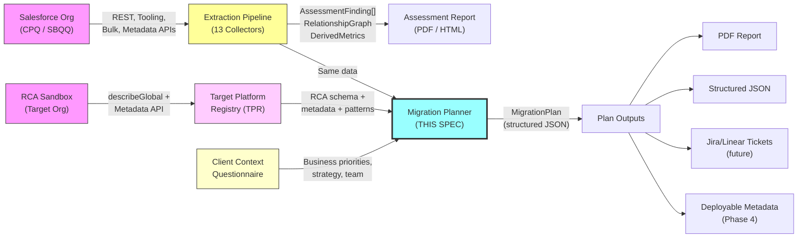

### Key Terminology

| Term              | Definition                                                                                     |
| ----------------- | ---------------------------------------------------------------------------------------------- |
| **CPQ**           | Salesforce CPQ (SBQQ managed package) — the source system being migrated from                  |
| **RCA**           | Revenue Cloud Advanced (also: Agentforce Revenue Management / ARM) — the target platform       |
| **SI**            | System Integrator — the consulting firm or team executing the migration                        |
| **Finding**       | A single extracted CPQ artifact (e.g., one price rule, one Apex class, one custom field)       |
| **IR**            | Intermediate Representation — platform-neutral canonical form of business logic                |
| **TPR**           | Target Platform Registry — verified RCA schema + metadata types + deployment rules             |
| **Disposition**   | The migration decision for an artifact: auto-translate, spec-stub, no-equivalent, retire, etc. |
| **Parity test**   | An executable test that verifies CPQ and RCA produce identical results for the same input      |
| **CML**           | Constraint Modeling Language — RCA's declarative product configuration language                |
| **Pricing triad** | Context Definitions + Decision Tables + Pricing Procedures — RCA's pricing architecture        |

### What the Extraction Pipeline Captures (the input)

The extraction pipeline runs 13 collectors organized in 3 tiers across 11 domains:

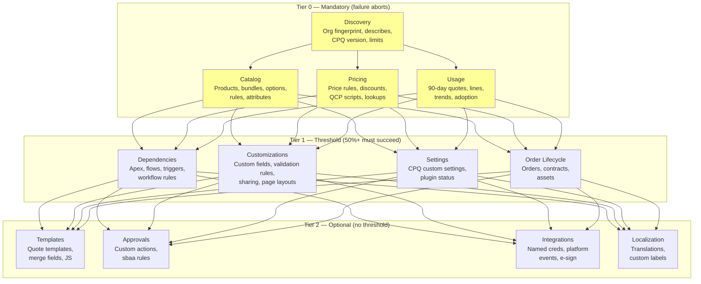

### Goals (V1)

| #   | Goal                                                                                        | Measurable Target                                                                  |
| --- | ------------------------------------------------------------------------------------------- | ---------------------------------------------------------------------------------- |
| G1  | **100% disposition coverage** — every extracted artifact has an explicit migration decision | 0 un-dispositioned artifacts per plan                                              |
| G2  | **Evidence-backed mappings** — every RCA target reference is validated against the TPR      | 0 unverified RCA object/field references                                           |
| G3  | **Confidence transparency** — every plan item states its confidence level and source        | 100% of items have confidence + source                                             |
| G4  | **Usage-weighted prioritization** — high-usage items get priority and scrutiny              | Top-20 used features all in Phase 1                                                |
| G5  | **Executable work packages** — plan items are ready for Jira/Linear export                  | Every item has owner role, acceptance criteria, verification criterion             |
| G6  | **Parity test generation** — executable test cases from actual usage patterns               | CPQ-side parity scripts for top-20 configurations                                  |
| G7  | **Deterministic reproducibility** — same inputs produce same plan                           | `hash(Assessment + TPR + Patterns + ClientContext) -> deterministic plan skeleton` |

### Non-Goals (V1)

| #   | Non-Goal                                  | Rationale                                                                                                                                                                                                                                                                                                                                               | When      |
| --- | ----------------------------------------- | ------------------------------------------------------------------------------------------------------------------------------------------------------------------------------------------------------------------------------------------------------------------------------------------------------------------------------------------------------- | --------- |
| NG1 | Fully deployable RCA metadata             | Requires deep RCA API testing. Plan only in V1.                                                                                                                                                                                                                                                                                                         | Phase 4   |
| NG2 | Automated migration execution             | Deployment to target org is out of scope                                                                                                                                                                                                                                                                                                                | Phase 4+  |
| NG3 | RCA-side parity test scripts              | Requires TPR + RCA API knowledge for test generation                                                                                                                                                                                                                                                                                                    | Phase 2-3 |
| NG4 | Multi-target support (non-RCA targets)    | Architecture supports it, but only RCA target in V1                                                                                                                                                                                                                                                                                                     | V2        |
| NG5 | Real-time plan updates as CPQ org changes | Re-assessment + re-plan is the mechanism, not streaming                                                                                                                                                                                                                                                                                                 | V3        |
| NG6 | **Data migration plan generation**        | Historical quotes, in-flight deals, contract chains, asset continuity — this is 40-60% of actual migration effort but requires deep org-specific analysis. V1 plan **flags data migration scope** (volumes, open quotes, active subscriptions from assessment) but does not generate ETL scripts, data mapping specs, or migration window calculations. | V2        |
| NG7 | **Coexistence architecture generation**   | Bridge objects, dual-write patterns, system-of-record during parallel run, integration routing during transition. V1 plan flags coexistence requirements based on ClientContext but does not generate coexistence specs.                                                                                                                                | V2        |

> **Audit note:** `DataMigrationStrategy` and `CoexistencePlan` appeared in the V1 output schema but no pipeline stage produced them. They are removed from the V2 schema and replaced with `dataMigrationFlags` and `coexistenceFlags` — structured inventories of what the SI must address, not automated plans.

### Competitive Context

| Competitor                | Offering                                                                                       | Our Advantage                                                                                                                   |
| ------------------------- | ---------------------------------------------------------------------------------------------- | ------------------------------------------------------------------------------------------------------------------------------- |
| **ideaHelix**             | "Advanced automation tools" that "swiftly migrate catalog and customer data" + free assessment | Deeper extraction (13 collectors vs. basic catalog/data), usage-weighted intelligence, relationship graph, custom code analysis |
| **Plative**               | Migration assistant for CPQ->RCA                                                               | We combine extraction + planning (they do one or the other)                                                                     |
| **SI manual engagements** | Deep expertise, $50K-$200K, 4-8 weeks for planning alone                                       | We produce the plan in minutes, not weeks. SI reviews instead of creates.                                                       |

**Our differentiation is depth of analysis (13 collectors + relationship graph + usage data) combined with automated plan generation.** Nobody else is doing the full loop from extraction to executable plan with dispositions, parity tests, and confidence scoring.

**But the window won't stay open forever.** Execute Phase 0 fast.

---

## 2. Domain Model

### What Is a CPQ -> RCA Migration, Really?

A CPQ-to-RCA migration is not a data copy. It involves three fundamental paradigm shifts that the planner must understand and communicate.

**Shift 1: Pricing — Sequential Rules -> Stacked Declarative Elements**

CPQ pricing: Price Rules fire sequentially based on evaluation order. A QCP script can override anything. Logic is scattered across rules, conditions, actions, and custom code.

RCA pricing: **Context Definitions** define the data flow. **Decision Tables** encode the business rules (criteria rows and columns). **Pricing Recipes** manage the decision tables. **Pricing Procedures** stack **Pricing Elements** in logical order (List Price -> Volume Discount -> Net Price). Each element calls a decision table. The procedure is linked to a Context Definition for data flow. Then simulate and activate.

This is not "Price Rule -> Pricing Procedure Step." It's:

```
CPQ: Price Rule + Conditions + Actions + Evaluation Order + QCP
  |
RCA: Context Definition + Decision Table(s) + Pricing Recipe +
     Pricing Element(s) + Pricing Procedure
```

**Shift 2: Configuration — Sequential Rules -> Constraint-Based Logic**

CPQ: Product Rules (selection, validation, alert, filter) fire in sequence. Each rule says "IF condition THEN action."

RCA: The **Advanced Configurator** uses **CML (Constraint Modeling Language)** — a declarative constraint-based model. Instead of telling the system how to configure step-by-step, you describe the valid end state, and the engine finds valid configurations automatically. CML supports object-oriented modeling with types, subtypes, relations, and rich data types.

This is **not** a translation — it's a reconceptualization. CPQ's fragile rule chains become constraint declarations. The mental model shifts from "do this, then check that" to "these relationships must remain true."

**Shift 3: Product Catalog — Flat Fields -> Attribute-Centric Model**

CPQ: Configuration Attributes are "basically fields duct-taped to quote lines." Product2 uses standard fields + custom fields.

RCA: **Product Attributes** are reusable building blocks — centrally defined, assignable across products, organized in categories. Expanded from 15 to 200 per product. Attributes drive configuration, pricing, rules, and orchestration.

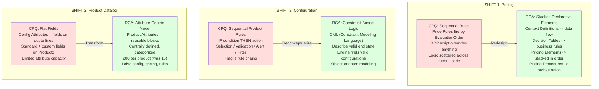

### The RCA Pricing Triad

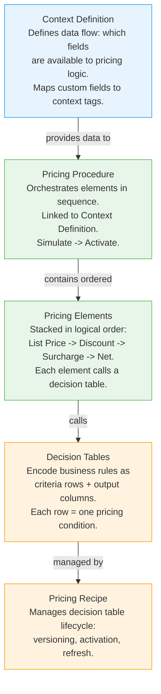

**Key implication:** A single CPQ Price Rule does NOT map to a single RCA object. It maps to:

- A Context Definition entry (for data flow)
- Decision Table rows (for conditions/actions)
- A Pricing Element (for evaluation order)
- Membership in a Pricing Procedure (for orchestration)

### The Artifact Disposition Model

Every finding must end up in exactly one of these buckets:

| Disposition                 | Meaning                                                                                                                                          | Automation Depth                                 | Example                                                                                             |
| --------------------------- | ------------------------------------------------------------------------------------------------------------------------------------------------ | ------------------------------------------------ | --------------------------------------------------------------------------------------------------- |
| **AUTO-TRANSLATE**          | Deterministic pattern match. High confidence. Structured RCA spec generated.                                                                     | Full — generates deployable spec                 | Simple discount price rule -> Decision Table + Pricing Element                                      |
| **AUTO-TRANSLATE + REVIEW** | Pattern match with medium confidence. Spec generated but flagged for validation.                                                                 | Full spec, needs human sign-off                  | Multi-condition price rule -> DT with complex criteria                                              |
| **SPEC-STUB**               | Can't fully translate, but generates a complete work package: what it does, what it touches, candidate RCA patterns, explicit questions for SME. | Analysis complete, implementation manual         | Complex QCP function -> intent summary + RCA hook candidates + acceptance tests                     |
| **NO-EQUIVALENT**           | CPQ feature has no RCA equivalent. Includes workaround pattern list.                                                                             | Full gap analysis                                | Feature X -> "No RCA equivalent. Workaround options: [A, B, C]"                                     |
| **RETIRE**                  | Dormant artifact. Zero usage in 90 days. Recommended for decommission. Must cite usage evidence and require owner approval.                      | Full — generates cleanup recommendation          | Price rule with `usageLevel: 'dormant'` -> "Recommend retire. Last triggered: never in 90d window." |
| **CLIENT-INPUT-REQUIRED**   | Cannot be determined without business context. Structured question generated.                                                                    | Partial — question is automated, answer is human | "Which of these 3 approval chains is business-critical?"                                            |

**The deterministic validator enforces: no artifact left un-dispositioned, no phase holes, no "RETIRE" without usage evidence.**

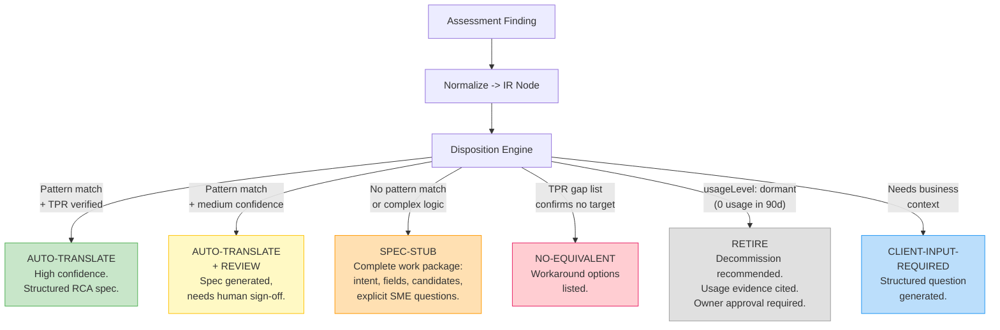

### Disposition Rules

| Input Condition                                                                             | Disposition             |
| ------------------------------------------------------------------------------------------- | ----------------------- |
| IR node matches a known pattern in PatternLibrary AND target exists in TPR                  | AUTO-TRANSLATE          |
| IR node matches pattern but with medium confidence (formula actions, cross-scope)           | AUTO-TRANSLATE + REVIEW |
| IR node has no pattern match but has a TPR target concept                                   | SPEC-STUB               |
| IR node's CPQ concept is in TPR's explicit gap list                                         | NO-EQUIVALENT           |
| Finding has `usageLevel: 'dormant'` AND `migrationRelevance !== 'must-migrate'`             | RETIRE                  |
| Disposition depends on business priority, timeline, or strategy choice not in ClientContext | CLIENT-INPUT-REQUIRED   |

### CPQ -> RCA Migration Map

| CPQ Concept                                                        | RCA Equivalent                                                                       | Migration Type         | Paradigm Shift                                      |
| ------------------------------------------------------------------ | ------------------------------------------------------------------------------------ | ---------------------- | --------------------------------------------------- |
| `SBQQ__PriceRule__c` + Conditions + Actions                        | Context Definition + Decision Table + Pricing Element + Pricing Procedure            | **Redesign**           | Yes                                                 |
| QCP (Quote Calculator Plugin — JS/Apex)                            | Pricing Procedure (declarative) or custom Apex                                       | **Redesign**           | Yes                                                 |
| `SBQQ__ProductRule__c` (selection/validation/alert/filter)         | CML constraint model via Advanced Configurator                                       | **Redesign**           | Yes                                                 |
| `SBQQ__ProductOption__c` (bundle options)                          | ProductComposition + ProductCompositionItem                                          | **Transform**          | Partial                                             |
| `SBQQ__ConfigurationAttribute__c`                                  | Product Attributes (centrally defined, reusable)                                     | **Transform**          | Partial                                             |
| `SBQQ__DiscountSchedule__c`                                        | PriceAdjustmentSchedule                                                              | **Transform**          | No                                                  |
| `SBQQ__QuoteTemplate__c`                                           | OmniStudio Document Generation                                                       | **Redesign**           | Yes                                                 |
| `sbaa__ApprovalRule__c`                                            | Built-in Approval or Flow orchestration                                              | **Transform/Redesign** | Depends                                             |
| Custom fields on SBQQ objects                                      | Custom fields on RCA objects + Context Definition mappings                           | **Transform**          | Partial                                             |
| Apex referencing SBQQ objects                                      | Apex referencing RCA objects                                                         | **Redesign**           | Yes                                                 |
| SBQQ Custom Settings                                               | RCA Configuration or Custom Metadata                                                 | **Transform**          | No                                                  |
| `SBQQ__Subscription__c` + amendments + renewals                    | Order Products -> Assets -> Lifecycle Management (amend/renew/cancel)                | **Redesign**           | Yes — different proration, effectivity, delta model |
| MDQ / time-segmented pricing                                       | Product Selling Model + time-phased Decision Tables                                  | **Redesign**           | Yes — different segment handling                    |
| Block Pricing (`SBQQ__BlockPrice__c`)                              | Volume-tiered Decision Table structures                                              | **Transform**          | Partial                                             |
| `SBQQ__SummaryVariable__c`                                         | Aggregate Pricing Element, Flow-computed field, or Rollup Summary                    | **Redesign**           | Yes — no direct equivalent                          |
| `sbaa__ApprovalRule__c` (parallel tracks)                          | Flow Orchestration (not standard Approval Process)                                   | **Redesign**           | Yes — parallel approval != sequential               |
| `sbaa__ApprovalRule__c` (sequential)                               | Flow-based approval or standard Approval Process                                     | **Transform**          | Partial                                             |
| Guided Selling (`SBQQ__GuidedSellingProcess__c`)                   | No direct equivalent. Rebuild as custom LWC, Flow Screen, or OmniStudio interaction. | **NO-EQUIVALENT**      | Yes                                                 |
| Twin field synchronization (Quote Line <-> Subscription <-> Asset) | No equivalent mechanism. Must rebuild data flow in RCA asset-to-order engine.        | **Redesign**           | Yes — invisible in field analysis                   |

**Caveat:** These mappings are conceptual. Validation against a real RCA sandbox is required before they can be treated as authoritative. RCA evolves with each Salesforce release.

### "Transform and Modernize" vs. "Lift and Shift"

The most successful CPQ->RCA migrations are not "lift-and-shift" projects. They are "transform-and-modernize" projects. RCA isn't CPQ 2.0 — even experienced migrators recommend refactoring over mechanical translation.

**The planner must present this as an explicit strategy choice**, not an assumption:

| Strategy                    | Implication                                                                                                | When to Use                                                             |
| --------------------------- | ---------------------------------------------------------------------------------------------------------- | ----------------------------------------------------------------------- |
| **Lift and Shift**          | Maximum fidelity to CPQ behavior. More redesign items but familiar outcomes.                               | Regulatory environments, tight timelines, risk-averse orgs              |
| **Transform and Modernize** | Redesign workflows for RCA strengths. Fewer total items (drop legacy workarounds). More powerful outcomes. | Orgs with known CPQ pain points, longer timelines, strong RCA expertise |
| **Hybrid**                  | Lift-and-shift for critical workflows, modernize for pain points                                           | Most orgs — the planner helps identify which workflows go where         |

This choice cascades through the entire plan. The `ClientContext` questionnaire captures the client's preference and the disposition engine adjusts accordingly.

### Zombie Cleanup — Reducing Scope Before Migration

Most legacy CPQ instances are cluttered with "Ghost Products" and "Zombie Rules." Our assessment already has the usage data to identify them.

- Every artifact with `usageLevel: 'dormant'` (zero usage in 90 days) gets a `RETIRE` disposition
- Group retired artifacts into a "Zombie Cleanup" work package
- Estimate scope reduction (typical: 20-40% of artifacts in mature orgs)
- Generate decommission checklist requiring owner approval

### Translation Boundaries

Explicit rules for what's eligible for AUTO-TRANSLATE vs. what becomes a SPEC-STUB:

**AUTO-TRANSLATE eligible (pricing):**

- Line-scope adjustments only (condition and action on same quote line)
- No cross-line aggregation (no "sum of all lines" logic)
- No external lookups beyond a known set of standard fields
- No custom action types (only `set-discount-*`, `set-price`, `set-field`)
- Conditions use only standard operators (no formula conditions)

**Automatic SPEC-STUB (pricing):**

- Cross-scope actions (quote-level condition, line-level action)
- Non-linear evaluation dependencies (rule reads output of another rule)
- Formula-based conditions or actions
- Summary variable references
- QCP interaction

### CML Semantic Preservation Policy

Because CML is a paradigm shift, the plan must define what "success" means for product rule migration. Driven by `ClientContext.migrationStrategy`:

| Policy                     | Meaning                                                                                                                | When Applied                                   |
| -------------------------- | ---------------------------------------------------------------------------------------------------------------------- | ---------------------------------------------- |
| **Strict semantic parity** | Same valid configurations as CPQ. Every rule has a CML equivalent that accepts and rejects the same inputs.            | `migrationStrategy: 'lift-and-shift'`          |
| **Business-intent parity** | Same intended constraints. Allow small differences where CML's constraint model produces equivalent business outcomes. | `migrationStrategy: 'hybrid'` (default)        |
| **Modernized model**       | Simplify constraints based on usage data. Drop rules that protect against configurations nobody uses.                  | `migrationStrategy: 'transform-and-modernize'` |

### Missing Migration Domains (Must Inventory + Flag)

Even if we don't migrate these in V1, the plan must **inventory and flag** them. SIs hit these late and blame the tool.

**Permissions & Security Surface:**

| Area                                               | What to Inventory                               | Why It Matters                               |
| -------------------------------------------------- | ----------------------------------------------- | -------------------------------------------- |
| Profiles / Permission Sets / Permission Set Groups | Any that grant access to SBQQ objects or fields | Access model must be rebuilt for RCA objects |
| Field-Level Security                               | FLS settings on SBQQ fields that are migrated   | Must replicate on RCA equivalent fields      |
| Sharing Rules                                      | Any on SBQQ objects                             | New objects = new sharing rules needed       |
| Record Types                                       | On SBQQ objects                                 | May not map 1:1 to RCA objects               |

**UI & Experience Surface:**

| Area                                  | What to Inventory           | Why It Matters                                       |
| ------------------------------------- | --------------------------- | ---------------------------------------------------- |
| Page Layouts / Lightning Record Pages | Any referencing SBQQ fields | Will show blank fields or errors after migration     |
| Reports / Dashboards                  | Any querying SBQQ objects   | Will break when SBQQ objects are no longer populated |
| Email Templates / Alerts              | Any with SBQQ merge fields  | Notifications will contain blank values              |
| List Views                            | On SBQQ objects             | Users lose their filtered views                      |

**Integration Contract Migration:**

| For Each Integration | What the Plan Must Say                                                                        |
| -------------------- | --------------------------------------------------------------------------------------------- |
| **Payload changes**  | Which fields in the integration payload reference SBQQ objects? What are the new field names? |
| **Cutover strategy** | Dual-write? Translation layer? Freeze window? Sequential cutover?                             |
| **Auth changes**     | Integration user permission changes + credential rotation plan                                |
| **Testing**          | Integration-specific parity test: same input -> same output from external system              |

### Proposed Plan Structure

```
Migration Roadmap
+-- 1. Executive Brief
|   +-- Org profile summary (from assessment)
|   +-- Overall migration complexity rating (with justification)
|   +-- Strategy recommendation: Lift-and-Shift vs. Transform-and-Modernize
|   +-- Estimated total effort (range, not point estimate, with effortBasis)
|   +-- Scope reduction opportunity (zombie cleanup)
|   +-- Top 5 risks with mitigations
|
+-- 2. Migration Strategy
|   +-- Approach recommendation (why phased vs. big-bang for THIS org)
|   +-- Phase definitions (what moves in each phase, why)
|   +-- Parallel-run requirements (if applicable)
|   +-- Bridge strategy for historical data
|   +-- Rollback strategy per phase
|   +-- Go/no-go criteria per phase
|
+-- 3. Object Migration Map
|   +-- Per-object: CPQ source -> RCA target -> disposition -> effort
|   +-- Field-level mapping (every custom field, every formula)
|   +-- Context Definition requirements
|   +-- Dependencies
|   +-- Validation criteria
|
+-- 4. Pricing Migration Plan (the "Pricing Triad")
|   +-- Context Definitions, Decision Tables, Pricing Recipes
|   +-- Pricing Elements, Pricing Procedures
|   +-- QCP -> declarative pricing or custom Apex
|   +-- For each: original logic summary, IR representation, RCA spec, effort, risk
|
+-- 5. Configuration Migration Plan
|   +-- Product Rules -> CML constraint models
|   +-- Configuration Attributes -> Product Attributes
|   +-- Bundle structures -> Product Compositions
|
+-- 6. Custom Code Migration Plan
|   +-- Per Apex class, per trigger, per flow
|   +-- Integration impact
|
+-- 7. Template & Document Migration
+-- 8. Data Migration Plan (flags + bridge strategy)
+-- 9. Testing Strategy (parity test suite — killer feature)
+-- 10. Risk Register
+-- 11. Effort Breakdown (with effortBasis transparency)
+-- 12. Zombie Cleanup Recommendations
+-- Appendices (field mappings, QCP analysis, CML stubs, parity tests, settings mapping, disposition summary)
```

**Key properties:** Traceable, dispositioned, sequenced, confidence-scored, usage-weighted, testable, effort-transparent.

---

## 3. Architecture

### Option C+: Hybrid Compiler with IR

The planner uses a **compiler architecture** with an Intermediate Representation (IR) layer. This avoids the brittleness of direct CPQ->RCA translation and enables unit-testable, pattern-matchable, partially-compilable migration logic.

#### Why Direct Translation Is Brittle

Even with perfect RCA knowledge, **direct CPQ -> RCA translation will stay brittle** because CPQ logic is scattered and heterogeneous. A single business rule might be implemented across a price rule, a QCP function, an Apex trigger, and a validation rule. Translating each piece independently produces duplicated, inconsistent RCA artifacts.

#### The IR Solution

Insert a deterministic **Canonical Migration IR** between extraction and RCA output:

```
CPQ Extractors -> Normalizers -> IR -> Pattern Engine -> RCA Spec
                                    -> LLM Enrichment ->
```

The IR captures **business intent** in a platform-neutral form. Then you implement two separate, testable translators:

- **CPQ -> IR**: deterministic, unit-testable
- **IR -> RCA**: pattern-based deterministic where possible, LLM-assisted where not

This is how you turn "LLM magic" into "compiler with guardrails."

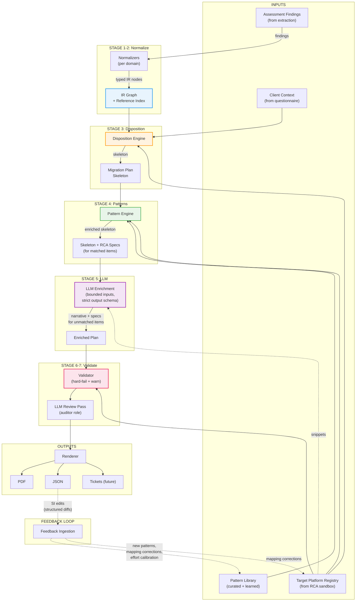

#### Why This Architecture

1. **IR layer decouples source from target.** CPQ->IR translators and IR->RCA translators are independently testable. If RCA changes, only the IR->RCA side needs updating.
2. **Deterministic stages first, LLM last.** The LLM is the fallback, not the default. Stages 1-4 and 6 are fully deterministic and reproducible.
3. **Partial compilation.** When full translation fails, the IR captures enough structure to generate a complete SPEC-STUB.
4. **Cross-artifact deduplication.** The IR graph reveals when a price rule, a QCP function, and an Apex trigger all implement the same business logic.
5. **Closed-loop learning.** SI feedback becomes new pattern rules and mapping corrections, shrinking the "needs review" surface over time.

### Pipeline Specification

#### Stage Contracts

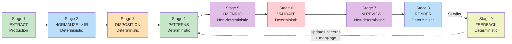

| Stage              | Input                               | Output                       | Deterministic          | Failure Mode                                        | Budget                |
| ------------------ | ----------------------------------- | ---------------------------- | ---------------------- | --------------------------------------------------- | --------------------- |
| **1. Extract**     | SF credentials + config             | `AssessmentFinding[]`        | Yes (same org state)   | Tier 0 fail = abort                                 | <15 min               |
| **2. Normalize**   | `AssessmentFinding[]`               | `IRGraph` + `ReferenceIndex` | **Yes**                | Warn on unrecognized types                          | <30 sec               |
| **3. Disposition** | `IRGraph` + `TPR` + `ClientContext` | `MigrationPlanSkeleton`      | **Yes**                | Hard-fail if TPR missing                            | <10 sec               |
| **4. Patterns**    | Skeleton + `PatternLibrary`         | Skeleton + RCA specs         | **Yes**                | Unmatched items keep skeleton                       | <10 sec               |
| **5. LLM Enrich**  | Unmatched items + TPR snippets      | Enriched plan                | No (pin model version) | Timeout -> keep skeleton, flag `enrichment-skipped` | 5-20 min (tier-based) |
| **6. Validate**    | Enriched plan + TPR                 | `ValidationReport`           | **Yes**                | Hard-fails block render                             | <5 sec                |
| **7. LLM Review**  | Complete plan                       | `ReviewReport`               | No                     | Failure -> skip, flag                               | <2 min                |
| **8. Render**      | Validated plan                      | PDF + JSON                   | **Yes**                | Retry once, then error                              | <30 sec               |
| **9. Feedback**    | Structured diffs                    | Updated patterns + mappings  | **Yes**                | Invalid diff -> reject                              | <5 sec                |

**Reproducibility invariant:** `PlanHash = f(AssessmentSnapshot, TPRVersion, PatternLibVersion, ClientContext, LLMModelVersion)`. Same inputs + same versions -> same deterministic skeleton. LLM outputs may vary but are version-pinned and flagged as non-deterministic.

**Idempotency invariant:** Re-running any deterministic stage with the same inputs produces the same output. No duplicate items, no accumulated state.

### Target Platform Registry (TPR)

#### Why Schema Alone Is Insufficient

RCA uses **configuration-as-metadata**. Pricing Procedures are deployable as `ExpressionSetDefinition` via Metadata API. Decision Tables are data objects that behave like metadata (with versioning and required post-deploy refresh). The TPR must capture schema, metadata types, AND deployment operations.

#### TPR Structure

```mermaid
graph TD
    TPR["Target Platform Registry"]
    TPR --> SO["SObject Schema Registry<br/>Every RCA object, all fields,<br/>types, relationships, licenses"]
    TPR --> MT["Metadata Type Registry<br/>ExpressionSetDefinition, etc.<br/>Deploy order, dependencies,<br/>post-deploy operations"]
    TPR --> CD["Config-Data Registry<br/>Objects that are data but<br/>behave like metadata:<br/>versioning, refresh, activation"]
    TPR --> OM["Object Mapping Table<br/>CPQ object -> RCA object(s)<br/>Cardinality: 1:1, 1:N, N:M<br/>Explicit gap list"]
    TPR --> FM["Field Mapping Table<br/>SBQQ field -> RCA field<br/>Transform type, data type changes<br/>Context Definition requirement"]
    TPR --> CB["Implementation Patterns<br/>(Cookbook)<br/>Pricing, config, bundle,<br/>approval, template, code"]
    TPR --> KL["Known Limitations<br/>No-equivalent features,<br/>performance limits,<br/>known bugs, roadmap"]
    TPR --> EB["Effort Benchmarks<br/>Per-pattern effort ranges,<br/>validated multipliers,<br/>common surprises"]
    TPR --> VT["Version Tracking<br/>TPR version, RCA API version,<br/>release tag, extraction date"]

    style TPR fill:#e8f4fd,stroke:#2196F3,stroke-width:2px
```

#### Bidirectional Mapping Registry

```typescript
interface MappingEntry {
  cpqObject: string; // 'SBQQ__PriceRule__c'
  rcaObjects: string[]; // ['PricingProcedure', 'PricingElement', 'DecisionTable']
  cardinality: '1:1' | '1:N' | 'N:1' | 'N:M';
  fieldMappings: FieldMapping[];
  verified: boolean; // extracted from real sandbox, not guessed
  verifiedDate: string;
  rcaApiVersion: string;
}

interface FieldMapping {
  cpq: string; // 'SBQQ__Active__c'
  rca: string; // 'Status'
  transform: 'direct' | 'boolean_to_picklist' | 'formula_rewrite' | 'custom';
  contextDefinitionRequired: boolean; // must map in Context Definition?
  verified: boolean;
}
```

#### Target Preflight

Before the planner runs, verify the target org can receive the migration:

| Check                          | Type                           | Action if Failed                                        |
| ------------------------------ | ------------------------------ | ------------------------------------------------------- |
| RCA/ARM features enabled       | **Hard blocker**               | Cannot proceed                                          |
| OmniStudio licensed            | **Hard blocker for templates** | Template items -> NO-EQUIVALENT                         |
| Advanced Configurator licensed | **Hard blocker for CML**       | Product rule items -> SPEC-STUB with manual alternative |
| Metadata API access            | **Hard blocker**               | Cannot validate TPR                                     |
| API limits acceptable          | **Warning**                    | Flag timeline risk                                      |

Output: `TargetPreflightReport` — included in plan metadata, influences dispositions.

#### TPR_LITE: Bootstrap Contingency

**Problem:** If sandbox access takes 8 weeks instead of 1, Phases 0-2 are blocked.

**Solution:** Define a minimum viable TPR that enables a useful (if degraded) plan:

| TPR_LITE Scope           | Content                                                                                                                                  | Source                                                              |
| ------------------------ | ---------------------------------------------------------------------------------------------------------------------------------------- | ------------------------------------------------------------------- |
| Object mappings (top 10) | Product2, PriceRule->PricingTriad, ProductRule->CML, DiscountSchedule, Quote, QuoteLine, ProductOption, Approval, Template, CustomScript | Salesforce documentation + LLM synthesis (marked `verified: false`) |
| Field mappings (top 15)  | Critical SBQQ fields with known RCA equivalents                                                                                          | Trailhead + community posts (marked `verified: false`)              |
| Gap list (known)         | Features confirmed as no-equivalent                                                                                                      | Salesforce known issues + community                                 |
| Pricing triad structure  | Object relationships only (no field-level detail)                                                                                        | Documentation                                                       |

**What TPR_LITE produces:** A "CPQ-side-only" plan where all artifacts are dispositioned (SPEC-STUB dominates), dependency ordering works, usage-weighted prioritization works, effort estimates are labeled `effortBasis: 'placeholder'`, and every RCA mapping is labeled `verified: false`.

**This plan is still valuable** — it's a structured inventory with priorities, dependencies, and risk flags. SIs can start scoping with it while TPR verification proceeds in parallel.

**Upgrade path:** As verified TPR entries arrive, re-run the planner. Items upgrade from SPEC-STUB -> AUTO-TRANSLATE. Mappings upgrade from `verified: false` -> `verified: true`. The plan improves incrementally without structural changes.

#### How to Build the TPR

| Approach                                            | Effort                     | Quality                                | Maintenance               |
| --------------------------------------------------- | -------------------------- | -------------------------------------- | ------------------------- |
| **A. Extract schema from RCA sandbox**              | 1-2 weeks                  | High for schema, low for patterns      | Re-extract per release    |
| **B. Extract metadata types via Metadata API**      | 1 week (addon to A)        | High — reveals deploy dependencies     | Same cadence as A         |
| **C. Interview 3-5 experienced CPQ->RCA migrators** | 2-4 weeks                  | Very high — battle-tested patterns     | Manual updates            |
| **D. Study Trailhead + build examples in sandbox**  | 2-3 weeks                  | Medium — correct but not battle-tested | Must re-study per release |
| **E. Partner with an SI**                           | 1-2 weeks (if cooperative) | Very high — pre-validated cookbook     | Depends on relationship   |
| **F. LLM-assisted research**                        | 1 week                     | Low-medium — high hallucination risk   | Unreliable                |

**Recommended: A + B + C.** Extract the schema and metadata types programmatically. Then interview migrators for the patterns and effort benchmarks.

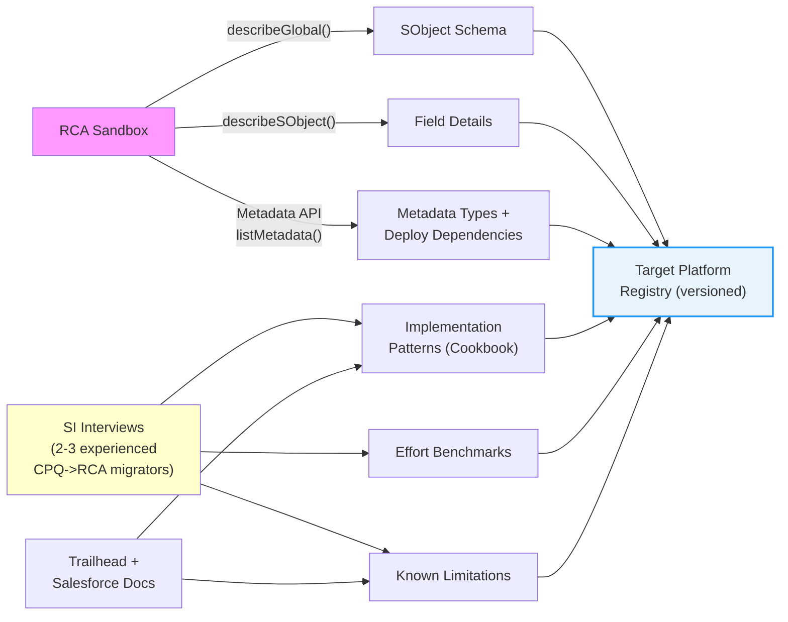

### Intermediate Representation (IR)

#### IR Node Types

```mermaid
graph TD
    IR3["IR Graph"]
    IR3 --> PRI["PricingRuleIR<br/>conditions, actions,<br/>evaluation order,<br/>block pricing, MDQ"]
    IR3 --> BSI["BundleStructureIR<br/>parent product, options,<br/>features, constraints"]
    IR3 --> CCI["ConfigConstraintIR<br/>selection/validation/<br/>alert/filter + intent"]
    IR3 --> SLI["SubscriptionLifecycleIR<br/>amendment, renewal,<br/>proration, co-term,<br/>twin fields, MDQ"]
    IR3 --> AI2["AutomationIR<br/>Apex classes + triggers<br/>(parsed via tree-sitter-apex)"]
    IR3 --> FLI["FlowIR<br/>trigger, conditions,<br/>DML targets, subflows"]
    IR3 --> VRI["ValidationRuleIR<br/>object, formula,<br/>error message"]
    IR3 --> SVI["SummaryVariableIR<br/>aggregation, filters,<br/>downstream consumers"]
    IR3 --> DTI["DocumentTemplateIR<br/>merge fields,<br/>conditional sections"]
    IR3 --> CCI2["CustomComputationIR<br/>(QCP) -- per function,<br/>AST-decomposed"]

    IR3 --> RI["ReferenceIndex<br/>(global, SQLite-backed)"]

    style IR3 fill:#e8f4fd,stroke:#2196F3,stroke-width:2px
    style SLI fill:#fff3e0,stroke:#FF9800,stroke-width:2px
    style RI fill:#fff3e0,stroke:#FF9800
```

#### Core IR Types

```typescript
// Every IR node carries provenance for explainability
interface EvidenceBlock {
  sourceArtifactIds: string[]; // which findings produced this node
  classificationReasons: string[]; // "Classified as X because [conditions]"
  cpqFieldsRead: FieldRefIR[]; // exact fields read
  cpqFieldsWritten: FieldRefIR[]; // exact fields written
  extractedFrom: string; // source location
}

// Pricing
interface PricingRuleIR {
  id: string;
  name: string;
  evidence: EvidenceBlock;
  sourceType: 'PriceRule' | 'QCPFunction' | 'DiscountSchedule' | 'ApexPricing';
  sourceArtifactIds: string[];
  conditions: PriceConditionIR[];
  conditionLogic: 'AND' | 'OR' | string;
  actions: PriceActionIR[];
  evaluationPhase: 'pre-calc' | 'on-calc' | 'post-calc';
  evaluationOrder: number;
  contextScope: 'quote' | 'line' | 'bundle' | 'option' | 'group';
  inputFields: FieldRefIR[];
  outputFields: FieldRefIR[];
  dependencies: string[]; // other IR node IDs
  recordTypeFilter?: string; // price rules often only apply to specific quote record types
  blockPricingTiers?: Array<{ min: number; max: number; price: number }>;
}

interface PriceConditionIR {
  type: 'field-compare' | 'formula' | 'lookup-result' | 'aggregate';
  field?: FieldRefIR;
  operator: 'eq' | 'neq' | 'gt' | 'gte' | 'lt' | 'lte' | 'in' | 'contains';
  value: string | number | boolean | string[];
  formula?: string;
}

interface PriceActionIR {
  type:
    | 'set-discount-pct'
    | 'set-discount-amt'
    | 'set-price'
    | 'set-unit-price'
    | 'set-field'
    | 'add-charge'
    | 'formula-result'
    | 'custom';
  targetField: FieldRefIR;
  value?: string | number;
  formula?: string;
  basisField?: FieldRefIR;
}

// Configuration constraints
interface ConfigConstraintIR {
  id: string;
  evidence: EvidenceBlock;
  type: 'selection' | 'validation' | 'alert' | 'filter';
  sourceRuleId: string;
  intent: string; // "Require at least 1 support option"
  conditions: PriceConditionIR[];
  actions: ConfigActionIR[];
}

// Bundle/Configuration
interface BundleStructureIR {
  id: string;
  parentProduct: string;
  options: BundleOptionIR[];
  features: BundleFeatureIR[];
  constraints: ConfigConstraintIR[];
}

// Subscription Lifecycle (50-80% of enterprise CPQ logic)
interface SubscriptionLifecycleIR {
  id: string;
  evidence: EvidenceBlock;
  lifecycleType: 'new' | 'amendment' | 'renewal' | 'cancellation' | 'upgrade';
  pricingModel: 'flat' | 'per-unit' | 'usage' | 'tiered' | 'block' | 'mdq' | 'custom';
  prorationLogic: {
    method: 'daily' | 'monthly' | 'none' | 'custom';
    roundingBehavior?: string;
    customApex?: string;
  };
  coTermination: boolean;
  autoRenewal: boolean;
  renewalPricingMethod: 'same' | 'uplift-percent' | 'reprice' | 'custom';
  amendmentBehavior: 'delta' | 'full-replacement';
  relatedPricingRules: string[];
  relatedAutomations: string[];
  contractFields: FieldRefIR[];
  twinFieldPairs: Array<{
    sourceObject: string;
    sourceField: string;
    targetObject: string;
    targetField: string;
  }>;
  mdqSegments?: {
    segmentType: 'year' | 'month' | 'quarter' | 'custom';
    segmentCount: number;
    pricingVariation: boolean;
  };
}

// Automation
interface AutomationIR {
  id: string;
  sourceType: 'ApexClass' | 'ApexTrigger' | 'Flow' | 'WorkflowRule' | 'ValidationRule';
  sourceArtifactIds: string[];
  triggerObject: string;
  triggerEvents: ('insert' | 'update' | 'delete')[];
  sbqqFieldRefs: FieldRefIR[];
  businessPurpose?: string;
  complexity: ComplexityLevel;
  callGraph?: string[];
}

// Flow (distinct migration path from Apex)
interface FlowIR {
  id: string;
  evidence: EvidenceBlock;
  flowType: 'record-triggered' | 'screen' | 'scheduled' | 'autolaunched' | 'platform-event';
  triggerObject: string;
  entryConditions: PriceConditionIR[];
  sbqqFieldRefs: FieldRefIR[];
  dmlTargets: string[];
  subflowCalls: string[];
  isActive: boolean;
}

// Validation Rule
interface ValidationRuleIR {
  id: string;
  evidence: EvidenceBlock;
  targetObject: string;
  formula: FormulaIR;
  errorMessage: string;
  isActive: boolean;
}

// Summary Variable (cross-line aggregation — no direct RCA equivalent)
interface SummaryVariableIR {
  id: string;
  evidence: EvidenceBlock;
  targetObject: string;
  aggregateFunction: 'SUM' | 'COUNT' | 'MIN' | 'MAX' | 'AVG';
  aggregateField: FieldRefIR;
  filterCriteria: PriceConditionIR[];
  compositeField?: FieldRefIR;
  consumers: string[]; // IR node IDs of rules/QCP that read this variable
}

// Document/Template
interface DocumentTemplateIR {
  id: string;
  sourceArtifactIds: string[];
  mergeFields: FieldRefIR[];
  conditionalSections: string[];
  scriptBlocks: string[];
  outputFormat: 'pdf' | 'word' | 'html';
}

// Formula (parsed dependency list — critical for impact analysis)
interface FormulaIR {
  raw: string;
  referencedFields: FieldRefIR[];
  referencedObjects: string[];
  hasCrossObjectRef: boolean;
  complexity: 'simple' | 'moderate' | 'complex';
}

// SOQL query references
interface QueryIR {
  raw: string;
  fromObject: string;
  referencedFields: FieldRefIR[];
  referencedObjects: string[];
  isDynamic: boolean; // string-built query — can't statically analyze
  filters: PriceConditionIR[];
}

// Global reference index
interface ReferenceIndex {
  byObject: Record<string, string[]>; // object -> [artifact IDs referencing it]
  byField: Record<string, string[]>; // object.field -> [artifact IDs referencing it]
}

// Identity hash for stable node matching across re-assessments
// Do NOT rely on Salesforce IDs (change across sandbox refreshes)
type IRNodeIdentityHash = string; // hash(ArtifactType + DeveloperName + ParentName)

// Common
interface FieldRefIR {
  object: string; // e.g., 'SBQQ__QuoteLine__c'
  field: string; // e.g., 'SBQQ__NetPrice__c'
  isCustom: boolean;
  isCpqManaged: boolean; // SBQQ__ namespaced
}
```

#### Apex Parsing Strategy (Stage 2)

**Decision: tree-sitter-apex** (community grammar) for deterministic field reference extraction.

| Option                  | Pros                                                       | Cons                                         | Verdict               |
| ----------------------- | ---------------------------------------------------------- | -------------------------------------------- | --------------------- |
| Regex-based             | Fast to build                                              | Fragile, misses nested refs                  | Insufficient          |
| tree-sitter-apex        | Deterministic, good enough for field refs, runs in Node.js | Community grammar, may miss edge cases       | **Selected**          |
| Salesforce jorje parser | Most accurate                                              | Java-based, hard to integrate in Node.js     | Too heavy             |
| LLM-based               | Handles any syntax                                         | Adds LLM dependency to a deterministic stage | Violates architecture |

**Key constraint:** Stage 2 must remain fully deterministic. No LLM calls. Dynamic field references (`record.get('SBQQ__' + fieldName)`) are marked `isDynamic: true` and handled as SPEC-STUB.

#### Cycle Detection (Stage 2)

CPQ configurations can have circular references. The IR normalizer must detect and handle cycles:

1. After building the IR graph, run Tarjan's algorithm to find strongly connected components (SCCs)
2. Any SCC with >1 node is a cycle
3. Cyclic subgraphs are collapsed into a single composite IR node with `type: 'CyclicDependency'`, `disposition: 'SPEC-STUB'` (forced)
4. The composite node carries the union of all member nodes' field refs, conditions, and actions

#### QCP AST Decomposition (Stage 2)

Real-world QCP files can exceed 10,000 lines of nested JavaScript. The IR normalizer must decompose QCP before any LLM sees it:

1. **Parse** QCP source using a JS AST parser (Babel/Acorn)
2. **Extract** discrete functions into individual `CustomComputationIR` nodes
3. **Map** external variable dependencies between functions (call graph + shared state)
4. **Classify** each function independently
5. **LLM sees one function at a time** — never the full QCP file

Functions that can't be parsed get a single `CustomComputationIR` node with `disposition: 'SPEC-STUB'` and a raw source attachment.

#### What the IR Enables

| Capability                    | How the IR Provides It                                                                       |
| ----------------------------- | -------------------------------------------------------------------------------------------- |
| **Unit-testable translators** | CPQ->IR and IR->RCA tested independently on a corpus of orgs                                 |
| **Partial compilation**       | Even when full translation fails, IR captures enough for a complete SPEC-STUB                |
| **Cross-artifact dedup**      | IR graph reveals duplicated business logic across rules + code + triggers                    |
| **Impact analysis**           | ReferenceIndex answers "what breaks when SBQQ**Quote**c goes away?"                          |
| **Pattern matching**          | Patterns operate on typed IR nodes, not raw heterogeneous findings                           |
| **Formula/SOQL breakage**     | FormulaIR and QueryIR track every field reference for migration impact                       |
| **Cycle safety**              | Tarjan's SCC detection prevents infinite loops in downstream stages                          |
| **QCP scalability**           | AST decomposition keeps LLM context bounded regardless of QCP file size                      |
| **Subscription coverage**     | SubscriptionLifecycleIR captures the 50-80% of enterprise logic that pricing IR alone misses |
| **Typed automation**          | FlowIR and ValidationRuleIR distinguish "transform" migrations from "redesign"               |
| **Aggregation tracking**      | SummaryVariableIR maps cross-line aggregation with downstream consumers                      |
| **Stable re-assessment**      | Identity hashing enables artifact matching across sandbox refreshes                          |

#### IR Schema Versioning

- `irSchemaVersion: string` is stored in both the IR graph and the plan metadata
- New fields are always **optional with sensible defaults**
- Breaking changes require a major version bump and a migration script
- Golden-file regression tests include at least one plan per historical schema version

### Pattern Engine

#### Purpose

The pattern engine is the **highest-ROI module** in the pipeline. It handles the "boring 60%" deterministically, before the LLM ever runs. For each matched pattern, it emits a concrete, structured RCA specification — not prose.

#### Price Rule Patterns

| Pattern              | Detection Logic (on PricingRuleIR)               | RCA Output                                     | Disposition             |
| -------------------- | ------------------------------------------------ | ---------------------------------------------- | ----------------------- |
| Simple discount      | 1 condition, 1 action of type `set-discount-pct` | Decision Table (1 row) + Pricing Element       | AUTO-TRANSLATE          |
| Conditional discount | N conditions (AND/OR), 1 action `set-discount-*` | Decision Table (N rows) + Pricing Element      | AUTO-TRANSLATE          |
| Multi-action rule    | 1+ conditions, N actions                         | Multiple Pricing Elements in same group        | AUTO-TRANSLATE + REVIEW |
| Cross-object rule    | Different scope in conditions vs. actions        | Context Definition extension + Pricing Element | AUTO-TRANSLATE + REVIEW |
| Formula-based        | Action has `formula` populated                   | Formula element or custom Apex                 | SPEC-STUB               |
| QCP-dependent        | IR node depends on CustomComputationIR           | Requires QCP analysis first                    | SPEC-STUB               |

#### Configuration Patterns (CML)

| Pattern                 | Detection Logic (on ConfigConstraintIR)    | RCA Output                 | Disposition             |
| ----------------------- | ------------------------------------------ | -------------------------- | ----------------------- |
| Required option         | type=selection, min=1                      | CML cardinality constraint | AUTO-TRANSLATE          |
| Exclusive option        | type=validation, max=1                     | CML exclusion constraint   | AUTO-TRANSLATE          |
| Conditional visibility  | type=filter, condition on parent attribute | CML conditional constraint | AUTO-TRANSLATE + REVIEW |
| Cross-bundle dependency | References multiple bundle parents         | CML relation constraint    | SPEC-STUB               |
| Complex validation      | Formula-based condition                    | CML with custom logic      | SPEC-STUB               |

#### QCP Function-Level Patterns

| Pattern                | Detection Logic                | RCA Approach                | Disposition             |
| ---------------------- | ------------------------------ | --------------------------- | ----------------------- |
| Markup/margin          | Reads cost, applies percentage | Single Pricing Element      | AUTO-TRANSLATE + REVIEW |
| Tiered pricing         | Checks quantity ranges         | Decision Table              | AUTO-TRANSLATE + REVIEW |
| Family surcharge       | Conditional on product type    | Decision Table              | AUTO-TRANSLATE + REVIEW |
| Subscription proration | Date math on terms             | Check RCA native            | SPEC-STUB               |
| Cross-line aggregation | Sums across lines              | Aggregate element           | SPEC-STUB               |
| External callout       | HTTP callout                   | Custom Apex in pricing hook | SPEC-STUB               |
| Unrecognized           | No pattern match               | LLM analysis + human review | SPEC-STUB               |

#### Subscription Lifecycle Patterns

| Pattern                    | Detection Logic (on SubscriptionLifecycleIR)                             | RCA Approach                                        | Disposition                           |
| -------------------------- | ------------------------------------------------------------------------ | --------------------------------------------------- | ------------------------------------- |
| Simple auto-renewal        | `autoRenewal: true`, `renewalPricingMethod: 'same'`, no custom proration | RCA Lifecycle Management renewal action             | AUTO-TRANSLATE + REVIEW               |
| Renewal with uplift        | `renewalPricingMethod: 'uplift-percent'`, standard proration             | RCA renewal + price adjustment schedule             | AUTO-TRANSLATE + REVIEW               |
| Standard amendment         | `amendmentBehavior: 'delta'`, line-level add/remove, daily proration     | RCA amend action with proration config              | AUTO-TRANSLATE + REVIEW               |
| Co-terminated subscription | `coTermination: true`                                                    | RCA co-termination configuration                    | SPEC-STUB (verify RCA native support) |
| MDQ / time-segmented       | `mdqSegments` populated, different price per segment                     | Time-phased Decision Tables + Product Selling Model | SPEC-STUB                             |
| Custom proration Apex      | `prorationLogic.method: 'custom'`, custom Apex reference                 | Custom Apex in RCA lifecycle hook                   | SPEC-STUB                             |
| Full replacement amendment | `amendmentBehavior: 'full-replacement'`                                  | Requires redesign — RCA uses delta model            | SPEC-STUB                             |

#### Advanced Approval Patterns

| Pattern                   | Detection Logic                                            | RCA Approach                                       | Disposition             |
| ------------------------- | ---------------------------------------------------------- | -------------------------------------------------- | ----------------------- |
| Sequential approval chain | `sbaa__ApprovalRule__c` with single-track sequential steps | Flow-based approval process                        | AUTO-TRANSLATE + REVIEW |
| Parallel approval tracks  | `sbaa__ApprovalRule__c` with multiple concurrent tracks    | Flow Orchestration (NOT standard Approval Process) | SPEC-STUB               |
| Dynamic approver          | Approver determined by formula or related record lookup    | Flow with decision elements                        | SPEC-STUB               |

#### Pattern Conflict Resolution

An IR node may match multiple patterns. The determinism guarantee requires explicit resolution:

1. **Specificity score** — count the number of matching predicates. More predicates = more specific = wins.
2. **Disposition strictness** — if specificity ties, the stricter disposition wins: SPEC-STUB > AUTO-TRANSLATE+REVIEW > AUTO-TRANSLATE. Err toward caution.
3. **Pattern priority rank** — if both above tie, patterns have an explicit numeric priority. Core patterns outrank tenant patterns.

**Invariant:** For any IR node, exactly one pattern wins. The winning pattern's ID is recorded in the evidence block.

#### Pattern Governance (Feedback Loop Quality)

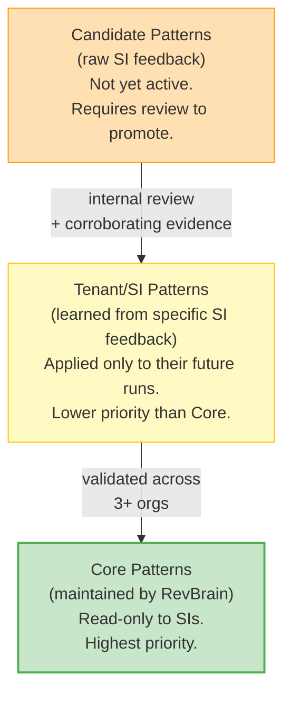

**Rules:**

- All SI-sourced patterns enter as `candidate` — never directly active
- Promotion to `tenant` requires manual engineering review
- Promotion to `core` requires validation across 3+ distinct orgs
- Conflicting feedback from different SIs creates separate tenant patterns
- Each pattern has a `confidence` score that starts low and increases with corroborating feedback

#### Pattern Output Format

For AUTO-TRANSLATE patterns, the engine emits structured JSON (not prose):

```json
{
  "disposition": "AUTO-TRANSLATE",
  "confidence": "high",
  "evidence": {
    "patternId": "pricing.conditional-discount",
    "matchedBecause": ["1 condition (field-compare)", "1 action (set-discount-pct)", "line scope"]
  },
  "rcaArtifacts": [
    {
      "type": "DecisionTable",
      "name": "Enterprise_Volume_Discount_DT",
      "columns": [
        { "name": "Product_Family", "type": "Input", "dataType": "Text" },
        { "name": "Min_Quantity", "type": "Input", "dataType": "Number" },
        { "name": "Discount_Pct", "type": "Output", "dataType": "Percent" }
      ],
      "rows": [{ "Product_Family": "Hardware", "Min_Quantity": 100, "Discount_Pct": 15 }]
    },
    {
      "type": "PricingElement",
      "name": "Enterprise_Volume_Discount",
      "elementType": "Discount",
      "decisionTable": "Enterprise_Volume_Discount_DT",
      "sortOrder": 2
    }
  ],
  "contextDefinitionRequirements": ["Product_Family must be mapped in Context Definition"],
  "testCase": {
    "input": "Quote with 100 units of Hardware product",
    "expected": "15% discount applied to line net price"
  }
}
```

### Validation & Plan Linting

#### Hard-Fail Checks (Block Rendering)

| #   | Check                                               | What It Catches                            |
| --- | --------------------------------------------------- | ------------------------------------------ |
| V1  | Every artifact has a disposition                    | Un-dispositioned item (coverage gap)       |
| V2  | No circular dependencies                            | Impossible execution order                 |
| V3  | No invalid target reference                         | RCA object/field not in TPR                |
| V4  | No orphan items                                     | Plan references artifact not in assessment |
| V5  | No RETIRE without usage evidence                    | Unjustified decommission                   |
| V6  | No must-migrate item with RETIRE                    | Critical item improperly skipped           |
| V7  | Effort totals consistent                            | Phase total != sum of items                |
| V8  | Every pricing IR field in a Context Definition item | Field won't be available to pricing logic  |
| V9  | Every item has owner role + acceptance criteria     | Not exportable to tickets                  |
| V10 | Target preflight hard blockers clear                | Cannot execute plan                        |

#### Warning Checks (Included in Plan)

| #   | Check                                                                              | What It Catches                                                |
| --- | ---------------------------------------------------------------------------------- | -------------------------------------------------------------- |
| W1  | Low confidence on high-usage item                                                  | Risk of incorrect migration for critical feature               |
| W2  | Effort range >5x spread                                                            | Unreliable estimate                                            |
| W3  | >40% SPEC-STUBs in pricing domain                                                  | Insufficient cookbook coverage                                 |
| W4  | Confidence distribution skewed high without evidence                               | Over-confidence                                                |
| W5  | Pattern coverage <50%                                                              | Cookbook needs expansion                                       |
| W6  | Missing post-deploy operations                                                     | Activation/refresh steps omitted                               |
| W7  | Undeclared ClientContext defaults used                                             | Silent assumptions                                             |
| W8  | High-risk item missing rollback note                                               | No recovery plan                                               |
| W9  | Report/dashboard references SBQQ but no UI Impact item                             | Silent breakage                                                |
| W10 | Integration item missing payload change docs                                       | Incomplete integration plan                                    |
| W11 | Custom code writes to twin-field-eligible SBQQ fields                              | Synchronization behavior will break silently in RCA            |
| W12 | Platform Event / CDC triggers exist on SBQQ objects                                | Downstream integrations will receive no events after migration |
| W13 | Generated Decision Table spec exceeds row/column limits                            | RCA has per-org Decision Table limits                          |
| W14 | Subscription lifecycle IR nodes >30% of total but no subscription patterns matched | Enterprise subscription logic under-covered                    |

### Client Context Intake

The client questionnaire converts ~50% of CLIENT-INPUT-REQUIRED items into automated decisions. Without it, ~20% of the plan is "ask the client" — with it, most becomes deterministic.

```typescript
interface ClientContext {
  // Strategy (cascades through entire plan)
  migrationStrategy: 'lift-and-shift' | 'transform-and-modernize' | 'hybrid';
  riskTolerance: 'conservative' | 'moderate' | 'aggressive';

  // Priorities (drive phase sequencing)
  criticalWorkflows: Array<{
    description: string;
    relatedProducts: string[];
    priority: 'must-have-day-1' | 'phase-2' | 'nice-to-have';
  }>;

  // Timeline (drive effort allocation)
  hardDeadlines: Array<{
    date: string;
    reason: 'fiscal-year' | 'contract-renewal' | 'regulatory' | 'other';
  }>;

  // Team (validate effort feasibility)
  team: {
    salesforceAdmins: number;
    developers: number;
    qaResources: number;
    availableHoursPerWeek: number;
  };

  // Pain points (influence redesign recommendations)
  painPoints: Array<{
    area:
      | 'quoting-speed'
      | 'approval-bottleneck'
      | 'pricing-accuracy'
      | 'template-quality'
      | 'integration-reliability'
      | 'other';
    severity: 'critical' | 'moderate' | 'minor';
    description?: string;
  }>;

  // Historical data
  historicalData: {
    openQuotesStrategy: 'migrate' | 'complete-before-cutover' | 'archive';
    historicalQuotesRetention: 'migrate-to-rca' | 'archive-read-only' | 'discard';
    activeSubscriptionsMustMigrate: boolean;
    bridgeStrategyAcceptable: boolean;
  };

  // Parallel run
  parallelRunRequired: boolean;
  parallelRunDuration?: string;
}
```

#### Cascading Effects

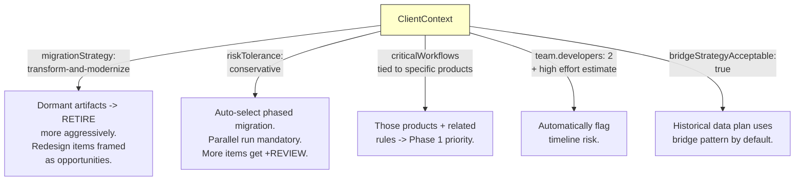

**Disposition override by ClientContext:** If `riskTolerance: 'conservative'`, any item that the pattern engine gives AUTO-TRANSLATE but with confidence < 0.9 is upgraded to AUTO-TRANSLATE+REVIEW. If `riskTolerance: 'aggressive'`, the threshold drops to 0.7.

### Output: Migration Plan Schema

```typescript
interface MigrationPlan {
  metadata: {
    assessmentId: string;
    orgId: string;
    generatedAt: string;
    planVersion: string;
    tprVersion: string;
    rcaApiVersion: string;
    overallComplexity: ComplexityLevel;
    estimatedEffortRange: { min: number; max: number; unit: 'hours' };
    strategy: 'lift-and-shift' | 'transform-and-modernize' | 'hybrid';
    confidenceDistribution: Record<ConfidenceLevel, number>;
    dispositionSummary: Record<Disposition, number>;
    patternMatchRate: number;
    zombieCleanupReduction: number;
  };

  executiveBrief: string; // LLM-generated
  strategyRationale: string; // LLM-generated
  phases: MigrationPhase[];
  items: MigrationItem[];
  risks: MigrationRisk[];
  parityTestSuite: ParityTestCase[];
  zombieCleanup: ZombieCleanupPlan;
  uiImpactAssessment: UIImpactItem[];

  // Scope flags (NOT full plans — see NG6, NG7)
  dataMigrationFlags: {
    openQuoteCount: number;
    historicalQuoteCount: number;
    activeSubscriptionCount: number;
    orderCount: number;
    contractCount: number;
    estimatedDataVolumeTier: 'small' | 'medium' | 'large' | 'enterprise';
    clientStrategy: string;
    siMustAddress: string[];
  };
  coexistenceFlags: {
    requiresParallelRun: boolean;
    bridgeStrategyAcceptable: boolean;
    licensingConcerns: string[];
    reportingSplitRisks: string[];
    twinFieldRisks: string[];
    siMustAddress: string[];
    deploymentGrouping: {
      metadataApi: string[];
      dataLoader: string[];
    };
  };
  validationResults: ValidationResult[];
  humanReviewRequired: string[];
}

interface MigrationItem {
  id: string;

  // Traceability
  sourceArtifactIds: string[];
  sourceDomain: AssessmentDomain;
  irNodeId: string;

  // Disposition
  disposition: Disposition;

  // What
  title: string;
  description: string;
  cpqSource: {
    objectType: string;
    artifactName: string;
    count: number;
    usageLevel: UsageLevel;
  };
  rcaTarget: {
    objectType: string;
    concept: string;
    implementationSpec?: string;
    mappingSource: 'pattern-engine' | 'curated-reference' | 'llm-generated' | 'unverified';
    contextDefinitionRequired: boolean;
    metadataType?: string;
    deployDependencies?: string[];
    postDeployOps?: string[];
  };

  // How hard
  migrationType: 'direct' | 'transform' | 'redesign' | 'no-equivalent' | 'skip';
  effort: { min: number; max: number; unit: 'hours' };
  effortBasis: 'benchmark' | 'heuristic' | 'placeholder';
  complexity: ComplexityLevel;
  confidence: ConfidenceLevel;

  // Dependencies
  dependsOn: string[];
  blockedBy: string[];

  // Ticket readiness
  ownerRole: 'admin' | 'developer' | 'qa' | 'ba' | 'architect';
  acceptanceCriteria: string;
  verificationCriteria: string;
  rollbackNote?: string;

  // Risk + testing
  risks: string[];
  migrationRelevance: MigrationRelevance;
  testScenarioIds: string[];
  parityTestIds: string[];

  // Review
  requiresHumanReview: boolean;
  reviewNotes?: string;

  // Lifecycle (designed for V4)
  status: 'planned' | 'in-progress' | 'completed' | 'blocked' | 'skipped';
  completedAt?: string;
  actualEffort?: number;
  reviewedBy?: string;
  reviewedAt?: string;
}
```

### Plan Item Granularity

**Grouping rules (reduce noise):**

| Rule                                      | Example                                                          |
| ----------------------------------------- | ---------------------------------------------------------------- |
| Group by pattern + target concept + scope | "1 item per Decision Table + Pricing Elements", not 1 per action |
| Batch low-risk field mappings             | "Field migration batch: QuoteLine custom fields (n=83)"          |
| Batch dormant artifacts                   | "Zombie cleanup: 47 dormant price rules"                         |
| Group AUTO-TRANSLATE by target object     | "Product Compositions: 76 bundle-capable products"               |

**Splitting rules (surface risk):**

| Rule                                                          | Rationale                     |
| ------------------------------------------------------------- | ----------------------------- |
| High-usage items (`usageLevel: 'high'`) are always individual | Must be reviewed individually |
| High-risk items are always individual                         | Risk needs focused attention  |
| Cross-domain dependency items are always individual           | Complex interactions          |
| Items requiring different reviewer roles are never batched    | Different expertise needed    |

**Target:** 80-150 items per typical plan.

### Parity Test Suite

Nobody else generates executable verification tests from actual usage data. SIs care about one thing above all: "how do we prove the migration worked?"

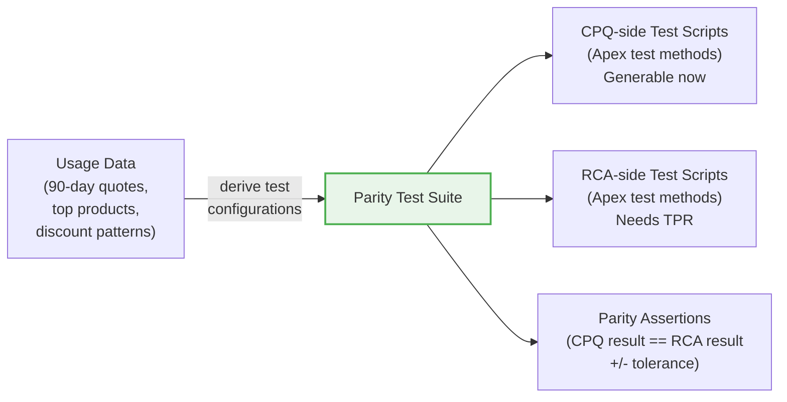

```typescript
interface ParityTestCase {
  id: string;
  name: string; // "Standard hardware bundle + volume discount"
  derivedFrom: string; // "Based on 47 similar quotes in 90d"
  quoteConfig: {
    products: Array<{ productId: string; name: string; quantity: number }>;
    pricebookId: string;
    accountType?: string;
    discountOverrides?: Array<{ lineIndex: number; discount: number }>;
  };
  expectedOutcomes: {
    lineNetAmounts: Array<{ productName: string; expected: number; tolerance: number }>;
    quoteTotal: { expected: number; tolerance: number };
    discountsApplied: string[];
  };
  cpqScript: string; // Apex test method
  rcaScript?: string; // Generated once TPR exists
  parityAssertion: string; // "CPQ NetAmount == RCA NetAmount +/- $0.01"
}
```

### Security & Privacy

#### LLM Data Handling

| Decision                     | Policy                                                                                                                                               |
| ---------------------------- | ---------------------------------------------------------------------------------------------------------------------------------------------------- |
| QCP/Apex source sent to LLM? | **Yes, with redaction.** Pre-processing strips tokens, credentials, API keys.                                                                        |
| Customer opt-out?            | **Yes -- "no code leaves tenant" mode.** LLM enrichment skipped for code items. SPEC-STUB with deterministic analysis only. Plan quality drops ~10%. |
| Data sent to LLM scope       | **Single tenant per call.** No cross-tenant context leakage.                                                                                         |

#### Credential Redaction

1. **Regex-based scanner** -- matches common patterns: API keys (`sk-`, `xox-`, `AKIA`), bearer tokens, Base64-encoded credentials, connection strings, `password=`, `secret=`, private keys (PEM headers)
2. **AST-based scanner** (for QCP/Apex) -- identifies string literals assigned to variables named `*token*`, `*secret*`, `*password*`, `*apiKey*`, `*credential*`
3. **Redaction** -- matched values replaced with `[REDACTED:type]` before LLM submission
4. **False-negative risk** -- acknowledged. Novel credential formats may evade detection. The "no code leaves tenant" opt-out is the backstop.

#### Data Retention

| Data                | Retention                                   | Deletion                                    |
| ------------------- | ------------------------------------------- | ------------------------------------------- |
| Assessment findings | 12 months (configurable)                    | Full tenant purge within 30 days on request |
| Migration plans     | Indefinitely (needed for diffing)           | Purgeable on request                        |
| Raw API responses   | Not stored. Processed in-memory, discarded. | N/A                                         |
| LLM call logs       | 90 days                                     | Auto-expired                                |

#### Tenant Isolation

| Concern              | Policy                                                                                   |
| -------------------- | ---------------------------------------------------------------------------------------- |
| Extraction           | Read-only integration user. Credentials encrypted at rest, AES-256.                      |
| Target org (Phase 4) | Separate credentials with write scopes. Never reuse extraction creds.                    |
| API scopes           | Minimum required: REST, Tooling, Metadata (read), Bulk for large orgs. All calls logged. |
| Transport            | All API calls over TLS 1.2+. No plaintext connections.                                   |

#### Compliance Posture

- **SOC 2 Type II:** Not yet achieved. Architecture is designed to be SOC 2 compatible. Certification is a business milestone, not a V1 blocker.
- **LLM provider DPA:** Requires a Data Processing Agreement with Anthropic. The "no code leaves tenant" opt-out ensures compliance even without DPA for code-sensitive customers.
- **GDPR/data residency:** Assessment data may contain PII (user names in adoption data, email addresses in approval chains). Redaction of PII before storage is a Phase 2 enhancement.

### Operational Constraints

#### Salesforce API Limits

| Concern                    | Mitigation                                                                                 |
| -------------------------- | ------------------------------------------------------------------------------------------ |
| REST/SOAP daily limits     | Batch queries. Cache describes. Track remaining calls. Abort gracefully if <100 remaining. |
| Tooling API limits         | Rate-limit Apex/metadata extraction. Priority queue: tier 0 collectors first.              |
| Metadata API retrieve size | Chunk large retrieves. Partial-failure: continue with warnings.                            |
| Concurrent requests        | Max 3 concurrent collectors (existing `pLimit(3)` pattern).                                |

#### Retry & Partial Failure

| Stage     | Retry Policy                                     | Partial Failure                                             |
| --------- | ------------------------------------------------ | ----------------------------------------------------------- |
| Extract   | 3 retries with exponential backoff per collector | Tier 1: continue if >=50% succeed. Tier 2: always continue. |
| LLM calls | 2 retries, 30s timeout                           | Keep skeleton disposition. Flag "enrichment failed."        |
| Render    | 1 retry                                          | Error -- cannot produce plan.                               |

#### Memory & State Management for Large Orgs

- **ReferenceIndex** uses SQLite (via `better-sqlite3` or DuckDB) rather than in-memory maps.
- **IR graph** is built as a streaming adjacency list. Nodes are processed in chunks.
- **Pattern matching** operates per-node. Memory is proportional to the largest single IR node, not the total graph.
- **Performance budget:** <2GB peak memory for enterprise-tier orgs (50K+ findings).

#### Effort Estimation Methodology

```
effort = baseEffort(pattern) * complexityMultiplier(irNode) * scopeMultiplier(clientContext)
```

| Factor                 | Source                                                            | Scale                                                              |
| ---------------------- | ----------------------------------------------------------------- | ------------------------------------------------------------------ |
| `baseEffort(pattern)`  | Per-pattern from TPR cookbook. Initially placeholder.             | Hours (range: min-max)                                             |
| `complexityMultiplier` | From IR node: condition count, formula presence, cross-scope refs | 0.8x (simple) to 3.0x (very complex)                               |
| `scopeMultiplier`      | From ClientContext: team size, risk tolerance, strategy           | 0.8x (aggressive + large team) to 1.5x (conservative + small team) |

**Role assumption:** All hours assume a mid-level Salesforce developer (3-5 years experience). **Calibration:** `MigrationItem.actualEffort` is compared against estimated effort via feedback loop. Target: <2x variance after 3 calibration cycles.

### Known Migration Gotchas

These are captured to ensure the planner flags them.

#### Pricing Behavior Differences

- **Rounding:** CPQ and RCA may round differently at intermediate steps. Parity tests must use tolerance ranges.
- **Currency:** Multi-currency orgs need conversion logic verified in both systems.
- **Evaluation ordering:** CPQ's `EvaluationOrder` and RCA's Pricing Element `SortOrder` may have different tie-breaking behavior.

#### Hidden Dependencies

- **Reports/dashboards** referencing SBQQ fields -> blank columns after migration (no error, just empty).
- **Email templates** with SBQQ merge fields -> blank values in sent emails.
- **Workflow rules/process builders** (legacy) on SBQQ objects -> often forgotten.
- **Scheduled Apex** referencing SBQQ objects -> may not show in 90-day usage.

#### Usage Data Blind Spots

- **90-day dormant doesn't mean unused annually.** Renewals, annual deals, and seasonal products may show zero activity in a 90-day window but be critical. RETIRE disposition must note: "90-day window only -- verify against annual cycle before decommission."
- **Batch Apex** running monthly/quarterly won't appear in 90-day usage data.

#### Code Analysis Limitations

- **Dynamic SOQL** can't be statically analyzed. Marked `isDynamic: true` -> always SPEC-STUB.
- **Dynamic field references** (e.g., `record.get('SBQQ__' + fieldName)`) evade the ReferenceIndex.
- **Managed package internals** -- SBQQ package code is opaque. Custom code depending on internal SBQQ behavior may have undocumented dependencies.

#### Twin Field Synchronization

CPQ's twin field mechanism silently synchronizes field values between Quote Line <-> Contract Line, Quote Line <-> Order Product, etc. This is **invisible** in standard field reference analysis.

**Why it matters:** Custom code that writes to a twin-field-eligible field on Quote Line and expects the value to appear on the corresponding Subscription or Asset will break silently after migration. RCA does not have the same twin field concept.

**Planner behavior:** The TPR maintains a list of known CPQ twin field pairs. The IR normalizer flags any custom code that writes to these fields. The validator emits W11 for each flagged reference.

#### Subscription & Amendment Logic

- **Amendment delta computation:** CPQ computes deltas automatically. RCA uses a different delta model via Lifecycle Management actions. QCP scripts that compute amendment math will need complete rewrites.
- **Renewal proration:** CPQ's `SBQQ__ProrationMultiplier__c` and `SBQQ__ProrationDayOfMonth__c` have no direct RCA equivalents.
- **Co-termination:** CPQ silently aligns subscription end dates. RCA co-termination requires explicit configuration.
- **MDQ segments:** CPQ creates segment records on quote lines. RCA handles time-phased pricing through Product Selling Models and time-variant Decision Tables -- a completely different model.

#### Operational Realities

- **Dual-run escalations:** Users comparing CPQ vs RCA outputs will escalate tiny differences. Plan should include a "known acceptable differences" document.
- **Licensing:** If SBQQ objects remain for history, CPQ licenses may need retention.
- **Training:** Users know CPQ, not RCA. Plan should include a user transition work package.
- **CPQ Summary Variables:** Translating Summary Variables that filter on related-list criteria into RCA Context Definitions or Rollup Summaries is notoriously tricky. All Summary Variable nodes get an explicit "translation complexity: high" flag.
- **Guided Selling:** `SBQQ__GuidedSellingProcess__c` has no RCA equivalent. Disposition: always NO-EQUIVALENT.
- **Platform Events / CDC on SBQQ objects:** Subscriptions become silent failures after migration.

### Hard Problems

#### The "Same Behavior" Problem -- Parity Tests

From the assessment's usage data, we know the top 20 quoted products, common discount patterns, and typical quote configurations. CPQ-side scripts are **generable today**. RCA-side scripts become generable once the TPR exists.

**Nobody else is generating executable verification tests from usage data.** This is the feature SIs will demo.

#### The "Cumulative Logic" Problem

CPQ pricing evaluation is sequential and cumulative. The IR captures this as a PricingRuleIR graph with evaluation order and dependencies. The pattern engine maps it to a Pricing Procedure with stacked Pricing Elements in the correct order. Cross-rule dependencies are flagged as high-risk items requiring review.

#### The "Data Migration Window" Problem -- Bridge Strategy

A proven industry pattern: keep active contracts in legacy CPQ. When a contract is up for renewal, use an automation script to "bridge" that data into an RCA Renewal Quote. The assessment already has the data to quantify this (open quotes, historical quotes, active subscriptions).

**The planner should recommend the bridge strategy as the default** and generate the specific bridge automation spec based on the org's subscription volume and renewal calendar.

---

## 4. LLM Enrichment

### Principles

1. **LLM is the fallback**, not the default. Runs only on items the pattern engine couldn't handle.
2. **Bounded inputs.** LLM sees one IR node (or small subgraph) + matched TPR snippets + output schema. Never the whole org.
3. **Strict output schema.** Every LLM call has a JSON schema for its response. Free-form prose is only for narrative sections.
4. **Failure is non-fatal.** If an LLM call times out or errors, the item keeps its skeleton disposition and is flagged as "enrichment failed."

### LLM Call Inventory

| Call                   | Purpose                            | Model       | Input                             | Requires TPR?             | Feasible Without TPR?  |
| ---------------------- | ---------------------------------- | ----------- | --------------------------------- | ------------------------- | ---------------------- |
| Strategy narrative     | Executive brief + rationale        | Opus/Sonnet | Metrics summary (~5K tokens)      | Partially                 | Yes (generic strategy) |
| Logic translation (xN) | RCA spec for unmatched rules       | Sonnet      | IR node + TPR snippet (~2K)       | **Yes**                   | No                     |
| QCP analysis           | Function-level migration spec      | Opus        | QCP source (~10K)                 | **Yes** (for RCA mapping) | CPQ-side only          |
| Code annotations (xM)  | Per-class migration approach       | Sonnet      | Class source + deps (~3K)         | **Yes** (for targets)     | CPQ-side only          |
| Test scenarios         | UAT from usage data                | Sonnet      | Usage summary (~3K)               | No                        | **Yes**                |
| Risk narratives        | Mitigation strategies              | Sonnet      | Risk list (~2K)                   | Partially                 | Partially              |
| CML suggestions        | Constraint model for product rules | Sonnet      | ConfigConstraintIR + CML examples | **Yes**                   | No                     |
| Review pass            | Audit complete plan                | Opus        | Full plan (~15K)                  | **Yes**                   | No                     |

**Estimated cost per plan:** 8-50 calls depending on org size, ~$0.50-$5.00 at current API pricing.

### LLM Scaling Strategy

**Batching:** Group related IR nodes (same domain, same parent object, similar pattern miss reasons) into batches of up to 5 nodes per call.

**Prioritization:**

1. `usageLevel: 'high'` + `migrationRelevance: 'must-migrate'` (critical items first)
2. Items in Phase 1 (per skeleton phasing)
3. Items with partial pattern matches (cheapest to enrich)
4. Everything else

**Graceful degradation:** Hard time budget per org size tier:

- Small (<500 findings): 5 minutes
- Medium (500-2000): 10 minutes
- Large (2000-5000): 15 minutes
- Enterprise (5000+): 20 minutes

When budget is exhausted, remaining items keep their skeleton disposition and are flagged as `enrichment-skipped`. The plan includes a "LLM Coverage" metric.

### Human Review Gates (Mandatory)

| Section                                   | Reviewer                  | Why                                          |
| ----------------------------------------- | ------------------------- | -------------------------------------------- |
| QCP migration spec                        | Senior developer          | Too complex for unsupervised LLM translation |
| CML constraint models                     | RCA configurator expert   | Paradigm shift -- must be validated          |
| Apex migration approach                   | Senior developer          | Architectural judgment required              |
| Phase strategy                            | Solution architect        | Business implications                        |
| Effort estimates                          | Project manager           | Inform contracts and budgets                 |
| RCA target mappings (until TPR validated) | RCA implementation expert | Unverified knowledge is dangerous            |

### Confidence Scoring

| Score              | Meaning                             | Source                                  |
| ------------------ | ----------------------------------- | --------------------------------------- |
| **High**           | Pattern-matched + TPR-verified      | AUTO-TRANSLATE with pattern engine      |
| **Medium**         | LLM-generated with structured input | AUTO-TRANSLATE+REVIEW or rich SPEC-STUB |
| **Low**            | LLM-generated, complex or ambiguous | SPEC-STUB for complex QCP, unusual Apex |
| **Requires Input** | Cannot be determined without client | CLIENT-INPUT-REQUIRED disposition       |

---

## 5. Open Questions & Missing Pieces

### What We Don't Have At All

This section is the most important reality check in the document. These are fatal gaps that must be closed before the planner can produce trustworthy output.

| Missing Piece                                 | Why It Matters                                                                                                                                                                                                                                                                                                                    | How Fatal                                                                                                        |
| --------------------------------------------- | --------------------------------------------------------------------------------------------------------------------------------------------------------------------------------------------------------------------------------------------------------------------------------------------------------------------------------- | ---------------------------------------------------------------------------------------------------------------- |
| **Target Platform Registry**                  | We don't know what fields exist on PricingProcedure, ProductComposition, PricingProcedureStep, etc. We can't map TO something we don't understand. Schema alone is insufficient -- we also need metadata types (e.g., Pricing Procedures are deployable as ExpressionSetDefinition via Metadata API) and deploy dependency rules. | **Fatal.** Without this, we cannot produce any migration spec.                                                   |
| **RCA pricing triad knowledge**               | RCA pricing is not "PricingProcedure + steps." It's **Context Definitions -> Pricing Recipes -> Decision Tables -> Pricing Procedures with stacked Pricing Elements.** We don't understand this layered architecture.                                                                                                             | **Fatal.** Our price rule mapping examples are wrong -- they assume a simpler model than what RCA actually uses. |
| **CML / Advanced Configurator understanding** | CPQ Product Rules don't "map" to RCA rules -- they must be **reconceptualized as constraints** in CML (Constraint Modeling Language). The Advanced Configurator replaces sequential rule chains with constraint-based logic. This is a paradigm shift, not a translation.                                                         | **Fatal for product rule migration.** Currently treated as simple "transform" in our heuristics.                 |
| **Context Definition mapping**                | Any custom field used in pricing or configuration needs to be mapped in a Context Definition. This means the assessment's custom field inventory must be cross-referenced against price rule conditions/actions.                                                                                                                  | **Fatal for field mapping.** Every custom field migration is currently "TBD."                                    |
| **Field-level transformation rules**          | We label fields as "transform" but have zero logic for what the transformation is. `SBQQ__SubscriptionPricing__c` -> what? We don't know.                                                                                                                                                                                         | **Fatal for field mapping.**                                                                                     |
| **RCA limitations and gaps**                  | Which CPQ features have NO RCA equivalent? We don't know, so we can't flag them. The plan would silently assume everything migrates.                                                                                                                                                                                              | **Dangerous.** Produces plans that promise what can't be delivered.                                              |
| **Real effort benchmarks**                    | Our effort numbers are invented. A "redesign" item could take 4 hours or 40 hours depending on the specifics.                                                                                                                                                                                                                     | **Undermines credibility.** SIs will spot fantasy numbers instantly.                                             |
| **Client business context**                   | What matters to the client? What workflows are critical? What's the timeline? What are they trying to fix?                                                                                                                                                                                                                        | **Cannot be extracted from Salesforce.** Must come from structured human input.                                  |

### Open Decisions

| #   | Decision                 | Options                                         | Recommendation                              | Blocks             |
| --- | ------------------------ | ----------------------------------------------- | ------------------------------------------- | ------------------ |
| 1   | **RCA sandbox access**   | Partner program / client sandbox / purchased DE | Partner program                             | Everything         |
| 2   | **IR scope for Phase 0** | Full IR for all domains / Pricing + Config only | Pricing + Config only (expand in Phase 1)   | IR normalizer work |
| 3   | **TPR maintenance**      | Manual per release / automated re-extract       | Automated via RCA Discovery module          | Long-term accuracy |
| 4   | **SI partnership**       | Build alone / partner with SI for cookbook      | Partner (accelerates Phase 0 + calibration) | Cookbook quality   |
| 5   | **Effort display**       | Wide ranges with basis tag / tight ranges       | Wide ranges + `effortBasis` tag             | Credibility        |
| 6   | **Phase 1 ship scope**   | Skeleton only / skeleton + CPQ parity tests     | Include CPQ parity tests (killer feature)   | Demo readiness     |
| 7   | **Naming**               | RCA / ARM / Revenue Cloud                       | RCA primary, track aliases                  | UI + docs          |
| 8   | **Pricing model**        | Per-plan / bundled with assessment              | Bundled (higher tier)                       | Sales motion       |

### Key Decision: RCA Sandbox Access

**The single most important action item: get an RCA sandbox.** Without it, weeks 1-3 can't start, and everything else is blocked. Options: Salesforce partner program, client sandbox, purchased developer edition.

### Planner Validation Strategy

How we test the planner itself:

| Tier                    | Description                                                                                                                                                   | Source                    | Purpose                               |
| ----------------------- | ------------------------------------------------------------------------------------------------------------------------------------------------------------- | ------------------------- | ------------------------------------- |
| **Synthetic (5 orgs)**  | Hand-crafted snapshots of varying complexity: minimal (50 findings), small (200), medium (800), large (3000), adversarial (cycles, dynamic SOQL, all-dormant) | Created by engineering    | Golden-file regression tests          |
| **Real-org (1-2 orgs)** | Anonymized assessment snapshots from actual CPQ orgs                                                                                                          | Customer consent required | Validated against an SI's manual plan |
| **Fuzz (automated)**    | Randomly generated findings with valid schema but adversarial content                                                                                         | Generated by test harness | Catches edge cases                    |

**Expert validation:** For each real-org test case, an SI reviews and scores coverage, accuracy, actionability, and trust on a 1-5 scale. Target: average >4.0 before Phase 2 ships.

---

## 6. Implementation Approach

### Delivery Roadmap

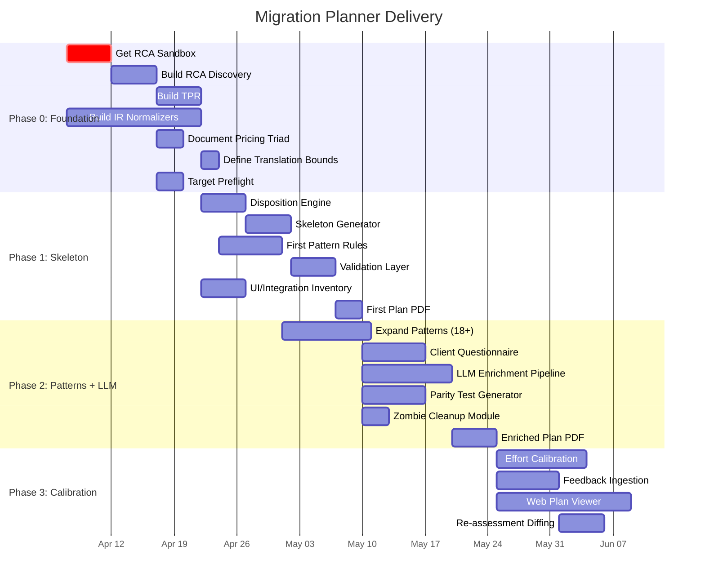

### Phase Milestones

| Phase                   | Weeks | Exit Criteria                                                                                                   | Quality                             |
| ----------------------- | ----- | --------------------------------------------------------------------------------------------------------------- | ----------------------------------- |
| **0: Foundation**       | 1-3   | TPR built + verified. IR normalizers pass unit tests. Target Preflight runs. Translation boundaries documented. | Plumbing only -- no plan output yet |
| **1: Skeleton**         | 4-6   | Every artifact dispositioned. Plan skeleton with phases + effort + deps. First PDF.                             | ~55% of consultant output           |
| **2: Patterns + LLM**   | 7-10  | Pattern engine covers >60% of items. LLM enrichment for edge cases. Parity tests for top-20 configs.            | ~72% of consultant output           |
| **3: Calibration**      | 11-14 | Effort calibrated against >=1 real migration. Feedback loop operational. Interactive plan viewer.               | ~78% of consultant output           |
| **4: Execution Bridge** | 15+   | Deployable metadata for catalog, pricing structures, field definitions.                                         | ~85% (selective deployables)        |

### Phase 4: Deployable Artifact Feasibility

| RCA Artifact                      | Generatable? | How?                                    |
| --------------------------------- | ------------ | --------------------------------------- |
| Product records (Product2)        | Yes          | Data Loader CSV or Apex script          |
| Product Selling Models            | Partially    | Map from SBQQ subscription fields       |
| Product Compositions (bundles)    | Yes          | From SBQQ**ProductOption**c hierarchy   |
| Product Attributes                | Partially    | From Configuration Attributes           |
| Price Adjustment Schedules        | Yes          | Direct data transform                   |
| Decision Tables (for price rules) | Yes          | From pattern engine output              |
| Pricing Elements                  | Yes          | From pattern engine output              |
| Pricing Procedures                | Partially    | Assemble elements into skeleton         |
| CML constraint models             | Hard         | LLM-assisted with human review          |
| Flows (approvals)                 | Partially    | From sbaa rule definitions              |
| OmniStudio templates              | No           | Gap analysis only                       |
| Custom field metadata XML         | Yes          | Generate CustomField XML                |
| Apex class stubs                  | Partially    | LLM refactors with SBQQ->RCA field refs |

**Estimated deployable automation: ~40-50% of total artifacts.**

### Engineering Decomposition -- Building Blocks

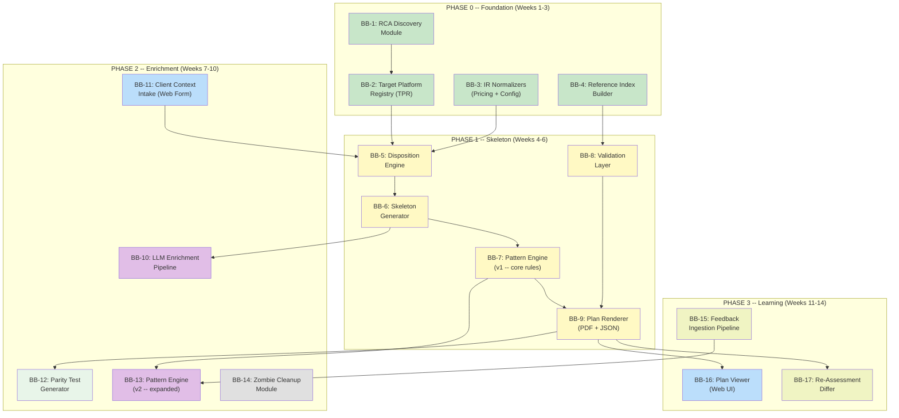

### Building Block Catalog

#### Phase 0 -- Foundation

| ID        | Building Block                                       | Description                                                                                                                                                                                                                       | Complexity    | Role                             | Est. Effort                | Dependencies                 | Acceptance Test                                                                              |
| --------- | ---------------------------------------------------- | --------------------------------------------------------------------------------------------------------------------------------------------------------------------------------------------------------------------------------- | ------------- | -------------------------------- | -------------------------- | ---------------------------- | -------------------------------------------------------------------------------------------- |
| **BB-1**  | **RCA Discovery Module**                             | Connect to RCA sandbox. Run `describeGlobal()`, `describeSObject()`, `listMetadata()`. Export structured JSON. Build Target Preflight checks.                                                                                     | Medium        | Backend Engineer (SF API)        | 1.5 weeks                  | RCA sandbox access           | `rca-schema.json` validates against live sandbox. Preflight correctly identifies enablement. |
| **BB-2**  | **Target Platform Registry**                         | Ingest BB-1 output + curated mapping tables + cookbook + known limitations + effort benchmarks. Versioned, queryable data store. Bidirectional mapping with `verified` flags.                                                     | High          | Backend Engineer + Domain Expert | 2 weeks + ongoing curation | BB-1 + SI interviews         | Given CPQ object, return verified RCA targets with field mappings, cardinality, deploy deps. |
| **BB-3**  | **IR Normalizers (Pricing + Config + Subscription)** | Transform findings into typed IR nodes. Parse conditions/actions into predicates. Apex field extraction via tree-sitter-apex. Tarjan's cycle detection. Identity hashes. **QCP AST decomposition deferred to BB-3b (Phase 1.5).** | **High**      | Senior Backend Engineer          | 3 weeks                    | Existing assessment findings | 5 synthetic orgs normalize to expected IR graphs. Cycles detected. Identity hashes stable.   |
| **BB-3b** | **QCP AST Decomposition**                            | Babel/Acorn AST parser for QCP JS. Per-function `CustomComputationIR` nodes. Call graph + shared state mapping. Graceful fallback for unparseable code.                                                                           | **Very High** | Senior Backend Engineer          | 2-3 weeks                  | BB-3                         | 10K-line QCP files decompose. Field refs extracted per function. Memory <2GB.                |
| **BB-4**  | **Reference Index Builder**                          | Global `ReferenceIndex` from IR graph + findings. Detect SBQQ refs in formulas, SOQL, Apex, flows, email templates, reports. SQLite-backed.                                                                                       | Medium        | Backend Engineer                 | 1 week                     | BB-3                         | Query "what references SBQQ**Quote**c?" returns all artifact IDs. Handles 50K+ findings.     |

#### Phase 1 -- Skeleton

| ID       | Building Block                 | Description                                                                                                                                                             | Complexity | Role                                    | Est. Effort | Dependencies                  | Acceptance Test                                                                            |
| -------- | ------------------------------ | ----------------------------------------------------------------------------------------------------------------------------------------------------------------------- | ---------- | --------------------------------------- | ----------- | ----------------------------- | ------------------------------------------------------------------------------------------ |
| **BB-5** | **Disposition Engine**         | Assign 6 dispositions based on TPR, patterns, usage, relevance, ClientContext. Translation boundary rules. ClientContext cascading effects.                             | **High**   | Senior Backend Engineer                 | 1.5 weeks   | BB-2, BB-3, BB-11 (stubbable) | 0 un-dispositioned items. Dispositions change correctly with ClientContext.                |
| **BB-6** | **Skeleton Generator**         | Topological sort, phase assignment, effort ranges, granularity rules (grouping + splitting). Owner roles, acceptance criteria, data migration flags, coexistence flags. | **High**   | Senior Backend Engineer                 | 1.5 weeks   | BB-5                          | 80-150 items for medium org. No circular deps. Effort totals consistent.                   |
| **BB-7** | **Pattern Engine v1**          | 8 patterns: 5 pricing + 3 configuration. Conflict resolution via specificity scoring. Structured JSON output.                                                           | **High**   | Senior Backend Engineer + Domain Expert | 2 weeks     | BB-2, BB-3                    | >=3 test cases per pattern. Deterministic winner for conflicts.                            |
| **BB-8** | **Validation Layer**           | All hard-fail checks (V1-V10) and warning checks (W1-W10). TPR validation. Context Definition coverage. Ticket hygiene.                                                 | Medium     | Backend Engineer                        | 1 week      | BB-2, BB-6                    | All 10 hard-fail checks trigger on planted violations. Zero false positives on clean data. |
| **BB-9** | **Plan Renderer (PDF + JSON)** | Validated plan -> HTML report with mermaid charts -> PDF. Structured JSON export. Reuse existing assessment report infrastructure.                                      | Medium     | Full-Stack Engineer                     | 1.5 weeks   | BB-6, BB-8                    | PDF renders correctly. JSON validates. Mermaid diagrams render.                            |

#### Phase 2 -- Enrichment

| ID        | Building Block              | Description                                                                                                                                                       | Complexity | Role                              | Est. Effort | Dependencies            | Acceptance Test                                                                                       |
| --------- | --------------------------- | ----------------------------------------------------------------------------------------------------------------------------------------------------------------- | ---------- | --------------------------------- | ----------- | ----------------------- | ----------------------------------------------------------------------------------------------------- |
| **BB-10** | **LLM Enrichment Pipeline** | Orchestrate LLM calls: batching, priority queue, time budget, graceful degradation. Strict output schemas. Credential redaction. "No code leaves tenant" opt-out. | **High**   | Senior Backend + AI/ML Engineer   | 2 weeks     | BB-2, BB-5              | Time budget respected. Opt-out works. Redaction catches planted credentials.                          |
| **BB-11** | **Client Context Intake**   | Web form capturing ClientContext schema. Product matching. Validation. Storage + versioning. Wired into disposition engine.                                       | Medium     | Full-Stack Engineer               | 1.5 weeks   | Assessment data         | Form submits valid ClientContext. Changing risk tolerance changes plan output.                        |
| **BB-12** | **Parity Test Generator**   | From usage data, generate ParityTestCase[] with quote configs + expected outcomes + CPQ-side Apex test scripts. Split tests to avoid CPU limits.                  | **High**   | Backend Engineer (Apex expertise) | 3 weeks     | Assessment data, BB-2   | Generated Apex compiles in sandbox. Test data factory creates valid records. No CPU limit violations. |
| **BB-13** | **Pattern Engine v2**       | Expand to 18+ patterns: +3 QCP, +2 CML, +2 approval, +2 automation, +1 template. Pattern governance with candidate/tenant/core tiers.                             | **High**   | Senior Backend + Domain Expert    | 2 weeks     | BB-7, SI interview data | 18+ patterns with >=3 test cases each. Governance enforced.                                           |
| **BB-14** | **Zombie Cleanup Module**   | Scan for dormant artifacts. Group by type. Scope reduction estimate. Decommission checklist with usage evidence.                                                  | Low        | Backend Engineer                  | 0.5 weeks   | BB-3                    | Correctly identifies dormant. Does NOT retire must-migrate items.                                     |

#### Phase 3 -- Learning

| ID        | Building Block                  | Description                                                                                                                                                                                             | Complexity | Role                    | Est. Effort | Dependencies              | Acceptance Test                                                                                                               |
| --------- | ------------------------------- | ------------------------------------------------------------------------------------------------------------------------------------------------------------------------------------------------------- | ---------- | ----------------------- | ----------- | ------------------------- | ----------------------------------------------------------------------------------------------------------------------------- |
| **BB-15** | **Feedback Ingestion Pipeline** | Accept structured diffs: disposition changes, mapping corrections, effort actuals, new patterns. Schema validation. Conflict detection. Audit trail.                                                    | Medium     | Backend Engineer        | 1.5 weeks   | BB-2, BB-7/13             | Valid diffs applied. Invalid rejected. Tenant isolation preserved.                                                            |
| **BB-16** | **Plan Viewer (Web UI)**        | Interactive view: phase navigation, item drill-down, disposition filtering, status updates, notes, team assignment, progress metrics. Export to Jira/Linear.                                            | **High**   | Full-Stack Engineer     | 3 weeks     | BB-9, existing client app | Plan loads and renders. Items status-updatable. Export works.                                                                 |
| **BB-17** | **Re-Assessment Differ**        | Three-way merge: old assessment + SI edits + new assessment. IR identity hashes for artifact matching (NOT Salesforce IDs). Merge conflict detection when SI overrides collide with assessment changes. | **High**   | Senior Backend Engineer | 2.5 weeks   | BB-3, BB-15               | New artifacts get fresh dispositions. Removed -> RETIRE. SI overrides preserved for unchanged items. Merge conflicts flagged. |

### Critical Path

```
BB-1 (Discovery) -> BB-2 (TPR) -> BB-5 (Dispositions) -> BB-6 (Skeleton) -> BB-8 (Validation) -> BB-9 (Renderer)
```

**Everything blocks on BB-1 (RCA Discovery) and BB-2 (TPR).** BB-3 (IR Normalizers) runs in parallel with BB-1 since it depends only on existing assessment data.

### Team Requirements

| Role                                         | Count | Key Skills                                   | Owns                                      |
| -------------------------------------------- | ----- | -------------------------------------------- | ----------------------------------------- |
| **Senior Backend Engineer** (compiler focus) | 1     | TypeScript, AST parsing, graph algorithms    | BB-3, BB-3b, BB-5, BB-6, BB-17            |
| **Backend Engineer** (Salesforce focus)      | 1     | TypeScript, Salesforce APIs, Apex            | BB-1, BB-4, BB-12                         |
| **Backend Engineer** (platform focus)        | 1     | TypeScript, pattern matching, rule engines   | BB-7, BB-8, BB-14, BB-15                  |
| **Full-Stack Engineer**                      | 1     | TypeScript, React, HTML->PDF                 | BB-9, BB-11, BB-16                        |
| **AI/ML Engineer**                           | 0.5   | Prompt engineering, LLM APIs                 | BB-10 (pairs with senior BE)              |
| **Domain Expert** (CPQ/RCA)                  | 0.5   | Deep CPQ migration experience, RCA knowledge | BB-2 curation, BB-7/13 pattern validation |

**Minimum viable team: 4 engineers + 1 domain expert (part-time).**

### Success Metrics

#### Coverage SLA (External)

| Metric                   | Target                                                            |
| ------------------------ | ----------------------------------------------------------------- |
| **Disposition coverage** | 100% -- 0 un-dispositioned artifacts                              |
| **Mapping coverage**     | >90% of findings with verified TPR target                         |
| **Plan completeness**    | Every must-migrate item has phase + effort + owner + verification |

#### Quality KPIs (Internal)

| Metric                   | Target                                             |
| ------------------------ | -------------------------------------------------- |
| **Pattern match rate**   | >60% handled by deterministic patterns             |
| **Review load**          | <50 items/org requiring human review               |
| **Defect rate**          | 0 hard-fails per generated plan                    |
| **Plan generation time** | <20 min (small/medium), <40 min (large/enterprise) |
| **SI satisfaction**      | >4/5 post-review survey                            |

#### Learning Metrics (Feedback Loop)

| Metric                          | Target                              |
| ------------------------------- | ----------------------------------- |
| **Pattern coverage growth**     | +5 patterns/quarter                 |
| **Effort calibration accuracy** | <2x variance (actual vs. estimated) |
| **Disposition change rate**     | <10% of items changed by SI         |

### Design Spec Template

Each building block gets its own design spec following this template:

```markdown
# BB-{N}: {Name} -- Design Spec

## 1. Purpose

One paragraph: what this component does and why it exists.

## 2. Interface Contract

Input/output schemas, determinism guarantee, failure modes, performance budget.

## 3. Algorithm / Logic

How it works, with pseudocode for non-trivial logic.

## 4. Data Model

New types, storage requirements, persistence strategy.

## 5. Dependencies

Other BBs consumed (with exact interface refs).

## 6. Edge Cases

Known tricky inputs and how they're handled.

## 7. Testing Plan

Unit tests, integration tests, golden-file tests.

## 8. Open Questions

Anything that needs resolution before implementation.
```

---

## 7. Audit Trail

This specification was developed through 7 review rounds with independent technical auditors.

| Round                     | Auditor                 | Key Additions                                                                                                                                                                                                                                                       |
| ------------------------- | ----------------------- | ------------------------------------------------------------------------------------------------------------------------------------------------------------------------------------------------------------------------------------------------------------------- |
| Brainstorm R1 (Auditor 1) | Senior architect        | IR/compiler layer, TPR concept, pricing triad, closed-loop feedback, pipeline stages, north star definition                                                                                                                                                         |
| Brainstorm R1 (Auditor 2) | Migration domain expert | CML blind spot, Context Definitions, transform-vs-modernize strategy, zombie cleanup, parity tests as killer feature, competitive landscape, deployable artifact feasibility                                                                                        |
| Brainstorm R2 (Auditor 1) | Follow-up               | Stage contracts, granularity rules, permissions/UI/integration domains, security/privacy, evidence blocks, formula/query IR, known gotchas, target preflight, translation boundaries                                                                                |
| Spec R1 (Auditor 1)       | Senior architect        | TPR_LITE bootstrap contingency, data migration/coexistence scoped to flags (not full plans), LLM scaling strategy, pattern conflict resolution, IR cycle detection, planner validation strategy, effort methodology                                                 |
| Spec R1 (Auditor 2)       | Migration domain expert | Pattern governance (multi-tier library), QCP AST decomposition, memory/state management (SQLite), parity test data setup, credential redaction, security hardening, Summary Variables gotcha, Decision Table limits                                                 |
| Spec R2 (Auditor 1)       | Senior architect        | SubscriptionLifecycleIR, FlowIR + ValidationRuleIR, SummaryVariableIR, Apex parsing strategy (tree-sitter-apex), Guided Selling as NO-EQUIVALENT, twin fields, mandatory cutover questions, merge-conflict rules, IR schema versioning, Platform Events/CDC warning |
| Spec R2 (Auditor 2)       | Migration domain expert | MDQ/Block Pricing in IR, amendment/renewal twin-field trap, Advanced Approvals parallel vs sequential, identity hashing, BB-3 timeline split (QCP AST -> BB-3b), BB-12 timeline adjustment, deployment grouping                                                     |

### Scorecard Evolution

| Dimension                   | Spec R1 (Auditor 1) | Spec R2 (Auditor 1)                    | Spec R2 (Auditor 2)   |
| --------------------------- | ------------------- | -------------------------------------- | --------------------- |
| Architectural soundness     | 9/10                | 9.5/10                                 | A+ (98/100)           |
| Completeness                | 7/10 -> 8/10        | 8/10 -> addressed                      | Strong                |
| Honesty / risk transparency | 10/10               | 10/10                                  | Commended             |
| Implementability            | 7/10 -> 9/10        | 9/10 (with timeline adjustments)       | Ready with BB-3 split |
| Domain expertise            | 9/10                | 8.5/10 -> addressed (subscription gap) | Deep, needs MDQ       |
| Security / compliance       | 5/10 -> 7.5/10      | 7.5/10                                 | Adequate for V1       |

**Final verdict (both auditors converge):** Spec is buildable and best-in-class. Critical path is clear. Subscription lifecycle was the last major domain gap -- now addressed. BB-3 timeline split is the key engineering risk mitigation. Proceed to sprint planning.

### Appendix: Assessment Finding Schema

```typescript
interface AssessmentFindingInput {
  domain:
    | 'catalog'
    | 'pricing'
    | 'templates'
    | 'approvals'
    | 'customization'
    | 'dependency'
    | 'integration'
    | 'usage'
    | 'order-lifecycle'
    | 'localization'
    | 'settings';
  collectorName: string;
  artifactType: string;
  artifactName: string;
  artifactId?: string;
  findingKey: string;
  sourceType: 'object' | 'metadata' | 'tooling' | 'bulk-usage' | 'inferred';
  sourceRef?: string;
  detected: boolean;
  countValue?: number;
  textValue?: string;
  usageLevel?: 'high' | 'medium' | 'low' | 'dormant';
  riskLevel?: 'critical' | 'high' | 'medium' | 'low' | 'info';
  complexityLevel?: 'very-high' | 'high' | 'medium' | 'low';
  migrationRelevance?: 'must-migrate' | 'should-migrate' | 'optional' | 'not-applicable';
  rcaTargetConcept?: string;
  rcaMappingComplexity?: 'direct' | 'transform' | 'redesign' | 'no-equivalent';
  evidenceRefs: EvidenceRef[];
  notes?: string;
  schemaVersion: '1.0';
}
```

### Appendix: Current System State

The current codebase has 23 object-level mappings and ~40 field-level mappings in the context blueprint. These are conceptual labels -- **not validated against a real RCA sandbox**. The effort multipliers (0.5h direct, 2h transform, 8h redesign, 16h no-equivalent) are placeholder formulas with no benchmark basis.

Pipeline architecture: 5 phases, 13 collectors, max concurrency 3. Tier 0 failure = abort. Tier 1 threshold = 50% success. Tier 2 = best-effort. Post-processing computes relationship graph (7 relationship types), derived metrics, and context blueprint.

---

_This document is deliberately harsh about where we stand. The gaps are real and the timelines assume focused execution. But the opportunity is also real: nobody else is combining deep CPQ extraction with structured RCA mapping, an IR compiler, deterministic pattern matching, and LLM reasoning. The assessment pipeline gives us a foundation that would take competitors months to replicate. The question is whether we can build the TPR and pattern engine fast enough to capitalize on it._
