# SI Partner Billing — Spec

> **Date:** 2026-04-28
> **Status:** v5 — FINAL (approved for implementation)
> **Scope:** Billing for SI partners only. End-client subscriptions and channel program are out of scope (see [BILLING-MODEL-BRAINSTORM.md](BILLING-MODEL-BRAINSTORM.md) for future direction).
> **Audience:** Engineering, product, finance, and external reviewers. This document is the source of truth for what we are building and why.

---

## 1. Context

### What is RevBrain?

RevBrain is a multi-tenant SaaS platform for migrating Salesforce CPQ (Configure-Price-Quote) to Revenue Cloud Advanced (RCA). It automates the extraction, normalization, segmentation, and disposition planning of CPQ configurations — work that is currently done manually by System Integrators (SIs) at high cost and high risk.

### Who is the customer?

The primary customer is the **System Integrator (SI)** — a professional services firm (e.g., Accenture, Deloitte, Slalom, boutique consultancies) that sells and executes Salesforce CPQ-to-RCA migrations for enterprise clients.

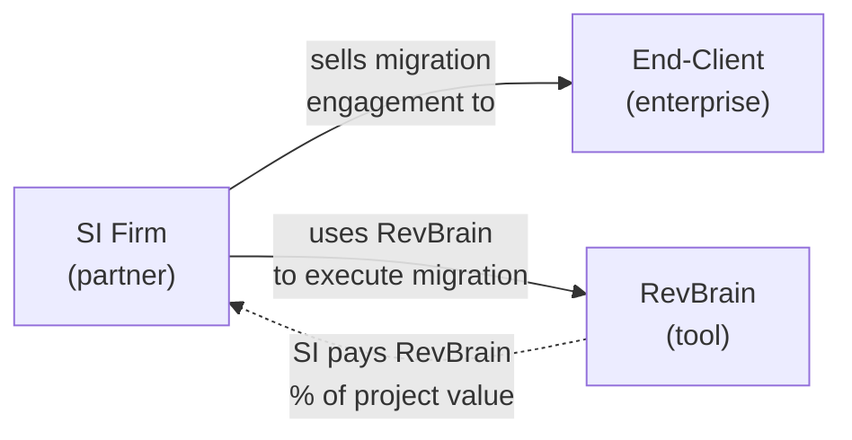

**Key relationships:**

- The SI owns the relationship with their end-client. RevBrain has no direct relationship with the end-client in this phase.
- RevBrain is a tool the SI uses, not a platform the end-client interacts with.
- RevBrain charges the SI per migration project — not monthly, not per-seat.

### The two-phase engagement reality

A CPQ-to-RCA migration is not a single engagement — it's two:

**Phase 1 — Assessment:** Before the SI's client has signed anything, the SI needs to evaluate the CPQ org's complexity to scope and price the migration. This currently takes **4 full-time employees 2–4 weeks** and produces a 40–100 page assessment report. The SI uses this report to build the SOW and price the migration for their end-client. RevBrain reduces this to days.

**Phase 2 — Migration:** After the end-client signs the SOW, the SI returns to execute the actual migration using RevBrain's full toolset (segmentation, disposition, planning, validation).

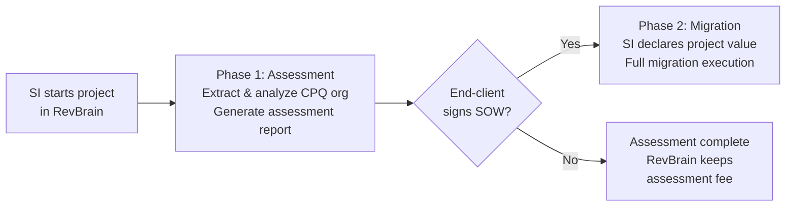

This two-phase reality shapes the entire billing model: RevBrain charges a **flat assessment fee** upfront (the SI needs the tool before any SOW exists), and a **percentage-based migration fee** once the project value is known. The assessment fee credits against the migration fee if the SI proceeds.

### Why percentage-based pricing (for migration)?

RevBrain's migration value is proportional to project size: a $5M migration with 2,000 pricing rules, 50 product bundles, and complex approval chains benefits far more from automation than a $200K migration with 100 rules. Percentage-based pricing captures this proportionality without requiring the SI to evaluate "seat counts" or "feature tiers" that don't map to their business.

---

## 2. Pricing Model

### Two-part pricing: assessment fee + migration percentage

RevBrain charges two fees per project, within a single agreement:

1. **Assessment fee (flat)** — paid upfront when the SI starts the project. Covers extraction, analysis, and assessment report generation. This IS the floor — RevBrain gets at least this amount regardless of whether the migration proceeds.

2. **Migration fee (percentage-based)** — calculated as a percentage of the declared project value, **minus the assessment fee already paid**. Billed across milestones once the end-client signs and the project value is known.

| Component      | Amount                                | When Billed             | Trigger                               |
| -------------- | ------------------------------------- | ----------------------- | ------------------------------------- |
| Assessment fee | $15,000 flat                          | On agreement activation | SI starts assessment work             |
| Migration fee  | (% of project value) - assessment fee | Across 3 milestones     | After SI declares project value + SOW |

**If the migration doesn't happen** (client doesn't sign), RevBrain keeps the $15,000 assessment fee. The agreement is closed as `assessment_complete`. No further billing.

**If the migration proceeds**, the $15,000 is credited: on a $145,000 total fee, the remaining migration milestones total $130,000.

### Migration rate structure: tiered per-project brackets

We use **tiered per-project brackets** — a single rate engine where the percentage decreases at breakpoints within a single project's declared value.

| Bracket                      | Rate         |
| ---------------------------- | ------------ |
| First $500K of project value | 800 bps (8%) |
| $500K – $2M                  | 500 bps (5%) |
| Above $2M                    | 300 bps (3%) |

**Example:** A $3M project:

- $500K \* 8% = $40,000
- $1.5M \* 5% = $75,000
- $1M \* 3% = $30,000
- **Total fee: $145,000**

**Why this over alternatives:**

- _Flat rate by partner tier_ (rejected): Stacking partner-tier discounts on top of per-project tiering causes margin collapse on large deals with loyal partners. Two discount axes are one too many.
- _Flat rate per project_ (rejected): A flat 8% on a $5M project yields $400K — a number that will kill deals. Tiering makes large deals viable without sacrificing revenue on small ones.

### Fee computation rules (deterministic, two-part)

All rates are stored as **integer basis points** (bps). 800 bps = 8.00%. All amounts stored as **integer cents** (bigint). This eliminates floating-point rounding.

**Assessment phase** (at agreement creation):

```
1. assessment_fee = agreement.assessment_fee (default $15,000, admin-overridable per deal)
2. Generate M1 milestone with amount = assessment_fee
```

**Migration phase** (when SI declares project value):

**Precondition:** `proceed-migration` requires M1 to be **paid** (or fully satisfied by `carried_credit_amount` for amendments). This is enforced server-side on `POST /v1/billing/agreements/:id/proceed-migration`. An SI cannot submit a project value while the assessment invoice is still unpaid.

```
1. raw_total_fee = sum of (bracket_amount * bracket_rate_bps / 10000) for each bracket
2. assessment_credit = COALESCE(M1.amount if M1 exists, carried_credit_amount, 0)
3. total_fee = max(raw_total_fee, assessment_credit)    -- assessment credit IS the floor
4. total_fee = min(total_fee, cap_amount) if cap exists -- cap applies to TOTAL fee
5. Round total_fee UP to nearest whole cent
6. remaining_fee = max(total_fee - assessment_credit, 0)
7. If remaining_fee > 0: generate M2, M3, M4 milestones splitting remaining_fee at 35/35/30
   If remaining_fee == 0: no migration milestones generated (see Section 4, zero-fee edge case)
8. Last milestone absorbs rounding remainder
```

**Key clarifications:**

- Step 2 handles both normal agreements (M1 exists with a Stripe invoice) and amendments (M1 is satisfied by `carried_credit_amount`, no new invoice). The computation is deterministic either way.
- Cap validation: `cap_amount IS NULL OR cap_amount >= assessment_credit`. This is enforced at the DB and service layer. A cap below the assessment fee is rejected — it would break the floor concept.

### Guardrails

- **Assessment fee = floor.** There is no separate `floor_amount` field. The assessment fee serves as the minimum fee. If the tiered calculation yields less than the assessment fee, `remaining_fee` is $0 and no migration milestones are generated. In practice, projects under ~$190K declared value are assessment-fee-only.
- **Cap:** No cap by default. Tiered brackets already reduce the effective rate on large deals. A cap can be added per-agreement for negotiated enterprise partnerships. Cap applies to the **total fee** (assessment + migration combined), not just the migration portion.

### Currency

All amounts are in **USD** (cents as bigint). The `currency` field is stored on every financial entity for future multi-currency support but is hard-coded to `usd` for this phase. No multi-currency logic is built.

### Taxes

Invoices are **tax-exclusive**. RevBrain does not calculate or collect sales tax in this phase. Stripe Tax can be layered on later when the business has tax nexus clarity. The SI is responsible for any applicable taxes on their end.

---

## 3. Project Value: Definition, Verification, and Enforcement

This is the core input to the migration fee calculation. The project value is **not known at project start** — it only exists after the assessment is complete and the end-client signs a SOW. The SI declares the project value when transitioning from assessment phase to migration phase.

An SI is financially incentivized to under-declare. We handle this with a layered trust model rather than heavy-handed enforcement.

### Definition

**"Project value"** means the total contract value of the CPQ-to-RCA migration engagement between the SI and their end-client, as defined in the signed SOW. Specifically:

**Included:**

- All migration implementation work (discovery, extraction, configuration, testing, go-live)
- Migration-adjacent work done in the same SOW (data migration, integration work, UAT support)

**Excluded:**

- Ongoing managed services or support retainers billed separately
- Training-only engagements with no migration component
- Pass-through costs (Salesforce license fees, third-party tools)
- Unrelated Salesforce work in the same client relationship but different SOW

### Verification (light-touch, escalating)

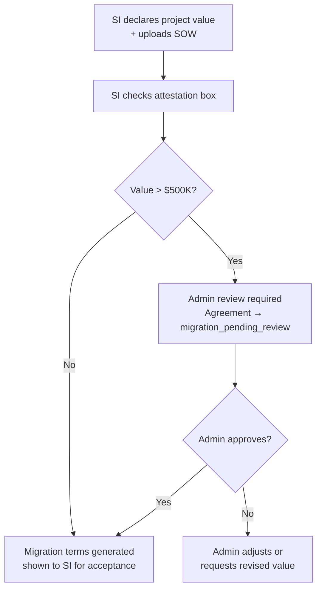

**Layer 1 — Attestation (all projects):**

- SI must check a legally binding attestation checkbox when accepting migration terms: _"I confirm that the declared project value of $X accurately represents the total engagement value as defined in RevBrain's partner terms."_
- SOW or order form upload is required (stored encrypted, accessible only to RevBrain admins).

**Layer 2 — Admin review (projects > $500K):**

- When the SI submits a project value above $500K, the agreement enters `migration_pending_review` status.
- Admin reviews the uploaded SOW for consistency with the declared value.
- Admin approves (migration terms are generated and shown to SI) or requests the SI to revise the value.
- For projects ≤$500K, migration terms are generated immediately without admin review.

**Layer 3 — Platform sanity signals (passive, ongoing):**

- RevBrain can observe proxy indicators from the migration itself: number of Salesforce objects extracted, pricing rule count, product catalog size, custom code volume.
- These are not authoritative (a complex small-value project exists), but a $200K declared value on a migration with 5,000 pricing rules and 200 products is a flag.
- Flags surface to admin dashboard — they do not auto-block or auto-adjust.

**Layer 4 — Contractual audit right (partner agreement, not in-product):**

- The SI partner agreement includes a right-to-audit clause allowing RevBrain to request supporting documentation for any declared project value within 24 months.
- If under-declaration is confirmed: RevBrain invoices the delta plus a 25% penalty fee, and the SI's partner tier perks are frozen for 12 months.
- This clause exists for deterrence. We expect to use it rarely.

---

## 4. Billing Mechanics

### Two-phase milestone structure

A project has two billing phases with a natural gap between them. Phase 1 (assessment) has one milestone. Phase 2 (migration) has three milestones that are only created after the SI declares a project value.

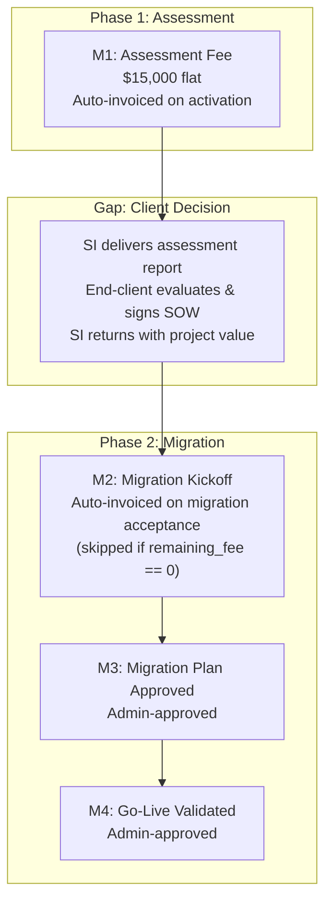

### Phase 1: Assessment (one milestone)

| #   | Milestone          | Amount       | Trigger Type  | Trigger Definition                                                                                                                 |
| --- | ------------------ | ------------ | ------------- | ---------------------------------------------------------------------------------------------------------------------------------- |
| 1   | **Assessment fee** | $15,000 flat | **Automatic** | Invoiced immediately when agreement is activated. Extraction and analysis tools unlock after M1 is **paid** (not merely invoiced). |

The assessment fee is fixed — it does not depend on project value (which is unknown at this point). It is the same for all projects regardless of size. The admin can override the amount per-agreement for negotiated deals.

**What the SI gets in Phase 1:** Full access to extraction, normalization, and analysis tools. The output is an assessment report the SI uses to scope and price the migration for their end-client.

**What is blocked in Phase 1:** Segmentation, disposition, and migration execution tools. These are Phase 2 capabilities.

### Transition: assessment to migration

The **SI initiates** the migration transition. They know when their client signed — the admin does not.

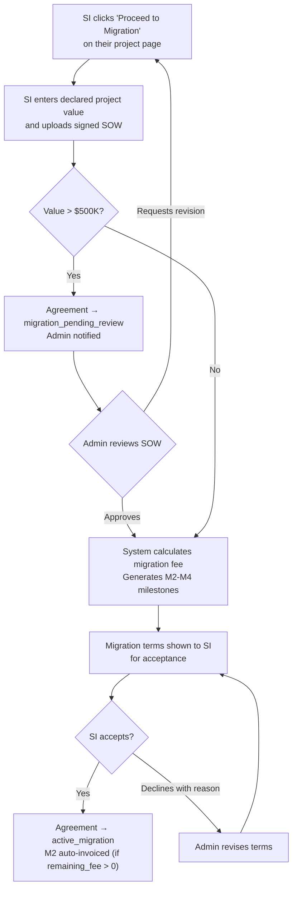

**Precondition:** M1 must be **paid** (or satisfied by carried credit for amendments). The "Proceed to Migration" button is only visible when this is true. The API enforces this server-side.

**Steps:**

1. SI clicks "Proceed to Migration" from their project billing tab.
2. SI enters the declared project value and uploads the signed SOW.
3. If value > $500K: agreement enters `migration_pending_review`. Admin reviews SOW and approves or requests revision (SI is emailed if admin requests revision — email #19).
4. If value ≤ $500K (or after admin approval): system calculates migration fee per Section 2 computation rules. Migration milestones (M2–M4) are generated (if remaining_fee > 0). **The agreement stays in `active_assessment` during this step** — the Variant B review page is a UI step, not a DB state. The atomic transition to `active_migration` happens only when the SI clicks "Accept Migration Terms."
5. Migration terms are shown to SI for acceptance (Variant B review page).
6. SI reviews, checks attestation, and accepts.
7. Agreement transitions to `active_migration`. M2 is auto-invoiced (if remaining_fee > 0).

**If the end-client doesn't sign:** The SI can close the project as assessment-only at any time after M1 is paid. This is self-service (with a required reason from a dropdown: "Client did not proceed", "Budget", "Timeline", "Competitor", "Other"). If the SI has already submitted a project value (i.e., agreement is in `migration_pending_review` or SI has been shown migration terms), only admin can finalize assessment-only closure.

### Phase 2: Migration (three milestones)

| #   | Milestone                   | % of Remaining Fee | Trigger Type       | Trigger Definition                                                               |
| --- | --------------------------- | ------------------ | ------------------ | -------------------------------------------------------------------------------- |
| 2   | **Migration kickoff**       | 35%                | **Automatic**      | Invoiced when SI accepts migration terms. Unlocks full migration tools.          |
| 3   | **Migration plan approved** | 35%                | **Admin-approved** | SI requests completion. Admin verifies plan artifact exists and is signed off.   |
| 4   | **Go-live validated**       | 30%                | **Admin-approved** | SI requests completion. Admin verifies validation checks passed in the platform. |

**"Remaining fee"** = total fee - assessment fee. Example: $3M project → $145,000 total fee - $15,000 assessment = $130,000 remaining, split 35/35/30 across M2–M4 ($45,500 / $45,500 / $39,000).

### Zero remaining fee edge case

If `remaining_fee == 0` (project value is small enough that the tiered calculation ≤ assessment fee):

- Migration acceptance still happens (attestation + SOW upload + terms snapshot).
- **No M2 invoice is created.** No Stripe invoice for $0.
- **No M3 or M4 milestones are generated.**
- Full migration tools unlock based on `status = active_migration` alone (not M2 payment).
- Agreement proceeds directly to `active_migration` and eventually `complete` when the SI finishes the migration (admin marks complete, no financial milestones to track).

### Milestone lifecycle

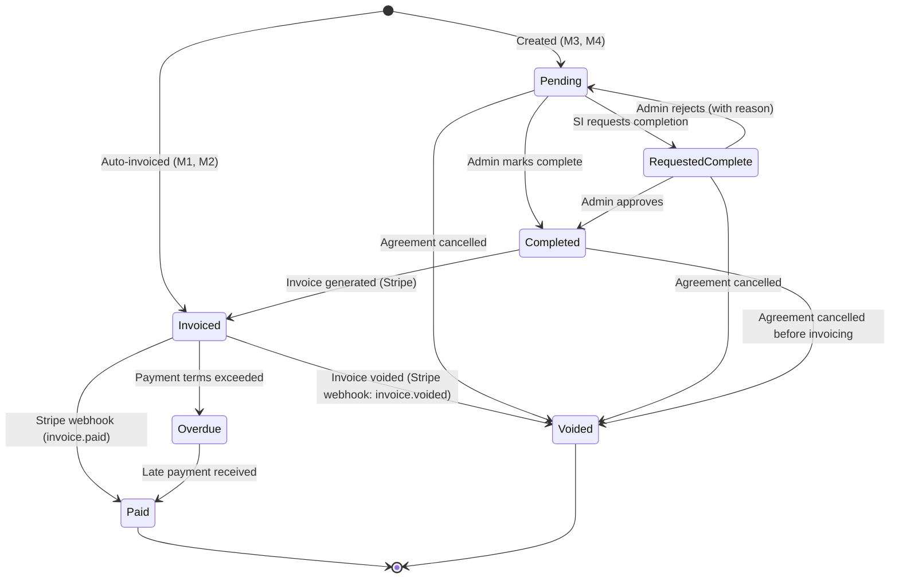

**Auto-invoiced milestones:** M1 (assessment fee) is auto-invoiced when the agreement is activated. M2 (migration kickoff) is auto-invoiced when the SI accepts the migration terms. Neither requires a completion request.

**M3 and M4** follow the standard request → approve → invoice → pay flow.

**Why not SI self-completion:** Allowing the SI to directly complete milestones and trigger invoices creates a moral hazard (premature completion, accidental triggers, dispute surface). Instead, the SI can **request** milestone completion; the admin approves it.

### Payment terms

Payment terms are an enum:

| Value            | Meaning                       |
| ---------------- | ----------------------------- |
| `due_on_receipt` | Due immediately               |
| `net_15`         | Due 15 days from invoice date |
| `net_30`         | Due 30 days from invoice date |
| `net_60`         | Due 60 days from invoice date |

Default: `net_30`. Stored on the fee agreement; applies to all milestones in that agreement.

### Entitlement gates

Platform access is gated by agreement phase and milestone state.

| Agreement Status           | Milestone State                             | Platform Access                                                                                                 |
| -------------------------- | ------------------------------------------- | --------------------------------------------------------------------------------------------------------------- |
| `draft`                    | N/A                                         | Read-only project setup. No extraction.                                                                         |
| `active_assessment`        | M1 invoiced, not paid                       | **Extraction blocked.** SI sees "Waiting for payment" callout with Pay Now link. Read-only setup only.          |
| `active_assessment`        | M1 paid                                     | **Assessment tools:** extraction, normalization, analysis. Migration tools (segmentation, disposition) blocked. |
| `active_assessment`        | M1 paid, assessment done                    | Assessment tools in read-only. "Proceed to Migration" button visible.                                           |
| `migration_pending_review` | —                                           | Same as assessment (M1 paid). Admin reviewing.                                                                  |
| `active_migration`         | M2 invoiced or paid (or remaining_fee == 0) | **Full platform access:** extraction, normalization, segmentation, disposition, validation.                     |
| `active_migration`         | Any milestone overdue                       | Full access continues (do not lock mid-project). Admin notified.                                                |
| `complete`                 | All paid                                    | Read-only archive access.                                                                                       |
| `assessment_complete`      | M1 paid only                                | Read-only. Assessment data available for 90 days.                                                               |
| `cancelled`                | Any                                         | Immediate read-only lock. Data available for 90 days.                                                           |

**Post-acceptance limbo (M1 invoiced, not yet paid):** This is the first state after the SI accepts assessment terms. The SI will navigate to their project and see a prominent callout:

```
┌────────────────────────────────────────────────────────────────┐
│  ⏳ Waiting for payment                                        │
│                                                                │
│  Your assessment invoice for $15,000 has been sent.            │
│  Extraction tools will unlock once payment is received.        │
│                                                                │
│  [Pay Now]  [View Invoice]                                     │
│                                                                │
│  In the meantime, you can set up your project:                 │
│  connect your Salesforce org and configure extraction settings. │
└────────────────────────────────────────────────────────────────┘
```

**Why not block on overdue:** Locking a mid-project SI out of the platform when they have a late invoice creates more problems than it solves (relationship damage, data hostage dynamics, support escalation). Instead, overdue invoices trigger an escalation sequence (see Section 4.1).

### 4.1 Overdue handling

Overdue handling is **required before first live transaction** — not optional polish. Without it, RevBrain has no enforcement mechanism for late payments.

When a milestone invoice exceeds its payment terms:

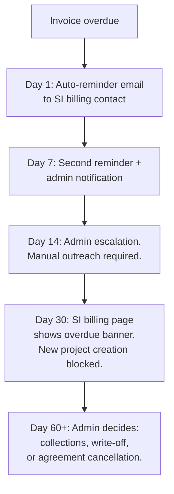

- **Days 1–30:** Automated reminders. Platform access continues. No new project creation after day 30.
- **Day 30+:** Overdue banner visible on SI billing page. SI can still work on active projects but cannot start new ones.
- **Day 60+:** Admin manual decision. No automated suspension — this is a relationship business.
- **No late payment fees** in this phase. May be added later if overdue invoices become a pattern.

---

## 5. Cancellation & Refund Policy

This is contractual policy, not a state diagram annotation.

### Assessment-only completion (not a cancellation)

If the end-client doesn't sign, the SI closes the project as assessment-only. This is a normal outcome, not a failure:

- Agreement status moves to `assessment_complete`.
- M1 (assessment fee) is non-refundable — the assessment work was delivered.
- No migration milestones exist to void.
- Data archived per standard 90-day retention policy.
- SI must provide a reason (dropdown: "Client did not proceed", "Budget", "Timeline", "Competitor", "Other" + optional notes). This data feeds product and sales analytics.

### When an agreement is cancelled during migration:

1. **Paid milestones are non-refundable.** The work associated with those milestones was delivered and accepted.

2. **Invoiced-but-unpaid milestones:** The open invoice is **voided** via Stripe (`Invoice.voidInvoice()`). The `invoice.voided` webhook updates the milestone status to `voided`. The SI owes nothing for unpaid milestones after cancellation.

3. **Completed-but-not-yet-invoiced milestones:** Auto-invoiced at cancellation. The work was delivered; RevBrain is owed payment.

4. **Pending milestones:** Voided. No invoice generated.

### Who can cancel:

- **Admin** can cancel any agreement at any time with a required reason.
- **SI** can request cancellation (in-app). Admin reviews and executes. The SI cannot unilaterally cancel an agreement with outstanding invoices.
- **SI** can mark a project as assessment-only after M1 is paid — but only if the SI has NOT already submitted a project value. Once a value is submitted, only admin can finalize assessment-only closure.

### RevBrain-fault cancellation:

If RevBrain is at fault (platform outage > 72 hours, critical bug preventing migration work, data loss), the admin can issue partial or full refunds on any milestone via the existing Stripe refund flow. This is a manual admin action, not an automated policy.

---

## 6. Partner Tiers

Partner tiers reward loyalty with **perks, not rate discounts**. The per-project tiered bracket table (Section 2) is the only rate engine. This avoids margin collapse from stacking two discount systems.

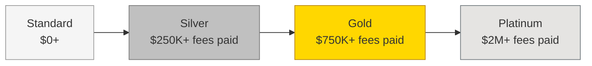

### Qualification

Tiers are based on **cumulative fees actually paid** to RevBrain (not declared project value). This includes assessment fees — an SI that runs 20 assessments at $15K each without converting any to migrations still paid $300K and earned their Silver tier. This is intentional: they paid real money for real value delivered.

| Tier         | Cumulative Fees Paid | Perks                                                                 |
| ------------ | -------------------- | --------------------------------------------------------------------- |
| **Standard** | $0+                  | Platform access, email support, standard SLA                          |
| **Silver**   | $250K+               | Priority support (4h response), beta feature access                   |
| **Gold**     | $750K+               | Dedicated CSM, co-marketing opportunities, quarterly business reviews |
| **Platinum** | $2M+                 | Custom integrations, executive sponsor, early roadmap input           |

### Rules

- Tier is recalculated when any milestone payment is received (not just final milestone).
- **Ratchet mechanism:** Tier only goes up, never down — even after refunds or cancellations. Exception: if the admin manually demotes for cause (e.g., confirmed fraud), that action is audit-logged with a reason.
- New tier applies to **future agreements only**, not retroactively to active ones.
- Admin can manually override tier (with required reason). Override history is visible in the admin UI.

---

## 7. Fee Agreement Lifecycle

The agreement has two acceptance points and an optional admin review gate for large deals.

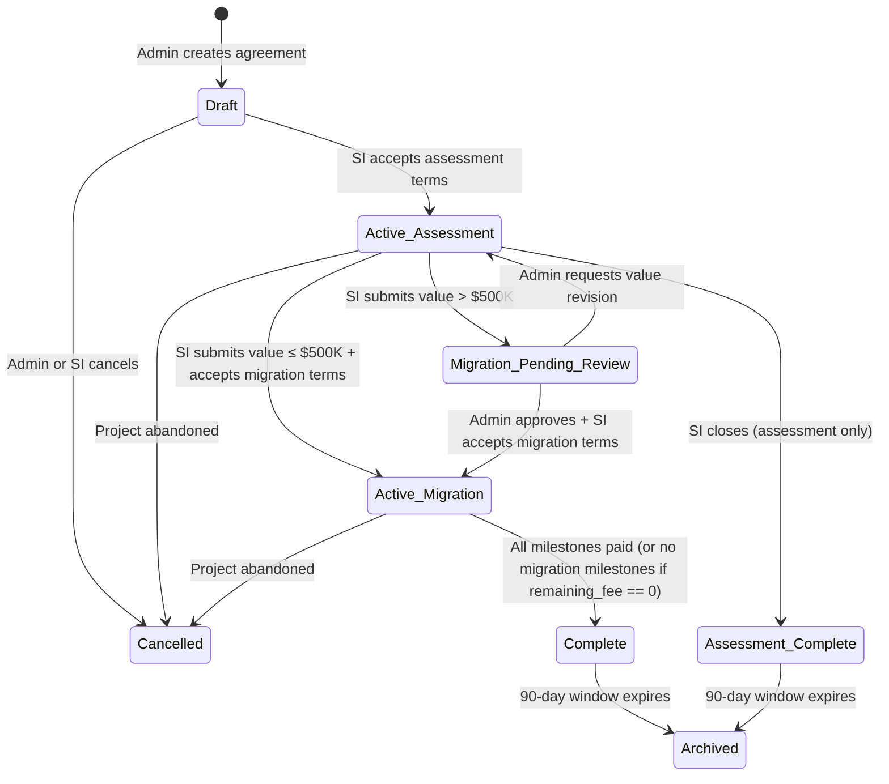

### Status invariants

These are enforced at both DB constraint and service layer:

| Status                     | Invariants                                                                                                                                                                                                                                                                            |
| -------------------------- | ------------------------------------------------------------------------------------------------------------------------------------------------------------------------------------------------------------------------------------------------------------------------------------- |
| `draft`                    | `accepted_at IS NULL`. No milestones invoiced. Not applicable for amendments (amendments skip draft).                                                                                                                                                                                 |
| `active_assessment`        | `accepted_at IS NOT NULL` (or `carried_credit_amount > 0` for amendments — assessment acceptance carries forward). M1 exists: either invoiced/paid via Stripe, or paid via carried credit (`paid_via = 'carried_credit'`). `declared_project_value IS NULL`. No migration milestones. |
| `migration_pending_review` | `declared_project_value IS NOT NULL`. `sow_file_id IS NOT NULL`. `migration_accepted_at IS NULL`. No migration milestones yet.                                                                                                                                                        |
| `active_migration`         | `migration_accepted_at IS NOT NULL`. `migration_terms_snapshot IS NOT NULL`. If `calculated_remaining_fee > 0`: M2-M4 exist. If `calculated_remaining_fee == 0`: no M2-M4.                                                                                                            |
| `assessment_complete`      | `declared_project_value IS NULL`. M1 is paid. No migration milestones. `assessment_close_reason IS NOT NULL`.                                                                                                                                                                         |
| `complete`                 | All non-voided milestones are paid. For zero-fee agreements (no M2-M4), `complete` requires explicit admin action via `POST /admin/fee-agreements/:id/complete`.                                                                                                                      |
| `cancelled`                | `cancelled_by IS NOT NULL`. `cancellation_reason IS NOT NULL`.                                                                                                                                                                                                                        |

### Initial acceptance (Draft → Active Assessment)

The SI reviews and accepts the assessment terms. This is lightweight — no SOW exists yet, no project value to declare.

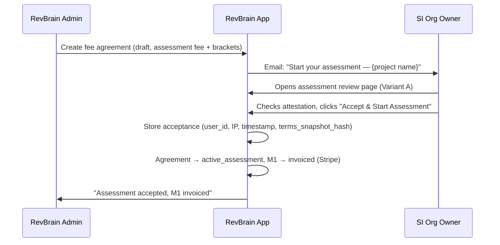

**What is stored at initial acceptance:**

- `accepted_by`, `accepted_at`, `accepted_from_ip`
- `assessment_terms_snapshot` — immutable JSON (assessment fee, payment terms, rate brackets for reference)
- `assessment_terms_snapshot_hash` — SHA-256

### Migration acceptance (Active Assessment → Active Migration)

SI-initiated. The SI returns when their client has signed.

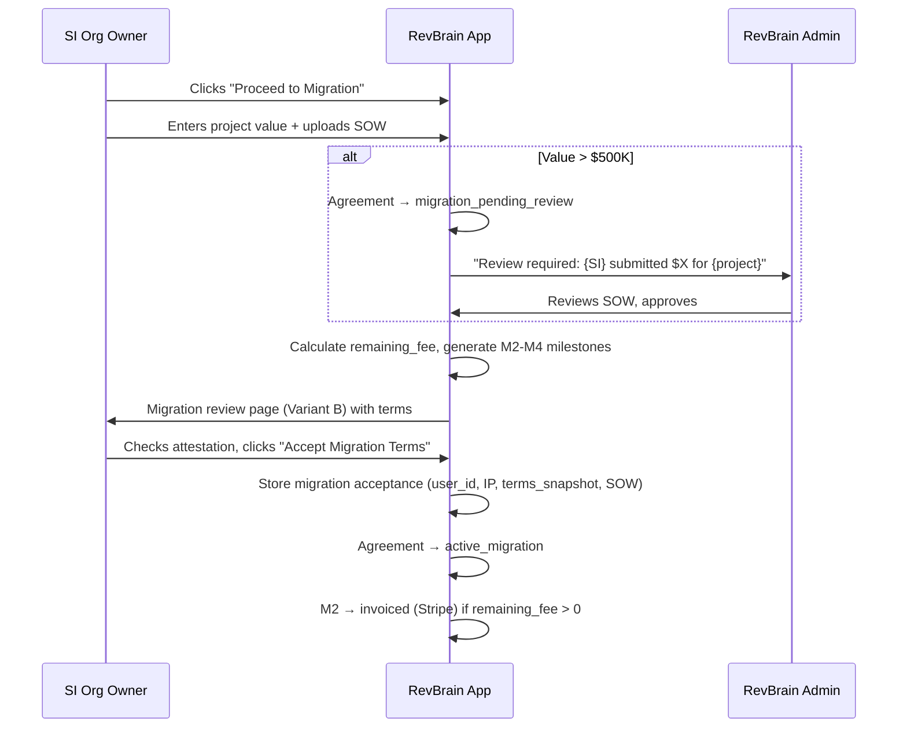

**What is stored at migration acceptance:**

- `migration_accepted_by`, `migration_accepted_at`, `migration_accepted_from_ip`
- `migration_terms_snapshot` — immutable JSON (declared value, rate brackets, milestones, total fee, remaining fee)
- `migration_terms_snapshot_hash`
- `sow_file_id`
- `declared_project_value`

### Amendments

If migration terms need to change after acceptance (e.g., project scope changed):

1. Admin creates a new agreement version linked to the same project.
2. The old agreement is cancelled (following cancellation policy — paid milestones are kept).
3. The new agreement carries forward the assessment fee as a credit: `carried_credit_amount` = assessment fee paid on the old agreement, `carried_credit_source_agreement_id` = old agreement ID.
4. **The new agreement skips `draft` and starts directly in `active_assessment`.** The assessment acceptance from the original agreement carries forward — the SI is not asked to re-accept assessment terms they already accepted. The SI is notified of the amendment and proceeds directly to migration term review (Variant B).
5. An M1 milestone is created on the new agreement with `status = 'paid'`, `paid_via = 'carried_credit'`, `stripe_invoice_id = NULL`. This keeps the data model uniform (every agreement always has M1) and makes reconciliation straightforward — the reconciliation job skips milestones where `paid_via = 'carried_credit'` when summing cash received.
6. The `fee_agreements` table tracks `supersedes_agreement_id` for audit trail.

Accepted terms are **immutable**. Changes require a new version.

---

## 8. SI Platform Access

### During an active project

- Full access to all migration tools (extraction, normalization, segmentation, disposition) — gated by phase and milestone status (see Section 4, Entitlement Gates).
- Project workspace with team collaboration. No seat limits during active projects.
- Reporting and analysis dashboards.
- Multiple simultaneous projects supported. Each project has its own fee agreement.

### Between projects

- Read-only access to completed project archives.
- Can start a new project at any time (triggers new fee agreement flow).
- Partner dashboard: tier status, project history, billing summary always accessible.

### After project completion

- 90-day read-only archive window for **operational data** (migration artifacts, analysis results). SI can view and export data. After 90 days: data moved to cold storage or deleted.
- **Billing artifacts** (terms snapshots, SOW files, invoice references, acceptance logs, audit trail) are retained for **7 years** minimum, independent of operational data archival. This is required to support the 24-month audit right (Section 3) and standard financial record-keeping obligations.
- SI is notified at 30 days and 7 days before operational data archive.

### SOW file storage

SOW files are stored encrypted in the existing Supabase Storage bucket. Retention: minimum 7 years (matching billing artifact retention). Access: RevBrain admins only. See project security documentation for encryption key management.

### Terms snapshot integrity

Terms snapshots are stored as JSON. To ensure the SHA-256 hash is reproducible, snapshots are canonicalized before hashing: keys sorted alphabetically, no trailing whitespace, numbers as plain decimals (no scientific notation). The application uses a `canonicalJson()` utility (already exists in the codebase for BB-3 determinism) for both snapshot creation and hash verification.

### Stripe Customer Portal

SIs need to manage payment methods (especially for $15K–$145K invoices where ACH/wire is typical). A link to **Stripe's hosted customer portal** is available from the SI billing page. Portal is configured for **invoice and payment-method management only** — subscription management features are disabled (subscriptions are dormant in this phase).

### Responsive design

This phase is **desktop-only**. SI users are consultants working at their desks; mobile invoice checking is a nice-to-have, not a requirement. The billing page will be responsive (tables stack on narrow screens) but is not optimized for mobile workflows.

---

## 9. Data Model

### Entity relationship diagram

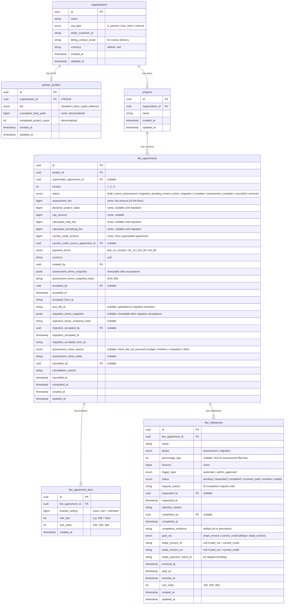

### Design decisions

**Why no `floor_amount` field:** The assessment fee IS the floor. Storing both creates ambiguity about which one "wins" and whether they can differ. One field, one concept.

**Why no `custom_rate_override_bps` on partner_profiles:** A single basis-point number does not fit into a bracket-based rate engine. Custom rates for negotiated deals are handled by editing the bracket table on individual fee agreements (`fee_agreement_tiers`). The admin can set custom brackets when creating an agreement — this is per-deal, not per-partner.

**Why `carried_credit_amount` for amendments:** When an agreement is superseded, the assessment fee already paid must transfer to the new agreement. `carried_credit_amount` + `carried_credit_source_agreement_id` explicitly model this. The new agreement's M1 is either skipped (if credit covers it) or reduced. The nightly reconciliation job can verify credit amounts match source milestone payments.

**Why `fee_agreement_tiers` table instead of JSONB:** Rate brackets are queried for fee calculation, reported on for revenue analytics, and audited for dispute resolution. A normalized table gives schema validation at the DB level and queryability.

**Why denormalized `cumulative_fees_paid` and `completed_project_count`:** These are read on every partner dashboard load. We denormalize with explicit reconciliation:

- **Updated on:** every `invoice.paid` webhook, every agreement completion, every cancellation.
- **Reconciliation:** A nightly job recomputes from `SUM(fee_milestones.amount WHERE status = 'paid' AND paid_via = 'stripe_invoice')` grouped by organization (milestones with `paid_via = 'carried_credit'` are excluded — they represent credit transfers, not cash received). Drift handling:
  - **Drift ≤ $1 (rounding):** Auto-correct, log to audit trail.
  - **Drift > $1:** Do NOT auto-correct. Alert admin via email. Require manual reconciliation via the admin endpoint. This prevents masking payment processing bugs.
- This job is part of Phase 2 of the implementation sequence.

**Why no `projects.fee_agreement_id`:** A project can have multiple agreement versions via amendments. Single direction: `fee_agreements.project_id`. Active agreement: `WHERE project_id = ? AND status IN ('draft', 'active_assessment', 'migration_pending_review', 'active_migration') ORDER BY version DESC LIMIT 1`.

**Why `sort_order` uses gap numbering (100, 200, 300):** Zero-cost insurance against future custom milestone ordering.

### Relationship to existing billing tables

The current `subscriptions`, `plans`, `paymentHistory`, `coupons`, and `couponUsages` tables remain **dormant**. No deletion, no modification.

The `billingEvents` table (Stripe webhook idempotency) is **reused**.

---

## 10. Stripe Integration

### Assessment fee invoice (M1)

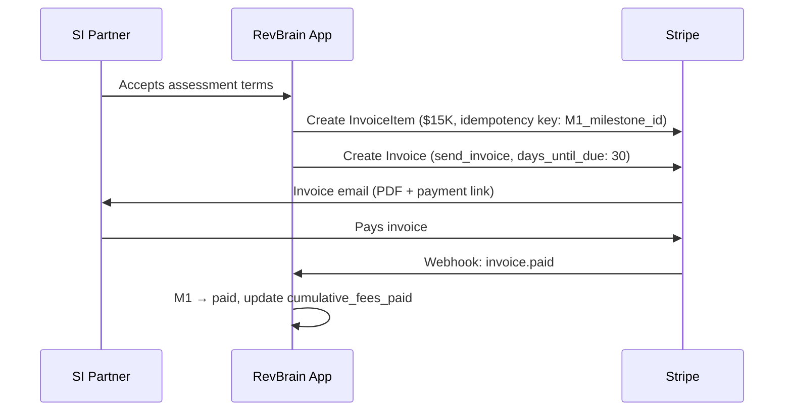

### Migration milestone invoices (M2–M4)

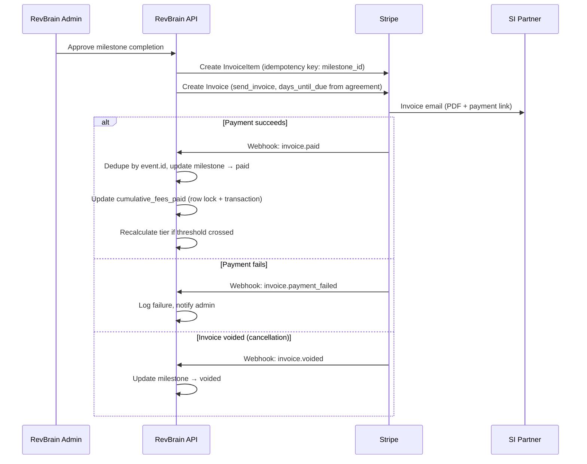

### Stripe metadata contract

Every InvoiceItem and Invoice includes:

```json
{
  "revbrain_type": "milestone_invoice",
  "milestone_id": "uuid",
  "fee_agreement_id": "uuid",
  "project_id": "uuid",
  "organization_id": "uuid",
  "milestone_name": "Assessment fee",
  "milestone_phase": "assessment",
  "milestone_number": "1"
}
```

### Invoice configuration

- **`collection_method: send_invoice`** — SI receives invoice via email with a hosted payment link. No auto-charge for $10K+ invoices.
- **`days_until_due`** — from the agreement's `payment_terms` enum.
- **`auto_advance: true`** — Stripe manages the invoice lifecycle.

**Draft invoice handling:** With `auto_advance: true`, Stripe automatically finalizes invoices. RevBrain never intentionally holds an invoice in draft state. If a draft invoice is discovered (e.g., Stripe API failure mid-creation), the cancellation flow deletes it before voiding; the reconciliation job flags orphaned drafts for admin review.

### "Pay Now" behavior

All payment links deep-link to **Stripe's hosted invoice payment page**. No custom payment form. No PCI scope.

### Idempotency

**Stripe API calls:** Idempotency key = `revbrain_milestone_{milestone_id}_{action}`.

**Webhook handling:** Deduped by `event.id` in `billingEvents` table (unique constraint on `stripe_event_id`).

### Webhook routing

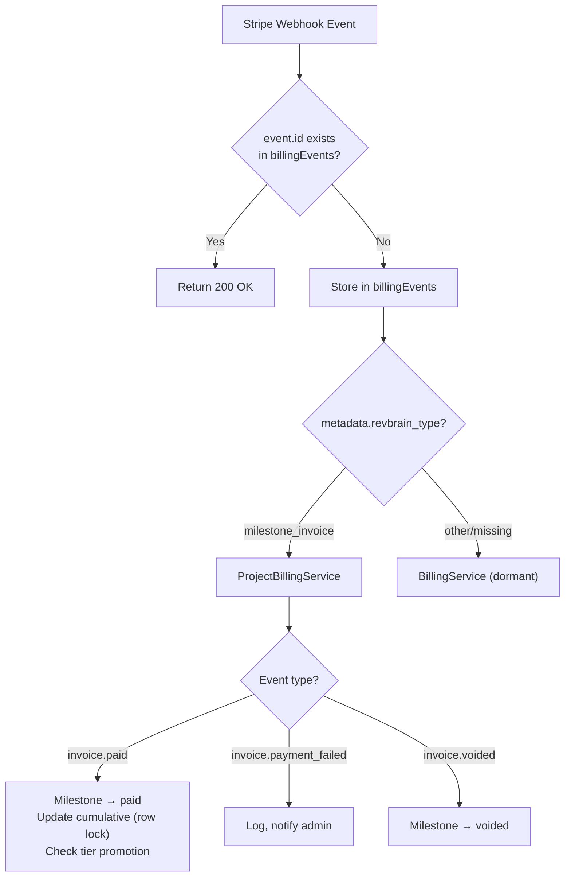

### Concurrency

- `cumulative_fees_paid` updated within a `SELECT ... FOR UPDATE` row lock on `partner_profiles`.
- Tier recalculation is atomic within the same transaction.

---

## 11. Admin Workflows

### Creating a fee agreement (assessment phase)

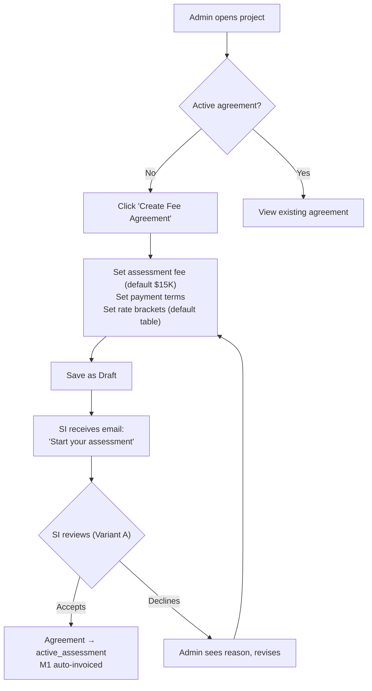

### Proceeding to migration (SI-initiated)

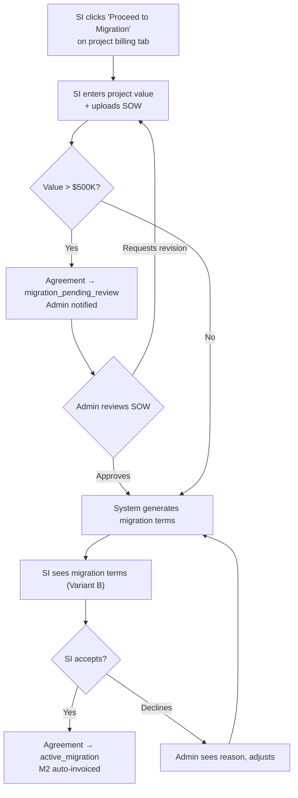

### Invoicing a milestone (M3, M4)

1. SI requests completion from their project billing tab (with optional note).
2. Admin sees the request in the project billing tab with the SI's note.
3. Admin reviews evidence and approves or rejects (with reason).
4. On approval: invoice is auto-generated. Stripe sends to SI billing contact.
5. Payment tracked via `invoice.paid` webhook.

### Partner tier management

1. On any milestone payment, system recalculates cumulative fees paid (atomic, row-locked).
2. If tier threshold crossed, SI is auto-promoted. Audit logged.
3. Admin can manually override tier with required reason. Override history visible in admin UI.

---

## 12. UI Specification

### Design principles

- **Billing must feel deterministic.** Every number traceable to a rate table, a milestone percentage, and a payment event.
- **Trust layer:** Agreement terms viewable as a read-only snapshot. Audit trail visible for admin actions.
- **Desktop-only MVP.**

### 12.1 Platform Admin Pages

#### 12.1.1 Partner Management Page (NEW)

**Route:** `/admin/partners`

```
┌──────────────────────────────────────────────────────────────────┐
│  Partners                                           [+ Add SI]  │
│  Manage SI partner organizations and fee agreements              │
├──────────────────────────────────────────────────────────────────┤
│  ┌─ Filters ─────────────────────────────────────────────────┐  │
│  │  Tier: [All ▾]   Status: [All ▾]   Search: [_________]   │  │
│  └───────────────────────────────────────────────────────────┘  │
│  ┌─ Table ───────────────────────────────────────────────────┐  │
│  │ Partner Name    │ Tier     │ Projects │ Fees Paid  │ Status│  │
│  │─────────────────┼──────────┼──────────┼────────────┼───────│  │
│  │ Acme Consulting │ Gold     │ 7        │ $842K      │ Active│  │
│  │ CloudOps Inc    │ Silver   │ 3        │ $310K      │ Active│  │
│  │ MigratePro      │ Standard │ 1        │ $12K       │ Active│  │
│  └───────────────────────────────────────────────────────────┘  │
└──────────────────────────────────────────────────────────────────┘
```

**Empty state:** "No SI partners yet. Partners appear here when an organization is registered as an SI partner. [+ Register First Partner]"

**Partner Detail Drawer** (click row): Tier status with progress bar, active agreements list, billing summary, override controls with explicit checkboxes (not "blank = default"), override history log.

#### 12.1.2 Fee Agreement Manager (project billing tab)

**Route:** Project detail page → "Billing" tab

**Assessment phase** (`active_assessment`):

```
┌──────────────────────────────────────────────────────────────────┐
│  FEE AGREEMENT (v1)                   Status: Assessment Active  │
│  ┌────────────────────────────────────────────────────────────┐  │
│  │  Partner: Acme Consulting (Gold) · Assessment Fee: $15,000 │  │
│  │  Rate Brackets: 8%/5%/3% (for migration) · Terms: Net 30  │  │
│  │  Accepted: Feb 12 by john@acme.com  [View Terms Snapshot]  │  │
│  └────────────────────────────────────────────────────────────┘  │
│  MILESTONES                                                      │
│  Phase 1: Assessment                                             │
│  1  Assessment fee       $15,000   ● Paid       [View inv.]     │
│                                                                  │
│  Phase 2: Migration (awaiting project value from SI)             │
│  [Mark Assessment Only]                                          │
└──────────────────────────────────────────────────────────────────┘
```

**Pending review** (`migration_pending_review`): Same as above but with admin action buttons: `[Approve Value] [Request Revision]` and shows the declared value + SOW link.

**Migration phase** (`active_migration`):

```
┌──────────────────────────────────────────────────────────────────┐
│  FEE AGREEMENT (v1)                   Status: Migration Active   │
│  ┌────────────────────────────────────────────────────────────┐  │
│  │  Project Value: $3,000,000 · Total Fee: $145,000           │  │
│  │  Assessment Paid: -$15,000 · Migration Fee: $130,000       │  │
│  │  Migration accepted: Mar 10 by john@acme.com               │  │
│  │  [View Terms Snapshot]  [View SOW]                         │  │
│  └────────────────────────────────────────────────────────────┘  │
│  MILESTONES                                                      │
│  Phase 1: Assessment                                             │
│  1  Assessment fee       $15,000   ● Paid       [View inv.]     │
│  Phase 2: Migration ($130,000)                                   │
│  2  Migration kickoff    $45,500   ● Paid       [View inv.]     │
│  3  Plan approved        $45,500   ◐ Invoiced   [View inv.]     │
│  4  Go-live validated    $39,000   ◉ Requested  [Approve]       │
│                                                                  │
│  PAYMENT PROGRESS                                                │
│  ████████████████████████░░░░░░░░  $106,000 / $145,000 (73%)    │
│                                                                  │
│  AUDIT TRAIL (expandable)                                        │
│  Apr 20: SI requested M4 completion                              │
│  Mar 10: Migration terms accepted by john@acme.com               │
│  Feb 22: M1 assessment fee paid                                  │
│  Feb 12: Assessment terms accepted                               │
│                                                                  │
│  [Cancel Agreement]  [Create Amendment]                          │
└──────────────────────────────────────────────────────────────────┘
```

**"View Terms Snapshot"** renders a formatted read-only page showing the exact terms at acceptance time: rate brackets, amounts, milestones, payment terms, acceptance metadata (who, when, IP). Not raw JSON — a clean formatted view with a SHA-256 hash footer for integrity verification.

**Routes:**

- Admin: `/admin/projects/:projectId/billing/agreements/:agreementId/snapshot/:type` where type is `assessment` or `migration`
- SI: `/billing/agreements/:id/snapshot/:type`

**"Create Amendment"** shows the current agreement summary with: "Assessment fee: $15,000 (carried from v1, already paid)" and opens the migration term revision flow. Admin adjusts value/brackets → new agreement version is created → sent to SI for acceptance.

**Empty state:** "No fee agreement for this project. [Create Fee Agreement]"

#### 12.1.3 Fee Agreement Creation (Dedicated Page)

**Route:** `/admin/projects/:projectId/billing/new`

At creation time, only assessment terms are set. Rate brackets are shown for reference.

```
┌──────────────────────────────────────────────────────────────────┐
│  ← Back to Project                                               │
│  Create Fee Agreement — BigCorp CPQ Migration                    │
├──────────────────────────────────────────────────────────────────┤
│  PARTNER: Acme Consulting (Gold tier)                            │
│                                                                  │
│  ASSESSMENT FEE                                                  │
│  Amount: [$15,000] (default — override for negotiated deals)     │
│                                                                  │
│  PAYMENT TERMS: [Net 30 ▾]                                       │
│                                                                  │
│  RATE BRACKETS (for migration phase, shown for reference)        │
│  Up to $500K: 800 bps (8%) · $500K–$2M: 500 bps (5%)           │
│  Above $2M: 300 bps (3%)                                        │
│  Assessment fee is credited against migration total.             │
│                                                                  │
│  Cap: [$______] (blank = no cap, for migration phase)            │
│                                                                  │
│  [Cancel]                              [Create as Draft]         │
└──────────────────────────────────────────────────────────────────┘
```

#### 12.1.4 Existing Pages (Dormant)

- **Pricing Plans Page** (`/admin/pricing`): Hidden from nav. Banner on direct URL access.
- **Coupons Page** (`/admin/coupons`): Hidden from nav.

#### 12.1.5 Admin Sidebar

```
CURRENT              PROPOSED
───────              ────────
Platform Overview    Platform Overview
Tenants              Tenants
Users                Users
Pricing ← hidden     Partners ← NEW
Coupons ← hidden     Support
Support              Audit Log
Audit Log            Settings
Settings
```

Fee agreements accessed from project context (project → Billing tab), not as standalone nav.

### 12.2 SI Org Owner Pages

#### 12.2.1 Billing & Invoices Page (REPLACES current BillingPage)

**Route:** `/billing`

```
┌──────────────────────────────────────────────────────────────────┐
│  Billing & Invoices                                              │
├──────────────────────────────────────────────────────────────────┤
│  PARTNER STATUS                                                  │
│  ★ Gold Partner · Fees paid: $842K · ████████████░░░ $842K/$2M   │
│  Projects completed: 7 · Active: 2                               │
│                                                                  │
│  ACTIVE PROJECTS                                                 │
│  ┌────────────────────────────────────────────────────────────┐  │
│  │ BigCorp CPQ Migration                      [View Details]  │  │
│  │ Fee: $145,000 · Paid: $60,500 · ████████░░░░ 42%          │  │
│  │ Milestone 3/4: "Plan approved" — invoiced, due Apr 30      │  │
│  ├────────────────────────────────────────────────────────────┤  │
│  │ SmallCo Assessment                         [View Details]  │  │
│  │ Assessment fee: $15,000 · Paid                             │  │
│  │ Assessment in progress — migration fee TBD                 │  │
│  └────────────────────────────────────────────────────────────┘  │
│                                                                  │
│  RECENT INVOICES                                                 │
│  Date     Project           Amount   Status                      │
│  Apr 15   BigCorp           $45,500  ● Due Apr 30                │
│  Mar 10   BigCorp           $45,500  ● Paid                      │
│  Feb 22   BigCorp           $15,000  ● Paid                      │
│  Feb 01   SmallCo           $15,000  ● Paid                      │
│  [View All Invoices]                                             │
│                                                                  │
│  BILLING SUMMARY                                                 │
│  Invoiced: $912,000 · Paid: $842,000 · Outstanding: $70,000     │
│                                                                  │
│  [Manage Payment Methods] (→ Stripe Customer Portal)             │
└──────────────────────────────────────────────────────────────────┘
```

**Assessment-in-progress project card:** Shows "Assessment fee: $15,000 · Paid" and "Assessment in progress — migration fee TBD" instead of a total fee and progress bar. No milestone count displayed (only M1 exists).

**Empty state:** "Standard Partner. No projects yet. Billing appears here once a fee agreement is created."

**Overdue banner** (above everything): "⚠ BigCorp — M3 — $45,500 (14 days past due) [Pay Now] [View Invoice]"

#### 12.2.2 Project Billing Tab (within project view)

**Route:** `/projects/:id` → "Billing" tab

**Assessment phase** (SI's view while assessment is in progress):

```
┌──────────────────────────────────────────────────────────────────┐
│  FEE AGREEMENT                                                   │
│  Assessment Fee: $15,000 · Paid · Terms: Net 30                  │
│  [View Full Terms]                                               │
│                                                                  │
│  MILESTONES                                                      │
│  ✓ 1. Assessment fee ──────────── $15,000   Paid ✓              │
│       Auto-invoiced Feb 12 · Paid Feb 22  [Download Invoice]     │
│                                                                  │
│  NEXT STEP                                                       │
│  When your client signs the SOW, proceed to set up               │
│  migration billing.                                              │
│  [Proceed to Migration]   [Close as Assessment Only]             │
└──────────────────────────────────────────────────────────────────┘
```

**Migration phase:**

```
┌──────────────────────────────────────────────────────────────────┐
│  FEE AGREEMENT                                                   │
│  Project Value: $3,000,000 · Total Fee: $145,000                 │
│  Assessment Paid: -$15,000 · Migration: $130,000 · Net 30       │
│  [View Full Terms]                                               │
│                                                                  │
│  MILESTONES                                                      │
│  Phase 1: Assessment                                             │
│  ✓ 1. Assessment fee ──────────── $15,000   Paid ✓              │
│       [Download Invoice]                                         │
│                                                                  │
│  Phase 2: Migration                                              │
│  ✓ 2. Migration kickoff ────────── $45,500   Paid ✓             │
│       [Download Invoice]                                         │
│  ◐ 3. Plan approved ────────────── $45,500   Due ●              │
│       Invoiced Apr 15 · Due Apr 30  [View Invoice] [Pay Now]     │
│  ○ 4. Go-live validated ─────────── $39,000   Pending            │
│       [Request Completion]                                       │
│                                                                  │
│  PAYMENT PROGRESS                                                │
│  ████████████████████████░░░░░░░░  $106,000 / $145,000 (73%)    │
└──────────────────────────────────────────────────────────────────┘
```

**Empty state:** "Billing details will appear here once a fee agreement is set up."

#### 12.2.3 Agreement Review Pages (SI-facing)

**Route:** `/billing/agreements/:id/review`
**Routing logic:** The page renders Variant A or B based on `agreement.status`:

- `draft` → Variant A (assessment acceptance)
- `migration_pending_review` or has pending migration terms → Variant B (migration acceptance)

**Variant A: Assessment acceptance**

```
┌──────────────────────────────────────────────────────────────────┐
│  Start Assessment — BigCorp CPQ Migration                        │
├──────────────────────────────────────────────────────────────────┤
│  WHAT'S INCLUDED                                                 │
│  RevBrain will extract and analyze your client's CPQ org.        │
│  Assessment Fee: $15,000 · Payment Terms: Net 30                 │
│  ✓ Full CPQ extraction  ✓ Complexity analysis  ✓ Assessment report│
│                                                                  │
│  IF YOUR CLIENT PROCEEDS TO MIGRATION                            │
│  Migration fee: % of project value (8%/5%/3% tiered brackets)    │
│  The $15,000 assessment fee is credited against the total.       │
│                                                                  │
│  This is an assessment engagement. Your client has not signed yet.│
│  You will receive a $15,000 invoice immediately.                 │
│  Migration pricing will be calculated later from the signed SOW; │
│  this fee will be credited.                                      │
│                                                                  │
│  ☐ I accept RevBrain's assessment terms and authorize            │
│    the assessment fee of $15,000.                                │
│                                                                  │
│  [Decline]                        [Accept & Start Assessment]    │
└──────────────────────────────────────────────────────────────────┘
```

**Variant B: Migration acceptance**

```
┌──────────────────────────────────────────────────────────────────┐
│  Review Migration Terms — BigCorp CPQ Migration                  │
├──────────────────────────────────────────────────────────────────┤
│  PROJECT VALUE: $3,000,000                                       │
│                                                                  │
│  FEE BREAKDOWN                                                   │
│  First $500K: 8% = $40,000 · $500K–$2M: 5% = $75,000           │
│  Above $2M: 3% = $30,000                                        │
│  Total Fee: $145,000 · Assessment Paid: -$15,000                 │
│  Remaining: $130,000                                             │
│                                                                  │
│  MIGRATION SCHEDULE                                              │
│  2. Migration kickoff (on acceptance)  35%   $45,500             │
│  3. Migration plan approved            35%   $45,500             │
│  4. Go-live validated                  30%   $39,000             │
│                                                                  │
│  You already paid $15,000; remaining fee is $130,000.            │
│                                                                  │
│  UPLOAD SOW [drop zone] PDF/DOCX/image, max 25MB                │
│                                                                  │
│  ☐ I confirm the declared value of $3,000,000 accurately        │
│    represents the total migration engagement value.              │
│                                                                  │
│  [Decline]                         [Accept & Start Migration]    │
│  An invoice for $45,500 will be generated immediately.           │
└──────────────────────────────────────────────────────────────────┘
```

**Zero remaining fee:** If `remaining_fee == 0`, Variant B hides the milestone schedule entirely and replaces it with: _"No additional invoices will be issued for this project. Your assessment fee of $15,000 covers the full engagement."_ The SOW upload and attestation are still required. The "Accept" button text changes to "Accept & Confirm Migration."

**Decline flow** (both variants): Modal with required reason text → "Your account manager has been notified."

#### 12.2.4 SI Sidebar

Unchanged from current: Dashboard, Projects, Customers, **Billing** (new content), Settings, Help.

---

## 13. Email Notifications

Sent via existing Resend email service. English + Hebrew variants per project i18n conventions.

| #   | Trigger                          | Recipient          | Subject                                      |
| --- | -------------------------------- | ------------------ | -------------------------------------------- |
| 1   | Agreement draft created          | SI org owner       | "Start your assessment — {project}"          |
| 2   | Assessment accepted              | Admin              | "Assessment started — {SI} / {project}"      |
| 3   | Terms declined (either phase)    | Admin              | "Terms declined — {SI} / {project}"          |
| 4   | Migration terms ready            | SI org owner       | "Review migration terms — {project}"         |
| 5   | Migration accepted               | Admin              | "Migration started — {SI} / {project}"       |
| 6   | Assessment closed (no migration) | Admin              | "Assessment complete — {project}"            |
| 7   | Milestone invoice sent           | SI billing contact | "Invoice #{n} — {project} — {milestone}"     |
| 8   | Milestone payment received       | SI + admin         | "Payment received — {project} — {milestone}" |
| 9   | Milestone completion requested   | Admin              | "Completion requested — {project}"           |
| 10  | Milestone request rejected       | SI requester       | "Request update — {project}"                 |
| 11  | Overdue reminder (day 1)         | SI billing contact | "Payment reminder — Invoice #{n} past due"   |
| 12  | Overdue reminder (day 7)         | SI + admin         | "Second reminder — Invoice #{n}"             |
| 13  | Overdue escalation (day 14)      | Admin              | "Action required — Invoice #{n}"             |
| 14  | Partner tier promotion           | SI org owner       | "You've reached {tier} partner status"       |
| 15  | Agreement completed              | SI + admin         | "Project complete — {project}"               |
| 16  | Archive reminder (30 days)       | SI org owner       | "Data archived in 30 days"                   |
| 17  | Archive reminder (7 days)        | SI org owner       | "Data archived in 7 days"                    |
| 18  | Migration pending review         | Admin              | "Review required: {SI} submitted ${value}"   |
| 19  | Admin requests value revision    | SI org owner       | "Revision requested — {project}"             |

**Dormant templates:** `payment-receipt.ts` (→ #8), `payment-failed.ts` (→ #11-12), `subscription-changed.ts`, `trial-ending.ts`, `trial-ended.ts`. `refund-confirmation.ts` kept.

---

## 14. Migration Path: Current → Desired

### 14.1 Overview

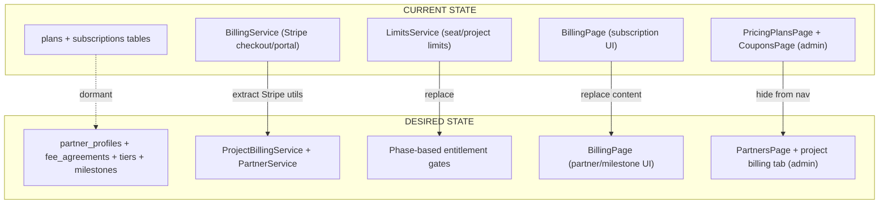

### 14.2 Frontend Migration

| #   | File / Route                                   | Action                            | Risk |
| --- | ---------------------------------------------- | --------------------------------- | ---- |
| 1   | `billing/pages/BillingPage.tsx` `/billing`     | **REPLACE** — atomic swap         | HIGH |
| 2   | `billing/components/UsageDashboard.tsx`        | **REMOVE**                        | LOW  |
| 3   | `billing/components/PlanUpgradeModal.tsx`      | **REMOVE**                        | LOW  |
| 4   | `billing/components/UpgradePrompt.tsx`         | **REMOVE**                        | LOW  |
| 5   | `billing/components/TrialCountdown.tsx`        | **REMOVE**                        | LOW  |
| 6   | `billing/components/BillingIntervalToggle.tsx` | **REMOVE**                        | LOW  |
| 7   | `billing/hooks/use-billing.ts`                 | **REPLACE**                       | MED  |
| 8   | `billing/hooks/use-usage.ts`                   | **REMOVE**                        | LOW  |
| 9   | `admin/pages/PricingPlansPage.tsx`             | **HIDE** from nav                 | LOW  |
| 10  | `admin/pages/CouponListPage.tsx`               | **HIDE** from nav                 | LOW  |
| 11  | `/admin/partners`                              | **NEW** PartnersPage + drawer     | MED  |
| 12  | `/admin/projects/:id` Billing tab              | **NEW** ProjectBillingTab (admin) | MED  |
| 13  | `/admin/projects/:id/billing/new`              | **NEW** FeeAgreementCreatePage    | MED  |
| 14  | `/projects/:id` Billing tab                    | **NEW** ProjectBillingTab (SI)    | MED  |
| 15  | `/billing/agreements/:id/review`               | **NEW** ReviewPage (Variant A/B)  | MED  |

### 14.3 Backend Migration

| #   | File                          | Action                                        | Risk |
| --- | ----------------------------- | --------------------------------------------- | ---- |
| 1   | `services/billing.service.ts` | **EXTRACT** shared Stripe utils               | LOW  |
| 2   | `services/limits.service.ts`  | **MODIFY** — phase-based entitlements         | MED  |
| 3   | `routes/billing.ts`           | **REPLACE** — SI-facing routes                | HIGH |
| 4   | `middleware/limits.ts`        | **MODIFY** — `requireActiveAgreement()`       | MED  |
| 5   | —                             | **NEW** `services/project-billing.service.ts` | —    |
| 6   | —                             | **NEW** `services/partner.service.ts`         | —    |
| 7   | —                             | **NEW** `routes/admin/partners.ts`            | —    |
| 8   | —                             | **NEW** `routes/admin/fee-agreements.ts`      | —    |
| 9   | —                             | **NEW** repositories (triple-adapter)         | —    |

#### API Routes

**SI-facing:**

| Method | Path                                           | Purpose                      |
| ------ | ---------------------------------------------- | ---------------------------- |
| GET    | `/v1/billing/partner-status`                   | Tier, cumulative fees        |
| GET    | `/v1/billing/agreements`                       | List agreements              |
| GET    | `/v1/billing/agreements/:id`                   | Detail with milestones       |
| GET    | `/v1/billing/invoices`                         | All invoices (paginated)     |
| POST   | `/v1/billing/agreements/:id/accept-assessment` | Accept assessment terms      |
| POST   | `/v1/billing/agreements/:id/proceed-migration` | Submit value + SOW           |
| POST   | `/v1/billing/agreements/:id/accept-migration`  | Accept migration terms       |
| POST   | `/v1/billing/agreements/:id/reject`            | Decline (either phase)       |
| POST   | `/v1/billing/agreements/:id/close-assessment`  | Assessment-only closure      |
| POST   | `/v1/billing/milestones/:id/request-complete`  | Request milestone completion |

**Admin:**

| Method | Path                                             | Purpose                                           |
| ------ | ------------------------------------------------ | ------------------------------------------------- |
| GET    | `/v1/admin/partners`                             | List partners                                     |
| GET    | `/v1/admin/partners/:id`                         | Partner detail                                    |
| PUT    | `/v1/admin/partners/:id`                         | Override tier                                     |
| POST   | `/v1/admin/fee-agreements`                       | Create agreement (draft)                          |
| GET    | `/v1/admin/fee-agreements/:id`                   | Detail + audit trail                              |
| PUT    | `/v1/admin/fee-agreements/:id`                   | Update (draft only)                               |
| POST   | `/v1/admin/fee-agreements/:id/approve-migration` | Approve value for >$500K                          |
| POST   | `/v1/admin/fee-agreements/:id/complete`          | Mark agreement complete (for zero-fee migrations) |
| POST   | `/v1/admin/fee-agreements/:id/cancel`            | Cancel agreement                                  |
| POST   | `/v1/admin/milestones/:id/approve`               | Approve + generate invoice                        |
| POST   | `/v1/admin/milestones/:id/reject`                | Reject (with reason)                              |
| POST   | `/v1/admin/partners/reconcile`                   | Manual reconciliation                             |

### 14.4 Database Migration

Steps: (1) Add `org_type` + `billing_contact_email` to organizations → (2) Create `partner_profiles` → (3) Create `fee_agreements` → (4) Create `fee_agreement_tiers` → (5) Create `fee_milestones` → (6) Seed partner_profiles.

---

## 15. Implementation Sequence

| Phase | What                                                                       | Notes                                                              |
| ----- | -------------------------------------------------------------------------- | ------------------------------------------------------------------ |
| **1** | Data model + migrations + contract types + Zod schemas                     | Foundation. No Stripe.                                             |
| **2** | Repositories + PartnerService + ProjectBillingService + reconciliation job | State machines, fee calc, tier logic. All testable without Stripe. |
| **3** | Admin API + admin UI (Partners, Agreement create/view)                     | Admin can create agreements.                                       |
| **4** | SI acceptance flow (accept/reject API + review pages)                      | Draft → Active Assessment works.                                   |
| **5** | Migration transition flow (proceed-migration + admin review + Variant B)   | Full two-phase lifecycle works. Still no Stripe.                   |
| **6** | Stripe invoicing + webhook handling (including `invoice.voided`)           | Money flows. Requires Stripe key.                                  |
| **7** | SI billing page + project billing tabs                                     | SI sees everything.                                                |
| **8** | Overdue handling (reminders, banners, new-project blocking)                | Required before first real-money transaction.                      |

---

## 16. Reviewer Feedback Log

| #   | Source   | Concern                                             | Decision                                                                       | Section    |
| --- | -------- | --------------------------------------------------- | ------------------------------------------------------------------------------ | ---------- |
| 1   | v2-R1,R2 | Project value gameable                              | Layered trust: attestation + SOW + admin review + signals + audit right        | 3          |
| 2   | v2-R1    | Two discount systems stack                          | Brackets only. Tiers = perks, not rate discounts.                              | 2, 6       |
| 3   | v2-R1    | Floor/cap ambiguous                                 | Deterministic computation rules                                                | 2          |
| 4   | v2-R1    | Use integer bps                                     | All rates as integer bps                                                       | 2, 9       |
| 5   | v2-R1    | Currency + taxes                                    | USD-only, currency field, tax-exclusive                                        | 2          |
| 6   | v2-R1,R2 | Milestone moral hazard                              | SI requests, admin approves                                                    | 4          |
| 7   | v2-R1    | Gate extraction behind M1                           | M1 auto-invoiced, extraction blocked until invoiced                            | 4          |
| 8   | v2-R1,R2 | Cancellation vague                                  | Deterministic policy per milestone state                                       | 5          |
| 9   | v2-R1    | Tier on fees paid                                   | Cumulative fees paid as qualifier                                              | 6          |
| 10  | v2-R1,R2 | Acceptance legally vague                            | IP + timestamp + snapshot + attestation                                        | 7          |
| 11  | v2-R1    | No amendment flow                                   | Immutable terms + supersedes_agreement_id                                      | 7          |
| 12  | v2-R1,R2 | Circular FK                                         | Single direction: fee_agreements.project_id                                    | 9          |
| 13  | v2-R1,R2 | JSONB rate_tiers                                    | Normalized fee_agreement_tiers table                                           | 9          |
| 14  | v2-R1    | invoice.paid not payment_succeeded                  | Fixed                                                                          | 10         |
| 15  | v2-R1    | Stripe idempotency                                  | milestone_id-based keys                                                        | 10         |
| 16  | v2-R1,R2 | Metadata undefined                                  | Exact contract defined                                                         | 10         |
| 17  | v2-R1,R2 | Webhook concurrency                                 | Row lock + atomic transaction                                                  | 10         |
| 18  | v2-R2    | Derived data drift                                  | Update triggers + nightly reconciliation (in Phase 2)                          | 9          |
| 19  | v2-R2    | SI no agency                                        | Reject with reason                                                             | 7, 12      |
| 20  | v2-R2    | Overdue untreated                                   | Full escalation sequence                                                       | 4.1        |
| 21  | v2-R2    | Blank = default UX                                  | Explicit checkbox toggles                                                      | 12.1.1     |
| 22  | v2-R2    | No empty states                                     | Defined per screen                                                             | 12         |
| 23  | v2-R2    | Mobile not mentioned                                | Desktop-only MVP                                                               | 8          |
| 24  | v2-R2    | payment_terms int                                   | Enum                                                                           | 4, 9       |
| 25  | v2-R2    | sort_order weak                                     | Gap numbering                                                                  | 9          |
| 26  | v2-R2    | Nav nesting                                         | Project context, not top-level                                                 | 12.1.5     |
| 27  | v2-R2    | Migration risk flags                                | Risk column                                                                    | 14.2, 14.3 |
| 28  | v2-R2    | Drawer for agreement                                | Dedicated page                                                                 | 12.1.3     |
| 29  | v2-R1    | Entitlements vague                                  | Gate table                                                                     | 4          |
| 30  | v2-R2    | ERD two paths                                       | Single path                                                                    | 9          |
| 31  | v3-A1    | Credit underspecified in Stripe                     | remaining_fee computation, no Stripe credit notes                              | 2          |
| 32  | v3-A1    | Fee computation incomplete                          | Two-phase deterministic rules                                                  | 2          |
| 33  | v3-A1    | remaining_fee==0 vs M2 gating                       | Special case: no M2 invoice, unlock on status                                  | 4          |
| 34  | v3-A1    | Admin review on wrong event                         | migration_pending_review status                                                | 3, 7       |
| 35  | v3-A1    | Amendment credit undefined                          | carried_credit fields on fee_agreements                                        | 7, 9       |
| 36  | v3-A1    | Status invariants missing                           | Explicit invariants table                                                      | 7          |
| 37  | v3-A2    | Section 11 describes v2                             | Rewritten for two-phase                                                        | 11         |
| 38  | v3-A2    | Migration initiation contradiction                  | SI-initiated with admin review >$500K                                          | 4, 7, 11   |
| 39  | v3-A2    | Post-acceptance limbo undefined                     | Callout design with Pay Now + setup instructions                               | 4          |
| 40  | v3-A2    | Assessment fee not in computation                   | Added as explicit step                                                         | 2          |
| 41  | v3-A2    | floor_amount vs assessment_fee                      | Removed floor_amount. Assessment fee IS the floor.                             | 2, 9       |
| 42  | v3-A2    | custom_rate_override_bps broken                     | Removed. Custom rates via bracket table per agreement.                         | 9          |
| 43  | v3-A2    | invoice.voided not handled                          | Added to webhook routing + milestone lifecycle                                 | 4, 10      |
| 44  | v3-A2    | Reconciliation is a ghost                           | Specced behavior + added to Phase 2 implementation                             | 9, 15      |
| 45  | v3-A2    | SI billing tab shows v2 milestones                  | Updated for two-phase structure                                                | 12.2.2     |
| 46  | v3-A2    | No assessment-in-progress card                      | Added to billing page                                                          | 12.2.1     |
| 47  | v3-A2    | Route A/B disambiguation                            | Status-based routing documented                                                | 12.2.3     |
| 48  | v3-A2    | Terms snapshot no design                            | Formatted read-only page with hash footer                                      | 12.1.2     |
| 49  | v3-A2    | Amendment UX undefined                              | Shows credit carry-forward, opens revision flow                                | 12.1.2     |
| 50  | v3-A2    | billing_contact missing                             | Added to organizations table                                                   | 9          |
| 51  | v3-A2    | projects missing timestamps                         | Added created_at/updated_at                                                    | 9          |
| 52  | v3-A2    | Assessment-only tier credit intentional?            | Yes, documented as intentional                                                 | 6          |
| 53  | v3-A2    | Stripe Customer Portal missing                      | Added link from SI billing page                                                | 8, 12.2.1  |
| 54  | v3-A2    | Overdue as optional polish                          | Reframed as required (Phase 8)                                                 | 4.1, 15    |
| 55  | v3-A2    | Assessment-only closure needs guardrails            | Required reason dropdown + admin-only if value submitted                       | 4, 5       |
| 56  | v4-A1    | M1 unlock wording contradicts entitlement gates     | Fixed: extraction unlocks after M1 paid, not invoiced                          | 4          |
| 57  | v4-A1    | proceed-migration must require M1 paid              | Server-side enforcement + precondition documented                              | 2, 4       |
| 58  | v4-A1    | cap < assessment_fee breaks floor                   | Validation: cap_amount >= assessment_credit                                    | 2          |
| 59  | v4-A1    | Amendment credit model inconsistent with invariants | Model B: M1 exists with paid_via=carried_credit. Uniform data model.           | 7, 9       |
| 60  | v4-A1    | Retention: billing vs operational data              | Split: 90 days operational, 7 years billing artifacts                          | 8          |
| 61  | v4-A1    | Hash canonicalization undefined                     | canonicalJson() utility, key ordering specified                                | 8          |
| 62  | v4-A1    | Stripe portal may expose subscription features      | Portal configured for invoice/payment-method only                              | 8          |
| 63  | v4-A1    | Draft invoice handling                              | auto_advance=true, orphan drafts flagged by reconciliation                     | 10         |
| 64  | v4-A2    | ≤$500K migration has no intermediate status         | Option C: Variant B is a UI step within active_assessment, not a DB state      | 4, 7       |
| 65  | v4-A2    | Amendment starting state undefined                  | Amendments skip draft, start in active_assessment. Acceptance carries forward. | 7          |
| 66  | v4-A2    | carried_credit not in computation rules             | assessment_credit = COALESCE(M1.amount, carried_credit_amount, 0)              | 2          |
| 67  | v4-A2    | Reconciliation auto-correct dangerous               | Threshold: ≤$1 auto-correct, >$1 alert admin                                   | 9          |
| 68  | v4-A2    | Missing email: admin requests value revision        | Added email #19                                                                | 13         |
| 69  | v4-A2    | Zero-fee complete transition undefined              | Added POST /admin/fee-agreements/:id/complete endpoint                         | 4, 14      |
| 70  | v4-A2    | SOW storage not specified                           | Encrypted Supabase Storage, 7-year retention                                   | 8          |
| 71  | v4-A2    | Terms snapshot has no route                         | Routes defined for admin and SI views                                          | 12         |
| 72  | v4-A2    | complete invariant unclear for zero-fee             | Explicit: requires admin action via /complete endpoint                         | 7          |

---

## 17. Future Direction (Out of Scope)

- **End-client subscriptions:** Recurring revenue from enterprises using RevBrain directly (separate application)
- **SI as distribution channel:** SIs refer end-clients to RevBrain subscriptions, earning commission
- **Commission program:** Time-bound revenue share on referred subscriptions
- **Automated milestone detection:** System auto-completes milestones based on platform signals

See [BILLING-MODEL-BRAINSTORM.md](BILLING-MODEL-BRAINSTORM.md) for the full dual-model vision.
