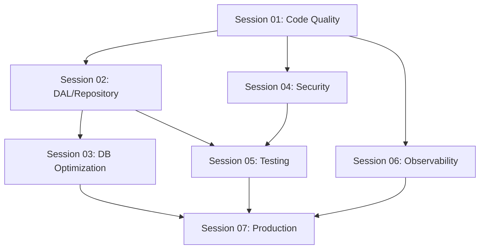

# RevBrain Foundation Roadmap

## Vision

Build the **best possible foundation** for a multi-tenant SaaS platform that:

- Achieves "Day 1 Velocity without sacrificing Year 2 Scalability"
- Maintains vendor agnosticism while leveraging platform-specific optimizations
- Provides excellent developer experience from day one

---

## Roadmap Sessions

| Session                              | Focus Area                     | Duration Est. | Dependencies    |
| ------------------------------------ | ------------------------------ | ------------- | --------------- |
| [01](./01-CODE-QUALITY.md)           | Code Quality & DX              | 1 day         | None            |
| [02](./02-DATA-ACCESS-LAYER.md)      | Repository Pattern & DAL       | 2-3 days      | Session 01      |
| [03](./03-DATABASE-OPTIMIZATION.md)  | Database Indexes & Constraints | 1 day         | Session 02      |
| [04](./04-SECURITY-HARDENING.md)     | Security (Non-Redis)           | 1-2 days      | Session 01      |
| [05](./05-TESTING-INFRASTRUCTURE.md) | Testing Setup                  | 2-3 days      | Sessions 02, 04 |
| [06](./06-ERROR-OBSERVABILITY.md)    | Error Handling & Monitoring    | 1 day         | Session 01      |
| [07](./07-PRODUCTION-READINESS.md)   | Infrastructure & Redis         | 2-3 days      | All previous    |

---

## Architecture Principles

### 1. Platform-Agnostic Core

```
┌─────────────────────────────────────────────────────────────┐
│                    BUSINESS LOGIC                           │
│              (Services, Use Cases, Domain)                  │
│                 imports: Repository<T>                      │
└─────────────────────────┬───────────────────────────────────┘
                          │
              ┌───────────┴───────────┐
              │   REPOSITORY INTERFACE │
              │     (Port/Contract)    │
              └───────────┬───────────┘
                          │
        ┌─────────────────┼─────────────────┐
        │                 │                 │
        ▼                 ▼                 ▼
┌───────────────┐ ┌───────────────┐ ┌───────────────┐
│   Drizzle     │ │   Supabase    │ │   Future      │
│   Engine      │ │   Engine      │ │   Engine      │
│   (TCP/SQL)   │ │   (HTTP/REST) │ │   (Prisma?)   │
└───────────────┘ └───────────────┘ └───────────────┘
```

### 2. Performance Strategy

| Environment     | Primary Engine      | Reason                                  |
| --------------- | ------------------- | --------------------------------------- |
| Local Dev       | Drizzle (TCP)       | Full SQL control, hot reload            |
| Supabase Edge   | Supabase SDK (HTTP) | Internal network, no TCP handshake      |
| Self-Hosted     | Drizzle (TCP)       | Standard Postgres, no vendor dependency |
| Complex Queries | Drizzle (TCP)       | Better for joins, aggregations          |

### 3. Quality Gates

Before each session is considered "complete":

- [ ] All tests pass
- [ ] TypeScript compiles without errors
- [ ] ESLint passes (after Session 01)
- [ ] Documentation updated
- [ ] PR reviewed and merged

---

## Current State Assessment

**Completed:**

- [x] Monorepo structure (Turborepo + pnpm)
- [x] Hono backend with OpenAPI
- [x] React 19 frontend
- [x] Drizzle schema definitions
- [x] Supabase auth integration
- [x] Basic RBAC middleware
- [x] CI/CD pipelines

**In Progress:**

- [ ] Code quality tooling
- [ ] Repository pattern implementation
- [ ] Comprehensive test coverage

---

## Session Execution Order



**Parallel Tracks:**

- Sessions 04 and 06 can run parallel to Session 02
- Session 03 and 05 can start once Session 02 is complete

---

## Success Metrics

After completing all sessions:

| Metric               | Target                   |
| -------------------- | ------------------------ |
| Test Coverage        | >80%                     |
| TypeScript Strict    | Enabled                  |
| ESLint Errors        | 0                        |
| Security Headers     | A+ (securityheaders.com) |
| Lighthouse Score     | >90                      |
| Cold Start (Edge)    | <200ms                   |
| Query Response (p95) | <100ms                   |

---

## Notes

- **No Redis Initially:** Sessions 01-06 work without Redis. Redis is introduced in Session 07.
- **Incremental Value:** Each session delivers working, deployable code.
- **Documentation First:** Each session starts with documentation of the approach.
